# Fluxurile aplicației — client și admin

Harta tuturor lucrurilor pe care le poate face un om pe site: vizitatorul pe partea publică și
organizatorul în `/admin`. Pentru fiecare flux: ce vede, ce se întâmplă dedesubt, unde stă codul și
ce trebuie să atingi ca să-l schimbi.

> Diagramele sunt Mermaid — se randează direct pe GitHub și în preview-ul Markdown din VS Code.
> Documentul descrie codul de la commit-ul pe care a fost scris (19 sept 2026). Când schimbi un
> flux, actualizează secțiunea lui și tabelul „Unde schimbi ce" de la final.

**Cuprins**

1. [Harta mare](#1-harta-mare)
2. [Client — pagina publică](#2-client--pagina-publică)
   - [2.1 Rutele](#21-rutele)
   - [2.2 Ce ecran vede vizitatorul pe `/`](#22-ce-ecran-vede-vizitatorul-pe-)
   - [2.3 De unde vine configul](#23-de-unde-vine-configul)
   - [2.4 Înscrierea la eveniment](#24-înscrierea-la-eveniment)
   - [2.5 Trei uși spre același formular](#25-trei-uși-spre-același-formular)
   - [2.6 „Anunță-mă la lansare" + confirmarea din email](#26-anunță-mă-la-lansare--confirmarea-din-email)
   - [2.7 Linkurile din emailuri: `/renunt` și `/unsubscribe`](#27-linkurile-din-emailuri-renunt-și-unsubscribe)
3. [Automatizări (fără om la tastatură)](#3-automatizări-fără-om-la-tastatură)
4. [Admin — `/admin`](#4-admin--admin)
   - [4.1 Autentificarea](#41-autentificarea)
   - [4.2 Structura ecranului](#42-structura-ecranului)
   - [4.3 Oameni → Participanți](#43-oameni--participanți)
   - [4.4 Oameni → Abonați la anunț](#44-oameni--abonați-la-anunț)
   - [4.5 Comunicare → Trimite emailuri](#45-comunicare--trimite-emailuri)
   - [4.6 Comunicare → Livrare](#46-comunicare--livrare)
   - [4.7 Comunicare → Șabloane](#47-comunicare--șabloane)
   - [4.8 Setup → Evenimentul](#48-setup--evenimentul)
   - [4.9 Setup → Coming Soon](#49-setup--coming-soon)
   - [4.9b Antrenamentul săptămânii (bloc, nu tab)](#49b-antrenamentul-săptămânii-bloc-nu-tab)
   - [4.10 Selectorul de ediție și „+ Ediție nouă"](#410-selectorul-de-ediție-și--ediție-nouă)
5. [Emailurile: cine le declanșează](#5-emailurile-cine-le-declanșează)
6. [Unde schimbi ce](#6-unde-schimbi-ce)
7. [Neconcordanțe găsite la documentare](#7-neconcordanțe-găsite-la-documentare)

---

## 1. Harta mare

Nu există server propriu. Browserul vorbește direct cu Supabase: citirile publice prin RPC-uri,
scrierile publice prin funcția Edge `submit-form`, adminul prin RPC-uri `admin_*` cu token.
Emailurile pleacă toate prin funcția Edge `send-email` (Resend).

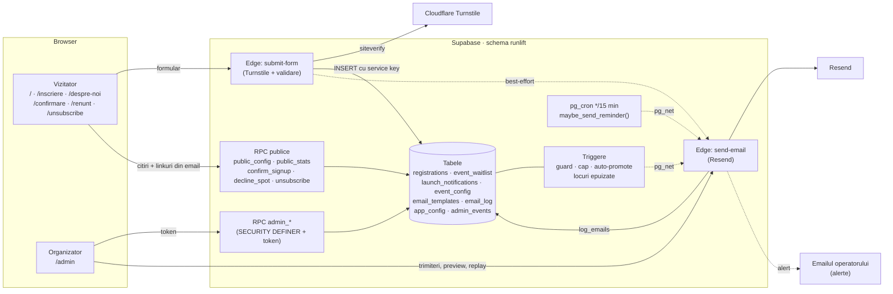

**Regula de aur:** sursa de adevăr pentru ediție e rândul `published` din `runlift.event_config`.
`src/content/edition.ts` e doar instantaneul de build (primul cadru + meta de share).

---

## 2. Client — pagina publică

### 2.1 Rutele

Nu există router. `src/main.tsx` alege componenta după `pathname`:

| Cale | Componentă | Ce face | Primește config live? |
|---|---|---|---|
| `/` (orice altceva) | `App` → `ComingSoon` / `Landing` | Pagina principală, cu faze pe ceas (vezi 2.2) | da |
| `/inscriere` | `Inscriere` | Doar formularul — linkul din bio/story/WhatsApp | da |
| `/despre-noi` | `DespreNoi` | Prezentare + formular „anunță-mă" | **nu** (deliberat: zero request-uri la Supabase la încărcare) |
| `/confirmare?token=` | `Confirmare` | Double opt-in pentru lista „anunță-mă" | da |
| `/renunt?token=` | `Renunt` | „Nu mai pot veni" — eliberează locul | da |
| `/unsubscribe?token=` | `Unsubscribe` | Dezabonare de la emailurile în masă | da |
| `/antrenament` | `Antrenament` | Antrenamentul săptămânii + programul Săptămâna 1…N (linkul din cardul „Până atunci", pe ecranul „Ne vedem curând") | **nu** (nu ține de nicio ediție; își cere singur datele) |
| `/admin` | `AdminApp` | Backoffice | da |

`/antrenament` e singura rută cu **shell propriu de build** (`antrenament.html`, rutat din
`vercel.json`). Meta de share se injectează la build, deci un card per pagină cere un fișier per
pagină — altfel linkul antrenamentului ar arăta cardul ediției, cu o dată posibil trecută.

Înainte de orice randare, `redirectCanonic` mută vizitatorii de pe `*.vercel.app` (producție) pe
`parktraining.fit`, cu tot cu cale și parametri.

### 2.2 Ce ecran vede vizitatorul pe `/`

Totul e pe ceas, fără redeploy. Momentele vin din configul publicat
(`useEditionDates` → `src/lib/config.ts`).

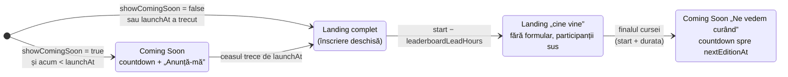

- Precedența (`src/App.tsx`): poarta de lansare bate fazele zilei cursei.
- Fazele zilei: `src/hooks/usePagePhase.ts` (`pre` → `leaderboard` → `next`).
- În faza „cine vine" aranjarea secțiunilor e fixă (Participanți, Format, Locație), nu din config.
- În faza „landing complet", ordinea și vizibilitatea secțiunilor vin din `config.layout`;
  numerotarea (01, 02…) se derivă din poziție. Secțiunea „Instagram" dispare dacă n-are clipuri.

**Previzualizări prin URL** (se pot combina):

| Parametru | Efect |
|---|---|
| `?preview=soon` | forțează Coming Soon |
| `?preview=landing` | forțează landing-ul complet |
| `?preview=leaderboard` | forțează faza „cine vine" |
| `?preview=next` | forțează „următorul antrenament" |
| `?config=draft` | randează ciorna în locul configului publicat — doar dacă ai token de admin în `localStorage` |

### 2.3 De unde vine configul

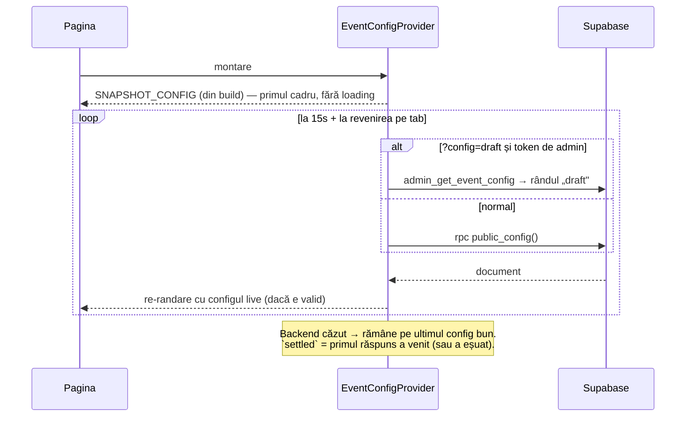

Consecință practică: o publicare din admin ajunge în taburile deja deschise în ≤15 secunde, fără
reload. Acțiunile ireversibile (redirectul de pe `/inscriere`) așteaptă `settled`, ca să nu decidă
pe un instantaneu de build vechi.

Cod: `src/hooks/useEventConfig.tsx`, `src/content/eventConfig.ts` (forma + parsarea documentului).

### 2.4 Înscrierea la eveniment

Aceeași logică pentru toate cele trei uși (2.5): `src/hooks/useRegistration.ts`.

**Ce vede omul** — stările panoului de înscriere:

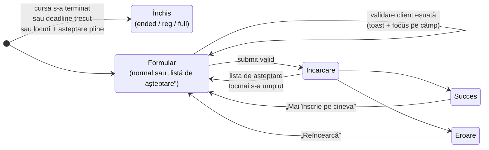

Modul „listă de așteptare" se activează singur când `locuri rămase ≤ 0` și lista mai are loc.
Locurile vin din `public_stats` (poll periodic, `src/hooks/useStats.ts`).

**Ce se întâmplă la submit:**

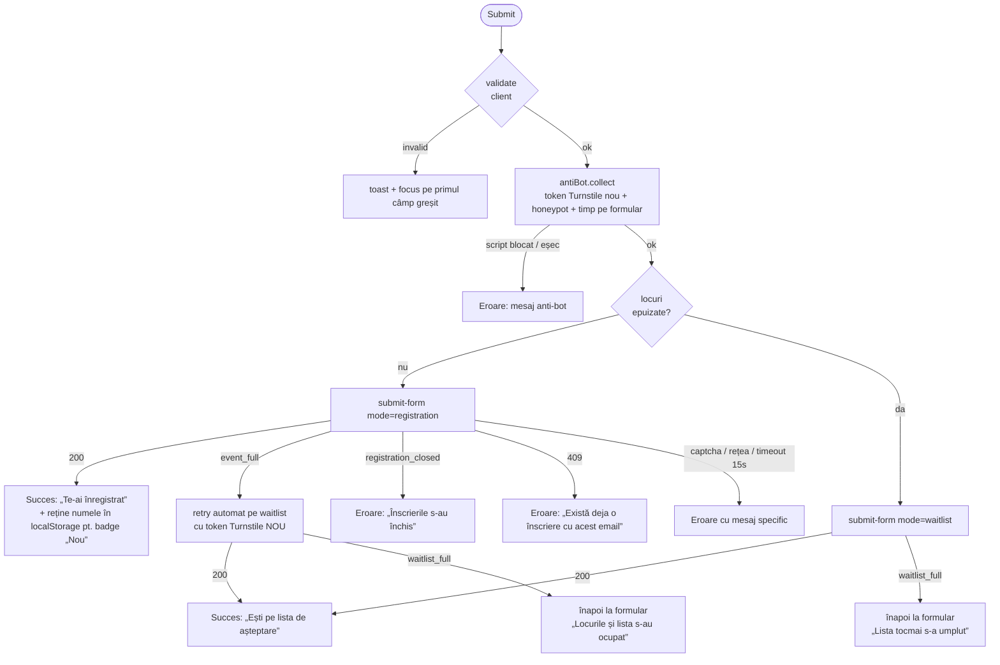

**Ce face serverul** (`supabase/functions/submit-form/index.ts`):

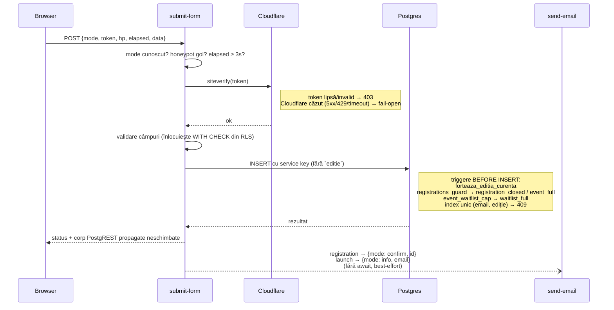

După insert, triggerul `semnaleaza_locuri_epuizate` trimite o alertă operatorului când s-a ocupat
ultimul loc (vezi 3).

Detalii anti-bot: `ANTI-BOT.md`. Mesajele de eroare: `mesajPentru()` din `useRegistration.ts`.

### 2.5 Trei uși spre același formular

| Ușa | Unde | După succes |
|---|---|---|
| Secțiunea „Înscriere" | în landing, `RegistrationSection.tsx` | rămâi pe loc, panou de succes |
| Overlay | CTA-urile din `TopBar`/`Hero` → `RegistrationOverlay.tsx` | se închide singur după 3s (orice interacțiune oprește închiderea) |
| Pagina `/inscriere` | `Inscriere.tsx` + `RegistrationForm.tsx` | redirect după 3s spre `/#participanti`, cu banner „Ești înscris — locul X/Y" |

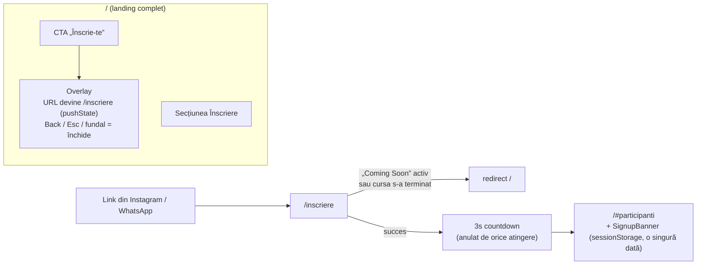

Notă: `/inscriere` **nu** se închide în faza „cine vine" (o oră înainte de start) — rămâne linkul de
dat la fața locului până la deadline-ul real. O închide `useRegistration`, pe deadline.

### 2.6 „Anunță-mă la lansare" + confirmarea din email

Formularul din `ComingSoon` (modal) și din `/despre-noi` (inline). Logica comună:
`src/hooks/useLaunchForm.ts` + `src/lib/launchForm.ts`. Câmpul `sursa` spune de unde a venit
(`lansare` / `despre-noi`).

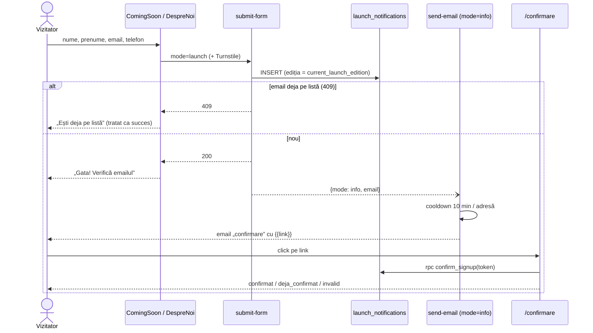

Șablonul folosit e `confirmare` (cu `{{acolade duble}}`). Fără `{{link}}` în text, oamenii n-au cum
confirma.

### 2.7 Linkurile din emailuri: `/renunt` și `/unsubscribe`

Două pagini cu comportament **opus**, deliberat:

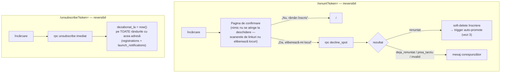

- `prea_tarziu` = ediția nu mai e curentă sau cursa a început.
- Dezabonarea oprește doar emailurile în masă; confirmările tranzacționale pot ajunge în
  continuare.
- Linkul `{link_renunt}` există doar în emailurile către participanți (confirmare, reminder,
  promovare). Paragraful care îl conține se filtrează pentru cine n-are token.

---

## 3. Automatizări (fără om la tastatură)

Lucrurile care se întâmplă singure. Toate trec prin `send-email` și lasă urme în `email_log` și
`admin_events` (tabul „Participanți" → Activitate).

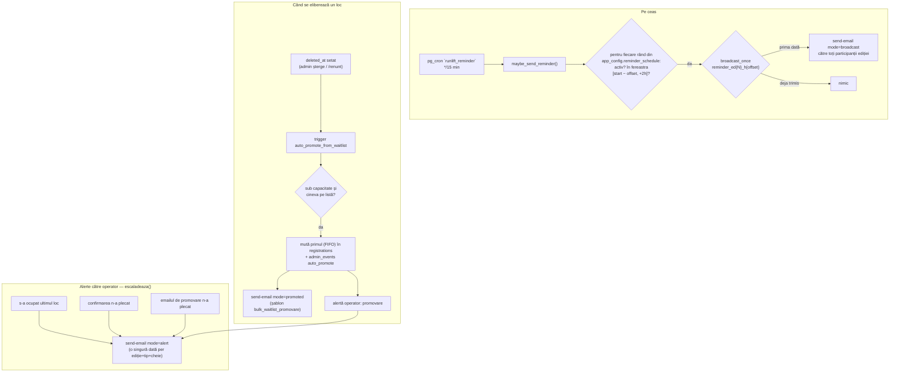

- Orarul reminderelor se editează din admin (4.8 → Remindere). Publicarea scrie orarul în
  `app_config.reminder_schedule`, pe care îl citește cron-ul.
- Pentru a opri **un** reminder: debifează-l în admin și publică. `cron.unschedule` le oprește pe
  toate, ale tuturor edițiilor.
- Armare / inspecție cron: `supabase/sql/supabase-cron-reminder-ARM.sql`. Verificat live
  (18 sept 2026): jobul e activ, `*/15 * * * *`.

---

## 4. Admin — `/admin`

### 4.1 Autentificarea

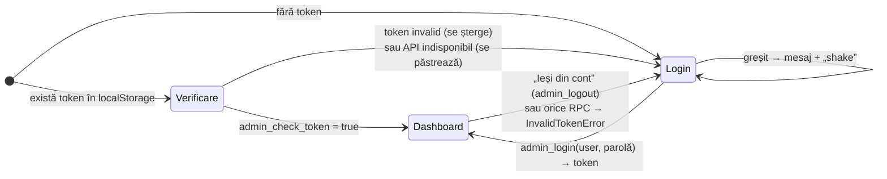

Cont unic în `admin_users` (bcrypt), sesiuni în `admin_sessions`. Tokenul stă în `localStorage` pe
aceeași origine — de asta `/?config=draft` știe că ești admin.
Cod: `AdminApp.tsx`, `AdminLogin.tsx`, `adminSession.tsx` (contextul `token` + `onAuthError` +
`showToast` pentru toate taburile).

### 4.2 Structura ecranului

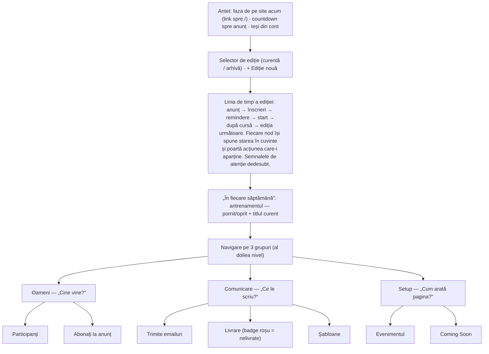

- Datele (înscrieri, așteptare, jurnal email, activitate) se reîmprospătează periodic:
  `useAdminPolling.ts`. La prima încărcare a activității nu se afișează toast-uri; apoi fiecare
  `auto_promote` nou aduce un toast.
- **Ediție de arhivă** = orice ediție selectată care nu e cea curentă. Butoanele de scriere se
  ascund, iar serverul refuză oricum (`edition_archived`).
- Grupurile și taburile: `src/admin/adminNavigatie.ts`. Nodurile liniei de timp:
  `src/admin/reperele.ts` — **singura** listă de repere; faza și semnalele de atenție rămân în
  `src/admin/stareCurenta.ts`. Randarea: `src/admin/LiniaDeTimp.tsx`.
- **De ce linia de timp și nu meniul.** Desfășurarea în timp e forma pe care organizatorul o are
  oricum în cap; meniul îl obliga s-o traducă în taburi — reminderele sunt un grup din
  „Evenimentul", lista de înscriși e alt tab, ediția următoare un dialog în al treilea. Panoul
  „Acum" răspundea la aceeași întrebare, dar în două propoziții: restul rămânea de reconstruit.
- **Antrenamentul stă în AFARA liniei**, într-un bloc propriu: nu aparține niciunei ediții, iar pe
  linie ar fi părut un reper al ediției curente și ar fi dispărut odată cu ea. Împărțirea de nivel
  întâi a backoffice-ului e episodic (ediția) față de recurent (săptămâna).

### 4.3 Oameni → Participanți

Codul: `AdminDashboard.tsx` (handlerele), `AdminRandAdaugare.tsx`, `AdminAsteptare.tsx`,
`AdminActivitate.tsx`, `DialogPrezenta.tsx`, `AdminCifre.tsx`.

| Acțiune | RPC | Observații |
|---|---|---|
| Caută | — (filtru local) | după nume, telefon, email |
| Adaugă manual | `admin_add_registration` | validare client + garda de capacitate pe server (`event_full`) |
| Editează | `admin_update_registration` | 409 = email duplicat |
| Șterge (cu dialog) → Undo 6s | `admin_delete_registration` → `admin_undelete_registration` | soft-delete; undo readuce **același** rând (aceeași poziție) |
| Prezență (venit / număr / timp) | `admin_set_prezenta` | refuzuri: număr duplicat, număr invalid, timp invalid |
| Export CSV | — (local) | coloanele de prezență la coadă; celulă goală = „nu se știe" |
| Promovează din așteptare | `admin_promote_waitlist` + `send-email mode=confirm` | trimite șablonul „Confirmare (participanți)", **nu** pe cel de promovare automată |
| Șterge din așteptare → Undo | `admin_delete_waitlist` → `admin_undelete_waitlist` | ordinea FIFO se păstrează |

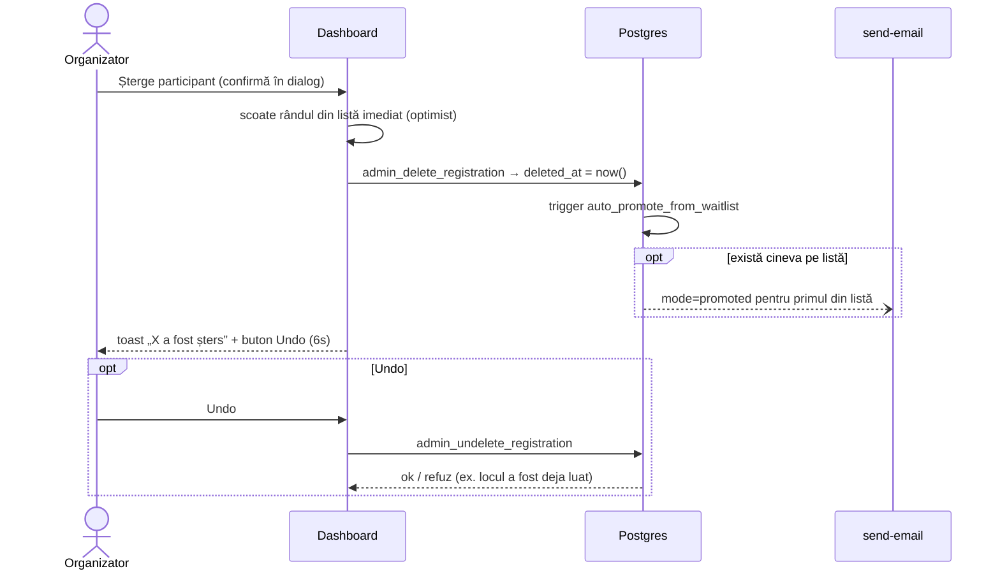

Atenție la combinația „șterge + undo" când lista de așteptare nu e goală: ștergerea a promovat deja
pe cineva, deci undo poate fi refuzat pe capacitate (mesajul vine din `motivUndoEsuat`).

### 4.4 Oameni → Abonați la anunț

Doar citire: lista `launch_notifications` (`admin_list_launch_notifications`), filtrabilă după
ediția de lansare, sursă (`lansare` / `despre-noi`) și text, cu export CSV.
Cod: `AdminLaunchTab.tsx`.

### 4.5 Comunicare → Trimite emailuri

Cod: `AdminEmailTab.tsx` (audiențele din ediția deschisă), `AnuntIstoric.tsx` (anunțul către toți),
`emailAudience.ts`, `sendLock.ts`, `anunt.ts`.

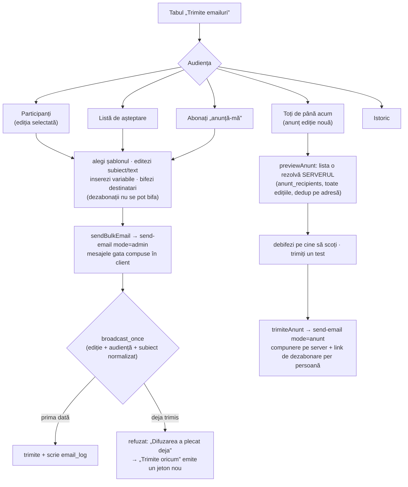

Reminderele **nu** se trimit de aici: le trimite cron-ul (3). Butonul manual lângă cron-ul armat ar
fi dus la reminder dublu.

### 4.6 Comunicare → Livrare

Jurnalul `email_log` pentru ediția selectată: fișa per participant (ce comunicare a ajuns, ce nu),
plus lista trimiterilor eșuate.

| Acțiune | Pentru ce | Cum |
|---|---|---|
| Retrimite eșuatele | doar emailurile trimise manual din backoffice | `send-email mode=admin` cu același text |
| Rejoacă prin fluxul lui | confirmări, promovări, anunțuri eșuate | `send-email mode=replay` — reconstruiește mesajul din șablon, nu din jurnal |
| Trimite confirmarea | după ce ai corectat un email greșit | `mode=admin`, șablonul de confirmare, la adresa curentă |

Nicio acțiune de trimitere pe o ediție de arhivă. Cod: `AdminDeliveryTab.tsx`, `deliveryLog.ts`.

### 4.7 Comunicare → Șabloane

Editezi subiectul și textul fiecărui șablon din `email_templates` (`admin_save_email_template`) și
vezi preview-ul HTML randat de server (`send-email mode=preview`). Avertizează (nu blochează) dacă
un reminder n-are `{link_renunt}`. Lista completă, cu cine le declanșează: secțiunea 5.
Cod: `AdminTemplatesTab.tsx`.

### 4.8 Setup → Evenimentul

Ciclul de viață al configului unei ediții. Cod: `AdminEventTab.tsx`, grupurile din
`src/admin/eventTab/grupuri/`, validarea din `eventConfigForm.ts`.

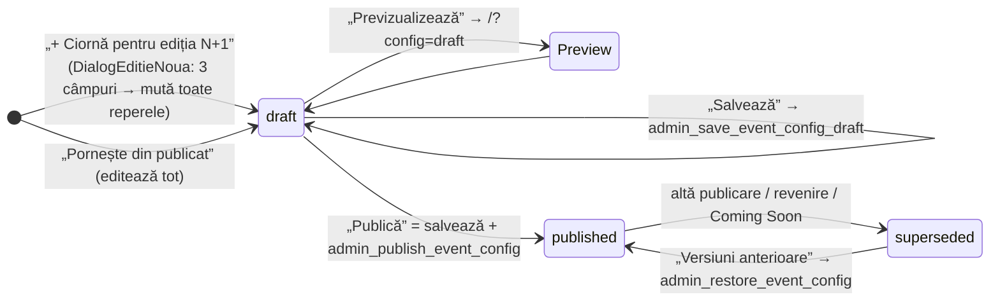

Grupurile formularului: **Ediția** (numere, nume, concept) · **Când** (start, deadline, lansare,
următorul antrenament, check-in, durată, „cine vine" cu X ore înainte) · **Unde** (loc, oraș,
coordonate) · **Locuri** (total, listă de așteptare) · **Remindere** (orarul: avans în ore +
șablon + activ) · **Ce arată** (ordinea și vizibilitatea secțiunilor) · **Instagram** (clipuri, max
`MAX_REELS`).

**Ce face „Publică" pe server** (o singură tranzacție):

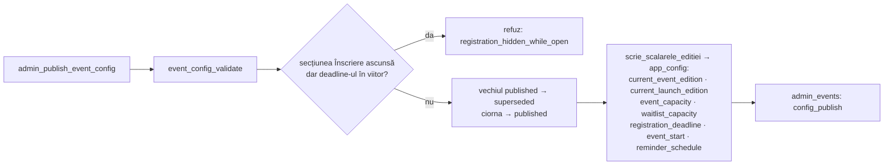

Din acel moment: site-ul (≤15s), triggerele de capacitate/deadline și cron-ul de remindere citesc
valorile noi. Singurul lucru care cere deploy e **meta de share** (injectată la build) — tabul îți
spune când a rămas în urmă (`buildFingerprint.ts`).

Salvarea și publicarea nu sunt o tranzacție comună: dacă publicarea e refuzată, rămâi cu ciorna
salvată și site-ul pe configul vechi. Mesajul spune la ce pas a picat (`refuzCuPas`).

### 4.9 Setup → Coming Soon

Singurul tab cu efect **imediat**, fără ciornă: comutatorul `showComingSoon`, momentul lansării
(`launchAt`, cu presetări „Mâine la 12:00", „Peste o săptămână", „Acum") și ținta
`nextEditionAt`.

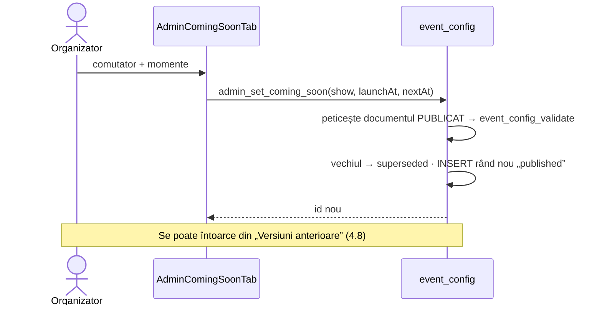

Cod: `AdminComingSoonTab.tsx`.

### 4.9b Programul antrenamentelor (bloc, nu tab)

Se deschide din blocul „în fiecare săptămână", de sub linia de timp — **nu e un tab**, fiindcă nu
e o setare a ediției. Efect **imediat**, fără ciornă.

Ecranul are două jumătăți: **lista programului** (Săptămâna 1…N, cu ↑ ↓, Ascunde/Arată, Șterge)
și **editorul** săptămânii deschise (titlu, text liber, vizibilitate). Butonul de adăugare poartă
numărul deja calculat — „+ Săptămâna 10" — deci numărul nu se tastează nicăieri.

Nu ține de nicio ediție — se editează și între ediții, iar ediția de arhivă nu-l blochează.
Cod: `AdminAntrenamentTab.tsx`; tabelul și RPC-urile:
`supabase/sql/supabase-migration-program-antrenamente.sql`.

Patru reguli le impune **serverul**, nu formularul, fiindcă formularul nu e singura cale spre tabel:

| Regulă | De ce acolo |
|---|---|
| Săptămână vizibilă + corp gol → `workout_empty` | O scriere directă ar fi produs o săptămână goală la un URL tocmai trimis |
| Salvarea care schimbă doar vizibilitatea peticește rândul publicat, nu scrie versiune | Altfel o ascundere-arătare dublă ar fi îngropat editarea reală sub rânduri identice |
| Numărul următor se calculează la server (`max(numar) + 1`) | Două ecrane deschise ar fi putut trimite același număr |
| Mutarea și ștergerea renumerotează, prin interval-tampon | Indexul unic e *parțial*, deci neamânabil: un schimb dintr-un singur `update` pică cu `duplicate key` |

**Numărul e poziția în program, nu un identificator etern.** Mutarea și ștergerea renumerotează,
ca programul să rămână 1…N fără goluri — un program căruia îi lipsește Săptămâna 2 e un program
stricat. Consecința asumată: un `#s5` trimis luna trecută poate să nu mai însemne același lucru.

**Ascunderea NU renumerotează.** Cu Săptămâna 3 ascunsă, publicul vede 1, 2, 4. Numerele
recalculate peste cele vizibile ar fi mutat numărul săptămânii curente la fiecare ascundere.

Versiunile anterioare rămân (`superseded`), poartă numărul săptămânii lor — deci lista e **per
săptămână** — și se pot republica din același ecran. Fără nicio săptămână vizibilă, URL-ul
**răspunde** și spune că nu e nimic publicat — nu dă 404, ca linkurile deja trimise să nu se rupă.

Pe partea publică, `/antrenament` arată în prim-plan săptămâna curentă (cea mai mare vizibilă) și,
sub ea, un `<select>` nativ cu tot programul. Alegerea schimbă cardul pe loc și scrie fragmentul
(`/antrenament#s1`), fără să mai ceară nimic de la server: tot programul vine într-un singur
răspuns (`public_weekly_workouts`). Un fragment care nu corespunde niciunei săptămâni vizibile e
ignorat, iar pagina deschide săptămâna curentă.

### 4.10 Selectorul de ediție și „+ Ediție nouă"

Două lucruri diferite care se confundă ușor:

| | „+ Ediție nouă" (selector, sus) | „+ Ciornă pentru ediția N+1" (tabul Evenimentul) |
|---|---|---|
| RPC | `admin_create_edition` | `admin_save_event_config_draft` + publicare |
| Ce schimbă | `current_event_edition` / `current_launch_edition` = max + 1; **șterge** `registration_deadline` și `event_start` | întregul document al ediției (dată, loc, locuri, secțiuni, remindere) |
| Efect pe site | înscrierile noi intră pe ediția nouă, goală | site-ul trece pe ediția nouă după „Publică" |

Ordinea obișnuită e cea din `GHID-EDITIE-NOUA.md` (ciorna + publicarea). Publicarea scrie oricum
numărul ediției în `app_config`.

---

## 5. Emailurile: cine le declanșează

Toate șabloanele stau în `runlift.email_templates` și se editează din 4.7.
Variabilele cu **o acoladă** (`{prenume}`, `{data_cursei}`…) sunt ale trimiterilor în masă;
șablonul `confirmare` folosește **două** (`{{link}}`).

| Cheie șablon | Declanșat de | Mod `send-email` | Către |
|---|---|---|---|
| `confirmare` | înscriere „anunță-mă" (submit-form) | `info` | abonatul nou (double opt-in) |
| `bulk_participant_confirmare` | înscriere la eveniment (submit-form); promovare manuală; „Trimite confirmarea" din Livrare | `confirm` / `admin` | participantul |
| `bulk_waitlist_promovare` | trigger auto-promote | `promoted` | cine a urcat de pe listă |
| `bulk_participant_reminder` | cron, după orar | `broadcast` | toți participanții ediției |
| `bulk_participant_reminder_final` | cron, dacă e ales pe un rând din orar | `broadcast` | idem |
| `bulk_participant_reminder_binar` | cron, dacă e ales pe un rând din orar | `broadcast` | idem |
| `bulk_waitlist_anunt` | organizatorul, tabul Emailuri → Listă de așteptare | `admin` | lista de așteptare |
| `bulk_participant_anunt` | organizatorul, tabul Emailuri → Toți de până acum | `anunt` | toți participanții din toate edițiile |
| `event_badge` | capul fiecărui email | — | — |
| `info` | nefolosit (înlocuit de `confirmare`) | — | — |
| — (text fix) | `escaladeaza()` din DB / send-email | `alert` | operatorul (`operator_email()`) |

Fiecare încercare lasă un rând în `email_log` (`log_emails`), vizibil în 4.6.

---

## 6. Unde schimbi ce

| Vrei să schimbi… | Unde | Deploy? |
|---|---|---|
| Data, locul, locurile, secțiunile, orarul reminderelor | `/admin` → Evenimentul → ciornă → Publică | nu |
| Coming Soon on/off, momentul anunțului | `/admin` → Coming Soon | nu |
| Antrenamentul săptămânii, ordinea programului, ce se vede | `/admin` → blocul „în fiecare săptămână” | nu |
| Textul oricărui email | `/admin` → Șabloane | nu |
| Un clip Instagram | `/admin` → Evenimentul → Instagram | nu (posterul nou, da: `public/reels/`) |
| Meta de share (titlu/imagine WhatsApp/Facebook) | `src/content/edition.ts` → build | **da** |
| Proza statică a paginii (texte care nu țin de ediție) | componentele din `src/components/` | da |
| Ordinea fazelor / când comută pagina | `src/App.tsx`, `src/hooks/usePagePhase.ts`, derivatele din `src/lib/config.ts` | da |
| Validarea formularului | `src/lib/validation.ts` **și** `validateEventRow` / `validateLaunchRow` din `submit-form` | da + deploy manual al funcției Edge |
| Mesajele de eroare la înscriere | `mesajPentru()` în `src/hooks/useRegistration.ts` | da |
| Reguli anti-bot (timp minim, honeypot, fail-open) | `supabase/functions/submit-form/index.ts`, `src/lib/antiBot.ts` | deploy manual Edge |
| Capacitate / deadline pe server | triggerele `registrations_guard`, `event_waitlist_cap` (citesc `app_config`) | migrare SQL |
| Regula de promovare automată | `auto_promote_from_waitlist()` | migrare SQL |
| Frecvența cron-ului / fereastra de 2h | `supabase-cron-reminder-ARM.sql` / `maybe_send_reminder()` | SQL |
| Un tab nou în admin | `adminNavigatie.ts` (grup + tab), `TabAdmin` din `stareCurenta.ts`, randarea în `AdminDashboard.tsx` | da |
| O acțiune nouă în admin | RPC `admin_*` nou (SQL, cu `admin_check_token`) + wrapper în `src/lib/adminApi.ts` | da + migrare |
| Un mod nou de formular public | `TABLE` + `validate*` în `submit-form` (altfel slăbești validarea) + `postForm` în `src/lib/supabase.ts` | da + Edge |
| Un șablon nou pentru reminder | rândul în `email_templates` + `REMINDER_TEMPLATE_KEYS` din `src/content/eventConfig.ts` **+ `TEMPLATES_PERMISE` din `send-email`** (testul pică dacă uiți) | da + Edge + SQL |

Amintiri de proces (din `CI-CD.md` și `MIGRATIONS.md`): merge în `main` = deploy Vercel;
funcțiile Edge **nu** se deployează din CI (`supabase functions deploy … --no-verify-jwt`);
migrările SQL se aplică manual și se notează în `MIGRATIONS.md`.

---

## 7. Neconcordanțe găsite la documentare

Găsite la scrierea documentului și reparate pe 18 septembrie 2026:

1. **Reminderul binar pleca pe textul greșit.** `bulk_participant_reminder_binar` se putea alege
   pe un rând din orar, dar modul `broadcast` din `send-email` nu-l avea în `TEMPLATES_PERMISE`,
   deci trimitea tăcut reminderul obișnuit. În plus, șablonul nici nu exista în producție
   (migrarea `supabase-migration-reminder-binar.sql` era neaplicată). Acum: cheia e permisă,
   șablonul e în DB, iar un test din `tests/unit/edge/sendEmail.test.ts` verifică faptul că
   fiecare cheie din `REMINDER_TEMPLATE_KEYS` pleacă cu textul ei.
2. **Toastul de după „+ Ediție nouă"** cerea editarea lui `edition.ts` și un redeploy, contrazicând
   dialogul de confirmare. Acum trimite spre Setup → Evenimentul.
