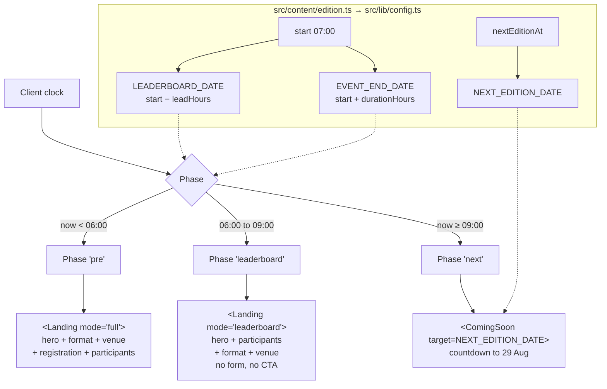

# Fazele zilei de eveniment - Plan

## Goal Capsule

**Objective:** On race morning the homepage tells whoever opens it the one thing
that matters at that hour — before 06:00 "sign up", from 06:00 "here is who is
coming", from 09:00 "the next one is on 29 August" — and it does this on its
own, while the organiser is at Valea Morilor with a phone in a pocket, not at a
laptop pushing a deploy.

**Means:** Derive three page phases from the dates already in
`src/content/edition.ts` and switch on them client-side, extending the
`LAUNCH_DATE` gate that `src/App.tsx` already uses to flip Coming Soon → Landing
(KTD1).

**Authority hierarchy:** Requirements (R-IDs) win on product behavior. KTDs win
on implementation mechanism inside those constraints. Units override neither.

**Stop conditions:**
- Stop and ask if honouring R2 or R3 requires moving `registrationDeadline`.
  The 07:00 server-side deadline is a settled decision (KD3); a change there
  needs a Supabase `app_config` sync and is not this plan's call to make alone.
- Stop if `npm run verify` fails for a reason not named in this plan.

**Execution profile:** Ship today. The first phase boundary fires at 06:00 on
2026-08-22, so this has to be live and eyeballed tonight. Build U1–U4 as the
critical path, verify each phase through the preview params before trusting the
clock, then U5–U7. Add tests as each unit lands rather than at the end — the
whole feature is time-dependent, and a fixed-clock test is the only way to see
tomorrow morning today.

**Tail ownership:** Deploy is in scope (U7). Per the repo's deploy memory, a
GitHub push does not reliably trigger a Vercel build — finish with
`vercel --prod` and confirm the phases on the live domain using the preview
params.

## Product Contract

### Summary

The homepage moves through three automatic, clock-driven phases on event day.
Until 06:00 it is today's landing with registration open. From 06:00 to 09:00 it
is the same landing with registration removed and the participants list pulled
up under the hero. From 09:00 it is the Coming Soon screen counting down to the
next session on 29 August. The direct `/inscriere` link is deliberately not on
this schedule: it follows the real 07:00 registration deadline instead.

### Problem Frame

Right now the page has one shape for the whole of race day. At 06:00, with
everyone already registered and walking to Valea Morilor, the homepage is still
a sales page asking them to sign up — the list of who is actually coming sits at
the bottom, below the hero, the format section and the map. At 09:00, when the
session is over, the page is a countdown to an event that has already happened.
Both moments need a different page, and both fall inside a three-hour window
when the organiser is running the event and cannot be editing config and
redeploying.

The repo already solves the shape of this problem once: `src/App.tsx` flips
Coming Soon → Landing when `LAUNCH_DATE` passes, with no deploy. What is missing
is the same treatment for the two boundaries that matter on the day itself.

### Requirements

#### Phase switching

R1. The homepage derives its phase from the current time and the dates in
`src/content/edition.ts`, with no redeploy or manual flag flip at either
boundary.

R2. The leaderboard phase begins one hour before the event start — 06:00 for the
current edition.

R3. The countdown phase begins when the session ends — 09:00 for the current
edition, with `durationHours` corrected to `2`.

R4. Each phase is reachable before its hour through a `?preview=` parameter, so
the organiser can check all three the night before.

#### Leaderboard window

R5. During the leaderboard phase the homepage shows no way to register: no form
section, no header CTA, no hero CTA, no overlay.

R6. During the leaderboard phase the participants list appears directly under
the hero, above the format and venue sections.

R7. Once the start time passes, the header stops showing a countdown reading all
zeros and shows a live state instead.

#### Next-session countdown

R8. From the countdown phase onward the homepage shows the Coming Soon screen
counting down to the next session date, held in `src/content/edition.ts`.

R9. The Coming Soon copy names the next session rather than an announcement when
it is counting to a session date.

R10. The countdown phase renders regardless of the `showComingSoon` flag, which
governs the pre-launch gate and not this one.

#### Direct link and operations

R11. `/inscriere` keeps serving the registration form through the 06:00–07:00
hour, and closes on the existing 07:00 deadline rather than on the homepage's
06:00 boundary.

R12. From the countdown phase onward, `/inscriere` sends visitors to the
homepage so the next-session teaser has one home.

R13. Launch-list signups collected from the countdown phase are attributed to
the next edition, not the one that just finished.

### Key Decisions

KD1. **The session is 07:00–09:00.** (session-settled: user-directed — chosen
over a 1-hour session with a gap before the countdown, and over decoupling the
switches from session length: the countdown replaces the page the moment the
session ends.) Governs R3.

KD2. **The leaderboard window keeps the full landing, minus registration.**
(session-settled: user-directed — chosen over a full-page leaderboard takeover:
people arriving at the venue still want the map and the format.) Governs R5, R6.

KD3. **Registration closes server-side at 07:00, not at 06:00.** (session-settled:
user-directed — chosen over moving the deadline to match the homepage: the
06:00–07:00 hour becomes a check-in link the organiser hands out, not something
the public stumbles into.) Governs R11.

KD4. **The countdown phase is a teaser only.** No venue, slots, or registration
for 29 August; edition 6 gets flipped by hand when its details are settled.
Governs R8, R9.

### Success Criteria

- At 06:00 tomorrow the homepage changes on its own, with nobody touching a
  laptop.
- Someone who opens the page at 07:30 sees who is on the start line, not a
  countdown stuck at zero.
- The organiser can see all three phases tonight, before any of them are real.

### Scope Boundaries

In scope: the three homepage phases, the `/inscriere` guard, the Coming Soon
next-session variant, the edition-config fields the phases derive from, and the
launch-edition bump those signups need.

Out of scope:

- Race results, times, or any ranking. "Leaderboard" here means the list of
  registered people that `public_stats` already returns — the same data the
  "Cine vine" section shows today.
- Edition 6 content. The countdown names a date and nothing else.
- Server-side changes to the registration deadline or the reminder window.

#### Deferred to follow-up work

- A results view for after the session, if you ever want times on the page.
- Making the phase boundaries editable from `/admin` instead of from config.

## Planning Contract

### Key Technical Decisions

KTD1. **Phases derive from `useCountdown` on module-level dates, matching the
existing launch gate.** `src/App.tsx` already holds `useCountdown(LAUNCH_DATE)`
and reads `.done`. Two more of the same give the two new boundaries, tick every
second until they fire, and stop after. This keeps one time mechanism on the
page instead of introducing a scheduler. Covers R1.

KTD2. **Phase boundaries are derived, not hand-entered.** `LEADERBOARD_DATE`
comes from `EVENT_DATE` minus a configured lead time; the countdown boundary is
`EVENT_END_DATE`, which `durationHours` already produces. A future edition
inherits the behaviour by editing `start` and `durationHours` alone. Covers R2,
R3.

KTD3. **`Landing` takes a mode rather than splitting into a second component.**
The leaderboard window is the same page with registration removed and one
section reordered (KD2) — a sibling component would duplicate the hero, format,
venue and footer wiring and drift from it. `TopBar` and `Hero` gain an optional
flag to drop their CTA. Covers R5, R6.

KTD4. **`ComingSoon` gains a target and a copy variant, defaulting to today's
behaviour.** The component hardcodes `LAUNCH_DATE` and computes its label at
module scope. Both become props with the current values as defaults, so the
pre-launch gate and `/admin` keep working untouched while the countdown phase
passes the next-session date. Covers R8, R9.

KTD5. **`durationHours: 6 → 2` is a config correction with a small blast
radius.** It feeds `EVENT_END_DATE`, which reaches exactly three places: the
`isEventEnded` gate in `src/hooks/useRegistration.ts`, the `DTEND` of the
calendar file in `src/lib/calendar.ts`, and a derivation test that asserts the
formula rather than the value. It is not synced to Supabase — no `app_config`
change follows from it. Covers R3.

KTD6. **Attribution is server-side; the code field only changes copy.** Signups
taken during the countdown phase belong to the next session (R13), but
`src/lib/supabase.ts:139` deliberately omits `editie` from the insert and lets
the server supply it by default — so `launchNumber` in code attributes nothing.
Attribution follows the `app_config` sync, and U7 must confirm that the
`launch_notifications.editie` default reads that key before treating the sync as
sufficient. Covers R13.

KTD7. **The `launchNumber` bump lands after the session ends, not with tonight's
deploy.** `LAUNCH_EDITION_ORDINAL` derives from it and renders on
`src/components/Confirmare.tsx` and `src/components/Unsubscribe.tsx` — the two
pages people registered for the current edition open from their email links
tonight and tomorrow morning. Bumping it now relabels their confirmation page to
an edition that has not happened, during exactly the window this plan exists to
get right. Covers R13.

### High-Level Technical Design

The `/inscriere` route reads the same phase but uses only its last boundary: it
serves the form through `pre` and `leaderboard` (R11, the existing 07:00 gate in
`useRegistration` closing it mid-window), and redirects to `/` in `next` (R12).

Timeline for the current edition:

| Clock | Phase | Homepage | `/inscriere` |
|---|---|---|---|
| before 06:00 | `pre` | landing, registration open | form |
| 06:00–07:00 | `leaderboard` | landing, no registration, list under hero | form (deadline not reached) |
| 07:00–09:00 | `leaderboard` | same, header shows live state | existing "closed" state |
| from 09:00 | `next` | Coming Soon → 29 August | redirect to `/` |

### Assumptions

- The client clock is trusted for the switch, as it already is for the launch
  gate. A visitor with a badly wrong device clock sees the wrong phase; the
  server-side deadline still protects registration itself.
- A 30-second lag at a boundary is acceptable. `useCountdown` ticks every second,
  so in practice the switch lands within a second of the hour.

### Sequencing

U1 must land first — every other unit reads the dates it derives. U2 depends on
U1. U3 and U4 are independent of each other and both depend on U2. U5 depends on
U2. U6 depends on U3, U4 and U5. U7 is last.

## Implementation Units

### U1. Edition config and derived phase dates

**Goal:** The three phase boundaries and the next-session date exist as derived
constants, from fields in the edition SSOT.

**Requirements:** R1, R2, R3, R8.

**Files:**
- `src/content/edition.ts` — set `durationHours: 2`; add `leaderboardLeadHours: 1`
  and `nextEditionAt: '2026-08-29T07:00:00'`, both documented in the file's
  existing comment style.
- `src/lib/config.ts` — derive `LEADERBOARD_DATE` and `NEXT_EDITION_DATE` next to
  the existing `EVENT_DATE` / `EVENT_END_DATE` block, using the same `at()` helper
  so the timezone composition stays identical.
- `tests/unit/config.test.ts` — extend.

**Approach:** Follow the file's own rule that dates are written without an offset
and composed with `EDITION.tz`. `LEADERBOARD_DATE` is `EVENT_DATE` minus
`leaderboardLeadHours` in milliseconds, mirroring how `EVENT_END_DATE` is
already built. Do not add a separate countdown-boundary constant — that boundary
is `EVENT_END_DATE` (KTD2).

**Test scenarios:**
- `LEADERBOARD_DATE` equals `EVENT_DATE` minus `leaderboardLeadHours` hours.
- `NEXT_EDITION_DATE` is composed with `EDITION.tz`, not the machine timezone —
  the same assertion shape `config.test.ts` already uses for `LAUNCH_DATE`.
- The four moments are strictly ordered: `LEADERBOARD_DATE` < `EVENT_DATE` <
  `EVENT_END_DATE` < `NEXT_EDITION_DATE`. This is the guard that catches a future
  edition where someone edits `start` and forgets `nextEditionAt`.
- The existing `EVENT_END_DATE = start + durationHours` assertion in
  `tests/unit/edition-derivation.test.ts` still passes — confirm rather than edit.

**Verification:** `npm run test`.

### U2. Phase hook and homepage wiring

**Goal:** `/` renders the right one of three phases, and each is reachable
through a preview parameter.

**Requirements:** R1, R4, R10.

**Files:**
- `src/hooks/usePagePhase.ts` — new.
- `src/App.tsx` — replace the two-way Coming Soon / Landing choice with the phase
  result.
- `tests/unit/` — a hook-level test alongside the existing `countdown.test.ts`.

**Approach:** The hook returns one of `'pre' | 'leaderboard' | 'next'` from two
`useCountdown` calls, one per boundary (KTD1). Keep the existing launch gate in
`App.tsx` intact and layered above the new phases: the pre-launch Coming Soon
still wins while `SHOW_COMING_SOON` is set and `LAUNCH_DATE` has not passed, and
the `next` phase renders Coming Soon regardless of that flag (R10). Extend the
existing `?preview=` reader to accept the two new values next to `landing` and
`soon` — same parameter, same precedence over the clock.

**Test scenarios:**
- Before the leaderboard boundary the hook returns `pre`; between the boundaries,
  `leaderboard`; after the end, `next`.
- Exactly at a boundary the later phase wins, so no instant reads as neither.
- `?preview=leaderboard` and `?preview=next` override a clock that says
  otherwise; `?preview=landing` and `?preview=soon` keep behaving as they do
  today.
- With `SHOW_COMING_SOON` set and the clock past the session end, the page shows
  the next-session countdown rather than the pre-launch screen.

**Verification:** `npm run test`.

### U3. Leaderboard mode on the landing

**Goal:** Between 06:00 and 09:00 the landing offers no way to register and puts
the participants list under the hero.

**Requirements:** R5, R6, R7.

**Files:**
- `src/components/Landing.tsx` — accept a mode; branch section order; skip the
  registration section and the overlay.
- `src/components/landing/TopBar.tsx` — optional CTA; live state when the start
  has passed.
- `src/components/landing/Hero.tsx` — optional CTA.

**Approach:** Add a `mode` prop defaulting to today's behaviour so nothing else
that renders `Landing` has to change (KTD3). In leaderboard mode do not mount
`RegistrationSection`, do not mount `RegistrationOverlay`, and pass the CTA flag
off to `TopBar` and `Hero`; render `ParticipantsSection` between `Hero` and
`FormatSection`. For R7, `TopBar` already receives the countdown — when `cd.done`
is true, show a live label in place of the four zeroed units, keeping
`role="timer"` off the static text.

Leave the `href="/inscriere"` attributes where they are on the elements that
still render — `tests/unit/rute.test.ts` scans these files for internal hrefs and
they must stay resolvable.

**Test scenarios:**
- In leaderboard mode the registration section is absent, and so are the header
  and hero CTAs.
- In leaderboard mode the participants section precedes the format section in
  document order; in full mode it follows the registration section, as today.
- In leaderboard mode the overlay cannot be opened — there is no control that
  opens it.
- With the clock past the start, the header shows the live state and not four
  zeroed countdown units.
- Someone redirected from `/inscriere` after registering at 06:30 still sees the
  post-signup banner, and the participants anchor still resolves — this is the
  landing point of the flow R11 keeps open, and R6 moves the section it targets.
- Full mode is unchanged: the existing landing tests pass without edits.

**Verification:** `npm run test`, then `npm run test:e2e` for the existing
landing specs.

### U4. Coming Soon as a next-session countdown

**Goal:** From 09:00 the homepage counts down to 29 August and says so.

**Requirements:** R8, R9, R10.

**Files:**
- `src/components/ComingSoon.tsx` — target and copy variant as props.
- `src/App.tsx` — pass the next-session target in the `next` phase.

**Approach:** Turn the module-scope `LAUNCH_LABEL` into a function of the target
date and give the component `target` and `variant` props defaulting to
`LAUNCH_DATE` and today's announcement copy (KTD4). In the next-session variant
the subtitle names the session date instead of an announcement date, and the
badge names the upcoming edition. Keep the launch form, the marquee, the footer
and the modal exactly as they are — the only differences are the target and the
two strings.

`src/admin/AdminDashboard.tsx` and `src/admin/AdminLogin.tsx` also count to
`LAUNCH_DATE`; they call `useCountdown` directly and are untouched by this unit.

**Test scenarios:**
- Rendered with no props, the component counts to `LAUNCH_DATE` and shows the
  announcement copy — today's behaviour, unchanged.
- Rendered with the next-session target, the countdown targets
  `NEXT_EDITION_DATE` and the copy names the session date.
- The label renders in the Chișinău timezone regardless of the machine timezone,
  matching the guarantee the existing `Intl` formatter gives.
- The launch form still submits from the next-session variant.

**Verification:** `npm run test`.

### U5. `/inscriere` in the countdown phase

**Goal:** The direct link keeps working through the 06:00–07:00 hour and sends
people home once the session is over.

**Requirements:** R11, R12.

**Files:**
- `src/components/Inscriere.tsx` — extend the existing redirect guard.

**Approach:** The component already holds a guard that redirects to `/` while the
pre-launch Coming Soon is up, with the early return placed after all hooks so
hook order stays stable across renders. Extend the same condition with the `next`
phase and keep that structure — the redirect stays in an effect, the return stays
below the hooks. Do not add a leaderboard-phase branch: through that window the
page serves the form and the existing 07:00 deadline closes it (KD3, R11).

**Test scenarios:**
- At 06:30 the form is served, with the homepage in leaderboard mode at the same
  instant.
- At 07:30 the page shows the existing closed state, driven by the deadline and
  not by the phase.
- At 09:30 the page redirects to `/`.
- The pre-launch redirect still fires when `SHOW_COMING_SOON` is set.

**Verification:** `npm run test:e2e`.

### U6. End-to-end coverage for the day

**Goal:** All three phases and both routes are provable today, with a fixed
clock.

**Requirements:** R1, R2, R3, R4, R5, R6, R7, R11, R12.

**Files:**
- `tests/faze.spec.ts` — new.

**Approach:** Follow the clock-fixing pattern the existing specs use —
`page.addInitScript` overriding `Date.now`, with `public_stats` mocked through
the `**/rest/v1/rpc/public_stats` route as in `tests/landing.spec.ts`. Derive
every instant from `src/lib/config` rather than writing dates by hand, the way
`landing.spec.ts` derives its instants from `LAUNCH_DATE`, so the spec survives
the next edition.

Mock `public_stats` with several participants for the leaderboard assertions —
the empty-list branch renders a "be the first, sign up" link that has no place in
a window where registration is closed. Check that branch too.

**Test scenarios:**
- One minute before the leaderboard boundary: the registration section is
  visible.
- One minute after it: no registration section, no CTAs, participants above the
  format section.
- Between start and end: the header shows the live state.
- One minute after the session end: the Coming Soon root is visible and its
  countdown targets 29 August.
- With the clock in the leaderboard window and an empty participant list, the
  page shows no invitation to sign up.
- `/inscriere` at 06:30 serves the form; at 09:30 it lands on `/`.
- Each `?preview=` value forces its phase against a contradicting clock.

**Verification:** `npm run test:e2e`.

### U7. Ship tonight, then hand over the launch-edition bump

**Goal:** The three phases are live before tonight, and the launch-edition change
is written down as tomorrow's step rather than smuggled into tonight's deploy.

**Requirements:** R13.

**Files:**
- `README.md` and `GHID-EDITIE-NOUA.md` — one line each on the phase fields, so
  the next edition's runbook mentions them.

**Approach:** Do **not** bump `launchNumber` in this deploy (KTD7). Run
`npm run verify`, then deploy with `vercel --prod` rather than relying on the push
to trigger a build.

Record the launch-edition change as a post-session step in
`GHID-EDITIE-NOUA.md`: after the session ends, bump `launchNumber` to 6, run
`npm run sync-edition`, review the emitted SQL and run it in Supabase. Before
relying on that sync for attribution, confirm what `launch_notifications.editie`
defaults to — the insert omits the column on purpose (KTD6), and if the default
is a literal rather than a read of `current_launch_edition`, the sync alone will
not re-file new signups.

`registration_deadline` and `event_start` must come out of that SQL unchanged;
seeing that is the check that this plan did not move the deadline (KD3).

**Test scenarios:**
- After deploy, each `?preview=` value shows its phase on the live domain.
- `/confirmare` and `/unsubscribe` still name the current edition tonight — the
  regression KTD7 exists to prevent.

**Verification:** `npm run verify`, then the preview parameters against
`https://parktraining.fit`.

## Verification Contract

- `npm run test` — unit suite. Covers the derived dates (U1), the phase hook
  (U2), and the Coming Soon variant (U4). `tests/unit/rute.test.ts` must stay
  green: it scans the landing components for internal hrefs, and U3 edits three
  of them.
- `npm run test:e2e` — Playwright. Covers the phases end to end (U6) and the
  `/inscriere` guard (U5). Every spec mocks Supabase; none writes to the database
  or sends email.
- `npm run verify` — typecheck, typecheck of tests, unit, build, e2e. This is the
  gate before deploy.
- `npm run test:integration` is opt-in and needs live credentials. Nothing in
  this plan touches the backend contract, so it is not required.
- The CSP guard in the build runs as part of `npm run build`; no new origin is
  introduced here, so it should pass untouched.

Manual check before leaving it overnight: load `/?preview=leaderboard` and
`/?preview=next` on a phone, not just a desktop viewport. The leaderboard window
is the one people will open while walking to the venue.

## Definition of Done

Global:

- Every requirement R1–R13 is honoured by a landed unit.
- `npm run verify` passes.
- All three phases have been seen through the preview parameters on the deployed
  site, on a phone.
- `launchNumber` is still 5 in this deploy, and the post-session bump is written
  into the runbook (KTD7).
- No scaffolding left behind: no temporary date overrides, no commented-out
  phase branches, no debug logging from working out the boundaries.

Per unit:

- U1 — the four moments are ordered and timezone-composed, proven by test.
- U2 — the three phases resolve from the clock, and each preview value overrides
  it.
- U3 — leaderboard mode offers no route to the form, and the list sits under the
  hero.
- U4 — the default render is byte-for-byte today's Coming Soon behaviour; the
  variant counts to 29 August.
- U5 — `/inscriere` serves the form at 06:30 and redirects at 09:30.
- U6 — `tests/faze.spec.ts` covers every row of the timeline table.
- U7 — the site is live, and the post-session launch-edition step is in the
  runbook with the attribution question named.

## Sources

- `src/App.tsx:12-17` — the existing `LAUNCH_DATE` gate and `?preview=` reader
  this plan extends.
- `src/lib/config.ts:28-36` — where `EVENT_DATE`, `EVENT_END_DATE` and
  `LAUNCH_DATE` are composed with the edition timezone.
- `src/hooks/useRegistration.ts:91-109` — `isEventEnded` / `isRegClosed` and the
  `closedReason` ladder that keeps `/inscriere` correct without a phase branch.
- `src/components/Inscriere.tsx:36-58` — the redirect-guard shape U5 extends,
  including why the early return sits below the hooks.
- `src/lib/supabase.ts:139` — why the launch signup omits `editie`, and therefore
  why KTD6 does not attribute anything from code.
- `tests/landing.spec.ts:21-27` — the fixed-clock harness U6 reuses.
- `scripts/sync-edition.ts` — the only backend keys that follow the edition, and
  the reason `durationHours` needs no sync.
- `GHID-EDITIE-NOUA.md` — the runbook U7 follows for the `app_config` step.
