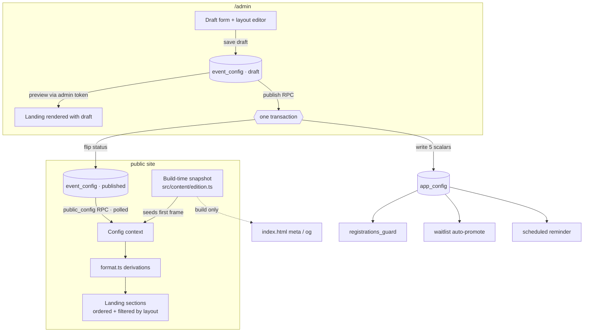

# Configurarea și lansarea evenimentelor din admin - Plan

## Goal Capsule

**Objective:** The organiser opens `/admin`, fills in the next edition, decides
which sections the public page shows and in what order, looks at it, and presses
publish — and the live site is that edition. No file edit, no generated SQL, no
redeploy, and no window in which the backend and the site disagree about which
edition is running.

**Means:** Invert the source of truth. A published `event_config` row in Supabase
becomes canonical (KTD1); `src/content/edition.ts` demotes to the build-time
snapshot that renders the first frame and covers the backend being unreachable
(KTD4). Publishing is one transaction that also writes the derived `app_config`
scalars the existing server-side guards already read (KTD2).

**Authority hierarchy:** Requirements (R-IDs) win on product behavior. KTDs win
on implementation mechanism inside those constraints. Units override neither.

**Stop conditions:**
- Stop and ask before publishing anything against edition 5 while it is inside
  its registration window. U1's seed is designed to be a no-op visually, but the
  first real publish changes what the public site serves without a deploy.
- Stop if a migration would touch the `public` schema. That schema belongs to
  gym-app and the Telegram bot (`MIGRATIONS.md`).
- Stop and ask if U2 cannot keep the landing's rendered output identical under
  the seeded config. U2 is a refactor with no visible delta; a visible delta
  means the derivation moved, not just its input.
- Stop if `npm run verify` fails for a reason not named in this plan.

**Execution profile:** Not a single sitting. U1–U3 are the foundation and carry
the risk; they change how config reaches the page without changing the page.
U4–U6 are the feature the organiser asked for. U7 is the cleanup that makes the
old ritual unavailable rather than merely discouraged. Land U1–U3 as one
reviewable change and confirm the public site is byte-identical before starting
U4.

**Tail ownership:** Deploy is in scope per tranche, not per unit. Per the repo's
deploy memory, a GitHub push does not reliably trigger a Vercel build — finish
each tranche with `vercel --prod`. Migrations are applied through the Supabase
MCP `apply_migration` with a `runlift_` prefix, never through a local migrations
directory (`MIGRATIONS.md`).

## Product Contract

### Summary

Move event configuration out of the bundle and into the database, so `/admin`
becomes where an edition is set up, previewed and published. Config covers an
edition's operational surface — numbering, branding, the date/time set, the
coming-soon toggle, race-day phase timings, venue, capacity — plus which landing
sections show and in what order. Share previews stay build-time and say so.

### Problem Frame

`src/content/edition.ts` is a compile-time constant, and every derived value in
`src/content/format.ts` and `src/lib/config.ts` is computed from it at import
time. Supabase holds the same facts a second time, in `app_config`, because the
registration guard, the waitlist auto-promotion trigger and the scheduled
reminder all need them server-side. Nothing keeps the two in agreement except a
person following `GHID-EDITIE-NOUA.md`: edit the file, run `npm run sync-edition`,
read the emitted SQL, run it in Supabase, regenerate `og.png`, verify, push, and
hope Vercel builds.

The admin already has half the mechanism and knows it is only half. The
`+ Ediție nouă` button moves `current_event_edition` in `app_config` and deletes
the two time markers; `AdminEditionTabs.tsx:69-76` then renders a red banner
telling the organiser to go edit the code and redeploy. Between those two acts
the backend is on the new edition and the public site is still serving the old
one — new registrations land somewhere the site does not describe.

The prior plan (`docs/plans/2026-08-25-admin-integritate-editii-ziua-cursei.md`)
treats this as a synchronisation problem and proposes an interlock: a pending
edition, a build identity stamped into `dist/version.json`, a field-by-field
diff, and a rollover preflight (U5, R13–R17). Its U9 then carves out a single
exception — a start-delay override in `app_config` read at runtime — and names
it as an exception precisely because `src/content/edition.ts` was to stay
canonical. That framing is what this plan reverses. There is no drift to
interlock against when there is only one copy.

The second half of the request has no current mechanism at all. Landing section
order and visibility are hardcoded JSX in `src/components/Landing.tsx:93-114`,
with a second hardcoded arrangement for the race-day `leaderboard` mode. The
sections already accept a `num` prop that renumbers them when the order changes,
so the seam exists — nothing reaches it from outside the file.

### Key Decisions

- **The database becomes the source of truth and edits go live without a
  deploy.** (session-settled: user-directed — chosen over keeping the code
  canonical with a deploy step, and over a DB/code split by field: the user
  picked live-instantly after the three options were surfaced.) Governs R1–R6,
  R20–R24.
- **Section control is show/hide plus reorder, not copy editing and not a
  section builder.** (session-settled: user-directed — chosen over editable
  section copy and over a full block-composition CMS.) Governs R15–R19.
- **Launch means: open the next edition, fill it in, preview it, publish it.**
  (session-settled: user-directed — chosen over also scheduling the go-live
  moment, and over also firing the announcement email in the same action.)
  Governs R7–R14.
- **This plan supersedes U5 of the prior admin plan.** The edition interlock,
  the `app_config` field diff and the desync banner exist to police a drift this
  plan removes. Its build-identity stamp survives for a different purpose
  (R27). Governs R20, R27.
- **Config edits are drafted and published as a set, not saved live field by
  field.** A half-edited edition must never be what a visitor sees. Governs
  R7, R10, R12.

### Requirements

#### Runtime configuration source

R1. A published `event_config` row is the source of truth for the current
edition's operational fields: edition numbers, event name, concept, timezone,
start, check-in time, duration, registration deadline, launch moment,
coming-soon toggle, leaderboard lead hours, next-edition moment, venue, and
capacity.

R2. The public page reads the published config at runtime and reflects it
without a rebuild or redeploy.

R3. `src/content/edition.ts` remains in the repo as the build-time snapshot. It
is no longer canonical and is no longer edited per edition.

R4. Fields that do not change per edition stay in code and are out of the config
document: the weekly training place, site URLs, Instagram handle, and brand.

R5. Every derived string the landing shows — the ordinal, the formatted date,
the hero kicker, the map embed and directions URLs, the badge, the success line
— derives from the active config, not from a module-level constant.

R6. When the config fetch fails or has not resolved, the page renders from the
build-time snapshot rather than showing a loading state.

#### Admin event configuration and launch

R7. The admin can open a draft for the next edition, prefilled from the current
published config.

R8. The admin can edit every field in R1 from a form, with validation that
refuses a config the page could not render.

R9. Validation refuses a registration deadline after the start, a next-edition
moment before the end of the race, a non-positive capacity, and a malformed
`lat,lng` venue query.

R10. Draft edits are saved to the draft without affecting the published config.

R11. The admin can preview the draft against the real public page before
publishing.

R12. Publishing takes the whole draft live in one atomic act.

R13. Publishing is reversible: the previously published version can be restored.

R14. Every publish and restore is written to the admin event journal with the
acting session, mirroring the existing write-journal pattern.

R33. Publishing a launch-edition number ahead of the event edition warns before
proceeding, naming that `/confirmare` and `/unsubscribe` are opened from emails
by people registered for the edition in progress.

#### Section layout

R15. The config document carries an ordered list of the landing's sections with
a visibility flag for each.

R16. The public landing renders sections in the configured order and omits the
ones marked hidden.

R17. Section numbering follows the rendered order, so hiding or moving a section
renumbers the rest.

R18. The race-day `leaderboard` phase keeps its own arrangement and is not
governed by the configured order.

R19. Publishing is refused when the layout hides the registration section while
the edition's registration window is open.

#### Integrity and drift

R20. The `app_config` keys the server-side guards read — `current_event_edition`,
`current_launch_edition`, `event_capacity`, `registration_deadline`,
`event_start` — are written from the published config, in the same transaction
as the publish.

R21. The registration guard, the waitlist auto-promotion trigger and the
scheduled reminder keep working unchanged.

R22. A public registration or waitlist insert is assigned its edition by the
server, not by the client bundle.

R23. The `event_config` table is not directly readable or writable with the
publishable key; all access goes through RPCs.

R24. The desync banner and the code-versus-backend comparison in
`AdminEditionTabs.tsx` are removed, because the condition they detect can no
longer occur.

#### Fallback, first paint, and share previews

R25. The first frame renders from the build-time snapshot with no loading state,
and reconciles when the published config arrives.

R26. Share and SEO meta remain injected at build time from the snapshot.

R27. The admin shows when the deployed build's snapshot no longer matches the
published config, naming which fields differ and that share previews are stale
until the next deploy.

R28. The gate order is preserved: the launch gate decides Coming Soon versus
landing first, and the race-day phases apply after it.

R29. A stale open tab picks up a new published config without a manual reload.

#### Documentation and retirement

R30. `GHID-EDITIE-NOUA.md` is rewritten to describe the admin flow.

R31. `npm run sync-edition` is retired; the emitting script is removed or
repurposed as the one-time seeder.

R32. The anti-drift tests invert: they assert `app_config` follows the published
config, not the code.

### Acceptance Examples

AE1. The organiser changes the venue and the start time in the draft, presses
preview, and sees the new date in the hero, the new place in the venue section,
and the map centred on the new pin — while a visitor on the live site still sees
the old edition. Covers R10, R11.

AE2. The organiser publishes. A visitor with the page already open sees the new
edition within the polling interval, without reloading. Covers R12, R29.

AE3. The organiser publishes a layout with the venue section hidden and moved
below participants. The landing shows format as `01`, participants as `02`,
registration as `03`, and no venue section. Covers R16, R17.

AE4. The organiser tries to publish a layout that hides the registration section
while the deadline is three days away. Publishing is refused and names why.
Covers R19.

AE5. Supabase is unreachable. The landing renders the last-deployed edition
completely, with no loading state and no empty sections. Covers R6, R25.

AE6. The organiser publishes a new date. The admin shows that the deployed build
still carries the previous date and that WhatsApp previews will show the old one
until the next deploy. Covers R27.

AE7. A visitor has the site open in a tab from before a rollover and submits the
form. The registration is recorded against the edition the server considers
current, not the one in their bundle. Covers R22.

### Scope Boundaries

In scope: the operational config surface in R1, the section order/visibility
layout, the admin editing and publishing flow, and the inversion of the drift
guards.

Out of scope:
- Editing section copy, headings or body text from admin.
- Adding, removing or composing new section types.
- Scheduling a future go-live moment as a separate action. The existing
  `launchAt` field stays and keeps driving the clock-based Coming Soon flip; the
  admin sets it like any other field.
- Firing the announcement email as part of publishing. The broadcast tab and its
  send lock stay a separate act.
- Editing the weekly training place, site URLs or brand (R4).
- Email templates, which are already DB-backed and editable.
- Runtime-configurable share images. `og.png` stays a file in the repo.
- Multiple concurrently published editions.

#### Deferred to Follow-Up Work

- The remaining units of the prior admin plan (U6–U10: cross-edition history, the
  race-day surface, the start-delay override, the status band). U9's start-delay
  override becomes cheap once this plan lands — it is an ordinary config field
  rather than an SSOT exception — but it is not pulled in here.

### Success Criteria

- A full edition rollover is performed from `/admin` alone, with no file edit and
  no `vercel --prod`, and the only remaining reason to deploy is the share image
  and its meta.
- The red desync banner is deleted rather than improved, and no code path can
  reproduce the condition it reported.

### Dependencies

- Supabase MCP `apply_migration` for U1 and U3, with a `runlift_` prefix.
- The existing admin session RPC pattern (`admin_check_token`) for every write.

## Planning Contract

### Key Technical Decisions

KTD1. **One `event_config` row per edition holding a jsonb document, not a
spread of loose `app_config` keys.** `app_config` is an untyped key/value table
with no atomicity across keys — publishing twenty fields into it is twenty
statements and no way to say "this set, together". A document row also gives
draft/published status, retained previous versions for R13, and a natural place
for the section layout. `app_config` stays exactly as it is for the five scalar
keys the SQL guards read (KTD2). Governs R1, R12, R13, R15.

KTD2. **Publishing is a single `SECURITY DEFINER` RPC that flips the row to
published and writes the five derived `app_config` scalars in the same
transaction.** This is what `scripts/sync-edition.ts` emitted for a human to run
by hand, executed atomically and unconditionally instead. It is the entire
drift fix: the guards in `supabase-migration-registration-guards.sql`,
`supabase-migration-waitlist-autopromote.sql` and
`supabase-migration-reminder-idempotent.sql` keep reading the keys they already
read, and those keys can no longer disagree with the site.
Governs R12, R20, R21.

KTD3. **The derivations in `src/content/format.ts` become functions of a config
object; the module-level constants go away.** Today `EDITION_ORDINAL`,
`HERO_KICKER`, `EVENT_WHERE`, `MAP_EMBED_SRC` and the rest are computed once at
import from the frozen `EDITION`. That is the real blocker to runtime config,
and converting them is the largest mechanical change in this plan. The module is
already a pure derivation keyed on one object, so the change is parameterisation,
not redesign: `placeStrings`, `parts` and the formatters stay as they are.
Consumers read the active config through a context hook or an argument,
depending on what they are (KTD13). Governs R5.

KTD4. **The build-time snapshot is both the initial render value and the offline
fallback — one mechanism, not two.** The context is seeded synchronously from
`src/content/edition.ts`, so the first frame is complete and correct for the
last-deployed edition. The published config replaces it when the fetch resolves.
A failed fetch is therefore not an error path at all, just a reconciliation that
never happens. This is what buys R6 and R25 without a skeleton on the public
page, at the cost of a brief stale frame after a publish. Governs R3, R6, R25.

KTD5. **The public read is a `public_config()` RPC, mirroring `public_stats`.**
`fetchStats` in `src/lib/supabase.ts:227-236` is the established shape for
non-personal public reads with the publishable key: a stable `SECURITY DEFINER`
function over an RLS-closed table, called through `rest/v1/rpc` with
`Accept-Profile`. Reuse it rather than exposing `event_config` to PostgREST.
Polling rides the interval that already exists for stats, which is what makes
R29 free. Governs R2, R23, R29.

KTD6. **The server assigns `editie` on public registration and waitlist
inserts.** `submitRegistration` and `submitWaitlist` currently send
`editie: CURRENT_EDITION` from the bundle (`src/lib/supabase.ts:70`, `:199`).
That is already a latent drift vector; once the edition can change without a
deploy, a stale tab or a cached bundle writes into the wrong edition with no
deploy to blame. `launch_notifications` already solves this — the client omits
the column and RLS rejects any client-supplied value
(`src/lib/supabase.ts:139-141`). Apply the same shape to the other two tables.
Governs R22.

KTD7. **The section layout is an ordered array of `{ key, visible }` inside the
config document, and `Landing.tsx` maps over it.** The section components
already take a `num` prop for exactly this reason, and the race-day branch
already passes `01`/`02`/`03` to renumber them. Numbering is derived from the
position in the filtered list rather than stored, so R17 cannot drift from R16.
Unknown keys in a stored layout are ignored, so removing a section from the code
does not break a published config. Governs R15, R16, R17.

KTD8. **The registration-section guard is enforced at publish, not at render.**
Rendering-time suppression would leave the admin showing a toggle that silently
does nothing. Refusing the publish and naming the conflict tells the organiser
what is actually true: while the deadline is open, that section is not theirs to
hide. Governs R19.

KTD9. **Draft preview reuses the admin session token from the organiser's own
browser, on a new `?config=draft` parameter.** The preview reads the token that
`src/lib/adminApi.ts:10` already stores under `runlift_admin_token` and calls a
token-guarded RPC for the draft, rendering the ordinary landing with that config.
No signed preview links, no public draft exposure, no second rendering path to
keep in step with the real one. The token never leaves the origin.

It must be a separate parameter, not another `?preview=` value. `previewParam()`
already carries the phase override (`soon`, `landing`, `leaderboard`, `next`),
and folding config source into the same key would make the two mutually
exclusive — the organiser could not check how a draft looks on race morning,
which is the one rehearsal `GHID-EDITIE-NOUA.md` insists on. The two axes
compose: `?config=draft&preview=leaderboard`. Governs R11.

KTD10. **Share and SEO meta stay build-time, and the admin says so rather than
hiding it.** Share scrapers do not run JS, which is why
`src/content/meta.ts` is injected by the Vite plugin in `vite.config.ts` — that
constraint is unchanged by any of this. `scripts/write-version.mjs` already
stamps build identity into `dist/version.json`; add a fingerprint of the
snapshot's meta-bearing fields so the admin can fetch it and compare against the
published config. This is the surviving half of the prior plan's KTD6, kept for
a different purpose. Governs R26, R27.

KTD11. **Publishing retains the previous published version rather than
overwriting it.** Restoring is then a publish of the retained version, reusing
the same transaction as KTD2 rather than a separate rollback path. The project
just built undo for deletions; a live public page deserves at least as much.
Governs R13.

KTD12. **U5 of the prior admin plan is not implemented.** Its pending-edition
key, its `app_config` field diff, its rollover preflight and the banner it
replaces all police a divergence that cannot occur after U1. Its
`dist/version.json` edition stamp survives inside KTD10. Governs R20, R24, R27.

KTD13. **Components read the config through a context hook; non-React consumers
take it as an argument.** Twenty-six source files import a `format.ts` or
`config.ts` constant, and four of them are not components:
`src/lib/validation.ts` (age checked against `EVENT_DATE`), `src/lib/calendar.ts`
(the `.ics` payload), `src/lib/monitoring.ts` (`CURRENT_EDITION` on error
reports) and `src/lib/supabase.ts`. A hook cannot serve those. A module-level
mutable singleton could, but it would reintroduce import-order coupling — the
fragility this plan exists to remove. Pure functions take the config as a
parameter and their callers pass it down. Governs R5.

KTD14. **The admin stops reading edition identity from the bundle.**
`AdminLaunchTab.tsx` filters the launch list by `CURRENT_LAUNCH_EDITION` and
`AdminEditionTabs.tsx` compares against `CURRENT_EDITION`. After the inversion
those are the deployed snapshot, not the truth, so a backoffice opened from a
stale build would filter the wrong edition — a quieter failure than the banner it
replaces. Admin reads the edition from the published config and from
`admin_list_editions`, which already reports `este_curenta`. Governs R24.

### High-Level Technical Design

Config flows one way. The admin writes drafts; publishing is the only act that
changes what a visitor sees, and it updates the derived scalars in the same
breath.

Two things are worth reading off the diagram. The `app_config` scalars are
downstream of publish rather than a parallel input, which is what makes the
guards agree with the site by construction. And the snapshot has exactly two
jobs left — seed the first frame, and feed build-time meta — neither of which is
"be the truth".

### Assumptions

- The organiser is the only admin user, and a lost draft is an annoyance rather
  than a coordination failure. No draft locking or multi-editor merge.
- The existing 15-second stats polling interval is an acceptable propagation
  delay for a published config (R29). If it is not, the interval is a config
  field, not a redesign.

### Sequencing

U1 → U2 → U3 form the foundation tranche and land together; U2 depends on U1's
document shape, U3 is independent of both but belongs in the same migration
review. U4 depends on U2's context. U5 depends on U1's RPCs. U6 depends on U4
and U5. U7 depends on everything and must not land earlier — the old ritual has
to keep working until the new one does.

## Implementation Units

### U1. `event_config` schema, RPCs, and the seed from edition 5

**Goal:** One row holds the truth, and publishing it also writes the scalars the
SQL guards read.

**Requirements:** R1, R4, R10, R12, R13, R14, R19, R20, R21, R23.

**Files:**
- Migration `runlift_event_config` (via Supabase MCP `apply_migration`)
- `MIGRATIONS.md`
- `src/lib/adminApi.ts`
- `tests/unit/eventConfig.test.ts` (new)

**Approach:** Create `runlift.event_config` with `editie`, a `config` jsonb
document, `status` (`draft` | `published` | `superseded`), `published_at`,
`created_at`, and a partial unique index allowing one draft and one published row
per edition. RLS on, no policies — every path is an RPC (KTD1, R23).

Define the document shape once, in TypeScript, and validate it in both places:
the RPC rejects a malformed document, and the client refuses to submit one. The
field set is R1 exactly; R4's fields are absent by design.

`admin_publish_config` is the load-bearing function (KTD2): it validates,
enforces R19 against the deadline in the document being published, marks the
current published row superseded, flips the draft to published, writes
`current_event_edition`, `current_launch_edition`, `event_capacity`,
`registration_deadline` and `event_start` into `app_config`, and writes an
`admin_events` row — all in one transaction. Take the deadline and start values
from the document and compose them with its timezone, the way
`scripts/sync-edition.ts` does today.

`public_config()` is `STABLE SECURITY DEFINER` and returns the single row with
`status = 'published'`, mirroring `public_stats` (KTD5). It reads that status
directly rather than joining through `current_event_edition` — the partial unique
index already guarantees one such row, and a join would make the scalars an input
to the read as well as an output of the publish. It returns the layout too, so
the page needs one call.

Seed edition 5 by transcribing the current `EDITION` object into a published row.
The seed inserts the row directly; it does **not** go through
`admin_publish_config`, because edition 5 is live and its five `app_config`
scalars are already correct. Instead the seed asserts they match the transcribed
document and fails if they do not — a mismatch means the live database and the
deployed code disagree today, which must be resolved before the inversion, not
during it. The seed is a visual no-op: after U2 lands, the site rendered from
this row is identical to the site rendered from the file.

**Test scenarios:**
- Publishing writes all five `app_config` scalars, and a mid-transaction failure
  leaves both the row status and every scalar unchanged.
- The edition-5 seed refuses to apply when a transcribed value disagrees with the
  scalar already in `app_config`.
- Publishing a document whose registration deadline is open while the layout
  hides the registration section is refused, and nothing is written.
- Publishing marks the previously published row superseded, and exactly one row
  per edition is published at any time.
- Restoring a superseded version republishes it and rewrites the scalars to match
  it.
- `public_config()` returns the published document with the publishable key, and
  a direct PostgREST read of `event_config` with the same key is refused.
- A draft save does not change what `public_config()` returns.
- Every publish and restore leaves an `admin_events` row naming the edition.
- The seeded edition-5 document round-trips to the same derived values as the
  current `EDITION` object.

**Verification:** `npm run test`, then `get_advisors` (security) after the DDL
per the `MIGRATIONS.md` runbook.

### U2. Runtime config on the client, with the snapshot as first frame

**Goal:** The landing renders from a config value instead of a module constant,
and nothing about it looks different.

**Requirements:** R2, R3, R5, R6, R25, R28, R29.

**Files:** This unit reaches every consumer of a `format.ts` or `config.ts`
constant — 26 source files and 16 test files. The load-bearing ones:
- `src/content/format.ts`, `src/lib/config.ts`, `src/content/edition.ts`
- `src/lib/supabase.ts`, `src/lib/validation.ts`, `src/lib/calendar.ts`,
  `src/lib/monitoring.ts` — the non-React consumers (KTD13)
- `src/hooks/useEventConfig.ts` (new), `src/hooks/usePagePhase.ts`,
  `src/hooks/useRegistration.ts`
- `src/App.tsx`, `src/components/Landing.tsx`, `src/components/ComingSoon.tsx`,
  `src/components/Confirmare.tsx`, `src/components/Unsubscribe.tsx`,
  `src/components/DespreNoi.tsx`, `src/components/Inscriere.tsx`, and the
  components under `src/components/landing/`
- `tests/unit/edition-derivation.test.ts`, `tests/unit/config.test.ts`,
  `tests/unit/pagePhase.test.ts`, `tests/unit/locatii.test.ts`,
  `tests/unit/validation.test.ts`, `tests/unit/supabase.test.ts`
- `tests/unit/eventConfigFallback.test.ts` (new)
- The seven e2e specs that import from `content/`

**Approach:** Convert `format.ts` from constants to derivation functions over a
config object (KTD3). Keep `placeStrings`, `parts`, the month and weekday tables
and the formatters exactly as they are — only their input changes. `config.ts`
follows: `EVENT_DATE`, `REGISTRATION_DEADLINE`, `LEADERBOARD_DATE` and the rest
become derived from the active config.

Add `fetchPublicConfig` alongside `fetchStats` in `src/lib/supabase.ts`, and a
context provider seeded synchronously from the `edition.ts` snapshot (KTD4). It
polls on the same interval and visibility trigger `useStats` already uses, which
is what gives R29. Components read derived values from the hook; the four
non-React consumers take the config as an argument (KTD13).

`usePagePhase` keeps its mechanism — two countdowns and the `?preview=` override
— and only changes where its two dates come from. The gate order in `App.tsx`
stays: launch gate first, phases after (R28).

The Coming Soon, Confirmare and Unsubscribe routes are in scope. They render the
edition ordinal from `format.ts`, and `GHID-EDITIE-NOUA.md` records that those
two routes are opened from emails by people registered for the edition in
progress — getting their edition from a stale bundle is the same defect as U3's,
on a different surface.

Keep `src/content/edition.ts` as the snapshot with a comment saying what it is
now for. Do not delete it and do not edit its values in this unit.

**Execution note:** This unit is large and cannot be split into shippable
halves — removing a `format.ts` constant breaks every importer in the same
commit, so a partial conversion does not typecheck. Sequence it internally
(derivations, then non-React consumers, then the provider and components) but
land it whole.

It is a behavior-preserving refactor, so lead with the characterization assertion
rather than the conversion. Before changing
`format.ts`, capture every derived value the current constants produce; the
converted module must reproduce that table from the seeded config. The e2e specs
import the constants being removed, so their *imports* change mechanically
(constant becomes a call against the snapshot) while their *assertions* must not.
An assertion that needs editing means the derivation moved, not its input — stop
and find out why.

**Test scenarios:**
- Every derived value computed from the seeded config equals the captured
  baseline, field by field — this replaces the anti-drift assertions in
  `edition-derivation.test.ts`.
- With the fetch pending, the first render shows the snapshot's edition and no
  loading state.
- With the fetch failing, the page stays on the snapshot and logs one client
  error, matching the `fetchStats` failure posture.
- When the fetch resolves with a different edition, the rendered values change
  without a reload.
- The launch gate still wins over the race-day phases when both would apply.
- `?preview=leaderboard` and `?preview=next` still override the clock.
- Age validation and the `.ics` payload derive from the active config, not from a
  captured import-time value.

**Verification:** `npm run verify`. Every e2e assertion passes unchanged; only
their import lines differ.

### U3. The server assigns the edition on public inserts

**Goal:** A stale bundle cannot write into the wrong edition.

**Requirements:** R22.

**Files:**
- Migration `runlift_server_assigned_edition`
- `MIGRATIONS.md`
- `src/lib/supabase.ts`
- `tests/unit/backend-contract.test.ts`

**Approach:** Give `registrations.editie` and `event_waitlist.editie` a default
that reads `current_event_edition` from `app_config`, and tighten the anon RLS
insert policies to reject a client-supplied value — the shape already proven on
`launch_notifications` (KTD6). Then stop sending `editie` from
`submitRegistration` and `submitWaitlist`.

Check the `launch_notifications.editie` default while here. `GHID-EDITIE-NOUA.md`
flags that it may be a fixed value rather than a read from `app_config`; if it
is fixed, it has the same defect and is fixed the same way.

**Test scenarios:**
- A public registration insert omitting `editie` lands on the current edition.
- A public insert supplying `editie` is refused rather than silently honoured.
- The admin add-registration path, which targets a chosen edition, still works.
- The contract test asserts the client no longer sends the column.

**Verification:** `npm run test`, then `npm run test:integration` with
`RUNLIFT_LIVE=1` — this unit changes RLS on the public insert path, which is
exactly what the live suite exists to check.

### U4. Config-driven section order and visibility

**Goal:** The landing renders the sections the config names, in the order it
names them.

**Requirements:** R15, R16, R17, R18.

**Files:**
- `src/components/Landing.tsx`
- `src/components/landing/Footer.tsx`, `src/components/landing/shared.ts`
- `tests/unit/sectionLayout.test.ts` (new)
- `tests/landing.spec.ts`

**Approach:** Replace the hardcoded section sequence in `Landing.tsx:106-113`
with a map over the layout from the config (KTD7). Build a registry of section
key to renderer, filter by `visible`, and derive each `num` from the position in
the filtered list so R17 follows from R16 rather than being maintained
separately. Ignore unknown keys.

The `leaderboard` branch keeps its own fixed arrangement (R18) — on race morning
the page answers one question and the layout is not the organiser's to rearrange
at that moment.

Give `Footer` a `num`-free path as today; it is not a numbered section. Sections
that take data props (`RegistrationSection`, `ParticipantsSection`) get them from
the same place they do now.

**Test scenarios:**
- A layout reordering venue above format renders them in that order with
  numbering `01`/`02` following the new positions.
- A layout hiding venue renumbers the sections after it with no gap.
- A layout containing an unknown key renders the known sections and does not
  throw.
- The `leaderboard` mode ignores the configured order and keeps its own.
- An empty or missing layout falls back to the current default order.

**Verification:** `npm run test`, then `npx playwright test tests/landing.spec.ts`.

### U5. The `Eveniment` tab — editing the draft

**Goal:** Every field in R1 and the section layout are editable from admin.

**Requirements:** R7, R8, R9, R10, R15, R33.

**Files:**
- `src/admin/AdminEventTab.tsx` (new), `src/admin/AdminDashboard.tsx`
- `src/admin/eventConfigForm.ts` (new)
- `src/lib/adminApi.ts`, `src/edition3.css` or the admin stylesheet
- `tests/unit/adminEventTab.test.tsx` (new),
  `tests/unit/eventConfigForm.test.ts` (new)

**Approach:** Add a sixth tab to the union at `AdminDashboard.tsx:151-152` and
the tab strip below it, following the existing tab shape and the shared
`useAdminPolling` hook.

Keep the validation rules in a plain module (`eventConfigForm.ts`) so they are
unit-testable without rendering and so the client and the RPC agree on what R9
means. Validate on edit and disable publish while invalid; do not wait for the
server to be the only guard.

The layout editor is a reorderable list with a visibility toggle per row. Keep it
keyboard-operable — move-up and move-down buttons are sufficient and avoid a
drag-and-drop dependency for a list of six.

Prefill a new draft from the current published config (R7), so opening the next
edition starts from the last one rather than from blank fields.

R33 is a warning, not a refusal — bumping the launch edition after the race is a
legitimate and necessary act. The form warns when the launch number would move
ahead of the event number and lets the organiser proceed.

**Test scenarios:**
- Opening the tab with no draft offers to start one prefilled from the published
  config.
- A deadline after the start, a next-edition moment before the race ends, a
  capacity of zero, and a venue query that is not `lat,lng` are each rejected
  with a message naming the field.
- A launch number ahead of the event number warns and still allows publishing.
- Saving a draft leaves the published config untouched.
- Reordering and hiding rows produce the layout array the config expects.
- A failed save keeps the edited values on screen rather than reverting.

**Verification:** `npm run test`.

### U6. Preview, publish, restore, and the stale-build notice

**Goal:** The organiser can look at it, take it live, put it back, and be told
what a deploy still owes them.

**Requirements:** R11, R12, R13, R14, R19, R26, R27.

**Files:**
- `src/admin/AdminEventTab.tsx`, `src/lib/adminApi.ts`
- `src/App.tsx`, `src/hooks/useEventConfig.ts`
- `scripts/write-version.mjs`
- `tests/unit/adminEventTab.test.tsx`, `tests/unit/buildFingerprint.test.ts` (new)
- `tests/faze.spec.ts`

**Approach:** Preview adds a `?config=draft` parameter alongside the existing
`?preview=` phase override rather than adding a route (KTD9). It makes the config
provider load the draft through a token-guarded RPC, using the token already in
`localStorage`. If no token is present, fall back to the published config rather
than erroring — the parameter is then inert for a visitor who guesses it.

Publish calls the U1 RPC and surfaces its refusal reasons, including R19's,
without inventing its own copy of the rule. Restore lists retained versions with
their `published_at` and republishes the chosen one (KTD11).

Publishing makes a config live; it does not by itself put the landing on screen.
Whether a visitor sees Coming Soon or the landing is still decided by
`showComingSoon` and `launchAt` in the config just published (R28). Say that at
the publish confirmation, naming which of the two the visitor will get — the
organiser's phrase for this action is "go live", and the gap between that and
"the config is now live" is where a wrong `showComingSoon` would hide.

For R27, extend `scripts/write-version.mjs` — which already writes commit and
build time — with the edition number and a fingerprint over the snapshot fields
that feed `META` (KTD10). The admin fetches `/version.json`, compares, and shows
which fields differ and that share previews are stale until the next deploy. This
is a notice, not a blocker.

**Test scenarios:**
- `?config=draft` with a valid admin token renders the draft; without one it
  renders the published config.
- `?config=draft&preview=leaderboard` renders the draft in the race-day phase.
- The publish confirmation names whether visitors will land on Coming Soon or the
  landing, and matches what the site then serves.
- Publish surfaces the R19 refusal with the reason the RPC gave.
- After publishing, a page that was already open reflects the change on the next
  poll.
- Restoring a previous version returns the site to it and journals the act.
- The stale-build notice appears when the published config's meta-bearing fields
  differ from the deployed fingerprint, and disappears after a deploy.
- The notice never blocks publishing.

**Verification:** `npm run verify`, then `npx playwright test tests/faze.spec.ts`.

### U7. Retire the old ritual

**Goal:** The path this plan replaces is gone, not merely discouraged.

**Requirements:** R3, R24, R30, R31, R32.

**Files:**
- `GHID-EDITIE-NOUA.md`, `MIGRATIONS.md`, `README.md`
- `scripts/sync-edition.ts`, `package.json`
- `src/admin/AdminEditionTabs.tsx`, `src/admin/AdminLaunchTab.tsx`,
  `src/admin/AdminDashboard.tsx`
- `src/content/edition.ts`
- `tests/integration/backend.live.test.ts`, `tests/unit/meta.test.ts`

**Approach:** Rewrite `GHID-EDITIE-NOUA.md` around the admin flow: open a draft,
fill it, preview, publish; deploy only for the share image and its meta. Keep the
race-day phase table — that behavior is unchanged, only its input moved.

Remove the desync banner and the `CURRENT_EDITION` comparison at
`AdminEditionTabs.tsx:29` and `:69-76` (R24). Reconcile the `+ Ediție nouă`
button with U5's draft flow so there is one way to open an edition, not two.

Cut the admin's remaining reads of edition identity from the bundle (KTD14). The
one that matters is `AdminLaunchTab.tsx:45`, which filters the launch list by
`CURRENT_LAUNCH_EDITION` — from a stale build that silently shows the wrong
edition's list, with no banner left to explain it.

Delete `scripts/sync-edition.ts` and its npm script, or reduce it to the one-time
seeder U1 used. Update the "Legătura cu ediția" section of `MIGRATIONS.md`, which
currently instructs the reader to keep `app_config` following the code.

Invert the anti-drift assertion in `tests/integration/backend.live.test.ts`:
`app_config` must match the published config row, not `EDITION.number`. Keep
`meta.test.ts` asserting against the snapshot — build-time meta is still derived
from the file (R26).

Add a comment at the top of `src/content/edition.ts` stating that it is the
build-time snapshot, that it is not per-edition editable, and what still depends
on it.

**Test scenarios:**
- The integration suite fails when `app_config` disagrees with the published
  config, and passes when they agree.
- `meta.test.ts` still passes against the snapshot.
- No source file imports a removed `format.ts` constant.
- The launch tab filters by the published launch edition, and still shows it
  correctly when the bundle's snapshot names a different one.
- `npm run sync-edition` no longer exists as a documented step.

**Verification:** `npm run verify`, then `npm run test:integration` with
`RUNLIFT_LIVE=1`.

## Verification Contract

- `npm run verify` — typecheck, unit tests, build, e2e. The gate for every unit.
- `npm run test:integration` with `RUNLIFT_LIVE=1` and the documented Supabase
  environment — required for U3 and U7, which change RLS on the public insert
  path and the drift assertion respectively.
- `get_advisors` (security) after each migration, per the `MIGRATIONS.md`
  runbook.
- Through U2, every e2e **assertion** must pass unchanged. Seven specs import the
  constants being removed, so their import lines change mechanically; an
  assertion that needs editing means the derivation moved rather than its input.
- After U6, a full rehearsal on the live project: open a draft for a throwaway
  edition number, preview it, publish it, confirm the public page and the five
  `app_config` scalars agree, then restore the previous version and confirm both
  went back.

## Definition of Done

Global:
- An edition rollover is completed from `/admin` with no file edit and no
  deploy, and the public site serves it.
- The five `app_config` scalars match the published config after every publish,
  with no manual SQL.
- The desync banner is deleted and no code path can reproduce its condition.
- `GHID-EDITIE-NOUA.md` describes the admin flow and names the deploy-only
  remainder (share image and meta).
- No abandoned or experimental code from this work remains in the diff.

Per unit:
- U1: publishing is atomic across the row and all five scalars, and refuses R19.
- U2: the site renders identically from the seeded config, with every e2e
  assertion unchanged and only import lines edited.
- U3: public inserts carry a server-assigned edition and reject a supplied one.
- U4: order, visibility and numbering follow the layout; race-day mode does not.
- U5: every R1 field and the layout are editable, with R9 validation on both
  sides.
- U6: preview, publish, restore and the stale-build notice all work against the
  live project.
- U7: the old ritual is removed from docs, scripts and the admin, and the
  anti-drift test asserts the new direction.

## Open Questions

- **U6, deferred:** should the stale-build notice also appear on a publish
  confirmation dialog, rather than only as a standing notice in the tab? The plan
  chooses a standing notice, since the organiser publishes rarely and reads the
  tab each time.
- **U5, deferred:** the layout editor uses move-up/move-down buttons. If the
  section list grows past a handful, drag-and-drop becomes worth a dependency;
  it is not at six.
- **U7, deferred:** whether to keep `scripts/sync-edition.ts` as the one-time
  seeder or delete it after U1's seed is applied. Either is defensible; the unit
  allows both.

## Sources & Research

- `src/content/edition.ts`, `src/content/format.ts:88-130`, `src/lib/config.ts` —
  the compile-time derivation chain KTD3 converts.
- Consumer inventory behind U2's size: 26 source files import a `format.ts` or
  `config.ts` constant, including `src/lib/validation.ts:1`,
  `src/lib/calendar.ts:8-10` and `src/lib/monitoring.ts:10`, which are not
  components (KTD13); 16 test files import from `content/`, seven of them e2e
  specs.
- `src/admin/AdminLaunchTab.tsx:45` — the admin's own stale-edition read
  (KTD14).
- `src/lib/supabase.ts:70`, `:199` — client-supplied `editie` on public inserts;
  `:139-141` — the server-assigned pattern KTD6 copies.
- `src/lib/supabase.ts:227-236` — `fetchStats`, the public-read shape KTD5
  mirrors.
- `src/admin/AdminEditionTabs.tsx:29`, `:69-76` — the desync banner R24 removes.
- `src/components/Landing.tsx:93-114` — the hardcoded section order U4 replaces,
  and the existing `num` renumbering seam.
- `scripts/sync-edition.ts` — the exact scalar set KTD2 absorbs into the publish
  transaction.
- `supabase-migration-registration-guards.sql`,
  `supabase-migration-waitlist-autopromote.sql`,
  `supabase-migration-reminder-idempotent.sql` — the server-side readers of those
  scalars that R21 must not disturb.
- `vite.config.ts`, `src/content/meta.ts` — the build-time meta injection that
  fixes R26.
- `docs/plans/2026-08-25-admin-integritate-editii-ziua-cursei.md` — U5 (R13–R17)
  superseded per KTD12; U9's KTD9 is the runtime-read precedent this plan
  generalises.
- `GHID-EDITIE-NOUA.md` — the ritual being replaced, and the source of the
  `launch_notifications.editie` default caveat in U3.
