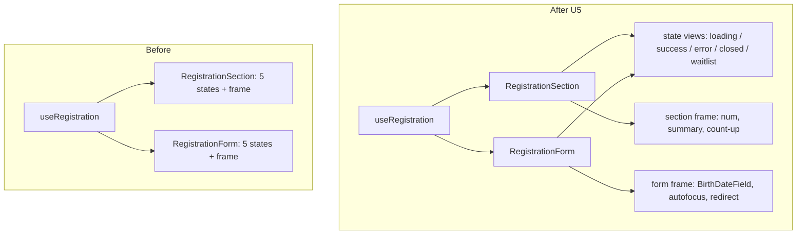
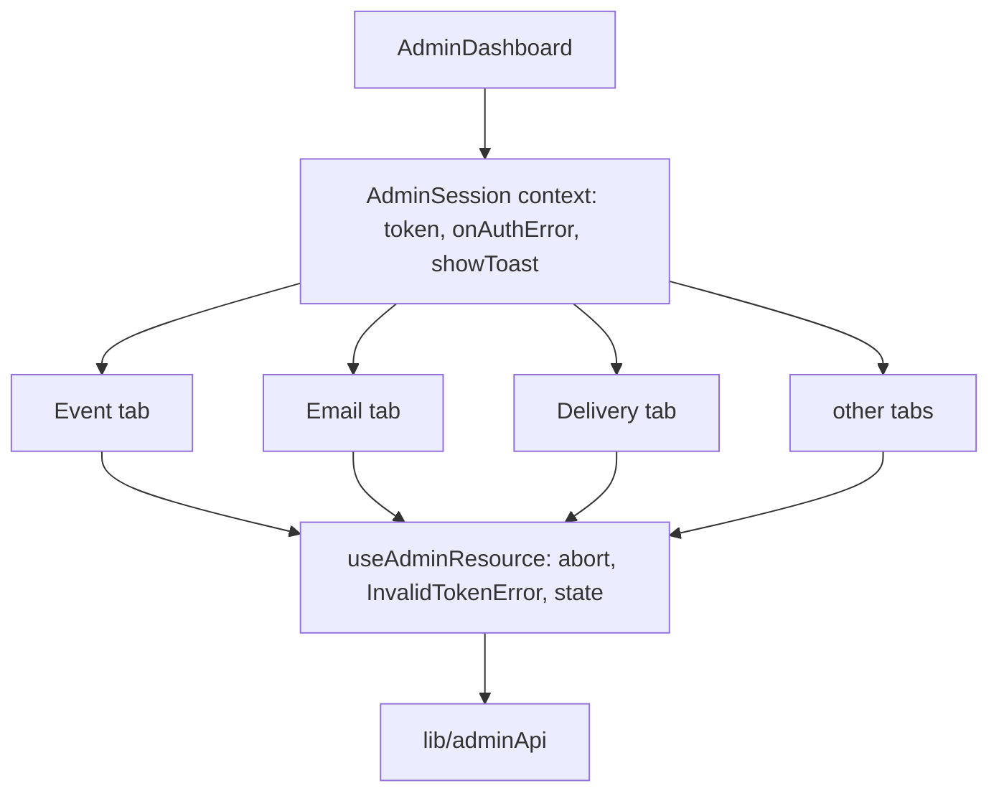
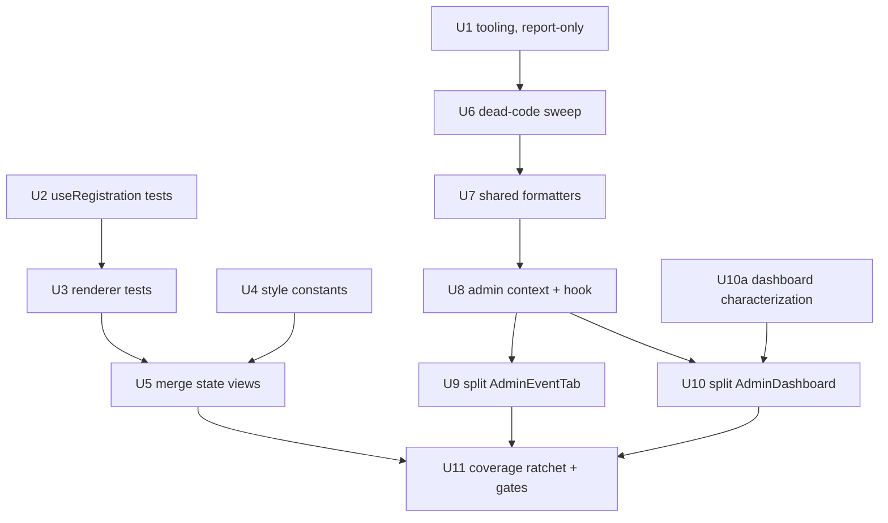

# Refactor de mentenabilitate si acoperire de teste - Plan

## Goal Capsule

**Objective:** Adding the next feature to this codebase is a small diff in one place. A change to the registration form, an admin field group, or a Supabase call is made once, not copied across parallel files, and a test fails when it breaks.

**Means:** Cover the two untested hot spots first, then collapse the duplication they protect: one set of registration state views behind `useRegistration`, one admin session context and loader, and the two 1000-line admin screens split along their existing seams (KTD2). Automated checks replace manual vigilance for dead code and coverage regression (KTD5).

**Authority:** The Requirements own what changes. KTD1 owns the behavior-preservation contract — no visible behavior, markup semantics, or network call may change. `TASK-FOR-CLAUDE.md` owns the standing architecture decisions this plan must not reopen (no `copy.ts`, no migration reorganization, edition SSOT in `src/content/edition.ts`).

**Stop conditions:** Stop and ask before changing any RPC signature or request header, before touching `supabase/functions/send-email/eventVars.ts` (its duplication is deliberate — see Scope Boundaries), before adding a runtime dependency, and before altering any rendered text or CSS value.

---

## Product Contract

### Summary

Refactor the app for maintainability without changing what it does. Cover the untested registration state machine and the thin-tested admin dashboard first, then collapse the duplicated registration renderers, the per-tab admin loading boilerplate, and the triplicated style and date-format constants. Delete the code nothing calls. Wire lint, dead-code detection, and a coverage floor into `npm run verify` and CI so the cleanup holds.

### Problem Frame

The codebase is ~14.5k lines of app code against ~9.2k lines of tests, and it has grown by accretion across six editions. Three shapes of debt now slow every change.

**Parallel renderers.** `src/components/landing/RegistrationSection.tsx` (606 lines) and `src/components/landing/RegistrationForm.tsx` (459 lines) destructure the same nineteen fields from `useRegistration` (`RegistrationSection.tsx:55-59`, `RegistrationForm.tsx:78-82`) and each render the same five states: form, loading, success, error, closed/waitlist. The logic is genuinely shared — the file header in `RegistrationForm.tsx` is right that `useRegistration` is not duplicated. The presentation is not. A change to the success screen or the sold-out copy has to be made twice, and neither file has a single unit or component test. `src/hooks/useRegistration.ts` (295 lines), which both depend on, has none either; only Playwright covers this path.

**Copied scaffolding.** Every admin tab re-implements the same load cycle: an `AbortSignal`, a `catch` that calls `onAuthError`, a `setState`, and prop-drilled `token` / `onAuthError` / `showToast`. `InvalidTokenError` is re-checked by hand in four places. Four files each construct their own `Intl.DateTimeFormat('ro-RO', …)`. `label`, `inputStyle`, and `fieldErr` are defined three times over in the landing components, byte-identical apart from one extra `letterSpacing`. `src/admin/AdminEventTab.tsx` holds a single 1,328-line component body (lines 265-1640) containing seven `<Grup>` blocks; `src/admin/AdminDashboard.tsx` (1,122 lines) switches seven tab views inline.

**No floor.** The repo has no linter, no dead-code detection, and no coverage measurement. Nothing catches drift, so it accumulates silently. `src/hooks/useOnlineStatus.ts` is a complete, working hook that nothing imports — the leftover of an approach `src/hooks/useLaunchForm.ts:71-72` records as deliberately abandoned, because `navigator.onLine` falsely reports offline on some networks. `README.md:28` still lists it as a hook in use. Roughly thirty more exported symbols have no reference outside their defining file.

None of this is a bug today. It is the reason the next feature costs more than it should.

### Key Decisions

- **Behavior preservation is the product constraint, not a nice-to-have.** This plan changes no rendered output, no text, no CSS value, and no request. Governs R1, R2.
- **Cover before you move.** Code with no test gets a characterization test before it is restructured, so the refactor is provably safe rather than reviewed by eye. Governs R3, R4.
- **Deliberate duplication stays.** Two duplications in this repo exist on purpose and are documented as such; the sweep must not "fix" them. Governs R11.

### Requirements

**Behavior preservation**

- R1. No user-visible behavior changes: same rendered text, same CSS values, same markup semantics, same states in the same order, on the public site and in `/admin`.
- R2. No network contract changes: same URLs, headers, RPC names, and payload shapes. `tests/unit/backend-contract.test.ts` and `tests/unit/deploy-config.test.ts` pass unmodified.

**Test coverage**

- R3. `src/hooks/useRegistration.ts` has unit tests covering its state machine before any file that consumes it is restructured.
- R4. The registration renderers have component tests covering all five states before they are merged.
- R5. `src/admin/AdminDashboard.tsx` gains characterization tests for its tab-switching and error paths before it is split. `src/admin/AdminEventTab.tsx` already has 57 tests in `tests/unit/adminEventTab.test.tsx` and needs no new safety net to be split.
- R6. Line coverage is measured, reported, and enforced by a threshold in CI that cannot silently fall.

**Duplication removal**

- R7. `label`, `inputStyle`, and `fieldErr` exist once, in `src/components/landing/shared.ts`.
- R8. The five registration states are rendered by one set of views, used by both the landing section and the standalone/overlay form.
- R9. Admin tabs read `token`, `onAuthError`, and `showToast` from one context and load data through one hook. `InvalidTokenError` is handled in one place.
- R10. Romanian date and time formatters exist once, in a shared module.

**Dead code**

- R11. Every deleted symbol is proven unreferenced by tooling, not by grep. Symbols used only inside their defining file lose the `export`; they are not deleted.
- R12. `src/hooks/useOnlineStatus.ts` is deleted and `README.md:28` no longer lists it.

**Maintainability floor**

- R13. `npm run verify` and CI run a linter, a dead-code check, and the coverage threshold. A new unused export or an uncovered regression fails the pipeline.

### Success Criteria

- The two largest source files each drop below 600 lines, with no logic moved into a file that merely relocates the problem.
- A change to the registration success screen requires editing one file.
- `npm run verify` is green at every unit boundary, so any unit can ship on its own.
- Total source line count falls; test line count rises.

### Scope Boundaries

- **No visual redesign.** Inline `style={{}}` usage stays inline. This plan hoists the *duplicated* style constants into the existing `shared.ts` pattern; it does not migrate 235 inline style objects to CSS. That migration is a separate, visually risky piece of work.
- **No product behavior changes.** Bugs found during the refactor are recorded, not fixed in the same diff.
- **No new runtime dependencies.** `react` and `react-dom` remain the only two. New tooling is `devDependencies` only.
- **`supabase/functions/send-email/eventVars.ts` is not deduplicated.** Its header documents why it duplicates `src/content/format.ts`: the Edge function deploys separately on Deno with that directory as its root and cannot import from `src/`. The duplication is guarded by `tests/unit/edgeEventVars.test.ts`, which compares both implementations. Removing it would break the deploy and delete the guard.
- **No migration reorganization.** `TASK-FOR-CLAUDE.md` records the standing decision: the repo does not own the shared database's lifecycle, so the root-level `supabase-migration-*.sql` files stay where they are and are documented in `MIGRATIONS.md`.
- **No `copy.ts` / i18n hoisting.** `TASK-FOR-CLAUDE.md` records the standing decision against hoisting static UI prose. Only edition-dependent strings are derived, in `src/content/format.ts`.

#### Deferred to Follow-Up Work

- Inline styles to CSS classes for the landing components.
- Documentation drift: `TASK-FOR-CLAUDE.md` and `BACKLOG.md` both say "Ultima actualizare: 4 august 2026" and describe edition 4; the repo is past that. A docs refresh is its own pass.
- Unit tests for the remaining untested admin tabs (`AdminDeliveryTab`, `AdminTemplatesTab`, `AdminLogin`, `AdminAcum`). The coverage ratchet from U11 will surface them.
- `src/lib/adminApi.ts` and `src/lib/supabase.ts` keep separate HTTP layers. They differ meaningfully — `adminApi` posts RPCs with token handling, `supabase` does timeouts and PostgREST table writes — and merging them touches the one contract this plan promises not to change.

---

## Planning Contract

### Key Technical Decisions

- KTD1. **Behavior-preserving refactor, enforced by tests rather than review.** Every unit ships green under `npm run verify`, which already chains typecheck, unit tests, build, and Playwright e2e against the production bundle. The e2e suite is the outer safety net for the public flow; the new unit and component tests are the inner one. If a unit cannot be made green without changing a rendered string, the unit is wrong, not the test.

- KTD2. **Extract along seams the code already has, not into a new architecture.** `AdminEventTab.tsx` has seven `<Grup>` blocks and two presentational primitives (`Grup`, `Camp`) already factored at the bottom of the file; the split follows those boundaries. `AdminDashboard.tsx` has seven `tab === '…'` branches; each becomes a component. The landing components already have `src/components/landing/shared.ts` for shared style constants; hoisting extends that file rather than inventing a design-token module. No new state library, no new folder taxonomy.

- KTD3. **Merge the registration renderers by extracting shared state views, not by adding props to one of them.** The two components differ in real ways: the landing section renders a section number, a summary block, and a `useCountUp` counter; the standalone form renders a single-field `BirthDateField`, an autofocus, and a redirect countdown. Collapsing them into one component behind five boolean props would trade duplication for a worse problem. Instead the five shared states (loading, success, error, closed, waitlist-full) move into small view components that both files render, and each file keeps its own frame and its own field layout. This is the smaller, reversible change.

- KTD4. **Dead code is removed on tool evidence, distinguishing two cases.** A grep-based scan over-reports: `buildShareText` and `whatsappShareUrl` in `src/lib/calendar.ts` look unreferenced but are used by `shareSignup` in the same file. Those lose their `export` keyword and stay. Only symbols and files with no reference anywhere are deleted — `src/hooks/useOnlineStatus.ts` is the clear case. Introducing the detection tool *before* the sweep (U1 before U6) is what makes the sweep evidence-based.

- KTD5. **Minimal-footprint tooling, matched to this repo's dependency discipline.** The repo has exactly two runtime dependencies and eleven devDependencies. Adding the full ESLint stack for a codebase this size is disproportionate. `oxlint` is a single binary with no plugin tree; `knip` is the established tool for unused files, exports, and dependencies; `@vitest/coverage-v8` is the first-party coverage provider for the vitest already in use. Three devDependencies, no config sprawl. If any of them proves noisy in practice, drop it rather than suppressing findings one by one.

- KTD6. **The coverage threshold is a ratchet set from the measured post-work value, not a number invented now.** Coverage has never been measured in this repo, so any target chosen in advance is a guess that would either be trivially met or block the pipeline. U11 measures the value after U2-U10 land and sets the threshold just below it. The floor only ever moves up.

### High-Level Technical Design

Directional. The implementer owns the exact boundaries.

Registration flow, before and after. The hook is already shared; the shared state views are what U5 adds.

Admin data access after U8. One context supplies the session; one hook owns the load-abort-error cycle that each tab currently repeats.

Unit sequencing. The safety net precedes every restructuring it protects; the coverage ratchet closes the plan.

### Assumptions

- The existing `tests/unit/adminEventTab.test.tsx` (57 tests, 878 lines) is a sufficient safety net for the U9 split without new characterization tests. If the split turns out to move logic those tests do not touch, add coverage before moving it.
- `tests/unit/helpers/adminHarness.ts` and its `adminApiMock` are the established harness pattern; new admin tests extend it rather than introducing a second mocking style.
- The Playwright e2e suite (30 tests across `tests/inscriere.spec.ts`, `tests/inscriere-directa.spec.ts`, `tests/landing.spec.ts`) covers the registration flow at the browser level and will catch a regression U5 introduces even if a unit test misses it.

### Sequencing

Three tracks that can interleave, with one hard rule: no unit restructures code its safety net does not yet cover.

1. **Floor first** — U1 introduces the tooling in report-only mode, which produces the evidence U6 acts on.
2. **Public flow** — U2 and U3 build the safety net, U4 is independent, U5 does the merge.
3. **Admin** — U6 clears dead weight, U7 and U8 remove the copied scaffolding, U10a covers the dashboard, U9 and U10 split the two large files.
4. **Close** — U11 measures coverage and turns the gates on.

Each unit is independently shippable and leaves `npm run verify` green.

---

## Implementation Units

| U-ID | Title | Key files | Depends on |
|---|---|---|---|
| U1 | Lint and dead-code tooling, report-only | `package.json`, `.oxlintrc.json`, `knip.json` | — |
| U2 | Unit tests for the registration state machine | `tests/unit/useRegistration.test.ts` | — |
| U3 | Component tests for the registration renderers | `tests/unit/registrationViews.test.tsx` | U2 |
| U4 | Hoist the triplicated style constants | `src/components/landing/shared.ts` | — |
| U5 | One set of registration state views | `src/components/landing/RegistrationSection.tsx`, `RegistrationForm.tsx`, `registrationStates.tsx` | U3, U4 |
| U6 | Dead-code sweep on tool evidence | `src/hooks/useOnlineStatus.ts`, `src/lib/calendar.ts`, `README.md` | U1 |
| U7 | Shared Romanian date and time formatters | `src/lib/formatare.ts`, four admin/component files | U6 |
| U8 | Admin session context and resource hook | `src/admin/adminSession.tsx`, `src/admin/useAdminResource.ts`, admin tabs | U7 |
| U9 | Split AdminEventTab along its field groups | `src/admin/AdminEventTab.tsx`, `src/admin/eventTab/*` | U8 |
| U10a | Characterization tests for AdminDashboard | `tests/unit/adminDashboard.test.tsx` | U8 |
| U10 | Split AdminDashboard into tab views | `src/admin/AdminDashboard.tsx` | U10a |
| U11 | Coverage measurement, threshold, and CI gates | `vitest.config.ts`, `package.json`, `.github/workflows/*.yml` | U5, U9, U10 |

### U1. Lint and dead-code tooling, report-only

**Goal:** The repo can list its own unused exports, unused files, and lint violations on demand. Nothing fails yet.

**Requirements:** R13 (partial — reporting only; gating lands in U11).

**Files:** `package.json`, `.oxlintrc.json` (new), `knip.json` (new).

**Approach:** Add `oxlint`, `knip`, and `@vitest/coverage-v8` as devDependencies (KTD5). Add `lint` and `deadcode` scripts. Configure `knip` with the four real entry points — `src/main.tsx`, `src/admin-preview.tsx`, `vite.config.ts`, and the `scripts/` files — otherwise it reports every entry point as unused. Exclude `supabase/functions/` from both tools: that code targets Deno, not the browser, and lives outside `tsconfig.json`'s `include`. Do not add either tool to `verify` or CI in this unit; the first run's output is expected to be noisy and is the input to U6.

**Test scenarios:**
- `npm run lint` exits 0 or reports violations without crashing, on a clean tree.
- `npm run deadcode` lists `src/hooks/useOnlineStatus.ts` as an unused file.
- `npm run deadcode` lists `buildShareText` and `whatsappShareUrl` as unused *exports*, not unused files — confirming the tool makes the distinction KTD4 depends on.
- `npm run verify` is unaffected and still green.

**Verification:** `npm run verify`; record the `knip` output for U6.

---

### U2. Unit tests for the registration state machine

**Goal:** `src/hooks/useRegistration.ts` has tests, so the two components that depend on it can be restructured safely.

**Requirements:** R3.

**Files:** `tests/unit/useRegistration.test.ts` (new).

**Execution note:** Characterization coverage. These tests describe what the hook does today, including any behavior that looks odd. Do not "fix" behavior while writing them; record it in Open Questions instead.

**Approach:** Test the hook through `@testing-library/react`'s `renderHook`, mocking `src/lib/supabase.ts` the way `tests/unit/adminDashboard.test.tsx` mocks `adminApi`. Cover the `form → loading → success | error` transitions, the waitlist branch, and the derived flags the components read (`showForm`, `isSoldOut`, `isWaitlistFull`, `closedReason`, `slots`). The hook uses timers (`MIN_LOADING_MS`, `SIM_LOADING_MS`) — use fake timers.

**Test scenarios:**
- Happy path: valid submit moves `form → loading → success`, and `confirmName` holds the submitted first name.
- Minimum loading: success does not appear before `MIN_LOADING_MS` has elapsed, even when the request resolves instantly.
- Waitlist: when the event is full, submit sets `submittedAsWaitlist` and the success copy path for waitlist.
- Waitlist full: `isWaitlistFull` is set when `submitWaitlist` rejects with the waitlist-full error, and `showForm` becomes false.
- Duplicate email: a 409 puts the hook in `error` with the duplicate reason, not a generic error.
- Timeout: an aborted request with `TimeoutError` produces the timeout error state, distinct from network failure.
- Validation: an invalid birth date populates `errors` and `dateErrMsg` and never reaches `loading`.
- `clearErrorFor` removes exactly one field's error and leaves the others.
- `resetForm` returns the hook to `form` with empty errors and empty birth fields.

**Verification:** `npm run test`.

---

### U3. Component tests for the registration renderers

**Goal:** Both renderers have component tests for all five states, so U5 can move the rendering without visual review.

**Requirements:** R4.

**Files:** `tests/unit/registrationViews.test.tsx` (new).

**Execution note:** Characterization coverage, written against the current output. Assert on the text and roles users see; do not snapshot whole trees, which would make U5's diff unreadable.

**Approach:** Render `RegistrationSection` and `RegistrationForm` with a stubbed `reg` object shaped like `ReturnType<typeof useRegistration>`, wrapped in the event-config provider the way `tests/unit/eventConfigFallback.test.tsx` does. Drive each state by the stub, not by real submissions — the hook's behavior is U2's job. Write one shared table of state fixtures and run it against both components, so the tests themselves state the equivalence U5 will make structural.

**Test scenarios:**
- Form state: both render the name, phone, email, and birth-date inputs, the consent checkbox, and the submit button.
- Loading state: both disable the submit control and show the loading indicator; no error text.
- Success state: both render the confirmation with the submitted name and the see-you line from the edition strings.
- Success as waitlist: both render the waitlist confirmation copy, not the participant confirmation.
- Error state: both render the error message and offer the retry affordance.
- Closed state: when `showForm` is false with a `closedReason`, both render the closed message and no form.
- Waitlist-full state: both render the waitlist-full message and no form.
- Field errors: an `errors` entry renders next to its field in both.
- Differences that must survive U5: the section renders its section number and summary; the standalone form renders `BirthDateField` as a single input and autofocuses when asked.

**Verification:** `npm run test`.

---

### U4. Hoist the triplicated style constants

**Goal:** `label`, `inputStyle`, and `fieldErr` are defined once.

**Requirements:** R7, R1.

**Files:** `src/components/landing/shared.ts`, `src/components/landing/RegistrationForm.tsx`, `src/components/landing/RegistrationSection.tsx`, `src/components/landing/BirthDateField.tsx`.

**Approach:** Move the three constants into `shared.ts`, which already holds `sectionNum` and `sectionTitle` for exactly this purpose. `label` and `fieldErr` are byte-identical across the three files. `inputStyle` is identical except `BirthDateField.tsx` adds `letterSpacing: 1` — it spreads the shared constant and adds that one property, rather than keeping a fork. Carry over the `fontSize: 16` comment explaining the iOS focus-zoom constraint; it is the reason the value cannot be lowered and must not be lost in the move.

**Test scenarios:**
- No computed style changes: the existing Playwright suite passes unmodified, including `tests/mobil.spec.ts`.
- `BirthDateField` still renders with `letterSpacing: 1` while the other inputs do not.

**Verification:** `npm run verify`.

---

### U5. One set of registration state views

**Goal:** The five shared registration states are rendered by one set of components. A change to the success screen is one edit.

**Requirements:** R8, R1.

**Files:** `src/components/landing/registrationStates.tsx` (new), `src/components/landing/RegistrationSection.tsx`, `src/components/landing/RegistrationForm.tsx`.

**Approach:** Per KTD3, extract the loading, success, error, closed, and waitlist-full renderings into small components in a new `registrationStates.tsx`. Both files render them and keep their own frame and field layout. Take the shared destructuring block (`RegistrationSection.tsx:55-59`, `RegistrationForm.tsx:78-82`) as the contract for what a state view may read. Where the two current renderings differ in wording, they must not — resolve it by keeping the text each file shows today for its own path, or by confirming with the user if the difference looks unintended. Expect both files to fall well under 400 lines.

**Test scenarios:**
- All U3 scenarios pass unchanged, against both components, after the move.
- The state views receive no props beyond what the shared `reg` contract exposes.
- Playwright registration flows pass: `tests/inscriere.spec.ts`, `tests/inscriere-directa.spec.ts`, `tests/landing.spec.ts`.
- A text change made once in a state view appears in both surfaces — assert the two rendered strings are equal rather than duplicating the literal in the test.

**Verification:** `npm run verify`.

---

### U6. Dead-code sweep on tool evidence

**Goal:** Nothing unreachable remains, and no reachable code is deleted by mistake.

**Requirements:** R11, R12.

**Files:** `src/hooks/useOnlineStatus.ts` (delete), `src/lib/calendar.ts`, `README.md`, plus the files `knip` names.

**Approach:** Work from U1's `knip` output, sorting each finding into two buckets per KTD4. Unused *files* are deleted. Unused *exports* whose symbol is used inside its own file lose the `export` keyword only — `buildShareText` and `whatsappShareUrl` in `src/lib/calendar.ts` are this case. Delete `src/hooks/useOnlineStatus.ts`: nothing imports it, and `src/hooks/useLaunchForm.ts:71-72` records that pre-emptive `navigator.onLine` checks were removed on purpose because they falsely report offline on some networks and VPNs. Update `README.md:28`, which still lists it. Types exported for a test's benefit are kept — check the test tree before removing any type. Anything ambiguous goes to Open Questions rather than into the diff.

**Test scenarios:**
- `npm run typecheck` and `npm run typecheck:tests` pass — `noUnusedLocals` and `noUnusedParameters` are already on, so a de-exported symbol that is genuinely unused fails here.
- `npm run deadcode` reports no unused files after the sweep.
- The offline error path still works: `tests/unit/useLaunchForm.test.ts` and `tests/unit/launchForm.test.ts` pass, confirming offline handling never depended on the deleted hook.
- `npm run test:e2e:preview` passes — a wrongly deleted export breaks the build first.

**Verification:** `npm run verify`; `npm run deadcode`.

---

### U7. Shared Romanian date and time formatters

**Goal:** Romanian date and time formatting is defined once.

**Requirements:** R10, R1.

**Files:** `src/lib/formatare.ts` (new), `src/admin/AdminDashboard.tsx`, `src/admin/AdminDeliveryTab.tsx`, `src/admin/AdminEmailTab.tsx`, `src/components/ComingSoon.tsx`.

**Approach:** Four files each build their own `Intl.DateTimeFormat('ro-RO', …)` with overlapping options. Collect them into one module as named formatters, one per distinct output shape — not one parameterised function, which would obscure which shape a call site wants. Keep every existing option set exactly, including the `.replace('.', '')` in `AdminDashboard.tsx:75`. Note that `src/content/format.ts` already owns edition-derived date strings; this module is for the admin and countdown surfaces only, and must not absorb `format.ts`'s responsibilities.

**Test scenarios:**
- Byte-identical output: for a fixed set of ISO inputs, each new formatter returns exactly what the old inline formatter returned. Assert against the literal expected strings.
- The short-date formatter drops the trailing period, as `AdminDashboard` does today.
- Existing tests pass unmodified: `tests/unit/adminDashboard.test.tsx`, `tests/unit/deliveryLog.test.ts`, `tests/unit/adminEmailTab.test.tsx`, `tests/coming-soon.spec.ts`.
- The module is importable from a Node test without a DOM, so it stays free of React.

**Verification:** `npm run verify`.

---

### U8. Admin session context and resource hook

**Goal:** Admin tabs stop re-implementing the load cycle and stop prop-drilling the session.

**Requirements:** R9, R1.

**Files:** `src/admin/adminSession.tsx` (new), `src/admin/useAdminResource.ts` (new), `src/admin/AdminDashboard.tsx`, and each `src/admin/Admin*Tab.tsx`.

**Approach:** Add a context holding `token`, `onAuthError`, and `showToast` — the three props every tab currently declares. `AdminDashboard` provides it; tabs consume it. Add `useAdminResource`, which owns the pattern each tab repeats: create an `AbortSignal`, call the loader, ignore aborted responses, route `InvalidTokenError` through `onAuthError`, and expose `{ data, loading, error, reload }`. The four hand-written `instanceof InvalidTokenError` checks (`AdminDeliveryTab.tsx:167,215`, `AdminEmailTab.tsx:302`, `AdminDashboard.tsx:202`) collapse into it. Keep `editie` as an explicit prop — it is a real per-tab input, not session state. Migrate tabs one at a time so each step is separately verifiable. `src/admin-preview.tsx`, the server-less demo backoffice, must keep working: it needs a provider too.

**Test scenarios:**
- Load: `useAdminResource` calls the loader once on mount and exposes the result.
- Abort: unmounting mid-flight aborts the request and produces no state update — assert no React act warning and no `setState` after unmount.
- Auth error: a rejected `InvalidTokenError` calls `onAuthError` and does not set the error state.
- Other error: a non-auth rejection sets `error` and does not call `onAuthError`.
- Reload: `reload()` re-runs the loader and aborts any in-flight request first.
- Context: a tab rendered without a provider fails loudly at render, not silently with an undefined token.
- Per-tab regression: each existing admin test file passes after its tab is migrated, unmodified where possible.
- `src/admin-preview.tsx` renders its demo rows without a network call.

**Verification:** `npm run verify` after each tab migration.

---

### U9. Split AdminEventTab along its field groups

**Goal:** `src/admin/AdminEventTab.tsx` is no longer a 1,328-line component body.

**Requirements:** R1.

**Files:** `src/admin/AdminEventTab.tsx`, `src/admin/eventTab/` (new directory).

**Approach:** Per KTD2, split along the seams the file already has. The seven `<Grup>` blocks (lines 689, 754, 986, 1069, 1117, 1264, 1288) each become a component taking the draft slice it edits and a change handler. The pure helpers at the top — `oreCheckin`, `caIsoLocal`, `sambeteleUrmatoare`, `motivRefuz`, `refuzCuPas`, and the option constants — move to a sibling module and become directly testable. The `Grup` and `Camp` primitives at the bottom (lines 1663, 1731) move to their own file. State stays in the parent: this is a file split, not a state-management change. While moving, relocate the `linkBrut` `useState` currently declared mid-body (around line 437) to sit with the other state declarations.

**Test scenarios:**
- All 57 tests in `tests/unit/adminEventTab.test.tsx` pass unmodified. If a test needs changing, the split moved behavior and must be reconsidered.
- The extracted pure helpers get direct unit tests: `oreCheckin` produces the documented check-in offsets; `caIsoLocal` emits local ISO without a timezone suffix; `sambeteleUrmatoare` returns the next Saturdays from a fixed `now`; `refuzCuPas` names the failed step for each of `salvare`, `publicare`, `revenire`.
- Save and publish still work end to end through the tab's tests, including the save-before-publish behavior from the 2026-09-03 plan.
- The resulting `AdminEventTab.tsx` is under 600 lines.

**Verification:** `npm run verify`.

---

### U10a. Characterization tests for AdminDashboard

**Goal:** The dashboard has a real safety net before it is split.

**Requirements:** R5.

**Files:** `tests/unit/adminDashboard.test.tsx`.

**Execution note:** Characterization coverage. `tests/unit/adminDashboard.test.tsx` has 8 tests for a 1,122-line file — enough to catch a crash, not enough to catch a behavior change during a split.

**Approach:** Extend the existing file using `adminApiMock` from `tests/unit/helpers/adminHarness.ts`. Cover the tab switching, the registration list operations, and the error paths the current tests skip.

**Test scenarios:**
- Each of the seven tabs mounts its view and does not mount the others.
- Search filters the registration list by name, phone, and email.
- Delete shows the undo affordance; undo restores the row; a failed undo renders the reason from `motivUndoEsuat`.
- Manual add appends a row and refreshes the counts.
- CSV export produces a payload with the expected header row.
- An `InvalidTokenError` from any tab's loader returns the user to login.
- Only the activity types in `TIPURI_ACTIVITATE` render in the activity feed.
- The coverage summary row (`rezumaAcoperire`) reports the same counts for a fixed fixture.

**Verification:** `npm run test`.

---

### U10. Split AdminDashboard into tab views

**Goal:** `src/admin/AdminDashboard.tsx` holds routing and shared state, not seven inline views.

**Requirements:** R1.

**Files:** `src/admin/AdminDashboard.tsx`, plus extracted view files.

**Approach:** The seven `tab === '…'` branches (lines 658-709) already mark the boundaries. Extract the participants view — the largest inline body — and the activity feed into their own components; the other five branches already delegate to tab components and mostly need their props trimmed now that U8 supplies the session from context. Move `formatDate`, `formatEventTime`, `rezumaAcoperire`, `motivUndoEsuat`, `STARE_TEXT`, and `activitateVizibila` out of the component file; the two formatters go to the shared module from U7.

**Test scenarios:**
- All U10a scenarios pass unmodified.
- Tab switching preserves the selected edition across tabs.
- The extracted helpers get direct tests: `rezumaAcoperire` for empty, partial, and full coverage; `motivUndoEsuat` for each error shape it distinguishes; `activitateVizibila` for an in-list and an out-of-list activity type.
- The resulting `AdminDashboard.tsx` is under 600 lines.

**Verification:** `npm run verify`.

---

### U11. Coverage measurement, threshold, and CI gates

**Goal:** The cleanup cannot silently regress.

**Requirements:** R6, R13.

**Files:** `vitest.config.ts`, `package.json`, `.github/workflows/` CI workflow.

**Approach:** Enable the v8 coverage provider in `vitest.config.ts`, reporting on `src/` and excluding `src/vite-env.d.ts`, `src/main.tsx`, and the CSS files. Run it once on the finished tree and read the actual line and branch percentages. Set the thresholds a few points below those measured values, per KTD6 — high enough to catch a regression, low enough that an unrelated PR is not blocked by noise. Add `lint`, `deadcode`, and `test -- --coverage` to `npm run verify`, and add a lint/dead-code step to the CI workflow before the test step so a violation fails fast. Record the chosen thresholds and their rationale in `CI-CD.md`, which already documents the pipeline.

**Test scenarios:**
- `npm run verify` fails when a new unused export is added, and the message names the symbol.
- `npm run verify` fails when a test is deleted such that coverage drops below the threshold.
- `npm run verify` passes on the finished tree.
- CI fails on a branch with a lint violation, before the Playwright step runs — confirming the ordering saves the browser install on a fast failure.
- The `supabase/functions/` directory is not linted or coverage-measured; it is Deno code outside `tsconfig.json`.

**Verification:** `npm run verify`; a deliberately broken branch pushed to confirm CI fails, then reverted.

---

## Verification Contract

| Command | When | Proves |
|---|---|---|
| `npm run test` | Every unit | Unit and component tests, including the new characterization suites |
| `npm run typecheck && npm run typecheck:tests` | Every unit | `noUnusedLocals` catches de-exported-but-unused symbols from U6 |
| `npm run build` | Every unit | Vite build plus the CSP-to-config guard in `scripts/check-deploy-config.ts` |
| `npm run test:e2e:preview` | Every unit, as the last step of `verify`; load-bearing for U4, U5, U6, U9, U10 | Behavior preservation against the production bundle — the outer safety net for KTD1 |
| `npm run verify` | Every unit boundary | The full chain; the gate for calling a unit done |
| `npm run lint` | U1 onward | Lint violations |
| `npm run deadcode` | U1, U6, U11 | Unused files, exports, and dependencies |
| `npm run test -- --coverage` | U11 | Line and branch coverage against the threshold |

**Baseline first.** Before U1, run `npm run verify` on an unmodified `main` and record the result. Every unit in this plan claims "green at the boundary", which is only meaningful against a green starting point. If the baseline is red, fix or record the pre-existing failure before starting — otherwise the first refactor will be blamed for it.

`npm run test:integration` stays opt-in and is not part of this work: it hits the real backend and this plan changes no backend contract.

## Definition of Done

**Global**

- `npm run verify` is green.
- No rendered text, CSS value, request URL, header, or RPC payload differs from `main`. Confirmed by the e2e suite passing unmodified.
- `src/admin/AdminEventTab.tsx` and `src/admin/AdminDashboard.tsx` are each under 600 lines.
- `label`, `inputStyle`, `fieldErr`, and the Romanian date formatters each have exactly one definition.
- `npm run deadcode` reports no unused files.
- Coverage thresholds are enforced in CI and documented in `CI-CD.md`.
- Total `src/` line count is lower than at the start; total `tests/` line count is higher.
- No abandoned or experimental code from a discarded approach remains in the diff. No commented-out old implementations, no `_old` or `_v2` files.
- No new runtime dependency in `package.json`.

**Per unit**

Each unit is done when its own test scenarios pass, `npm run verify` is green, and the unit could ship on its own without the units after it.

## Open Questions

Both are deferred; neither blocks implementation.

- Deferred: if U5 finds the two registration surfaces show *different wording* for the same state, is that intentional per-surface copy or drift? Default: preserve each surface's current text and flag the pair. Ask before unifying wording — that would be a product change, which R1 forbids.
- Deferred: `oxlint` and `knip` are chosen on fit, not on trial (KTD5). If either produces findings that are mostly noise on this codebase, drop that tool in U11 rather than accumulating suppressions. The coverage gate stands on its own.

## Sources & Research

Repo evidence behind the decisions above.

- `src/components/landing/RegistrationSection.tsx:55-59` and `src/components/landing/RegistrationForm.tsx:78-82` — the identical nineteen-field destructuring that KTD3 uses as the shared-state contract.
- `src/components/landing/RegistrationForm.tsx:23-50`, `RegistrationSection.tsx:21-41`, `BirthDateField.tsx:14-30` — the three copies of `label` / `inputStyle` / `fieldErr`.
- `src/admin/AdminEventTab.tsx:265-1640` — the single component body; `<Grup>` blocks at 689, 754, 986, 1069, 1117, 1264, 1288; `Grup` and `Camp` primitives at 1663 and 1731.
- `src/admin/AdminDashboard.tsx:658-709` — the seven inline tab branches.
- `src/admin/AdminDeliveryTab.tsx:167,215`, `src/admin/AdminEmailTab.tsx:302`, `src/admin/AdminDashboard.tsx:202` — the four hand-written `InvalidTokenError` checks U8 collapses.
- `src/hooks/useLaunchForm.ts:71-72` — records that pre-emptive `navigator.onLine` checks were removed deliberately. This is why `src/hooks/useOnlineStatus.ts` is dead rather than pending.
- `src/lib/calendar.ts:63-87` — `buildShareText` and `whatsappShareUrl` are used by `shareSignup` in the same file. The KTD4 example of an over-export that must not be deleted.
- `supabase/functions/send-email/eventVars.ts:1-19` — the header explaining why this duplication is deliberate and how `tests/unit/edgeEventVars.test.ts` guards it.
- `TASK-FOR-CLAUDE.md`, "Decizii de arhitectură" — the standing decisions against `copy.ts` and against migration reorganization, both carried into Scope Boundaries.
- `tests/unit/helpers/adminHarness.ts` — the `adminApiMock` harness pattern that new admin tests extend.
- `.github/workflows/` CI workflow — the existing pipeline order (typecheck, test, build, e2e) that U11 extends.
