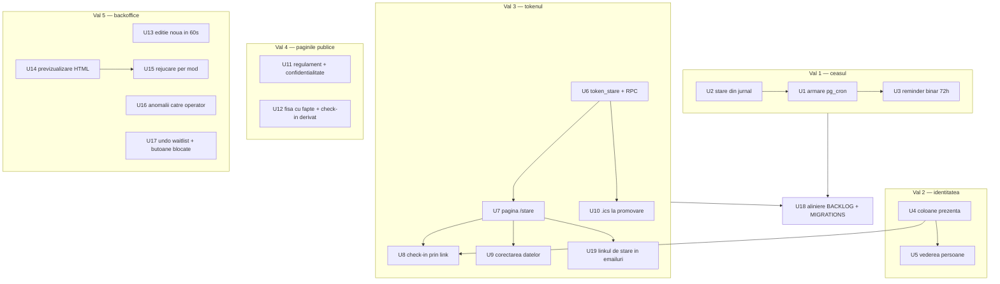
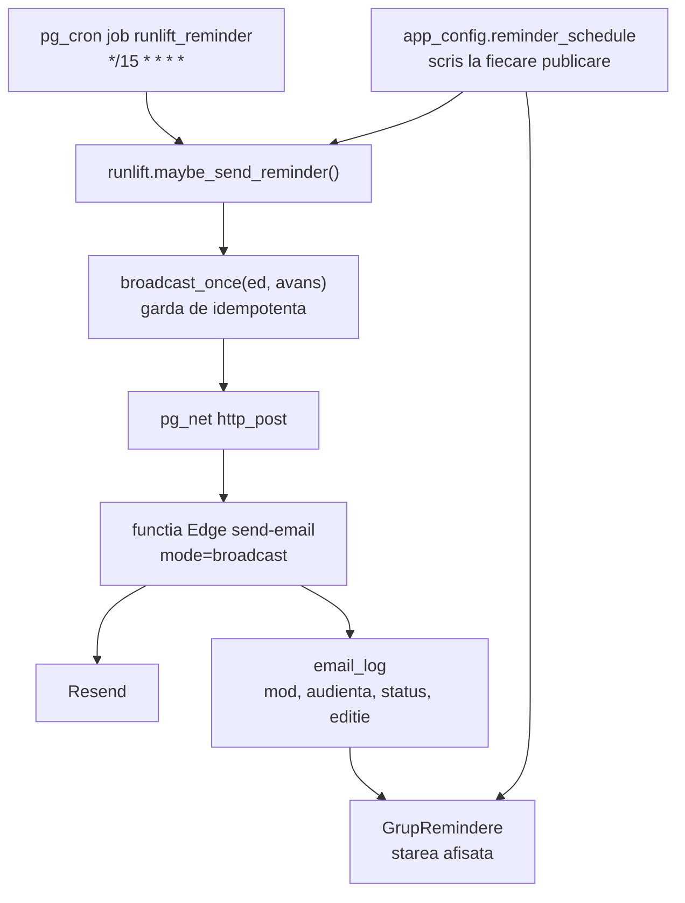
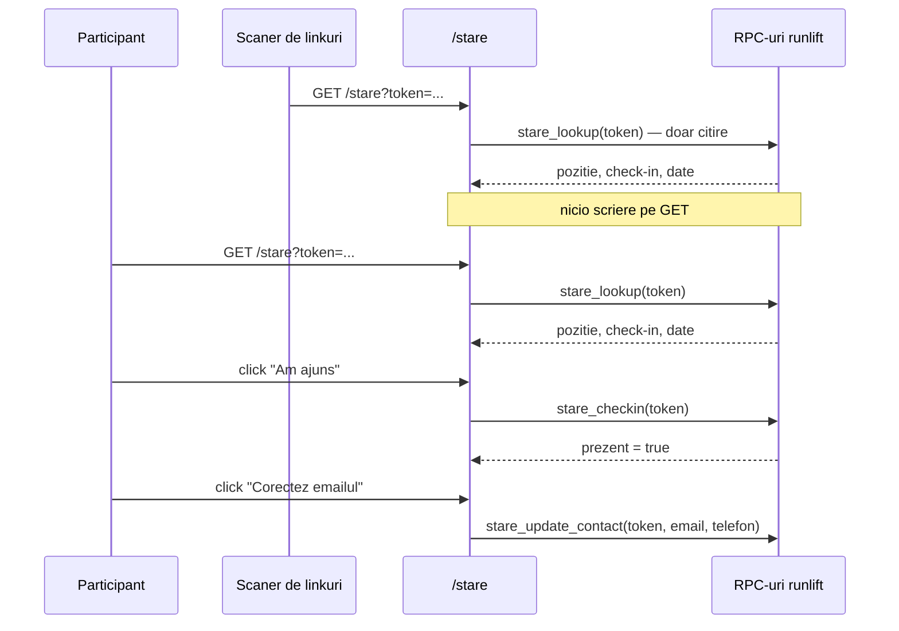
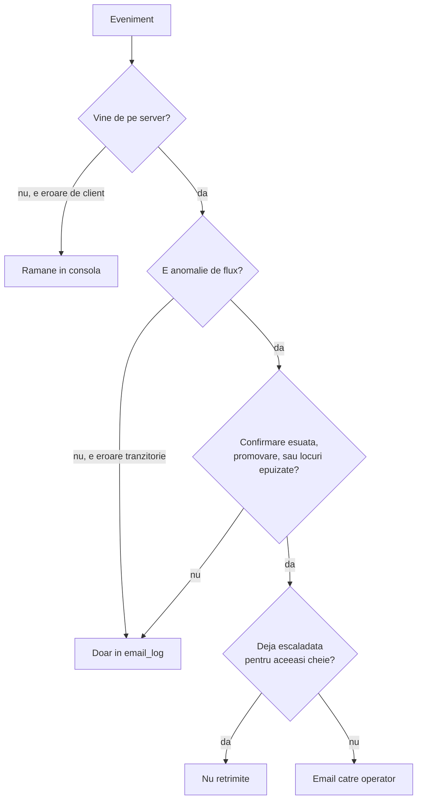

# Cele șapte idei din IDEI.md, secvențiate - Plan

## Goal Capsule

- **Objective:** reminderele pleacă singure și niciun ecran nu mai afirmă o stare pe care sistemul n-o poate susține; sistemul știe cine a venit, în cât timp, și că e a treia oară; fiecare înscris are un link propriu prin care își vede și își corectează starea; regulamentul și politica de confidențialitate există pentru caseta de acord care le invocă deja; o ediție nouă se configurează fără capcana de moștenire; niciun email nu pleacă nevăzut; anomaliile de flux ajung la operator fără să treacă printr-un login.
- **Means:** cinci valuri secvențiate pe dependențe de date, nu pe urgența percepută (KTD1).
- **Authority:** `IDEI.md` fixează scopul și temeiurile. Unde codul contrazice documentul, codul câștigă și planul o spune explicit. Unde planul contrazice `IDEI.md`, KTD-ul care face asta o notează.
- **Execution profile:** modificări de schemă și de funcții Postgres, plus interfață React. Migrările și funcțiile Edge se aplică **manual** — CI-ul din `main` nu le deployează (vezi Verification Contract).
- **Stop conditions:** oprește-te și întreabă dacă (a) o migrare cere schimbarea unei funcții pe care o folosește altă aplicație din proiectul Supabase partajat; (b) textul juridic din U11 ar trebui inventat în loc de completat de operator; (c) armarea `pg_cron` din U1 s-ar face înainte ca U2 să fie livrat.
- **Tail ownership:** planul se oprește la implementare + verificare locală. Deploy-ul în producție (merge în `main`) rămâne al operatorului.

---

## Product Contract

### Summary

Planul livrează toate cele șapte idei din `IDEI.md` plus cele două rămășițe mici, în cinci valuri ordonate de dependențele reale dintre ele: ceasul reminderelor, apoi schema de identitate și prezență, apoi linkul de stare al participantului care se sprijină pe ea, apoi paginile publice care închid expunerea legală, apoi reparațiile din backoffice. Ideile respinse din `IDEI.md` rămân respinse.

### Problem Frame

Produsul are un singur operator și 30 de locuri pe ediție. Mașinăria e construită mult peste ce se vede: `maybe_send_reminder()` e idempotentă pe (ediție, avans), cu fereastră de grație de două ore și orar editabil din admin; `decline_spot` și auto-promovarea de pe lista de așteptare sunt livrate; jurnalul de livrare are matrice de acoperire; ștergerea unei înscrieri e soft-delete cu undo de fidelitate completă.

Ce lipsește nu e mașinărie, ci trei lucruri de alt tip.

Primul e ceasul. `pg_cron` are `installed_version: null` în proiect, verificat pe 4 septembrie 2026, iar `maybe_send_reminder()` n-a rulat niciodată — nicio cheie `once_reminder_*` n-a fost scrisă vreodată în `app_config`. Toate reminderele trimise până acum au fost difuzări manuale. `GrupRemindere.tsx` afișează între timp „N active · următorul în X zile", derivat din orar și din ceas, nu din livrări. Interfața afirmă o stare falsă.

Al doilea e identitatea. `AdminRegistration` n-are niciun câmp de prezență, număr sau timp, iar exportul CSV e `Nr, Nume, Telefon, Email, Data înscrierii`. Singurele date care traversează edițiile azi sunt agregate — numărători, niciodată persoane. Patru elemente din `BACKLOG.md` sunt blocate pe aceleași coloane lipsă.

Al treilea e ce nu spune pagina. `TEXT_ACORD` din `registrationStates.tsx:30-31` îi pune pe participanți — care pot avea 14 ani — să confirme că acceptă „regulamentul evenimentului" și că sunt „apt din punct de vedere medical pentru efort fizic intens". Nu există rută `/regulament` în `src/main.tsx`. Se colectează nume, telefon și dată de naștere fără politică de confidențialitate. Iar `VenueSection.tsx:69` spune „vino cu 30 de minute înainte" în timp ce `checkinFrom: '06:45'` cu start la 07:00 înseamnă 15.

### Key Decisions

- **Check-inul se face din linkul participantului, nu din bifarea operatorului.** Costă zero efort de operator în minutele în care n-are niciun minut și refolosește tiparul de token care există deja de două ori. *Governs R9, R14, R16.* (session-settled: user-approved — chosen over bifarea a 30 de nume pe telefon de către operator: efortul cade exact în fereastra în care operatorul e cel mai ocupat.)
- **Rata de finalizare publicată se amână.** Numărul nu poate exista până nu se încheie o ediție întreagă cu `prezent` și `timp_final` completate, deci fișa cu fapte pleacă fără elementul ei portant. *Governs R21.* (session-settled: user-approved — chosen over blocarea ideii 4 până există date: expunerea legală nu poate aștepta o ediție.)
- **Escaladarea e îngustă: doar anomalii de flux, nu erori de JS.** Un rezumat pe care nu-l citește nimeni e mai rău decât nimic, iar erorile de client vin și de la extensii de browser și de la roboți. *Governs R29, R30.*
- **Textul juridic e scris de om, versionat prin git.** Singurul lucru din tot setul care cere o decizie omenească despre ce te angajezi. *Governs R18, R19.*

### Requirements

**Ideea 1 — reminderele care chiar pleacă**

- R1. `pg_cron` e instalat în proiect și `runlift.maybe_send_reminder()` e programată la fiecare 15 minute prin jobul `runlift_reminder`.
- R2. Difuzarea manuală a reminderelor e retrasă din backoffice înainte ca ceasul să pornească, ca nimeni să nu primească același reminder de două ori.
- R3. Starea afișată a fiecărui reminder se deduce din jurnalul de livrare (`email_log`), nu doar din orar și din ceas.
- R4. Un reminder pentru care orarul spune „a plecat" dar jurnalul nu are nicio intrare e marcat ca atare, nu ca livrat.
- R5. Există un șablon de reminder cu întrebarea binară „vin" / „nu mai vin", cu `{link_renunt}` în el, și un rând de orar la 72 de ore.

**Ideea 2 — prezența, timpul și persoana**

- R6. `runlift.registrations` are coloanele `prezent boolean`, `numar smallint` și `timp_final interval`, toate nule până la completare.
- R7. Trigger-ul `registrations_backup_sync()` copiază și cele trei coloane noi, pe toate cele trei ramuri (`INSERT`, `UPDATE`, `DELETE`).
- R8. Exportul CSV include prezența, numărul și timpul final.
- R9. Backoffice-ul poate scrie cele trei câmpuri pe un rând, prin RPC.
- R10. Există o vedere `runlift.persoane`, cheiată pe emailul normalizat, cu telefonul normalizat ca rezervă, care întoarce pentru fiecare persoană edițiile la care a fost înscrisă și cele la care a fost prezentă.
- R11. Regula de identitate e scrisă în comentariul vederii, cu ambele moduri în care greșește: doi frați cu un singur email devin o persoană; cine își schimbă emailul între ediții devine două.

**Ideea 3 — un link de stare pentru fiecare înscris**

- R12. `runlift.registrations` **și** `runlift.event_waitlist` au fiecare `token_stare uuid not null default gen_random_uuid()` cu index unic, și `token_stare_expira_la timestamptz`.
- R13. Pagina `/stare` arată: confirmat sau pe listă și pe ce poziție, ora de check-in, un buton „adaugă în calendar", și un buton de distribuire.
- R14. Pagina `/stare` marchează prezența doar la un click explicit, niciodată la încărcare — aceeași gardă anti-scanere ca `Renunt.tsx`.
- R15. Pagina `/stare` permite corectarea telefonului și a emailului, iar tokenul expiră după finalul ediției.
- R16. Backoffice-ul arată un contor de check-in pentru ediția curentă, actualizat din aceleași date.
- R17. Emailul de promovare de pe lista de așteptare (`mode="promoted"`) duce un atașament `.ics`.
- R34. Linkul către `/stare` ajunge la participant: emailul de confirmare, cel de promovare și reminderele îl conțin.

**Ideea 4 — regulamentul, confidențialitatea și faptele**

- R18. Există ruta `/regulament`, cu conținut scris, legată din `TEXT_ACORD`.
- R19. Există ruta `/confidentialitate`, cu conținut scris, legată din formularul de înscriere.
- R20. Landing-ul arată o fișă cu fapte: preț, ce primești, cât durează, unde parchezi, dacă pot veni spectatori, ce se întâmplă dacă plouă.
- R21. Fișa cu fapte nu conține rata de finalizare — se adaugă după prima ediție cu date de prezență.
- R22. Textul „vino cu N minute înainte" din `VenueSection.tsx` e derivat din `checkinFrom` și `start`, nu scris de mână.

**Ideea 5 — ediție nouă în 60 de secunde**

- R23. Crearea unei ediții noi trece printr-un dialog cu data, ora și numărul de locuri; restul se moștenește din ediția publicată.
- R24. Dialogul recalculează fiecare reper față de noul start prin `mutaReperele`, în loc să-l copieze.
- R25. Dialogul arată un rezumat al ce s-a moștenit, câmp cu câmp, înainte de a scrie ciorna.
- R26. Formularul complet rămâne disponibil ca „editează tot", nu ca ușă de intrare.

**Ideea 6 — niciun email fără previzualizare reală**

- R27. Backoffice-ul poate cere HTML-ul randat al oricărui șablon, exact cum pleacă, cu variabilele completate pentru un destinatar real.
- R28. O trimitere eșuată în modurile `confirm`, `promoted`, `info` și `broadcast` se poate rejuca prin funcția reală a modului ei, nu printr-o retrimitere oarbă în modul `admin`.

**Ideea 7 — erorile ajung la operator**

- R29. O anomalie de flux — o confirmare eșuată, o promovare de pe lista de așteptare, locurile epuizate — trimite un email operatorului.
- R30. Erorile de JS de client și violările de CSP rămân în consolă; nu declanșează niciun email.

**Rămășițe și aliniere**

- R31. Ștergerea din lista de așteptare are undo, cu paritate față de ștergerea unei înscrieri.
- R32. Butoanele de editare și ștergere din backoffice sunt `disabled` cât timp acțiunea lor e în curs.
- R33. `BACKLOG.md` și `MIGRATIONS.md` reflectă starea reală după fiecare val.

### Success Criteria

- Un reminder programat pleacă singur, la ora lui, fără ca cineva să atingă backoffice-ul — și se vede în jurnalul de livrare ca `mod = broadcast`.
- Niciun ecran din backoffice nu mai afirmă „programat" sau „N active" pentru un reminder care n-a lăsat urmă în `email_log`.
- După o ediție întreagă, `select * from runlift.persoane` întoarce rânduri cu numărul de participări per persoană, fără nicio colectare nouă de date.
- Caseta de acord trimite către un document care există.
- Crearea unei ediții noi nu mai poate produce un `launchAt` din trecut.

### Scope Boundaries

**În scop:** cele șapte idei din `IDEI.md`, cele două rămășițe mici, și corecțiile la `BACKLOG.md`.

**Deferred to Follow-Up Work**

- Pagina publică `/rezultate`. Ideea 2 îi livrează coloanele; pagina însăși e element de `BACKLOG.md` și e o decizie de produs separată.
- Emailul de după eveniment și reînscrierea prioritară. Deblocate de ideea 2, dar cer șabloane și o decizie despre fereastra de prioritate.
- Rata de finalizare publicată (R21) — după prima ediție cu date de prezență.

**Outside this product's identity**

- Toate ideile din tabelul „Idei respinse" din `IDEI.md`. Trei dintre ele au premisa demontată de cod; a le repropune ar fi o regresie de cunoaștere.
- Check-in cu scanare de coduri QR. Un link personal atinge același semnal la 30 de oameni.
- Regulament versionat, editabil din DB, cu ștampilă de consimțământ. Mașinărie disproporționată pentru un document editat de câteva ori pe an.

### Open Questions

- **Deferred.** Cine scrie textul regulamentului și al politicii de confidențialitate, și până când? U11 livrează rutele și scheletul; conținutul e al operatorului. Un `/regulament` gol e mai rău decât unul absent — vezi Risks.
- **Deferred.** Ce înseamnă „locurile epuizate" ca prag de anomalie (R29): momentul umplerii, sau prima intrare pe lista de așteptare? Se poate stabili la implementarea U16.
- **Deferred.** Cine e pe lista de așteptare nu primește azi niciun email la înscriere — `submitWaitlist` nu cheamă `sendConfirmationEmail`, spre deosebire de `submitRegistration` (`useRegistration.ts:203-207`). Tokenul lor de stare din U6 există, dar n-are canal de livrare până când nu se decide dacă înscrierea pe listă merită o confirmare proprie. Până atunci, linkul ajunge la ei abia la promovare (U19).
- **Deferred.** Câmpurile fișei cu fapte (preț, parcare, spectatori, ploaie) n-au azi corespondent în `EventConfig`. U12 le adaugă; ce valori primesc e o decizie de conținut, nu de cod.

---

## Planning Contract

### Key Technical Decisions

- KTD1. **Cinci valuri, ordonate pe dependențe de date.** Valul 2 (schema) precede valul 3 (tokenul), fiindcă pagina de stare marchează prezența în coloanele pe care le adaugă valul 2. Valul 1 e primul pentru că e singurul care repară o afirmație falsă care rulează chiar acum. Valurile 4 și 5 sunt independente de celelalte și pot fi livrate în paralel de la început.
- KTD2. **Ceasul e `pg_cron`, prin `supabase-cron-reminder-ARM.sql`.** (session-settled: user-directed — chosen over Vercel Cron: pe planul Hobby cron-urile Vercel rulează o dată pe zi și o expresie mai deasă pică deployment-ul, iar repo-ul n-are nicio suprafață serverless în care s-ar putea pune endpointul; `pg_net` e deja instalat în același proiect, deci precedentul extensiei există.) *Instanțiază R1.*
- KTD3. **Starea unui reminder se derivă din `email_log`, nu din orar.** `remindere.ts` calculează azi starea din `(start, offsetHours, acum)` — o proiecție a ce *ar trebui* să se întâmple. Sursa de adevăr pentru ce *s-a* întâmplat e `email_log`, care are deja `mod`, `audienta`, `status` și `editie`. Starea nouă e o funcție de amândouă: orarul dă scadența, jurnalul dă livrarea. Un reminder cu scadența trecută și fără intrare în jurnal e `neplecat`, nu `trimis`. *Owns R3, R4.*
- KTD4. **Al treilea token e o coloană `token_stare`, nu un token semnat — și stă pe ambele tabele de audiență.** Tiparul e stabilit de `token_unsub`, care e deja pe două tabele din același motiv: `uuid not null default gen_random_uuid()` cu index unic, citit prin RPC `SECURITY DEFINER`. Lista de așteptare e tabelul separat `runlift.event_waitlist` (promovarea creează un rând nou în `registrations` și întoarce ID-ul lui), deci un token pus doar pe `registrations` n-ar ajunge niciodată la cine e pe listă — adică exact la publicul pentru care poziția pe listă e informația cea mai valoroasă. Un token semnat ar cere infrastructură de chei pentru un eveniment de 30 de locuri. Expirarea vine din `token_stare_expira_la`, verificată în RPC — nu din criptografie. *Instanțiază R12, R15.*
- KTD5. **Coloanele noi trec obligatoriu prin `registrations_backup_sync()`.** Trigger-ul din `supabase-migration-soft-delete-registrations.sql:50` enumeră coloanele *pe nume* în toate cele trei ramuri. O coloană adăugată la `registrations` fără să fie adăugată și acolo rămâne în afara backupului, tăcut, și se pierde la primul soft-delete cu undo. Aceeași regulă se aplică la `token_stare`. *Owns R7.*
- KTD6. **Identitatea persoanei e o vedere, nu un tabel.** `runlift.persoane` e un `group by` peste rândurile existente, cheiat pe `lower(trim(email))` cu `regexp_replace(telefon, '\D', '', 'g')` ca rezervă când emailul lipsește. Nicio colectare nouă de date, nicio migrare de identități, și regula se corectează rescriind vederea. *Instanțiază R10, R11.*
- KTD7. **Previzualizarea reutilizează `renderHtml()` printr-un mod nou al funcției Edge existente.** `renderHtml()` din `supabase/functions/send-email/index.ts:190` e deja funcția unică prin care trec `confirm`, `promoted`, `info` și `broadcast`. Un mod `preview` care randează și întoarce în loc să trimită acoperă permanent fiecare șablon existent și viitor. O a doua implementare în client ar diverge la primul `fillVars` schimbat. *Instanțiază R27.*
- KTD8. **Rejucarea se face prin funcția reală a fiecărui mod, nu prin `mode: 'admin'`.** `AdminDeliveryTab.tsx:87-99` restrânge azi reîncercarea la `admin` din patru motive scrise în cod: `broadcast` ar sări peste filtrul `dezabonat_la is null`, `info` ar sări peste cooldown-ul de 10 minute și peste `mark_confirmation_sent`, `confirm`/`promoted` se re-declanșează din fluxul lor. Motivele rămân valide. Soluția e un RPC de rejucare per mod, care re-intră în fluxul original cu ID-ul rândului, nu textul din jurnal. *Instanțiază R28.*
- KTD9. **Escaladarea pleacă de pe server, nu din `monitoring.ts`.** `IDEI.md` pornește de la faptul că `monitoring.ts` prinde erorile de client — corect — dar cele trei anomalii pe care le numește (confirmare eșuată, promovare de pe listă, locuri epuizate) sunt evenimente de server, deja înregistrate în `email_log` și în trigger-ul de auto-promovare. Un client care poate cere trimiterea unui email e un releu de spam deschis către oricine deschide pagina. Escaladarea se declanșează din `send-email` și din trigger, unde anomalia se produce. *Owns R29, R30.*
- KTD10. **Regulamentul și politica sunt componente React cu conținut în repo.** Versionate prin git, la fel ca orice alt text. Generarea din `event_config` ar presupune modelarea unor câmpuri care azi nu există (politica de anulare, vârsta minimă), iar mașinăria de versionare din DB e disproporționată pentru un document editat de câteva ori pe an. Deviația față de config e reală și se limitează prin R22: singurul fapt din regulament care ține de ediție — ora de check-in — se derivă, nu se scrie. *Instanțiază R18, R19.*
- KTD11. **Faptele care pot devia trăiesc în `EventConfig`, nu în JSX.** `VenueSection.tsx:69` a deviat de `checkinFrom` exact fiindcă e text scris de mână despre un fapt configurabil. `EventConfig` n-are azi `price` și nici celelalte câmpuri ale fișei; U12 le adaugă cu tot cu validare, câmpuri de formular și instantaneu de build. *Instanțiază R20, R22.*
- KTD12. **Difuzarea manuală se retrage înainte de armare, nu după.** Ordinea contrează: `broadcast_once` face `maybe_send_reminder` idempotentă față de ea însăși, dar nu față de un buton apăsat de om. `pg_cron` armat lângă butonul încă prezent e exact scenariul în care oamenii primesc reminderul de două ori. *Owns R2.*

### High-Level Technical Design

Direcțional, nu prescriptiv. Fiecare unitate își alege forma concretă.

**Ordinea valurilor și dependențele dintre unități**

`U2` precede `U1` deliberat: ceasul se armează după ce ecranul spune adevărul, nu înainte. `U4` precede `U8` fiindcă marcarea prezenței scrie în coloanele adăugate de `U4`. Valurile 4 și 5 n-au nicio dependență de 1–3.

**Ceasul: componentele și direcția semnalului**

Astăzi legătura `LOG → ADMIN` nu există: starea afișată vine numai din `ORAR`. `U2` o adaugă.

**Pagina de stare: secvența, cu garda anti-scanere**

**Pragul de escaladare**

Garda de la `Q4` refolosește tiparul `broadcast_once`: fără ea, o funcție de confirmare care eșuează în buclă antrenează operatorul să ignore exact canalul construit.

### Sequencing

Valul 1 și valul 4 pot porni în paralel — n-au nimic comun. Valul 2 e prerechizit pentru `U8`. Valul 5 e independent de tot restul; `U13` (ediție nouă) e cea mai ieftină unitate din plan raportat la ce elimină și e un bun prim PR dacă se caută un început mic.

`U18` (alinierea documentelor) se rulează la final, o dată, nu incremental.

### Stare de execuție

Verificată pe 17 septembrie 2026, pe `main`.

| Val | Unități | Stare |
|---|---|---|
| Val 5 — backoffice | U13–U17 | **Livrat și aplicat.** PR #26; cele trei migrări aplicate pe 7 septembrie, înregistrate în `722ae58` |
| Val 1 — ceasul | U2, U1 pasul 1, U3 | **Cod livrat.** PR #27 (starea din jurnal + retragerea difuzării manuale), PR #28 (șablonul binar). `supabase-migration-reminder-binar.sql` **neaplicată** |
| Val 1 — ceasul | U1 pașii 2–5 | **Blocat pe decizie de operator.** `pg_cron` neinstalat, jobul nearmat, proba end-to-end nerulată. Sunt operații manuale pe proiectul Supabase partajat |
| Val 2 — identitatea | U4, U5 | **Cod livrat**, PR #29. `supabase-migration-prezenta.sql` și `supabase-migration-persoane.sql` **neaplicate** (prima e precondiție pentru a doua) |
| Val 3 — tokenul | U6–U10, U19 | Neînceput. Fără rută `/stare` în `src/main.tsx`, fără coloană `token_stare` |
| Val 4 — paginile publice | U11, U12 | Neînceput. Fără rută `/regulament` — `TEXT_ACORD` trimite în continuare către o pagină care nu există |
| Final | U18 | Neînceput (depinde de U1 și U7) |

**Tiparul care s-a format:** codul merge în `main` înaintea migrării lui. E deliberat — CI-ul nu deployează migrări, deci ele rămân manuale — dar înseamnă că fiecare val livrat lasă în urmă o fereastră în care interfața cere ceva ce baza de date încă n-are. Fiecare PR o numește explicit la „Înainte de merge". Lista migrărilor neaplicate, cu ordinea dintre ele, e în `MIGRATIONS.md`.

Următorul pas cu cel mai mare efect nu mai e cod, ci aplicarea celor trei migrări restante plus armarea din `U1`. Fereastra fără risc de armare ține cât timp `event_start` rămâne în trecut; se închide la publicarea ediției 7.

**Valul 1 are plan propriu:** `docs/plans/2026-09-16-1712-feat-valul-1-ceasul-reminderelor-plan.md`, scris pe 16 septembrie 2026 cu starea DB reverificată. Rafinează `U1`, `U2` și `U3` de mai jos și le înlocuiește ca sursă de execuție — în principal fiindcă `event_start` e în trecut (ediția 6 s-a consumat), ceea ce deschide temporar o fereastră fără risc de armare, și fiindcă `email_log` n-a văzut niciodată un rând `broadcast`, ceea ce schimbă regula de potrivire din `U2`.

### System-Wide Impact

- **Suprafață publică nouă de citire a datelor personale.** Cele trei RPC-uri `stare_*` din U6 se acordă lui `anon`, ca `decline_spot`, și `stare_lookup` întoarce nume, telefon și email pentru cine deține tokenul. Până acum niciun endpoint public nu întorcea date personale — `confirm_lookup` e cel mai apropiat și e legat de ID-ul înscrierii imediat după creare. Cele două lucruri care mărginesc suprafața sunt tokenul UUIDv4 (neenumerabil la scara asta) și expirarea din `token_stare_expira_la` (KTD4). Ambele sunt cerințe, nu detalii: un `stare_lookup` fără verificarea expirării ar lăsa un URL cu date personale acțional la nesfârșit prin inboxuri.
- **`stare_update_contact` e o scriere ajunsă de `anon`.** Singura ei gardă e tokenul. Limitează câmpurile la telefon și email (U9 o face deja — numele nu e editabil), și lasă fiecare apel în `email_log` sau într-un jurnal echivalent, ca o corectare făcută de altcineva decât titularul să fie măcar vizibilă după fapt.
- **Ciclul de viață al backupului.** Soft-delete-ul mută rândul: trigger-ul șterge din `registrations` și marchează `deleted_at` în `registrations_backup`, iar `admin_undelete_registration` îl readuce. Fiecare coloană adăugată de U4 și U6 trebuie să existe în ambele tabele și în cele trei ramuri ale trigger-ului (KTD5) — altfel prezența, timpul și tokenul se pierd la primul ciclu ștergere/undo, tăcut. Vederea `persoane` din U5 citește `registrations`, deci exclude natural rândurile șterse; asta înseamnă și că o persoană a cărei singură înscriere a fost ștearsă dispare din istoric. `event_waitlist` n-are tabel de backup, deci `token_stare` de acolo nu supraviețuiește unei ștergeri — U17 (undo-ul de listă) e ce îl readuce.
- **CSP rămâne neatins.** Niciun val nu adaugă un origin extern: `/stare`, `/regulament` și `/confidentialitate` vorbesc cu același proiect Supabase, iar `.ics`-ul din U10 se generează pe server. `connect-src` din `vercel.json` nu se schimbă, deci garda CSP↔config din CI și verificarea pe live rămân verzi fără intervenție.
- **`knip` și rutele.** Componentele noi (`Stare.tsx`, `Regulament.tsx`, `Confidentialitate.tsx`) sunt raportate ca fișiere nefolosite până sunt legate din `src/main.tsx`. Ruta și componenta se livrează în același commit.
- **Rescrierea tabelului la migrare.** `token_stare uuid not null default gen_random_uuid()` rescrie fiecare rând, la fel ca `token_unsub` înaintea lui. La câteva zeci de rânduri per ediție e neglijabil; nota există ca să nu fie redescoperită ca surpriză.
- **Proiectul Supabase e partajat.** `pg_cron` (U1) și fiecare `create or replace function` din plan ating o bază de date pe care o folosesc și gym-app și botul de Telegram. Toate funcțiile noi stau în schema `runlift`; nu redefini nimic din afara ei.

### Risks & Dependencies

- **`pg_cron` într-un proiect partajat.** Proiectul Supabase `whyndrjcezmtajbykeil` e partajat cu gym-app și cu botul de Telegram. Instalarea extensiei e la nivel de bază de date. Riscul e mic — `pg_net` e deja acolo — dar decizia nu e izolată și merită anunțată celorlalți consumatori ai proiectului.
- **Dublarea reminderelor la armare.** Cel mai probabil eșec real al valului 1. Mitigat de KTD12: `U2` și retragerea difuzării manuale preced `U1`.
- **`/regulament` gol.** O rută care există dar nu spune nimic e mai rea decât una absentă: caseta de acord ar trimite către o pagină care confirmă că nu există regulament. `U11` nu e „gata" cu placeholdere.
- **Schemă adăugată și necompletată.** `IDEI.md` o numește explicit: coloanele de prezență lăsate goale la prima ediție sunt mai rele decât absente. `U8` (check-inul care le completează singur) e ce le face să merite.
- **Pragurile de acoperire sunt clichete.** `vitest.config.ts` are praguri fixate la valorile din 5 septembrie 2026 (linii 68, instrucțiuni 67, funcții 61, ramuri 59). Codul nou fără teste le va pica. Când acoperirea urcă, urcă și pragurile.
- **`--max-warnings=25` la `oxlint`.** O încălcare nouă pică pipeline-ul. Cele 25 preexistente sunt tolerate; nu urca pragul.
- **Textul „în cel mult 15 minute" din `remindere.ts`.** Nota stării `iminent` promite intervalul cron-ului. Dacă intervalul se schimbă vreodată, se schimbă și acolo — `U2` atinge oricum fișierul.
- **Al treilea token e a treia suprafață de întreținut.** Fiecare e un URL care circulă prin inboxuri la nesfârșit. `token_stare` e singurul dintre cele trei cu acțiuni de scriere, deci singurul care cere expirare (KTD4). Dacă expirarea nu se setează la publicare, riscul nu e teoretic: linkul rămâne acțional după încheierea ediției.
- **Valul 3 e inert fără U19.** Pagina, check-inul și corectarea datelor există toate în spatele unui link pe care nimeni nu-l primește până când șabloanele nu poartă `{link_stare}`. `U19` nu e o unitate de finisare — e ce face restul valului să conteze.
- **U16 poate deveni zgomot.** Pragul de escaladare e singurul lucru care decide valoarea ideii 7, și e mai greu de nimerit decât de construit. Garda de deduplicare pe (ediție, tip, subiect) e obligatorie, nu opțională: fără ea, o funcție care eșuează în buclă antrenează operatorul să ignore exact canalul construit.
- **Dependența de Resend.** U10, U14, U16 și U19 presupun toate că API-ul Resend acceptă atașamente și că funcția Edge poate întoarce corpul randat. Verifică atașamentul din U10 pe un client real, nu doar prin codul de răspuns.

### Sources & Research

- `MIGRATIONS.md:85-100` — `supabase-cron-reminder-ARM.sql` neaplicat; `pg_cron` `installed_version: null` verificat 4 septembrie 2026; `pg_net` **e** instalat (0.20.3).
- `supabase-migration-remindere-si-renuntare.sql:466-537` — corpul `maybe_send_reminder()`: fereastra `[scadență, scadență + 2h]`, `broadcast_once('reminder_ed<N>_h<M>')`, `net.http_post` către `send-email`, `revoke execute ... from public, anon, authenticated`.
- `supabase-migration-soft-delete-registrations.sql:50` — `registrations_backup_sync()` enumeră coloanele pe nume în cele trei ramuri (sursa KTD5).
- `supabase-migration-editii-si-email-log.sql:154-174` — forma `email_log`: `mod`, `audienta`, `status`, `provider_status`, `eroare`, `editie`.
- `supabase-migration-remindere-si-renuntare.sql:42-61` — tiparul `token_renunt`: coloană `uuid` cu default și index unic, motivat ca separat de `token_unsub` (sursa KTD4).
- `src/admin/remindere.ts` — stările `oprit`/`programat`/`iminent`/`ratat`/`trecut`, toate derivate din `(start, offsetHours, acum)`; `REMINDER_GRACE_HOURS` oglindește grația din SQL.
- `src/components/Renunt.tsx:20-70` — garda anti-scanere: token validat local, nicio scriere până la click explicit; acțiunea ireversibilă e butonul secundar.
- `supabase/functions/send-email/index.ts:190` — `renderHtml()`; `:319,370,411,454,513` — cele cinci moduri.
- `src/admin/deliveryLog.ts:44` — `emailuriRetrimisibile` filtrează pe `mod === 'admin'`; `AdminDeliveryTab.tsx:87-99` scrie motivele.
- `src/admin/reperele.ts` — `mutaReperele` mută grupul odată cu startul și păstrează avansul check-inului, nu ora; `reperiiCareSeMuta` există pentru rezumat.
- `src/content/eventConfig.ts:129-153` — `EventConfig` n-are `price` și niciun câmp al fișei cu fapte (sursa KTD11).
- `vercel.json` — SPA static, zero funcții, `git.deploymentEnabled.main: false`; CSP `connect-src` fixat pe originul Supabase.
- [Vercel — Usage & Pricing for Cron Jobs](https://vercel.com/docs/cron-jobs/usage-and-pricing) și [Vercel — Limits](https://vercel.com/docs/limits): pe Hobby cron-urile sunt limitate la o rulare pe zi, iar o expresie mai deasă pică deployment-ul (sursa KTD2).

---

## Implementation Units

| U-ID | Titlu | Fișiere principale | Depinde de |
|---|---|---|---|
| U1 | Armarea `pg_cron` | `supabase-cron-reminder-ARM.sql`, `MIGRATIONS.md` | U2 |
| U2 | Starea reminderelor din jurnal | `src/admin/remindere.ts`, `src/admin/eventTab/grupuri/GrupRemindere.tsx`, `src/lib/adminApi.ts` | — |
| U3 | Reminderul binar la 72 de ore | `supabase-migration-*` nou, `src/content/eventConfig.ts` | U1 |
| U4 | Coloanele de prezență | `supabase-migration-*` nou, `src/lib/adminApi.ts`, `src/admin/AdminDashboard.tsx` | — |
| U5 | Vederea `persoane` | `supabase-migration-*` nou, `src/lib/adminApi.ts` | U4 |
| U6 | `token_stare` și RPC-urile | `supabase-migration-*` nou | U4 |
| U7 | Pagina `/stare` | `src/components/Stare.tsx`, `src/main.tsx`, `vercel.json` | U6 |
| U8 | Check-in prin linkul participantului | `src/components/Stare.tsx`, `src/admin/AdminAcum.tsx` | U7, U4 |
| U9 | Corectarea datelor din `/stare` | `src/components/Stare.tsx`, migrare | U7 |
| U10 | `.ics` la emailul de promovare | `supabase/functions/send-email/index.ts` | U6 |
| U11 | `/regulament` și `/confidentialitate` | `src/components/Regulament.tsx`, `src/components/Confidentialitate.tsx`, `src/main.tsx`, `vercel.json` | — |
| U12 | Fișa cu fapte + check-in derivat | `src/content/eventConfig.ts`, `src/components/landing/VenueSection.tsx`, `src/admin/eventConfigFields.ts` | — |
| U13 | Ediție nouă în 60 de secunde | `src/admin/AdminEventTab.tsx`, `src/admin/reperele.ts` | — |
| U14 | Previzualizarea HTML reală | `supabase/functions/send-email/index.ts`, `src/admin/AdminTemplatesTab.tsx` | — |
| U15 | Rejucarea per mod | `supabase-migration-*` nou, `src/admin/deliveryLog.ts`, `src/admin/AdminDeliveryTab.tsx` | U14 |
| U16 | Anomaliile ajung la operator | `supabase/functions/send-email/index.ts`, migrare | — |
| U17 | Undo waitlist + butoane blocate | `supabase-migration-*` nou, `src/admin/AdminDashboard.tsx` | — |
| U18 | Alinierea `BACKLOG.md` și `MIGRATIONS.md` | `BACKLOG.md`, `MIGRATIONS.md` | U1, U7 |
| U19 | Linkul de stare ajunge în emailuri | `supabase/functions/send-email/index.ts`, migrare | U6, U7 |

---

### U1. Armarea `pg_cron`

- **Goal:** ceasul pornește și `maybe_send_reminder()` rulează la fiecare 15 minute.
- **Requirements:** R1, R2 (prin KTD12).
- **Files:** `supabase-cron-reminder-ARM.sql` (există, se rulează), `MIGRATIONS.md`, plus retragerea butonului de difuzare manuală a reminderelor din `src/admin/AdminEmailTab.tsx`.
- **Approach:** fișierul de armare e scris, comentat și idempotent — `cron.schedule` cu același `jobname` suprascrie jobul. Nu-l rescrie. Ordinea: mai întâi retrage butonul de difuzare manuală a reminderelor din backoffice (KTD12), apoi rulează fișierul, apoi verifică `select jobname, schedule, active from cron.job where jobname = 'runlift_reminder'`. Verificările de dinainte de armare sunt deja scrise în capul fișierului — rulează-le. Marchează fișierul ca APLICAT în `MIGRATIONS.md`, cu data.
- **Test Scenarios:**
  - Difuzarea manuală de remindere nu mai e accesibilă din `AdminEmailTab` — testul de randare nu găsește opțiunea de audiență / șablon de reminder în lista de difuzare.
  - Difuzarea manuală pentru celelalte audiențe rămâne accesibilă.
- **Verification:** `npm run test`. În DB: `cron.job` conține `runlift_reminder` activ cu `*/15 * * * *`; după prima fereastră de reminder, `app_config` conține o cheie `once_reminder_ed<N>_h<M>` și `email_log` o intrare cu `mod = 'broadcast'`.
- **Execution note:** armarea e o operație manuală, o singură dată pe proiect, ireversibilă în efect (oamenii primesc emailuri). Verifică `select count(*) from runlift.edition2_recipients()` înainte.

### U2. Starea reminderelor din jurnal, nu din intenție

- **Goal:** niciun ecran nu mai afirmă că un reminder a plecat fără să existe urma lui în `email_log`.
- **Requirements:** R3, R4 (KTD3 deține regula).
- **Files:** `src/admin/remindere.ts`, `src/admin/eventTab/grupuri/GrupRemindere.tsx`, `src/lib/adminApi.ts`, `tests/unit/remindere.test.ts`.
- **Approach:** `remindereleProgramate(c, acum)` primește un al treilea parametru — livrările cunoscute pentru ediție, derivate din `email_log`. Funcția rămâne pură; `acum` e deja parametru, livrările devin la fel. Adaugă starea `neplecat`: scadența plus grația au trecut, cursa n-a început, și jurnalul n-are nicio intrare de tip `broadcast` pentru ediție în fereastra reminderului. Distincția față de `ratat` contează: `ratat` înseamnă „ceasul n-a apucat", `neplecat` înseamnă „ceasul n-a existat". Rezumatul din `GrupRemindere` („N active · următorul în X zile") se recalculează din aceleași date: cât timp nu există niciun job de cron, formularea nu poate promite o plecare. Potrivirea livrare↔reminder se face pe `(editie, mod='broadcast')` plus fereastra de timp, nu pe subiect — subiectul e editabil din tabul „Șabloane" și potrivirea pe text s-ar rupe tăcut, exact raționamentul din `deliveryLog.ts`.
- **Test Scenarios:**
  - Reminder cu scadența în viitor, jurnal gol → `programat`, cu ora afișată.
  - Reminder cu scadența trecută în fereastra de grație, jurnal gol → `iminent`.
  - Reminder cu scadența plus grația trecute, jurnal gol, cursa în viitor → `neplecat`, cu nota care spune că n-a existat nicio livrare.
  - Reminder cu scadența trecută și o intrare `broadcast` reușită în fereastră → `trimis`.
  - Reminder cu scadența trecută și o intrare `broadcast` cu `status = 'esuat'` → semnalat ca eșuat, nu ca trimis.
  - Reminder cu bifa scoasă → `oprit`, indiferent de jurnal.
  - Startul a trecut → `trecut`, indiferent de jurnal.
  - Jurnal indisponibil (RPC eșuat) → stările cad pe comportamentul de azi, fără să afirme livrare.
  - Rezumatul grupului nu numără ca „activ" un reminder `neplecat`.
- **Verification:** `npm run test -- remindere`, plus `npm run test -- adminEventTab`.
- **Execution note:** `remindere.ts` are deja o suită dedicată. Scrie întâi cazurile de mai sus pe semnătura nouă, apoi mută implementarea — schimbarea e a unei funcții pure cu contract vizibil.

### U3. Reminderul binar la 72 de ore

- **Goal:** cu 72 de ore înainte de start, fiecare participant primește o singură întrebare: vin sau nu mai vin.
- **Requirements:** R5.
- **Files:** migrare nouă `supabase-migration-reminder-binar.sql`, `src/content/eventConfig.ts` (`REMINDER_TEMPLATE_KEYS`), `src/admin/eventTab/ajutoare.ts` (`ETICHETE_SABLOANE`).
- **Approach:** un rând nou în `runlift.email_templates` cu cheia `bulk_participant_reminder_binar`, al cărui text conține `{link_renunt}` — mașinăria de renunțare și auto-promovare e deja livrată, deci e doar text plus un rând de orar. Adaugă cheia în `REMINDER_TEMPLATE_KEYS` și eticheta ei, ca să apară în selectorul din `GrupRemindere`. Rândul de orar la `offsetHours: 72` se adaugă din admin, nu prin migrare — orarul e al operatorului.
- **Test Scenarios:**
  - Cheia nouă apare în selectorul de șablon al unui rând de reminder.
  - Un șablon de reminder fără `{link_renunt}` e semnalat în validare (paragraful cu linkul e filtrat pentru destinatarii fără token — vezi `faraLinkRenunt` — deci un șablon binar fără link ar pune o întrebare fără buton).
  - Textul randat pentru un destinatar cu `token_renunt` conține URL-ul complet de `/renunt`.
- **Verification:** `npm run test -- eventConfig`, plus o trimitere de test din backoffice către adresa operatorului.

### U4. Coloanele de prezență pe `registrations`

- **Goal:** sistemul poate înregistra cine a venit, cu ce număr și în cât timp.
- **Requirements:** R6, R7, R8, R9.
- **Files:** migrare nouă `supabase-migration-prezenta.sql`, `src/lib/adminApi.ts`, `src/admin/AdminDashboard.tsx`, `src/admin/AdminAcum.tsx`, `tests/unit/csv.test.ts`, `tests/unit/adminDashboard.test.tsx`.
- **Approach:** `alter table runlift.registrations add column if not exists prezent boolean, numar smallint, timp_final interval` — toate nule, fiindcă o coloană `not null default false` ar afirma absența înainte de cursă. Adaugă aceleași coloane la `registrations_backup` și extinde `registrations_backup_sync()` pe toate cele trei ramuri (KTD5) — funcția enumeră coloanele pe nume, deci omiterea e tăcută. Extinde `admin_list_registrations` să le întoarcă și adaugă `admin_set_prezenta(p_token, p_id, p_prezent, p_numar, p_timp_final)`. `AdminRegistration` din `adminApi.ts` primește cele trei câmpuri ca opționale, la fel ca `token_renunt`, ca rândurile din `admin-preview.tsx` să rămână valide. Exportul CSV primește trei coloane noi la coadă — `toCsv` neutralizează deja injecția de formule, deci timpul formatat nu cere tratament special.
- **Test Scenarios:**
  - Antetul CSV conține `Prezent`, `Număr`, `Timp final` după coloanele existente.
  - Un rând fără prezență completată exportă celule goale, nu `null` sau `false`.
  - Un timp final exportat e citibil ca text în spreadsheet, nu reinterpretat ca dată.
  - `admin_set_prezenta` cu token invalid întoarce `invalid_token`.
  - `admin_set_prezenta` scrie și rândul din `registrations_backup` se actualizează cu aceleași valori.
  - Un soft-delete urmat de undo păstrează prezența, numărul și timpul.
  - Backoffice-ul randează cele trei câmpuri pentru un rând care le are și le lasă goale altfel.
- **Verification:** `npm run test -- csv adminDashboard`, plus `npm run typecheck`.
- **Execution note:** scenariul soft-delete/undo e cel care prinde omiterea din KTD5. Scrie-l primul.

### U5. Vederea `persoane`

- **Goal:** sistemul știe că omul din fața ta e la a treia ediție.
- **Requirements:** R10, R11.
- **Files:** migrare nouă `supabase-migration-persoane.sql`, `src/lib/adminApi.ts`.
- **Approach:** `create or replace view runlift.persoane` cu un `group by` peste `registrations`, cheiat pe `coalesce(nullif(lower(trim(email)), ''), 'tel:' || regexp_replace(telefon, '\D', '', 'g'))`. Întoarce cheia, ultimul nume cunoscut, edițiile la care persoana a fost înscrisă și cele la care `prezent` e adevărat, plus numărul lor. Comentariul vederii scrie regula de identitate cu ambele moduri în care greșește (R11) — la 30 de locuri se corectează manual, dar regula trebuie scrisă undeva, nu dedusă. Vederea e citită printr-un RPC `admin_list_persoane(p_token)` `SECURITY DEFINER`, la fel ca restul: tabelele au RLS fără politici, deci cheia publică singură nu poate citi nimic.
- **Test Scenarios:**
  - Două înscrieri cu același email scris diferit ca majuscule și spații → o singură persoană, două ediții.
  - O înscriere fără email dar cu telefon → o persoană cheiată pe telefon.
  - Două înscrieri cu același telefon scris cu și fără prefix și fără email → o singură persoană.
  - O persoană cu două înscrieri dintre care una cu `prezent = true` → participări 1, înscrieri 2.
  - O înscriere ștearsă (rândul e mutat în `registrations_backup`) nu contribuie la nicio persoană din vedere.
  - Aceeași înscriere readusă prin undo reapare la aceeași persoană, nu ca una nouă.
  - `admin_list_persoane` cu token invalid întoarce `invalid_token`.
- **Verification:** `npm run typecheck`, plus interogarea vederii pe datele reale ale edițiilor existente.

### U6. `token_stare` și RPC-urile de stare

- **Goal:** fiecare înscriere are un token care deschide o pagină proprie, cu expirare.
- **Requirements:** R12 (KTD4 deține forma).
- **Files:** migrare nouă `supabase-migration-token-stare.sql`.
- **Approach:** urmează tiparul `token_unsub` din `supabase-migration-unsubscribe.sql:10-18`, care adaugă aceeași coloană pe două tabele de audiență — aici `runlift.registrations` și `runlift.event_waitlist` (KTD4): `add column if not exists token_stare uuid not null default gen_random_uuid()`, index unic pe fiecare, plus `token_stare_expira_la timestamptz`. Pe `registrations`, adaugă ambele coloane și în `registrations_backup` și în `registrations_backup_sync()` (KTD5). Trei RPC-uri `SECURITY DEFINER`, toate refuzând un token expirat: `stare_lookup(p_token)` caută în ambele tabele și întoarce numele, starea (confirmat sau pe listă), poziția pe listă când e cazul — după `created_at` în `event_waitlist`, ordinea pe care o folosește deja `admin_list_waitlist` — ora de check-in și datele de contact; `stare_checkin(p_token)` marchează prezența și se aplică doar rândurilor din `registrations`; `stare_update_contact(p_token, p_telefon, p_email)` corectează datele în tabelul în care s-a găsit tokenul. Promovarea de pe listă creează un rând nou în `registrations`, deci un promovat primește un `token_stare` nou — vechiul token trebuie să conducă la starea nouă, nu la un rând dispărut. Expirarea se setează la publicare, în `scrie_scalarele_editiei`, la finalul ediției — un URL care circulă prin inboxuri la nesfârșit nu trebuie să rămână acțional după ce ediția s-a încheiat. Distribuirea linkului prin emailuri e a lui U19.
- **Test Scenarios:**
  - `stare_lookup` cu token de participant confirmat → stare confirmată, fără poziție.
  - `stare_lookup` cu token de pe lista de așteptare → stare de așteptare, cu poziția corectă după `created_at`.
  - `stare_lookup` cu tokenul de listă al cuiva promovat între timp → starea nouă, confirmată, nu „link invalid".
  - `stare_lookup` cu token expirat → refuz, nu date.
  - `stare_lookup` cu token inexistent → refuz, fără să distingă de expirat.
  - `stare_checkin` marchează `prezent = true` și e idempotent la al doilea apel.
  - `stare_checkin` cu un token de listă de așteptare → refuz (nu există prezență de marcat).
  - `stare_update_contact` cu email invalid → refuz.
  - `stare_update_contact` cu token de listă de așteptare corectează rândul din `event_waitlist`.
  - `stare_update_contact` pe un participant propagă în `registrations_backup`.
  - Publicarea unei ediții setează `token_stare_expira_la` pe rândurile ediției din ambele tabele.
  - Un rând soft-șters cu undo păstrează același `token_stare`.
- **Verification:** interogări directe pe DB conform scenariilor.

### U7. Pagina `/stare`

- **Goal:** participantul își vede starea, poziția și ora de check-in fără să scrie nimănui pe WhatsApp.
- **Requirements:** R13, R14 (partea de gardă).
- **Files:** `src/components/Stare.tsx`, `src/main.tsx`, `vercel.json`, `src/lib/supabase.ts`, `tests/unit/rute.test.ts`, `tests/stare.spec.ts`.
- **Approach:** componentă nouă pe tiparul `Renunt.tsx`: tokenul citit o singură dată la montare, validat local cu regexul UUID înainte de a lovi serverul, și **nicio scriere pe GET** — exact garda anti-scanere din `Renunt.tsx:20-70`, care există pentru că providerii de email deschid URL-urile din mesaje ca să le verifice. Pagina afișează: confirmat sau pe listă și pe ce poziție, ora de check-in, „adaugă în calendar" prin `downloadEventIcs` din `lib/calendar.ts`, și distribuirea prin `shareSignup` — ambele deja livrate în `ActiuniSucces`, aici disponibile și pentru lista de așteptare. Ruta se adaugă în `src/main.tsx` (pagini fără router, `path === '/stare'`) și în `rewrites` din `vercel.json`; pagina are nevoie de `EventConfigProvider`.
- **Test Scenarios:**
  - Token lipsă sau malformat → stare invalidă randată fără niciun request.
  - Token valid de participant → se afișează starea confirmată, ora de check-in și cele două butoane.
  - Token valid de pe lista de așteptare → se afișează poziția, și butoanele de calendar și distribuire sunt prezente.
  - Token expirat → mesaj de link expirat, fără date personale afișate.
  - Încărcarea paginii nu declanșează nicio scriere (verificat prin absența RPC-urilor de scriere în request-uri).
  - RPC eșuat → stare de eroare care spune că datele n-au fost atinse.
  - `/stare` e în `rewrites` din `vercel.json` (garda din `tests/unit/rute.test.ts`).
- **Verification:** `npm run test -- rute`, `npm run test:e2e:preview`.

### U8. Check-in prin linkul participantului

- **Goal:** participantul se marchează prezent la sosire; operatorul se uită doar la un contor.
- **Requirements:** R14, R16 (Key Decision despre check-in guvernează).
- **Files:** `src/components/Stare.tsx`, `src/admin/AdminAcum.tsx`, `src/lib/adminApi.ts`, `tests/unit/adminDashboard.test.tsx`.
- **Approach:** butonul „Am ajuns" apare pe `/stare` doar în fereastra de check-in — de la `checkinFrom` până la start plus durată — și cheamă `stare_checkin`. După click, pagina arată confirmarea prezenței, nu butonul. În backoffice, `AdminAcum` primește un contor `N / M prezenți` pentru ediția curentă, citit din `admin_list_registrations` care întoarce deja `prezent` după U4. Contorul se împrospătează prin `useAdminPolling`, tiparul existent.
- **Test Scenarios:**
  - Butonul de check-in nu apare înainte de `checkinFrom`.
  - Butonul apare între `checkinFrom` și finalul cursei.
  - Butonul nu mai apare după finalul cursei.
  - După click, pagina arată prezența confirmată și butonul dispare.
  - Al doilea click (sau o reîncărcare urmată de click) nu produce eroare — `stare_checkin` e idempotent.
  - Contorul din backoffice numără doar participanții ediției curente cu `prezent = true`.
  - Contorul arată `0 / M` când nimeni n-a făcut check-in.
- **Verification:** `npm run test -- adminDashboard`, `npm run test:e2e:preview`.

### U9. Corectarea datelor din pagina de stare

- **Goal:** un email tastat greșit nu mai e invizibil și nerecuperabil.
- **Requirements:** R15.
- **Files:** `src/components/Stare.tsx`, `src/lib/validation.ts`, `tests/unit/validation.test.ts`.
- **Approach:** un formular restrâns pe `/stare` — doar telefon și email — validat cu aceleași reguli ca formularul de înscriere (`lib/validation.ts`, refolosit, nu rescris) și trimis prin `stare_update_contact`. Confirmarea inițială e „fire-and-forget" (`useRegistration.ts:206-207`), deci asta e singurul canal prin care cineva își poate repara adresa. Scrierea e explicită, deci garda anti-scanere din U7 rămâne intactă. Expirarea tokenului (U6) e ce face acceptabilă existența unei scrieri pe un URL care circulă prin inboxuri.
- **Test Scenarios:**
  - Email invalid → eroare de validare, niciun request.
  - Telefon invalid → eroare de validare, niciun request.
  - Ambele valide → request trimis, confirmare afișată, câmpurile reflectă valorile noi.
  - Token expirat → formularul nu se randează deloc.
  - RPC eșuat → mesaj care spune că datele au rămas neschimbate.
  - Formularul nu permite schimbarea numelui (nu e în scop).
- **Verification:** `npm run test -- validation`, `npm run test:e2e:preview`.

### U10. `.ics` la emailul de promovare

- **Goal:** cine e promovat de pe lista de așteptare primește evenimentul în calendar în chiar emailul care-l anunță.
- **Requirements:** R17.
- **Files:** `supabase/functions/send-email/index.ts`.
- **Approach:** `mode="promoted"` (`index.ts:411-449`) nu duce azi niciun atașament. Momentul în care „ai ce pune în calendar" devine adevărat e exact acest email — raționamentul din `registrationStates.tsx:250-253` e corect ca principiu, dar se termină aici. Generează `.ics` în funcția Edge din aceleași valori de ediție pe care le folosește deja `eventVars.ts`, și atașează-l prin API-ul Resend. Nu importa `src/lib/calendar.ts` — e cod de client, în afara `tsconfig.json`, iar `supabase/functions/` e exclus din verificări; duplicarea minimă a formatului `.ics` e prețul corect față de un import care leagă două runtime-uri.
- **Test Scenarios:**
  - Un email de promovare conține un atașament cu tip `text/calendar`.
  - Fișierul `.ics` are `DTSTART` egal cu startul ediției în fusul configurat.
  - Fișierul `.ics` are `SUMMARY` egal cu numele evenimentului.
  - Un eșec la generarea `.ics` nu blochează trimiterea emailului — promovarea rămâne „best-effort" prin `pg_net` și un email fără atașament e mai bun decât niciun email.
  - `mode="confirm"` rămâne neschimbat.
- **Verification:** `supabase functions deploy send-email --no-verify-jwt`, apoi o promovare de test din backoffice către adresa operatorului; verifică atașamentul în client.

### U11. `/regulament` și `/confidentialitate`

- **Goal:** caseta de acord trimite către documente care există.
- **Requirements:** R18, R19 (KTD10 deține forma).
- **Files:** `src/components/Regulament.tsx`, `src/components/Confidentialitate.tsx`, `src/main.tsx`, `vercel.json`, `src/components/landing/registrationStates.tsx`, `tests/unit/rute.test.ts`.
- **Approach:** două componente statice pe tiparul `DespreNoi.tsx`, cu conținut scris în repo. `TEXT_ACORD` din `registrationStates.tsx:30-31` primește linkuri către amândouă — azi cere confirmarea unui regulament pe care nu-l arată nimeni. Regulamentul acoperă cel puțin: ce e cursa, cerința de aptitudine medicală (formularea din `TEXT_ACORD` o invocă deja), vârsta minimă, politica de anulare și de renunțare, și ce se întâmplă la vreme rea. Politica de confidențialitate acoperă ce se colectează (nume, telefon, email, dată de naștere), de ce, cât se păstrează, cu cine se împarte, și cum se cere ștergerea — participanții pot avea 14 ani. Ora de check-in din regulament se derivă din config, nu se scrie (R22, livrat de U12).
- **Test Scenarios:**
  - `/regulament` și `/confidentialitate` sunt în `rewrites` din `vercel.json`.
  - Ambele rute randează fără niciun request către Supabase când conținutul nu depinde de ediție.
  - `TEXT_ACORD` conține linkuri funcționale către ambele rute.
  - Linkurile se deschid fără să părăsească formularul cu datele completate pierdute.
- **Verification:** `npm run test -- rute`, `npm run test:e2e:preview`.
- **Execution note:** nu livra cu placeholdere. O rută care confirmă că nu există regulament e mai rea decât una absentă — vezi Risks.

### U12. Fișa cu fapte și ora de check-in derivată

- **Goal:** pagina spune ce costă, cât durează și unde parchezi — și nu mai poate contrazice configul despre ora de check-in.
- **Requirements:** R20, R21, R22 (KTD11 deține forma).
- **Files:** `src/content/eventConfig.ts`, `src/content/edition.ts`, `src/admin/eventConfigFields.ts`, `src/admin/eventTab/grupuri/GrupCeArata.tsx`, `src/components/landing/VenueSection.tsx`, `tests/unit/eventConfig.test.ts`.
- **Approach:** `EventConfig` primește câmpurile fișei — preț, ce include, parcare, spectatori, plan de vreme rea. Fiecare trece prin lanțul complet: tip, validare în `event_config_validate`, câmp de formular în admin, și instantaneu de build în `edition.ts`. Landing-ul le randează ca listă de fapte. Separat și mai important: „vino cu 30 de minute înainte" din `VenueSection.tsx:69` devine derivat — diferența dintre `start` și `momentulCheckinului(config)`, formatată cu `durataRo` din `reperele.ts`, care există deja și spune „45 min" / „o oră". Așa contradicția nu se mai poate reintroduce.
- **Test Scenarios:**
  - `checkinFrom: '06:45'` cu start `07:00` → textul spune 15 minute, nu 30.
  - `checkinFrom: '06:00'` cu start `07:00` → textul spune o oră.
  - Un `checkinFrom` malformat → textul de check-in lipsește, nu afișează `NaN`.
  - Un câmp de fișă gol nu randează un rând gol.
  - `validateEventConfig` respinge un preț negativ.
  - Instantaneul de build și configul publicat produc aceeași fișă când sunt egale.
  - Fișa nu conține rata de finalizare (R21).
- **Verification:** `npm run test -- eventConfig eventConfigFields`, `npm run test:e2e:preview`.

### U13. Ediție nouă în 60 de secunde

- **Goal:** bug-ul de copiere a `launchAt` devine structural inaccesibil, nu doar documentat într-un comentariu.
- **Requirements:** R23, R24, R25, R26.
- **Files:** `src/admin/AdminEventTab.tsx`, `src/admin/reperele.ts`, `src/admin/eventConfigForm.ts`, `tests/unit/reperele.test.ts`, `tests/unit/adminEventTab.test.tsx`.
- **Approach:** crearea unei ediții deschide un dialog cu trei câmpuri — data, ora, numărul de locuri — și aplică `mutaReperele(configPublicat, startNou)` peste ediția publicată. Funcția e scrisă, pură și testată: mută grupul odată cu startul și păstrează **avansul** check-inului, nu ora. Restul câmpurilor se moștenesc. Dialogul arată un rezumat al ce s-a moștenit înainte de a scrie ciorna — `reperiiCareSeMuta` există deja pentru jumătatea de repere; rezumatul îl extinde la câmpurile netemporale care contează (locație, preț, capacitate), altfel muți capcana de la `launchAt` la orice alt câmp. Formularul complet rămâne, ca „editează tot".
- **Test Scenarios:**
  - Ediție publicată cu start `07:00` și `checkinFrom: '06:45'`, mutată la `09:00` → `checkinFrom` devine `08:45`, nu rămâne `06:45`.
  - `launchAt` al ediției noi e în viitor față de momentul creării, pentru un start în viitor.
  - `registrationDeadline` și `nextEditionAt` păstrează distanțele față de start.
  - Startul identic cu cel publicat → dialogul nu oferă mutarea (comportamentul existent al `reperiiCareSeMuta`).
  - Rezumatul enumeră locația și capacitatea moștenite.
  - Anularea dialogului nu scrie nicio ciornă.
  - Formularul complet rămâne accesibil după crearea prin dialog.
  - Un start malformat → dialogul refuză, cu mesajul validării existente.
- **Verification:** `npm run test -- reperele adminEventTab`.
- **Execution note:** `AdminEventTab.tsx` are 855 de linii. Dialogul e o componentă nouă, nu încă o ramură în fișier.

### U14. Previzualizarea HTML reală a emailurilor

- **Goal:** operatorul vede HTML-ul exact cum pleacă, cu variabilele completate, înainte să trimită.
- **Requirements:** R27 (KTD7 deține forma).
- **Files:** `supabase/functions/send-email/index.ts`, `src/admin/AdminTemplatesTab.tsx`, `src/lib/adminApi.ts`.
- **Approach:** un mod `preview` în funcția Edge care randează prin `renderHtml()` — funcția unică prin care trec deja toate cele patru moduri de trimitere — și **întoarce** HTML-ul în loc să-l trimită. Variabilele se completează pentru un destinatar real al ediției, ales de operator, ca `{prenume}` și linkurile să fie cele adevărate, nu textul brut. Previzualizarea de text există deja; gaura e HTML-ul randat, adică exact locul unde se strică lucrurile (linkuri rupte, variabile necompletate). Randarea în backoffice se face într-un `iframe` cu `sandbox`, ca CSP-ul paginii de admin să rămână intact.
- **Test Scenarios:**
  - Modul `preview` întoarce HTML și nu produce nicio intrare în `email_log`.
  - Modul `preview` nu cheamă Resend.
  - HTML-ul întors conține numele destinatarului ales, nu `{prenume}`.
  - Pentru un șablon cu `{link_renunt}`, HTML-ul conține URL-ul complet de `/renunt` cu tokenul destinatarului.
  - Pentru un destinatar fără `token_renunt`, paragraful cu linkul lipsește (comportamentul `faraLinkRenunt`).
  - Modul `preview` refuză fără secretul de difuzare, ca celelalte moduri.
  - Un șablon inexistent → eroare clară, nu HTML gol.
- **Verification:** `supabase functions deploy send-email --no-verify-jwt`, apoi previzualizarea fiecărui șablon din backoffice.

### U15. Rejucarea per mod a trimiterilor eșuate

- **Goal:** operatorul repară din același ecran și celelalte trei tipuri de eșec, nu doar pe cel din modul `admin`.
- **Requirements:** R28 (KTD8 deține forma).
- **Files:** migrare nouă `supabase-migration-rejucare.sql`, `src/admin/deliveryLog.ts`, `src/admin/AdminDeliveryTab.tsx`, `src/lib/adminApi.ts`, `tests/unit/deliveryLog.test.ts`.
- **Approach:** `emailuriRetrimisibile` filtrează azi pe `mod === 'admin'` din patru motive corecte, scrise în `AdminDeliveryTab.tsx:87-99`. Rejucarea nu le contrazice: în loc să reia textul din jurnal prin modul `admin`, cheamă fluxul original cu identitatea rândului. `confirm` și `promoted` re-intră prin funcțiile lor cu `p_id`-ul înscrierii, deci trec din nou prin filtrele lor. `broadcast` re-intră prin funcția de difuzare cu cheia șablonului, deci refiltrează dezabonații și readaugă linkul de dezabonare. `info` rămâne exclus deliberat — cooldown-ul de 10 minute și `mark_confirmation_sent` fac ca rejucarea să fie o cerere nouă, nu o reparație; ecranul spune asta în loc să ascundă rândul. Potrivirea rândului de jurnal cu înscrierea se face pe `lower(email)` plus `editie`, coloane care au deja index.
- **Test Scenarios:**
  - Un eșec `mod = 'confirm'` devine rejucabil și rejucarea cheamă fluxul de confirmare, nu modul `admin`.
  - Un eșec `mod = 'promoted'` devine rejucabil.
  - Un eșec `mod = 'broadcast'` rejucat nu trimite către o adresă dezabonată între timp.
  - Un eșec `mod = 'info'` rămâne nerejucabil, cu motivul afișat.
  - Un eșec al cărui email nu mai corespunde niciunei înscrieri a ediției rămâne nerejucabil.
  - O rejucare reușită schimbă ultima stare a cheii (adresă + subiect) din `esuat` în `trimis`.
  - Contorul de nerezolvabile scade cu numărul celor devenite rejucabile.
- **Verification:** `npm run test -- deliveryLog`, plus o rejucare de test pe o adresă a operatorului.

### U16. Anomaliile ajung la operator

- **Goal:** operatorul află de o confirmare eșuată fără să deschidă backoffice-ul.
- **Requirements:** R29, R30 (KTD9 deține forma).
- **Files:** `supabase/functions/send-email/index.ts`, migrare nouă `supabase-migration-escaladare.sql`.
- **Approach:** trei declanșatoare, toate de pe server (KTD9). Un email de confirmare care eșuează în `send-email` trimite operatorului un mesaj cu adresa și motivul din `email_log`. O promovare automată de pe lista de așteptare — care e „best-effort" prin `pg_net` și al cărei eșec nu blochează ștergerea (`supabase-migration-waitlist-autopromote.sql:95-107`), deci cineva poate fi promovat în tăcere — anunță operatorul. Umplerea locurilor anunță o dată. Fiecare escaladare trece printr-o gardă pe tiparul `broadcast_once`, cheiată pe (ediție, tip de anomalie, subiect), ca o funcție care eșuează în buclă să nu antreneze operatorul să ignore canalul. `monitoring.ts` rămâne neatins: erorile de client și violările de CSP rămân în consolă (R30).
- **Test Scenarios:**
  - O confirmare eșuată produce exact un email către operator.
  - A doua eșuare pentru aceeași adresă și aceeași ediție nu produce un al doilea email.
  - O eșuare pentru altă adresă produce un email nou.
  - O promovare automată produce un email către operator, cu numele promovat.
  - Umplerea locurilor produce un email o singură dată pe ediție.
  - O eroare de JS de client nu produce niciun email.
  - O violare de CSP nu produce niciun email.
  - Eșecul emailului de escaladare nu blochează fluxul care l-a declanșat.
- **Verification:** `supabase functions deploy send-email --no-verify-jwt`, plus declanșarea fiecărei anomalii pe o ediție de test.

### U17. Paritate de undo pentru lista de așteptare, și butoane blocate în zbor

- **Goal:** ștergerea din lista de așteptare se poate anula, la fel ca ștergerea unei înscrieri; dublu-clicurile nu mai ajung.
- **Requirements:** R31, R32.
- **Files:** migrare nouă `supabase-migration-undo-waitlist.sql`, `src/admin/AdminDashboard.tsx`, `src/lib/adminApi.ts`, `tests/unit/adminDashboard.test.tsx`.
- **Approach:** `handleDelete` (`AdminDashboard.tsx:368-399`) are toast cu `undo` prin `undeleteRegistration`; `handleDeleteWaitlist` (`:355-365`) n-are. Tiparul e o funcție mai sus, dar undo-ul presupune un RPC nou: `admin_undelete_waitlist`, pe modelul `admin_undelete_registration` din `supabase-migration-soft-delete-registrations.sql:191` — reversare, nu reinserare, ca rândul recreat să păstreze `created_at` și deci poziția în ordinea de promovare. Separat, butoanele de editare și ștergere se randează fără `disabled` cât timp acțiunea e în curs; adaugă starea de „în zbor" pe rând, nu global, ca un rând ocupat să nu blocheze restul tabelului.
- **Test Scenarios:**
  - Ștergerea din lista de așteptare afișează un toast cu undo.
  - Undo readuce rândul cu același `created_at` și pe aceeași poziție.
  - Undo pe un rând între timp promovat de altcineva → mesaj de eșec explicit, nu o inserare tăcută.
  - `admin_undelete_waitlist` cu token invalid întoarce `invalid_token`.
  - Butonul de ștergere e `disabled` între click și răspuns.
  - Un al doilea click în fereastra de așteptare nu trimite un al doilea request.
  - Butonul redevine activ după eșec, ca acțiunea să poată fi reîncercată.
  - Un rând ocupat nu dezactivează butoanele celorlalte rânduri.
- **Verification:** `npm run test -- adminDashboard`.

### U18. Alinierea `BACKLOG.md` și `MIGRATIONS.md`

- **Goal:** documentele nu mai descriu o stare depășită.
- **Requirements:** R33.
- **Files:** `BACKLOG.md`, `MIGRATIONS.md`, `IDEI.md`.
- **Approach:** aplică cele patru corecții pe care `IDEI.md` le-a găsit deja: `durationHours: 1` **nu** e nefolosit — alimentează `EVENT_END_DATE`, citit de `stareCurenta.ts`, `usePagePhase`, `useRegistration` și `calendar.ts`; „adaugă în calendar (.ics / Google)" e **livrat** în `lib/calendar.ts` și legat în `ActiuniSucces`; „share după înscriere" e **livrat** în același loc; „reminder automat (cron programat)" nu mai e „de făcut" după U1. Marchează migrările noi în `MIGRATIONS.md` cu data aplicării, în tabelul existent, și scoate `supabase-cron-reminder-ARM.sql` din secțiunea „NEAPLICAT". Bifează în `IDEI.md` ideile livrate.
- **Test expectation:** none — unitate de documentație, fără cod.
- **Verification:** citirea celor trei documente față de arborele de cod după fiecare val.

### U19. Linkul de stare ajunge în emailuri

- **Goal:** participantul primește URL-ul paginii lui de stare; fără asta valul 3 e o pagină pe care n-o deschide nimeni.
- **Requirements:** R34.
- **Files:** `supabase/functions/send-email/index.ts`, migrare nouă pentru rândurile din `runlift.email_templates`.
- **Approach:** urmează exact tiparul `{link_renunt}`: `linkStare(token)` construiește URL-ul, `fillVars` îl substituie, iar paragraful care-l poartă se filtrează pentru destinatarii fără token, ca în `faraLinkRenunt` (`index.ts:156-182`). Cele trei moduri care scriu către un destinatar identificabil — `confirm`, `promoted`, `broadcast` cu audiența `participanti` — cer `token_stare` în interogările lor de destinatari, la fel cum cer azi `token_renunt`. Adaugă `{link_stare}` în textul șabloanelor de confirmare, promovare și reminder. Modul `info` rămâne pe dinafară: destinatarul nu e încă înscris, deci n-are stare.
- **Test Scenarios:**
  - Emailul de confirmare randat conține URL-ul complet de `/stare` cu tokenul destinatarului.
  - Emailul de promovare conține același link.
  - Un reminder difuzat către participanți conține linkul, fiecare destinatar pe al lui.
  - Un destinatar fără `token_stare` primește emailul fără paragraful cu linkul, nu cu `{link_stare}` nesubstituit.
  - Modul `info` nu conține linkul.
  - Previzualizarea din U14 arată linkul completat, nu variabila brută.
- **Verification:** `supabase functions deploy send-email --no-verify-jwt`, apoi o confirmare și o promovare de test către adresa operatorului; deschide linkul primit și verifică pagina din U7.

---

## Verification Contract

| Comandă | Ce dovedește | Când se aplică |
|---|---|---|
| `npm run lint` | `oxlint`, clichet `--max-warnings=25` — o încălcare nouă pică pipeline-ul | fiecare unitate cu cod |
| `npm run deadcode` | `knip`, zero toleranță la exporturi și fișiere nefolosite | fiecare unitate cu cod |
| `npm run typecheck` și `npm run typecheck:tests` | tipurile aplicației și ale testelor | fiecare unitate cu cod |
| `npm run test:coverage` | testele unitare plus pragurile din `vitest.config.ts` | fiecare unitate cu cod |
| `npm run build` | garda CSP↔config și ștampila de versiune | înainte de e2e |
| `npm run test:e2e:preview` | Playwright pe `dist/`, exact ca în CI | U7, U8, U9, U11, U12 |
| `npm run verify` | tot lanțul, în ordinea din CI | înainte de fiecare PR |

**Ce nu acoperă CI-ul.** Migrările SQL și funcțiile Edge **nu** sunt deployate de pipeline-ul din `main`. Migrările se aplică manual în proiectul Supabase; funcțiile Edge cu `supabase functions deploy <nume> --no-verify-jwt`. `supabase/functions/` e exclus din lint, typecheck și acoperire — e cod Deno, în afara `tsconfig.json` — deci unitățile U10, U14 și U16 se verifică prin trimiteri de test către adresa operatorului, nu prin suită.

**Praguri de acoperire.** Măsurate pe 5 septembrie 2026 și fixate cu un punct sub real: linii 68, instrucțiuni 67, funcții 62 (măsurat 62,46 — prag 61), ramuri 59. Sunt clichete: când acoperirea urcă odată cu unitățile din plan, urcă și pragurile. Când un PR le pică, răspunsul implicit e „scrie testul".

---

## Definition of Done

**Global**

- `npm run verify` trece pe fiecare PR.
- Fiecare migrare aplicată e înregistrată în `MIGRATIONS.md` cu data.
- Fiecare coloană nouă pe `registrations` apare și în `registrations_backup` și în cele trei ramuri ale `registrations_backup_sync()` (KTD5).
- Pragurile de acoperire din `vitest.config.ts` sunt urcate când acoperirea reală a urcat.
- Codul rămas din abordări abandonate e șters, nu lăsat în diff — `knip` prinde exporturile, nu ramurile moarte.
- Niciun ecran nu afirmă o stare pe care sistemul n-o poate susține din date.

**Per unitate**

| U-ID | Semnalul de gata |
|---|---|
| U1 | `cron.job` conține `runlift_reminder` activ; o cheie `once_reminder_*` scrisă după prima fereastră; difuzarea manuală de remindere retrasă înainte de armare |
| U2 | Un reminder cu scadența trecută și jurnal gol se afișează ca `neplecat`; rezumatul grupului nu-l numără ca activ |
| U3 | Șablonul binar apare în selector și textul randat conține linkul de `/renunt` |
| U4 | Soft-delete urmat de undo păstrează prezența, numărul și timpul; CSV-ul are cele trei coloane |
| U5 | `select * from runlift.persoane` întoarce participări per persoană pe datele reale; regula de identitate e scrisă în comentariul vederii |
| U6 | Cele trei RPC-uri refuză un token expirat fără să-l distingă de unul inexistent |
| U7 | Încărcarea `/stare` nu produce nicio scriere; ruta e în `vercel.json` |
| U8 | Butonul de check-in apare doar în fereastră și e idempotent; contorul din admin numără corect |
| U9 | Un email corectat din `/stare` se vede în backoffice și în `registrations_backup` |
| U10 | Emailul de promovare ajunge cu atașament `text/calendar` cu `DTSTART` corect |
| U11 | `TEXT_ACORD` linkează două pagini cu conținut scris, nu placeholdere |
| U12 | `checkinFrom: '06:45'` cu start `07:00` produce „15 min" pe pagină |
| U13 | O ediție creată prin dialog are `launchAt` în viitor și `checkinFrom` recalculat |
| U14 | Previzualizarea arată HTML cu variabile completate și nu scrie în `email_log` |
| U15 | Un eșec `confirm` se rejoacă prin fluxul de confirmare; `info` rămâne exclus cu motivul afișat |
| U16 | O confirmare eșuată produce exact un email către operator; a doua pentru aceeași cheie, niciunul |
| U17 | Undo-ul de waitlist readuce rândul cu `created_at` neschimbat; dublu-clicul nu trimite două requesturi |
| U18 | Cele patru corecții din `IDEI.md` sunt aplicate în `BACKLOG.md`; `supabase-cron-reminder-ARM.sql` nu mai e „NEAPLICAT" |
| U19 | O confirmare de test ajunge cu un link de `/stare` care deschide pagina destinatarului |
