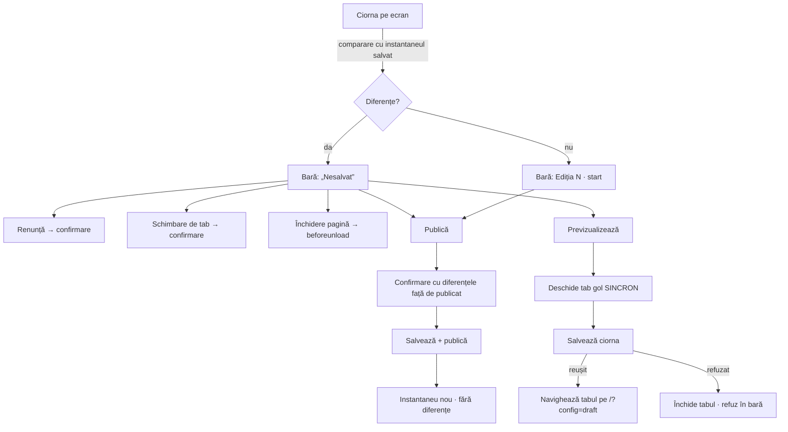

# Tabul „Eveniment" — nicio ediție publicată nevăzută - Plan

## Goal Capsule

- **Objective:** organizatorul nu mai poate publica o ediție pe care n-a văzut-o. Ce arată previzualizarea e ce e pe ecran; confirmarea spune ce se schimbă față de site-ul de acum; munca dintr-o ciornă nu dispare fără să întrebe; niciun câmp validat de server nu e nereparabil din formular.
- **Means:** stare „nesalvat" reactivă, previzualizare care salvează întâi (KTD3), diferențe câmp cu câmp în confirmare (KTD4), plus cele patru câmpuri și cinci reparații de interacțiune pe care auditul le-a găsit.
- **Authority:** planul ăsta. Alegerile de produs (previzualizare, confirmare, întinderea lucrării) au fost luate în sesiune — vezi Key Decisions. Unde codul contrazice planul, codul câștigă și se notează.
- **Execution profile:** doar interfață React + module pure. **Nicio migrare, nicio funcție Edge, nicio schimbare de RPC** — vezi KTD5. Deploy prin merge în `main`.
- **Stop conditions:** oprește-te și întreabă dacă (a) o unitate ar cere schimbarea unei funcții din `supabase/sql/` sau un RPC nou; (b) mutarea clipurilor/secțiunilor în grupuri (U9) ar cere rescrierea a mai mult de un sfert din `tests/unit/adminEventTab.test.tsx`; (c) garda de schimbare a tabului (U1) ar cere schimbarea semnăturii lui `AdminNav`.
- **Tail ownership:** implementare + verificare locală. Deploy-ul (merge în `main`) rămâne al operatorului.

---

## Product Contract

### Summary

Tabul „Eveniment" e deja bine gândit: câmpuri grupate pe întrebări, cronologie care scoate un reper căzut din ordine, oferta de mutare în bloc, liste în loc de text liber, dialogul de ediție nouă cu rezumatul moștenirii. Ce-i lipsește nu e frumusețe, e **verificare**: trei căi prin care documentul publicat poate diferi de ce crede organizatorul că a văzut, două câmpuri pe care validarea le cere dar formularul nu le are, și cinci locuri în care interacțiunea pierde munca sau ascunde eroarea.

Planul închide toate zece, în nouă unități independente, fără să atingă baza de date și fără să schimbe limbajul vizual.

### Problem Frame

Verificat în cod pe 18 septembrie 2026:

- **`Previzualizează` arată ciorna de pe SERVER, nu ce e pe ecran.** `src/hooks/useEventConfig.tsx:71-73` reinterogează `admin_get_event_config` și randează primul rând `draft`. Butonul stă în bara de jos, lângă `Salvează` (`src/admin/AdminEventTab.tsx:803-810`), ca `<a href="/?config=draft">`. Editezi șase câmpuri, deschizi previzualizarea, verifici documentul de dinaintea editărilor — și publici convins că ai văzut. E aceeași clasă de bug ca vechea capcană `launchAt`, mutată cu un ecran mai jos.
- **Nimic nu apără ciorna nesalvată.** `src/admin/AdminDashboard.tsx:700` randează `{tab === 'eveniment' && <AdminEventTab …>}`: schimbarea tabului demontează componenta și pierde ciorna în tăcere. `Renunță` (`AdminEventTab.tsx:432-446`) golește fără confirmare. Nu există `beforeunload`. `atinsa` e un `useRef` — ține polling-ul la distanță, dar nu e stare reactivă și nu poate apăra nimic.
- **Editarea numărului ediției poate bifurca ciorna.** `admin_save_event_config_draft` face `on conflict (editie) where status = 'draft'` (`supabase/sql/supabase-migration-event-config.sql:240-244`), deci un număr schimbat scrie un AL DOILEA rând `draft`. `admin_get_event_config` ordonează `created_at desc` (`:219-222`), iar tabul ia `rows.find((r) => r.status === 'draft')` — adică cea mai NOUĂ. Două ciorne deschise, niciun ecran care s-o spună.
- **`venue.zoom` e validat, dar n-are câmp.** `eventConfigForm.ts:78` cere `zoom > 0` și `GrupUnde` îl declară în `areEroare` (`GrupUnde.tsx:24`), dar grupul n-are inputul. Un document cu `zoom` zero (rând vechi, editat manual în DB) deschide grupul fără niciun câmp marcat și lasă `Publică` mort definitiv.
- **`slots.occupiedFallback` se moștenește tăcut.** `cioarnaEditieNoua` copiază `slots` întreg (`eventConfigForm.ts:383`); `rezumatCiornaNoua` doar RAPORTEAZĂ valoarea când e peste zero (`:455-460`). Când statisticile nu răspund, ediția nouă arată ocupația ediției TRECUTE, iar formularul n-are de unde s-o corecteze.
- **Confirmarea publicării nu spune ce se schimbă.** `AdminEventTab.tsx:876-901` descrie consecința („vizitatorii vor vedea landing-ul") — nu și ce câmpuri diferă de configul publicat. Singurul click ireversibil din tot backoffice-ul e și singurul fără diferențe sub el.
- **`N câmpuri de reparat` e text inert** (`AdminEventTab.tsx:785-790`). Ghidul de interfață cere focus pe prima eroare; azi o cauți prin șapte grupuri.
- **Cele două modale n-au tastatură.** Nici `DialogEditieNoua`, nici confirmarea publicării n-au Escape, focus inițial, capcană de focus sau `overscroll-behavior`. Se închid doar cu mouse-ul, pe overlay sau pe „Anulează".
- **Ștergerile locale n-au nici confirmare, nici undo.** `Șterge` pe un clip (`AdminEventTab.tsx:706`) sau pe un reminder (`GrupRemindere.tsx`) se aplică pe loc. Tiparul de undo există o componentă mai sus (`AdminDashboard.tsx:388-404`), dar `ToastAdmin` din `adminSession.tsx:19` n-are câmpul.
- **Bara lipită jos poate acoperi câmpul focusat.** `.admin-bara-actiuni` e `position: sticky; bottom: 0` (`src/index.css:1232-1240`); ultimele câmpuri ale formularului stau exact sub ea.
- **Clipurile și secțiunile se editează ÎN AFARA grupurilor** (`AdminEventTab.tsx:587-770`), deși `GrupInstagram` și `GrupCeArata` există și își rezumă conținutul. Rezumatul „3 clipuri" descrie ceva ce nu e în grup, iar rândurile nu primesc tratamentul lui `Camp` (etichetă legată, `aria-describedby`, inert în timpul scrierii).

### Key Decisions

- KD1. **Previzualizarea salvează întâi.** *(session-settled: user-directed — aleasă în locul blocării butonului cât timp ciorna e murdară și în locul avertismentului care lasă capcana accesibilă: singura variantă în care „am văzut" e adevărat de fiecare dată.)* Governs R6, R7.
- KD2. **Confirmarea publicării arată diferențele câmp cu câmp față de configul publicat.** *(session-settled: user-directed — aleasă în locul confirmării de azi și în locul unei liste de bifat înaintea publicării: diferențele sînt verificabile, bifele sînt ceremonie.)* Governs R8, R9, R10.
- KD3. **Întinderea: capcane + completitudinea câmpurilor + interacțiune/accesibilitate. Fără restructurare vizuală, fără taburi în URL.** *(session-settled: user-directed — aleasă în locul variantei minime (doar capcanele) și a celei largi (plus redesign și rutare).)* Guvernează Scope Boundaries de mai jos.

### Requirements

**Ciorna nesalvată (R1–R5)**

- R1. Formularul știe dacă ciorna de pe ecran diferă de ultimul document încărcat sau salvat, și o spune în bara de jos.
- R2. `Renunță` cere confirmare cât timp există diferențe nesalvate; fără diferențe, închide direct.
- R3. Ieșirea din tabul „Eveniment" cu diferențe nesalvate cere confirmare; refuzul păstrează tabul și ciorna intactă.
- R4. Închiderea sau reîncărcarea paginii cu diferențe nesalvate declanșează avertismentul nativ al browserului.
- R5. După o salvare sau o publicare reușită, starea revine la „fără diferențe".

**Previzualizare care nu minte (R6–R7)**

- R6. `Previzualizează` cu diferențe nesalvate salvează întâi ciorna, apoi deschide `/?config=draft` (KD1). Cu configul invalid, butonul e inert din același motiv ca `Publică`, iar bara spune de ce.
- R7. O salvare refuzată nu deschide nicio previzualizare; refuzul apare în bară cu pasul numit, ca la celelalte scrieri (`refuzCuPas`).

**Confirmarea publicării (R8–R10)**

- R8. Confirmarea enumeră câmpurile care diferă de configul publicat, cu valoarea veche și cea nouă, în formă citibilă („Startul cursei: sâmbătă, 22 aug, 07:00 → sâmbătă, 5 oct, 07:00").
- R9. Diferențele acoperă tot documentul: identitatea ediției, momentele, locul, locurile, reminderele, clipurile, secțiunile și ecranul de pornire. Un câmp neschimbat nu apare.
- R10. Când nu există config publicat pentru comparație, sau ciorna e a altei ediții decât cea publicată, confirmarea o spune ca atare, în loc să afișeze totul ca „schimbat".

**Ciorna bifurcată (R11–R12)**

- R11. Când pe server există mai multe ciorne, tabul o spune, numește edițiile și permite deschiderea oricăreia.
- R12. Schimbarea numărului ediției față de ciorna încărcată arată o atenționare pe câmp: salvarea va crea o ciornă separată, iar cea veche rămâne pe server.

**Câmpurile care lipsesc (R13–R15)**

- R13. `venue.zoom` are câmp în grupul „Unde", ca listă de valori uzuale, cu valoarea din document păstrată dacă e în afara listei.
- R14. `slots.occupiedFallback` are câmp în grupul „Locuri", cu explicația a ce e (valoarea de rezervă când statisticile nu răspund).
- R15. Ciorna unei ediții noi pornește cu `occupiedFallback` zero: la o ediție la care nu s-a înscris nimeni, orice altă valoare e o afirmație falsă.

**Interacțiune și accesibilitate (R16–R18)**

- R16. Indicatorul „N câmpuri de reparat" din bară duce la primul câmp invalid: îl focusează, îl aduce în ecran fără să-l acopere bara lipită, și deschide grupul care-l conține.
- R17. Cele două modale ale tabului se închid cu Escape, primesc focusul la deschidere, îl țin în interior cât sînt deschise și îl întorc unde era la închidere.
- R18. Ștergerea unui clip sau a unui reminder se poate anula din toast, fără să se piardă rândul.

### Scope Boundaries

**În scop:** cele optsprezece cerințe de mai sus, plus mutarea clipurilor și a secțiunilor în grupurile lor (U9), pentru ca rezumatul unui grup să descrie ce e în el.

**Deferit, cu motiv:**

- **Taburile în URL** (reîncărcarea te întoarce pe primul tab). E util, dar e o schimbare la nivel de dashboard, nu de tab — și cu R4 în loc, reîncărcarea accidentală nu mai pierde munca. Ține de „restructurare", exclusă prin KD3.
- **Publicarea atomică într-un singur RPC.** Autorul a adjudecat deja întrebarea în `AdminEventTab.tsx:336-348` și în `IDEI.md:223`: starea parțială e „o stare din care poți relua". Nu se redeschide aici.
- **Blocajul pentru doi operatori simultan.** Un singur operator; o schemă de versionare optimistă ar cere un RPC nou, exclus prin execution profile.
- **`ordinalOverride`.** Singurul câmp din `EventConfig` rămas fără interfață după U5, deliberat: e un override opțional pentru ordinalul scris cu litere, `null` în toate documentele de azi, iar un câmp liber peste un ordinal derivat corect e o cale nouă de greșeală, nu una închisă. Dacă vreodată e nevoie, se adaugă cu propriul ecou („se va scrie «a șaptea»").
- **`DialogPrezenta`** primește tastatura odată cu U7 doar dacă adopția e mecanică; nu e cerință.

---

## Planning Contract

### Key Technical Decisions

- KTD1. **„Nesalvat" se calculează prin comparație structurală cu un instantaneu, nu printr-un flag de atingere.** `atinsa` rămâne ce e — un `useRef` care ține polling-ul la distanță — dar nu poate hrăni R1–R5: nu e reactiv, și „am atins câmpul și am revenit la valoarea inițială" nu e o diferență. Se ține `salvat: EventConfig | null` (ce s-a încărcat sau ce tocmai s-a scris) și se compară cu ciorna. Comparația stă într-un modul pur, `src/admin/eventTab/nesalvat.ts`, testabil fără randare, ca restul regulilor formularului. Governs R1, R5.
- KTD2. **Garda de ieșire din tab stă în `AdminDashboard`, ca registru de blocaj.** Tabul „Eveniment" înregistrează o funcție „pot pleca?"; `AdminDashboard` o consultă în `setTab` înainte să schimbe valoarea. `AdminNav` nu se atinge — el cheamă `onTab` și atât, deci semnătura lui rămâne exact cea de azi (vezi stop condition c). Governs R3.
- KTD3. **Previzualizarea deschide tabul SINCRON, la click, și îl navighează după ce salvarea răspunde.** `window.open(url)` după un `await` e blocat de browser ca popup neinițiat de utilizator. Deci: `const tab = window.open('', '_blank')` pe click, salvare, apoi `tab.location = '/?config=draft'`; la refuz, `tab.close()` și mesajul în bară. Fără diferențe nesalvate, comportamentul rămâne cel de azi. Governs R6, R7.
- KTD4. **Diferențele se calculează dintr-un modul pur care aplatizează documentul în perechi etichetă/valoare**, `src/admin/eventTab/diferente.ts`, nu dintr-un diff generic pe JSON. Un diff pe chei ar produce `slots.occupiedFallback: 0 → 3` și `layout[2].visible: true → false` — corecte și necitibile. Aplatizarea folosește aceleași etichete și aceiași formatori ca formularul (`descrieMoment`, `durataRo`), deci diferența se citește în limba în care s-a editat. Randarea reia `<dl class="admin-mostenire">` din dialogul de ediție nouă (`src/index.css:1728-1740`): tiparul „câmp → valoare, cu marcaj pe cele schimbate" există deja și e recunoscut. Governs R8, R9, R10.
- KTD5. **Ciorna bifurcată se rezolvă în interfață, nu în schemă.** O ciornă unică forțată ar cere un RPC nou (ștergere de ciornă) sau o cheie unică schimbată — adică o migrare, plus deploy manual. Cu R11 (bannerul care le numește) și R12 (atenționarea pe câmp), starea devine vizibilă și reversibilă din UI, iar previzualizarea nu mai poate arăta altă ediție decât cea editată, pentru că salvarea de la R6 face din ciorna editată cea mai nouă. Governs R11, R12.
- KTD6. **Saltul la prima eroare se face prin `data-camp`, nu printr-o hartă de id-uri.** `Camp` își generează id-ul cu `useId()`, deci nu există un id previzibil de căutat. `Camp` primește o cheie opțională (`cheie="venue.mapQuery"`) pe care o pune ca `data-camp` pe container; saltul face `querySelector('[data-camp="…"]')` și focusează controlul din el. Cheile sînt exact cele din `CampInvalid.camp`, deci nu apare un al doilea vocabular. Grupul se deschide singur — comportamentul există deja (`primitive.tsx`, `areEroare`). Governs R16.
- KTD7. **Un singur primitiv de dialog**, `src/admin/eventTab/Dialog.tsx`: overlay, `role`, Escape, focus inițial pe primul control, capcană de focus pe Tab/Shift+Tab, întoarcerea focusului la închidere, `overscroll-behavior: contain`. Cele două modale ale tabului îl adoptă; niciunul nu-și mai scrie overlay-ul de mână. Governs R17.
- KTD8. **Undo-ul ștergerilor trece prin toastul existent, nu printr-o confirmare în doi pași.** `ToastAdmin` din `adminSession.tsx:19` capătă `undo?: () => void` — câmpul există deja în `AdminToast` din `AdminDashboard.tsx:69` și în randare, doar contextul nu-l poartă. O confirmare în doi pași ar pune o întrebare la fiecare ștergere; undo nu întreabă nimic și repară tot. Governs R18.
- KTD9. **Clipurile și secțiunile se mută în `GrupInstagram` și `GrupCeArata` cu rândurile pe `Camp`.** Testele existente care le caută după etichetă vor trebui să deschidă întâi grupul — grupurile pliate nu randează corpul. E o schimbare mecanică în teste, nu una de contract; dacă ar depăși un sfert din `tests/unit/adminEventTab.test.tsx`, unitatea se oprește și întreabă (stop condition b).

### High-Level Technical Design

Trei fluxuri se schimbă. Restul formularului rămâne cum e.



Modulele pure noi — `nesalvat.ts` și `diferente.ts` — urmează tiparul deja stabilit de `eventConfigForm.ts` și `reperele.ts`: reguli fără randare, testate direct, folosite de componentă.

### Sequencing

U1 (starea „nesalvat") e temelia pentru U2; restul sînt independente și pot merge în orice ordine. U9 se face ultima: mută cod pe care U6 și U8 îl ating.

```
U1 ──→ U2
U3, U4, U5, U6, U7, U8 (independente)
                         └──→ U9 (după U6 și U8)
```

### Assumptions

- Un singur operator lucrează în backoffice la un moment dat. Dacă ipoteza cade, R11 devine insuficient și e nevoie de versionare optimistă (deferită).
- `window.open('', '_blank')` la click e permis de browserele folosite (Chrome/Safari desktop). Dacă `open` întoarce `null` (blocker agresiv), U2 cade pe: salvează, apoi arată în bară un link „Deschide previzualizarea".

---

## Implementation Units

### U1. Ciorna nesalvată își spune numele — și nu mai dispare tăcut

**Goal:** organizatorul vede că are diferențe nesalvate și nu le poate pierde din greșeală.

**Requirements:** R1, R2, R3, R4, R5.

**Files:**
- `src/admin/eventTab/nesalvat.ts` (nou) — comparația pură.
- `src/admin/AdminEventTab.tsx` — instantaneul `salvat`, indicatorul din bară, confirmarea pe `Renunță`, înregistrarea gărzii, `beforeunload`.
- `src/admin/AdminDashboard.tsx` — registrul de blocaj consultat în `setTab` (KTD2).
- `tests/unit/nesalvat.test.ts` (nou), `tests/unit/adminEventTab.test.tsx`, `tests/unit/adminDashboard.test.tsx`.

**Approach:** `salvat` se pune la încărcarea ciornei de pe server, la crearea din dialog, la pornirea din publicat, și după fiecare salvare/publicare reușită. Bara afișează „Nesalvat" ca stare, sub problemele de validare și sub refuz în prioritate (ordinea de azi din `AdminEventTab.tsx:783-800` rămâne, „Nesalvat" intră ca a treia ramură, înaintea rezumatului „Ediția N"). Confirmarea pe `Renunță` și pe schimbarea tabului folosește `window.confirm` — aceeași voce ca avertismentul nativ de la R4, și singura care funcționează și când întrebarea vine dintr-un handler sincron de navigare. U7 nu o retrofitează. `beforeunload` se înregistrează doar cât timp există diferențe, și se dezînregistrează la demontare.

**Test Scenarios:**
- Tastarea într-un câmp face bara să spună „Nesalvat"; revenirea manuală la valoarea inițială o scoate.
- O salvare reușită scoate „Nesalvat" fără reîncărcare.
- `Renunță` cu diferențe cere confirmare; refuzul păstrează ciorna neatinsă, inclusiv editările.
- `Renunță` fără diferențe închide direct, fără întrebare.
- Schimbarea tabului cu diferențe cere confirmare; refuzul lasă tabul „Eveniment" activ și ciorna pe ecran.
- Schimbarea tabului fără diferențe trece direct.
- `beforeunload` e înregistrat cât timp există diferențe și absent altfel.

**Verification:** `npx vitest run tests/unit/nesalvat.test.ts tests/unit/adminEventTab.test.tsx tests/unit/adminDashboard.test.tsx`

---

### U2. `Previzualizează` arată ce e pe ecran

**Goal:** previzualizarea nu mai poate arăta un document mai vechi decât formularul.

**Requirements:** R6, R7. **Dependencies:** U1.

**Files:**
- `src/admin/AdminEventTab.tsx` — butonul de previzualizare (azi `<a>`, `:803-810`).
- `tests/unit/adminEventTab.test.tsx`.

**Approach:** KTD3. Butonul devine `<button>` când există diferențe nesalvate și rămâne `<a href="/?config=draft" target="_blank">` când nu există — navigarea reală rămâne o ancoră, cu Cmd-click și click de mijloc cu tot. Cu `probleme.length > 0` butonul e inert, ca `Salvează` și `Publică`, iar bara explică deja de ce („N câmpuri de reparat"). Refuzul salvării trece prin `refuzCuPas('salvare', err)`, ca celelalte scrieri, și tabul deschis se închide.

**Test Scenarios:**
- Cu diferențe nesalvate, apăsarea pe `Previzualizează` cheamă `saveEventConfigDraft` cu documentul de pe ecran, o singură dată.
- După salvarea reușită, tabul deschis e navigat pe `/?config=draft`.
- O salvare refuzată nu navighează nimic, închide tabul și pune refuzul în bară, cu pasul „Salvarea".
- Fără diferențe, previzualizarea nu scrie nimic pe server.
- Cu configul invalid, previzualizarea e inertă.

**Verification:** `npx vitest run tests/unit/adminEventTab.test.tsx`

---

### U3. Confirmarea publicării arată ce se schimbă

**Goal:** înaintea singurului click ireversibil, organizatorul vede diferențele față de site-ul de acum.

**Requirements:** R8, R9, R10.

**Files:**
- `src/admin/eventTab/diferente.ts` (nou) — `diferenteFataDePublicat(publicat, ciorna): Diferenta[]`.
- `src/admin/AdminEventTab.tsx` — dialogul de confirmare (`:869-902`).
- `tests/unit/diferente.test.ts` (nou), `tests/unit/adminEventTab.test.tsx`.

**Approach:** KTD4. `Diferenta = { eticheta: string; inainte: string; acum: string }`. Aplatizarea acoperă, în ordinea formularului: numărul ediției, ediția de lansare, numele, conceptul, startul, durata, check-inul, închiderea înscrierilor, anunțul, următorul antrenament, avansul „cine vine", fusul, locul (nume, oraș, coordonate, zoom), locurile (total, listă de așteptare, valoare de rezervă), ecranul de pornire, reminderele (număr, active, avansuri), clipurile (număr, ordine) și secțiunile (ordine, ascunse). Momentele se formatează cu `descrieMoment`, duratele cu `durataRo` — aceiași formatori ca în formular. Listele se compară ca descriere scurtă, nu element cu element: „Remindere: 2 active (24h, 3h) → 3 active (72h, 24h, 3h)". Când `publicat` e `null` sau `publicat.number !== ciorna.number`, funcția întoarce listă goală și dialogul spune „Prima publicare a ediției N — nu există o versiune anterioară cu care să se compare".

**Test Scenarios:**
- Un singur câmp schimbat produce o singură diferență, cu valoarea veche și cea nouă.
- Un document identic produce listă goală, iar dialogul o spune ca „nimic nu se schimbă".
- Momentele apar în formă citibilă, nu ca ISO.
- Reordonarea secțiunilor, fără altă schimbare, produce o diferență pe „Secțiunile paginii".
- Un clip adăugat produce o diferență pe „Clipurile din bandă".
- Ediția din ciornă diferită de cea publicată produce mesajul de primă publicare, nu o listă în care tot documentul pare schimbat.
- Dialogul păstrează avertismentul despre share preview și textul despre ce vede vizitatorul.

**Verification:** `npx vitest run tests/unit/diferente.test.ts tests/unit/adminEventTab.test.tsx`

---

### U4. Ciorna bifurcată devine vizibilă

**Goal:** două ciorne pe server nu mai pot trece neobservate.

**Requirements:** R11, R12.

**Files:**
- `src/admin/AdminEventTab.tsx` — bannerul de ciorne multiple, atenționarea pe „Numărul ediției" (prin `GrupEditia`).
- `src/admin/eventTab/grupuri/GrupEditia.tsx` — `atentie` pe câmpul `number`.
- `tests/unit/adminEventTab.test.tsx`.

**Approach:** KTD5. `randuri.filter((r) => r.status === 'draft')` e deja disponibil în componentă. La mai mult de una: banner `role="status"` care numește edițiile și oferă câte un buton de deschidere per ciornă (deschiderea = aceeași cale ca încărcarea inițială, plus `salvat` din U1 dacă e livrată). Atenționarea de pe câmp folosește propul `atentie` al lui `Camp`, care există (`primitive.tsx`), și se aprinde când `ciorna.number` diferă de `editie` a rândului încărcat.

**Test Scenarios:**
- Două rânduri `draft` produc bannerul, cu ambele numere de ediție numite.
- Un singur `draft` nu produce niciun banner.
- Deschiderea celeilalte ciorne încarcă documentul ei în formular.
- Schimbarea numărului ediției față de ciorna încărcată aprinde atenționarea pe câmp; revenirea la numărul inițial o stinge.
- Atenționarea nu blochează salvarea și nu apare printre `probleme`.

**Verification:** `npx vitest run tests/unit/adminEventTab.test.tsx`

---

### U5. Câmpurile pe care validarea le cere și formularul nu le avea

**Goal:** niciun câmp validat de server nu mai e nereparabil din formular, și ocupația nu se mai moștenește.

**Requirements:** R13, R14, R15.

**Files:**
- `src/admin/eventTab/grupuri/GrupUnde.tsx` — `venue.zoom`.
- `src/admin/eventTab/grupuri/GrupLocuri.tsx` — `slots.occupiedFallback`.
- `src/admin/eventTab/ajutoare.ts` — lista de valori pentru zoom.
- `src/admin/eventConfigForm.ts` — `cioarnaEditieNoua` pune `occupiedFallback: 0`; `rezumatCiornaNoua` scoate rândul devenit inutil.
- `tests/unit/eventConfigForm.test.ts`, `tests/unit/adminEventTab.test.tsx`.

**Approach:** zoom ca `select` peste valorile uzuale (13–18), cu ecou care spune ce înseamnă („17 · strada se vede") și cu valoarea din document păstrată ca opțiune dacă e în afara listei — exact tiparul din `GrupCand` pentru durată și fus. `occupiedFallback` ca `number`, cu ajutor care spune când se vede („numărul pe care pagina îl arată dacă statisticile nu răspund") și că zero e răspunsul normal. `cioarnaEditieNoua` îl duce la zero (R15), deci rândul „Ocupate (valoare de rezervă)" din `rezumatCiornaNoua` nu mai are ce raporta și dispare.

**Test Scenarios:**
- Grupul „Unde" are un câmp pentru zoom; schimbarea lui ajunge în documentul salvat.
- Un document cu `zoom` zero arată eroarea PE câmp, iar corectarea reactivează `Publică`.
- Un zoom din afara listei rămâne vizibil ca opțiune selectată.
- Grupul „Locuri" are un câmp pentru valoarea de rezervă; schimbarea lui ajunge în documentul salvat.
- `cioarnaEditieNoua` pornește cu `occupiedFallback` zero, chiar dacă ediția publicată avea altceva.
- Rezumatul dialogului nu mai afișează rândul „Ocupate (valoare de rezervă)".

**Verification:** `npx vitest run tests/unit/eventConfigForm.test.ts tests/unit/adminEventTab.test.tsx`

---

### U6. De la „N câmpuri de reparat" la câmpul vinovat

**Goal:** eroarea se repară dintr-un click, nu dintr-o căutare prin șapte grupuri.

**Requirements:** R16.

**Files:**
- `src/admin/eventTab/primitive.tsx` — `Camp` primește `cheie` și o pune ca `data-camp`.
- `src/admin/eventTab/grupuri/*.tsx` — cheia pe fiecare `Camp` (aceleași chei ca în `CampInvalid.camp`).
- `src/admin/AdminEventTab.tsx` — indicatorul din bară devine buton.
- `src/index.css` — `scroll-margin-bottom` pe `.admin-config-camp`, ca bara lipită să nu acopere câmpul adus în ecran.
- `tests/unit/adminEventTab.test.tsx`.

**Approach:** KTD6. Butonul ia prima problemă din `probleme` (ordinea din `validateEventConfig` e ordinea documentului, deci „prima" e și cea de sus), caută `[data-camp="…"]`, focusează primul `input`/`select`/`textarea` din el și cheamă `scrollIntoView({ block: 'center' })`. Grupurile cu eroare sînt deja deschise, deci elementul e randat. Pentru cheile indexate (`reminders.0.offsetHours`, `reels.2.code`) rândurile primesc același `data-camp` odată cu U9; până atunci butonul cade pe grupul care le conține.

**Test Scenarios:**
- Cu un deadline după start, apăsarea indicatorului focusează câmpul „Se închid înscrierile".
- Cu două probleme, focusul merge la prima din document, nu la ultima.
- Cu zero probleme, indicatorul nu e buton și bara arată rezumatul ediției.
- Fiecare `Camp` care poate purta o eroare are `data-camp` egal cu cheia din validare (test care parcurge cheile produse de `validateEventConfig` pe un document stricat în toate felurile).

**Verification:** `npx vitest run tests/unit/adminEventTab.test.tsx`

---

### U7. Modalele se folosesc de la tastatură

**Goal:** dialogurile tabului se închid cu Escape și nu pierd focusul.

**Requirements:** R17.

**Files:**
- `src/admin/eventTab/Dialog.tsx` (nou) — primitivul.
- `src/admin/eventTab/DialogEditieNoua.tsx`, `src/admin/AdminEventTab.tsx` (confirmarea publicării) — adopția.
- `src/index.css` — `overscroll-behavior: contain` pe `.admin-confirm-overlay`.
- `tests/unit/dialog.test.tsx` (nou), `tests/unit/adminEventTab.test.tsx`.

**Approach:** KTD7. Primitivul păstrează marcajul de azi (`.admin-confirm-overlay` > `.admin-confirm`) ca stilurile să nu se schimbe, și primește `rol` (`dialog` sau `alertdialog`), titlu legat prin `aria-labelledby`, `onInchide`. Închiderea pe click în afara conținutului rămâne. Focusul inițial: primul control focusabil din dialog; la închidere, elementul care l-a deschis.

**Test Scenarios:**
- Escape închide dialogul de ediție nouă fără să creeze ciorna.
- Escape închide confirmarea publicării fără să publice.
- La deschidere, focusul e în dialog.
- Tab de pe ultimul element se întoarce pe primul; Shift+Tab de pe primul merge pe ultimul.
- La închidere, focusul se întoarce pe butonul care a deschis dialogul.
- Titlul dialogului e numele lui accesibil.

**Verification:** `npx vitest run tests/unit/dialog.test.tsx tests/unit/adminEventTab.test.tsx`

---

### U8. Ștergerile se pot anula

**Goal:** un clip sau un reminder șters din greșeală se recuperează dintr-un click.

**Requirements:** R18.

**Files:**
- `src/admin/adminSession.tsx` — `ToastAdmin` capătă `undo?: () => void`.
- `src/admin/AdminEventTab.tsx` — ștergerea unui clip.
- `src/admin/eventTab/grupuri/GrupRemindere.tsx` — ștergerea unui reminder.
- `tests/unit/adminEventTab.test.tsx`, `tests/unit/grupRemindere.test.tsx`.

**Approach:** KTD8. La ștergere se păstrează lista de dinainte și se cheamă `showToast({ kind: 'success', msg: 'Clipul a fost șters.', undo })`, unde `undo` repune lista anterioară. Nimic nu atinge serverul — ambele liste sînt stare locală de formular — deci undo-ul nu poate eșua. `AdminDashboard` randează deja toastul cu undo și îi dă 6 secunde în loc de 3,2 (`:143`).

**Test Scenarios:**
- Ștergerea unui clip produce un toast cu undo; undo-ul repune clipul pe aceeași poziție, cu toate câmpurile lui.
- Ștergerea unui reminder produce un toast cu undo; undo-ul repune rândul cu avansul, șablonul și starea „activ" intacte.
- Undo-ul repune lista și când s-au șters două rânduri la rând (ultimul șters se întoarce primul).
- `GrupRemindere` continuă să afle `showToast` din contextul de sesiune, nu ca prop.

**Verification:** `npx vitest run tests/unit/adminEventTab.test.tsx tests/unit/grupRemindere.test.tsx`

---

### U9. Clipurile și secțiunile intră în grupurile lor

**Goal:** rezumatul unui grup descrie ce e în grup, iar rândurile primesc același tratament ca restul câmpurilor.

**Requirements:** contribuie la R16 (chei indexate) și la coerența grupurilor. **Dependencies:** U6, U8.

**Files:**
- `src/admin/AdminEventTab.tsx` — scoaterea celor două liste din corpul plat.
- `src/admin/eventTab/grupuri/GrupInstagram.tsx` — lista de clipuri.
- `src/admin/eventTab/grupuri/GrupCeArata.tsx` — lista de secțiuni.
- `tests/unit/adminEventTab.test.tsx`, `tests/unit/sectionLayout.test.tsx`.

**Approach:** KTD9. Listele se mută cu tot cu logica lor de rânduri; `linkBrut` (textul brut al linkului, `AdminEventTab.tsx:271`) se mută odată cu lista de clipuri, pentru că nu mai are alt consumator. Rândurile folosesc `Camp` cu `cheie` (`reels.0.code` etc.), deci saltul din U6 le prinde. Comportamentele existente rămîn cuvânt cu cuvânt: tastarea care nu se autodistruge, forma canonică la ieșirea din câmp, renumerotarea secțiunilor, plafonul de clipuri. Testele care caută etichetele trebuie să deschidă întâi grupul.

**Test Scenarios:**
- Clipurile se editează din grupul „Instagram"; rezumatul pliat numără exact clipurile din el.
- Secțiunile se aranjează din grupul „Ce arată pagina"; rezumatul pliat numără secțiunile vizibile.
- Un link de clip invalid deschide grupul „Instagram" singur și îl ține deschis.
- Tastarea unui link caracter cu caracter nu golește câmpul (comportamentul de azi, păstrat).
- Ieșirea din câmp lasă forma canonică, fără query de tracking (păstrat).
- Renumerotarea secțiunilor la ascundere/mutare (păstrat).
- Saltul de la „N câmpuri de reparat" ajunge pe rândul de clip vinovat.

**Verification:** `npx vitest run tests/unit/adminEventTab.test.tsx tests/unit/sectionLayout.test.tsx`

---

## Verification Contract

- **Pe unitate:** comanda `vitest` din unitate, plus `npm run typecheck && npm run typecheck:tests`.
- **Înainte de PR:** `npm run verify` — lint (`oxlint --max-warnings=25`), `knip`, ambele typecheck-uri, `vitest run --coverage`, build, și e2e pe preview.
- **Contractul păzit de suita existentă rămâne valabil și după:** nimic din ce se tastează nu ajunge pe site până la `Publică`, și publicarea nu poate porni dintr-un config invalid (`tests/unit/adminEventTab.test.tsx`). Nicio unitate n-are voie să slăbească un test existent ca să treacă; dacă un test trebuie schimbat, schimbarea e mecanică (deschiderea unui grup) sau se oprește și întreabă.
- **Fără migrări, fără deploy de funcții.** Dacă o unitate ajunge să ceară una, e o stop condition.
- **Verificare manuală, o dată, la final:** deschide `/admin` → „Eveniment", pornește o ciornă, editează startul, apasă `Previzualizează` și confirmă că pagina deschisă poartă editarea; apoi `Publică` și confirmă că dialogul enumeră exact câmpurile schimbate.

## Definition of Done

**Global:**
- Cele optsprezece cerințe sînt acoperite de teste care pică fără schimbare și trec cu ea.
- `npm run verify` trece.
- Codul abandonat pe parcurs (abordări încercate și părăsite) e șters, nu lăsat în diff.
- `GHID-EDITIE-NOUA.md` e actualizat acolo unde comportamentul descris s-a schimbat: previzualizarea care salvează întâi, diferențele din confirmare, câmpurile noi.
- Niciun `docs/plans/` nou; planul ăsta rămâne artefactul.

**Pe unitate:** unitatea e gata când testele ei trec, `typecheck` și `typecheck:tests` trec, iar comportamentele existente numite în „Test Scenarios" ca „păstrat" încă trec neschimbate.

## Sources

- `src/admin/AdminEventTab.tsx` — formularul, bara de acțiuni (`:780-831`), confirmarea publicării (`:869-902`), listele plate de clipuri și secțiuni (`:587-770`).
- `src/admin/eventTab/primitive.tsx` — `Grup`, `Camp` (cu `atentie` și `ecou`), `LinieDeTimp`.
- `src/admin/eventConfigForm.ts` — validarea, avertismentele, `cioarnaEditieNoua`, `rezumatCiornaNoua`.
- `src/hooks/useEventConfig.tsx:65-74` — de unde citește previzualizarea configul.
- `supabase/sql/supabase-migration-event-config.sql:208-248` — ordinea rândurilor și `on conflict (editie) where status = 'draft'`.
- `src/index.css:1232-1240, 1688-1740` — bara lipită, overlay-ul de dialog, `<dl class="admin-mostenire">` reluat la diferențe.
- `IDEI.md:135-158, 223` — ideea 5 (livrată) și publicarea atomică (adjudecată, nu se redeschide).
- Web Interface Guidelines (vercel-labs), secțiunile Forms, Focus States, Navigation & State — sursa pentru R2–R4 (avertisment la navigare cu modificări nesalvate), R16 (focus pe prima eroare), R17 (modale), R18 (acțiuni distructive cu undo) și pentru bara lipită care nu are voie să acopere elementul focusat.
