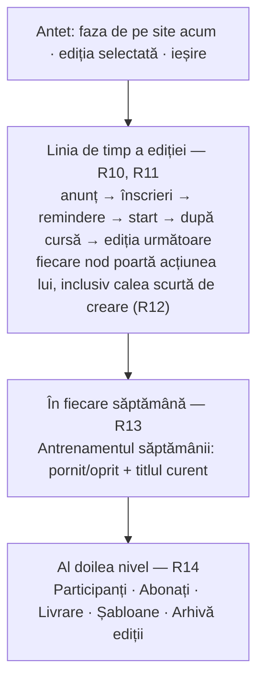
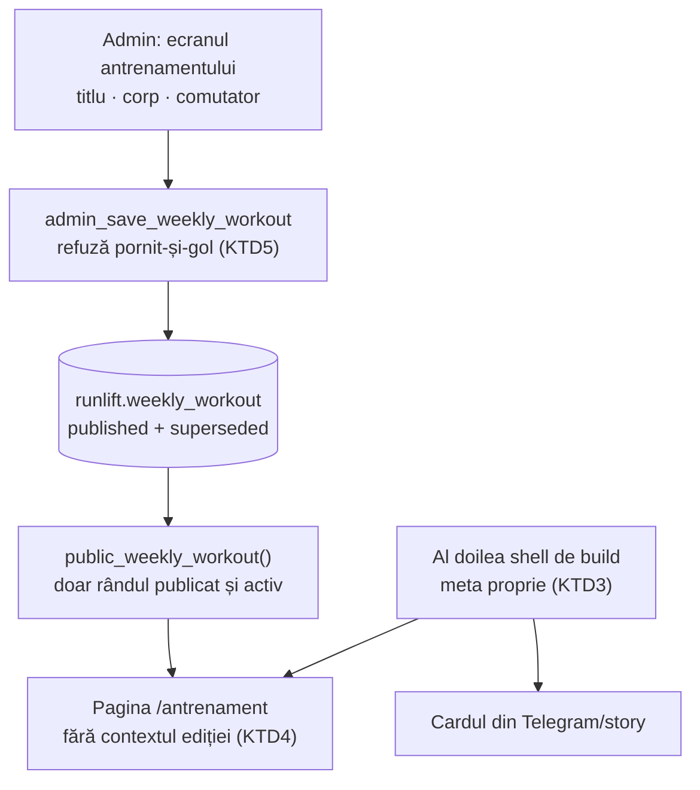
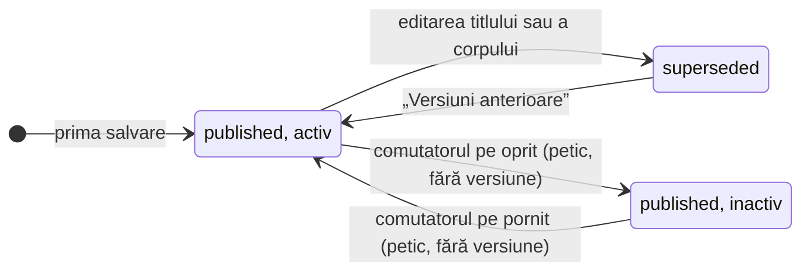

# Antrenamentul săptămânii și backoffice-ul cronologic - Plan

## Goal Capsule

- **Objective:** organizatorul are un link permanent de trimis pentru antrenamentul săptămânii și îl pornește sau îl oprește dintr-o singură apăsare; iar când deschide `/admin`, primul lucru pe care-l vede e unde stă ediția și ce urmează, nu un meniu din care trebuie să ghicească.
- **Means:** o pagină publică proprie cu comutator (KTD1), plus ecranul principal al backoffice-ului rescris ca linia de timp a ediției (KTD2), cu antrenamentul așezat în afara ei.
- **Authority:** planul ăsta. Alegerile de produs au fost luate în sesiune — vezi Key Decisions. Unde codul contrazice planul, codul câștigă și se notează.
- **Execution profile:** React + module pure, **o migrare SQL** (U1, aplicată manual) și **o schimbare de build** pentru al doilea shell de meta (U4). Nicio funcție Edge nouă. Deploy prin merge în `main`.
- **Stop conditions:** oprește-te și întreabă dacă (a) al doilea shell de build cere schimbarea `index.html` pentru pagina principală, nu doar adăugarea unuia nou; (b) unificarea reperelor (U6) ar cere rescrierea a mai mult de jumătate din `tests/unit/stareCurenta.test.ts`; (c) linia de timp (U7) ar cere schimbarea contractului `useAdminPolling` sau a sesiunii de admin.
- **Tail ownership:** implementare + verificare locală. Aplicarea migrării în Supabase și deploy-ul (merge în `main`) rămân ale operatorului.
- **Open blockers:** niciunul.

---

## Product Contract

### Summary

Antrenamentul săptămânii primește o pagină publică proprie, cu un URL stabil de lipit în story sau în Telegram, pornită și oprită dintr-un singur comutator. În același timp, ecranul principal al backoffice-ului devine desfășurarea ediției: anunțul, înscrierile, reminderele, startul, după cursă, ediția următoare — fiecare nod cu acțiunea lui. Antrenamentul stă în afara acelei linii, pentru că ține de săptămână, nu de ediție.

### Problem Frame

Antrenamentul se publică azi în story pe Instagram și în grupul de Telegram. Amândouă sunt închise sau trecătoare: story-ul moare în 24 de ore, grupul ajunge doar la cine e deja înăuntru. Când cineva întreabă „ce antrenament e săptămâna asta?", nu există nimic de trimis — se repostează sau se reexplică. Costul numit e exact ăsta: **nu există link**. Nu lipsa unei arhive, nu invizibilitatea față de cei din afară, nu un site care pare mort între ediții.

Backoffice-ul are o problemă separată, ieșită la ultima configurare de ediție. Patru lucruri au mers prost odată: calea scurtă de creare (dialogul de trei câmpuri) n-a fost văzută; după ea a urmat tot formularul lung cu șapte grupuri; câmpurile se completează de la zero, fără sugestii și fără preluări; iar la final nu se știa dacă ce s-a completat e corect. Nu e o problemă de grupare — gruparea s-a făcut deja, în trei grupuri de câte o întrebare. E o problemă de formă: ecranul e construit ca **un formular de completat**, nu ca **o treabă de terminat**, și nu spune niciodată nici unde ai ajuns, nici dacă e bine.

Cele două lucrări se ating într-un punct: într-un backoffice organizat în jurul ediției, un antrenament săptămânal n-are unde să stea fără să pară al optulea tab lipit pe margine.

### Key Decisions

- KD1. **Antrenamentul are ciclul lui, nu al ediției: o salvare, efect imediat.** Cadența e săptămânală și miza e mică; ciclul ciornă → previzualizare → publicare e exact greutatea care a făcut configurarea ediției obositoare. *(session-settled: user-approved — chosen over găzduirea antrenamentului în documentul ediției: ar fi scris un rând nou de configurare în fiecare săptămână și ar fi îngropat istoricul real al ediției sub editări de antrenament.)* Governs R5, R7.
- KD2. **Ecranul principal al backoffice-ului devine linia de timp a ediției.** Desfășurarea în timp e lucrul pe care organizatorul îl are deja în cap; meniul îl obligă să-l traducă în taburi. *(session-settled: user-directed — chosen over transformarea tabului „Evenimentul" în pași cu verdict final și peste un lansator de treburi pe ecranul de intrare: linia de timp răspunde întâi la „unde suntem", care e întrebarea cu care se intră.)* Governs R10, R11, R12.
- KD3. **Împărțirea de nivel întâi devine episodic față de recurent.** Ediția are început și sfârșit; antrenamentul se repetă. Separate, niciunul nu mai trebuie înghesuit în forma celuilalt. Governs R7, R13.
- KD4. **Valoarea urmărită e un link de trimis.** *(session-settled: user-directed — chosen over arhivă de antrenamente, suprafață de achiziție pentru cine nu s-a înscris încă și animarea site-ului între ediții: doar linkul a fost numit ca lipsă reală.)* Governs R1, R2.
- KD5. **Previzualizarea linkului e un card fix, propriu paginii.** *(session-settled: user-approved — chosen over cardul generic de azi, care numește o dată de ediție posibil trecută, și peste un card care urmărește conținutul săptămânii, care ar cere randare per cerere.)* Governs R4.
- KD6. **Comutatorul rămâne explicit, dar starea pornit-și-gol se refuză.** Un comutator separat de conținut lasă loc pentru textul de săptămâna viitoare scris din timp; refuzul împiedică singura combinație care produce o pagină publică goală. Governs R6.
- KD7. **Suprascrierea e recuperabilă, dar nu publică.** Versiunile anterioare rămân accesibile din backoffice ca revenire după o greșeală, nu ca istoric vizibil pe site. Governs R8.
- KD8. **Cu comutatorul oprit, URL-ul răspunde și spune că nu e nimic publicat acum.** Un 404 ar rupe linkurile deja lipite în Telegram, care e chiar lucrul pe care pagina vine să-l repare. Governs R9.
- KD9. **Pagina se livrează întâi, pe backoffice-ul de azi; linia de timp vine după.** Linkul e valoarea cerută și e mică de construit; linia de timp e cea mai mare dintre variantele cântărite, iar comutatorul mutat o dată e un preț mai mic decât linkul întârziat cu toată lucrarea de backoffice. *(session-settled: user-approved — chosen over livrarea împreună și peste linia de timp întâi.)* Governs R16.

### Actors

- A1. Organizatorul — singurul cont din backoffice; scrie antrenamentul, îl pornește, configurează ediția.
- A2. Cine primește linkul — participant sau nu, fără cont și fără autentificare; deschide pagina dintr-un mesaj.

### Requirements

**Pagina „Antrenamentul săptămânii"**

- R1. Pagina are un URL propriu și stabil în timp, servit la acces direct — nu doar prin navigare din interiorul site-ului.
- R2. Pagina arată un singur antrenament — cel curent. Nu există navigare spre săptămâni trecute și niciun index.
- R3. Conținutul e scris de organizator ca titlu plus text liber; forma textului nu e impusă de câmpuri separate.
- R4. Linkul lipit într-o aplicație de mesagerie arată un card de previzualizare propriu paginii, nu cardul ediției. Cardul e fix și nu urmărește conținutul săptămânii.
- R5. Publicarea unui antrenament e o singură salvare, cu efect imediat pe site, fără pas de ciornă și fără pas de publicare.
- R6. Comutatorul de vizibilitate e independent de conținut: textul poate exista cu pagina oprită. Salvarea cu comutatorul pornit și textul gol se refuză.
- R7. Antrenamentul nu aparține niciunei ediții: rămâne editabil și vizibil și când nu există ediție curentă deschisă.
- R8. Suprascrierea antrenamentului precedent e recuperabilă din backoffice.
- R9. Cu comutatorul oprit, URL-ul răspunde și spune că nu e nimic publicat acum. Nu dă eroare și nu redirectează.

**Ecranul principal al backoffice-ului**

- R10. La deschiderea `/admin`, primul lucru de pe ecran e desfășurarea ediției curente ca linie de timp, cu nodurile în ordinea lor: anunțul, înscrierile deschise, reminderele, startul, după cursă, ediția următoare.
- R11. Fiecare nod își spune starea în cuvinte — trecut, în curs, cere atenție — și poartă acțiunea care-i aparține.
- R12. Nodul „ediția următoare" poartă calea scurtă de creare direct pe linie, fără să ceară intrarea într-un tab.
- R13. Antrenamentul săptămânii are locul lui în afara liniei de timp, ca lucru recurent, cu starea pornit sau oprit lizibilă fără să intri în el.
- R14. Taburile existente rămân accesibile ca al doilea nivel, iar conținutul lor nu se schimbă.
- R15. Cu o ediție de arhivă selectată, linia ei de timp se vede în citire, fără acțiunile de scriere.

Compoziția ecranului principal, ca regiuni:

**Ordinea livrării**

- R16. Pagina și comutatorul ei se livrează pe backoffice-ul de azi, ca intrare separată în navigația existentă, înainte ca linia de timp să existe. Linia de timp preia comutatorul la locul lui din R13 când ajunge, iar intrarea temporară dispare atunci.

### Key Flows

- F1. Public antrenamentul săptămânii
  - **Trigger:** organizatorul a hotărât antrenamentul și vrea un link de trimis.
  - **Actors:** A1
  - **Steps:** deschide backoffice-ul; ajunge la antrenament din ecranul principal, fără să treacă prin configurarea ediției; scrie titlul și textul; pornește comutatorul; salvează o dată; copiază linkul.
  - **Outcome:** pagina e live la același URL ca săptămâna trecută; linkul se lipește în story și în Telegram.
  - **Covered by:** R1, R3, R5, R6, R13

- F2. Văd unde stă ediția
  - **Trigger:** organizatorul deschide `/admin` fără o intenție anume.
  - **Actors:** A1
  - **Steps:** citește linia de timp de sus în jos; vede ce s-a consumat, ce e în curs, ce cere atenție; intră doar în nodul care-l privește.
  - **Outcome:** poate spune faza ediției și ce urmează fără să apese nimic.
  - **Covered by:** R10, R11

- F3. Pornesc ediția următoare
  - **Trigger:** cursa s-a terminat, urmează ediția nouă.
  - **Actors:** A1
  - **Steps:** apasă acțiunea de pe ultimul nod al liniei; completează cele trei câmpuri; confirmă.
  - **Outcome:** ciorna ediției următoare există, fără ca organizatorul să fi căutat unde stă calea scurtă.
  - **Covered by:** R12

### Acceptance Examples

- AE1. Comutator pornit, text gol
  - **Covers R6.**
  - **Given** organizatorul a pornit comutatorul și n-a scris nimic în text.
  - **When** apasă salvare.
  - **Then** salvarea e refuzată, cu motivul pe ecran; pagina publică nu se schimbă.

- AE2. Text scris, comutator oprit
  - **Covers R6, R9.**
  - **Given** organizatorul a scris antrenamentul de săptămâna viitoare și a lăsat comutatorul oprit.
  - **When** salvează, iar cineva deschide un link vechi spre pagină.
  - **Then** textul se păstrează nepublicat, iar pagina răspunde spunând că nu e nimic publicat acum.

- AE3. Între ediții
  - **Covers R7.**
  - **Given** ediția trecută s-a consumat și nu există ediție curentă deschisă.
  - **When** organizatorul publică un antrenament.
  - **Then** pagina rămâne live și editabilă, neafectată de starea ediției.

- AE4. Ediție de arhivă
  - **Covers R15.**
  - **Given** organizatorul a selectat o ediție de arhivă.
  - **When** se uită la linia ei de timp.
  - **Then** nodurile și stările se văd, iar acțiunile de scriere lipsesc.

- AE5. Linkul lipit într-un mesaj
  - **Covers R1, R4.**
  - **Given** URL-ul antrenamentului e lipit în Telegram.
  - **When** aplicația construiește previzualizarea.
  - **Then** cardul numește antrenamentul săptămânii, nu ediția și data ei; iar deschiderea linkului duce direct la pagină.

### Success Criteria

- De la deschiderea backoffice-ului până la link live: sub un minut, fără să treacă prin tabul „Evenimentul".
- Un organizator care deschide `/admin` fără context poate spune faza ediției și reperul următor fără să apese nimic.
- Calea scurtă de creare a ediției se vede de pe primul ecran, fără căutare.
- Linkul rămâne același de la o săptămână la alta, deci un mesaj vechi duce tot la antrenamentul curent.

### Scope Boundaries

**Amânat**

- Arhivă publică de antrenamente, URL per săptămână, index sau navigare între săptămâni.
- Card de previzualizare care urmărește conținutul săptămânii curente.
- Secțiune pentru antrenament pe pagina principală.
- Structură impusă a antrenamentului: intervale, distanțe, ritmuri, încălzire și revenire ca elemente separate.
- Pasul de verdict înainte de publicarea ediției și completarea automată a câmpurilor din configurare — atacă direct două dintre cele patru dificultăți, dar ține de aranjamentul respins în favoarea liniei de timp.

**În afara identității produsului**

- Antrenamentul nu devine jurnal personal de antrenament și nici plan de pregătire cu istoric per persoană. Site-ul rămâne despre eveniment.

### Dependencies / Assumptions

- Ruta nouă trebuie declarată explicit la hosting: fiecare pagină are azi linia ei în lista de rewrite-uri (`vercel.json`). Fără ea, accesul direct din link dă 404, iar R1 cade.
- Previzualizarea per rută nu există azi. Meta se injectează la build, o singură dată pentru tot site-ul (`src/content/meta.ts`, `vite.config.ts`), pentru că scraperele de share nu rulează JS. R4 cere ca acest lucru să devină per rută.
- Logica reperelor există azi în două locuri: `reperele` în `src/admin/reperele.ts:140` și `repere` în `src/admin/stareCurenta.ts:91`. Linia de timp se sprijină pe una singură — vezi KTD2.
- Nimic legat de antrenament nu există azi în `src/`, `supabase/` sau `MIGRATIONS.md`, verificat pe 19 septembrie 2026. Lucrarea e nouă în întregime.
- Presupunere: conținutul antrenamentului e text liber (R3), pentru că nu s-a furnizat un exemplu real. Dacă textul pe care-l scrie organizatorul are structură repetabilă, R3 se poate strânge fără să afecteze restul.
- Migrările SQL se aplică manual și se notează în `MIGRATIONS.md`; deploy-ul vine din merge în `main` (`CI-CD.md`).

### Sources / Research

- `src/admin/adminNavigatie.ts:28` — gruparea actuală în trei grupuri și raționamentul ei, scris în fișier.
- `src/admin/AdminEventTab.tsx:745` — cele șapte grupuri ale formularului de ediție.
- `src/admin/eventTab/DialogEditieNoua.tsx` — calea scurtă de trei câmpuri și rezumatul de moștenire.
- `src/admin/reperele.ts:140`, `src/admin/stareCurenta.ts:91` — cele două implementări de repere.
- `src/main.tsx:39` — paginile se aleg pe cale, fără router.
- `src/content/eventConfig.ts:151` — mecanismul existent de ascundere și reordonare a secțiunilor.
- `docs/FLUXURI.md:570` — tabul cu efect imediat, fără ciornă, ca precedent pentru R5.
- `README.md:125` — secțiunea care nu se randează când e goală, ca precedent pentru refuzul din R6.
- `supabase/sql/supabase-migration-reels-si-coming-soon.sql:156` — `admin_set_coming_soon`: tiparul „peticește publicatul, scrie rând nou", pe care U1 îl copiază.
- `tests/unit/sql/db.ts:20` — testele SQL rulează pe `supabase/schema/runlift.sql` în PGlite, deci instantaneul de schemă trebuie actualizat odată cu migrarea (KTD8).
- `tests/unit/rute.test.ts:39` — garda care cere ca fiecare rewrite să ducă spre `/index.html`; U4 o lărgește.

---

## Planning Contract

**Product Contract preservation:** neschimbat. Cele două întrebări amânate la planificare sunt răspunse în KTD2 și KTD6, iar secțiunea lor a fost scoasă; niciun R n-a fost divizat, mutat sau reformulat.

### Key Technical Decisions

- KTD1. **Antrenamentul primește tabelul lui, cu rânduri `published`/`superseded`, după tiparul `event_config`.** Versiunile anterioare cad din structură, nu dintr-o coloană de istoric adăugată ulterior. Governs R5, R8.
- KTD2. **Linia de timp se sprijină pe `src/admin/reperele.ts`, extins cu nodul de leaderboard și cu unul de remindere; `repere` din `src/admin/stareCurenta.ts` dispare.** `reperele` e singurul care are deja `trecut`, `semnal` și `problema` per nod — exact vocabularul cerut de R11 — iar `stareCurenta` păstrează faza și semnalele de atenție și consumă lista în loc s-o recalculeze. Governs R10, R11.
- KTD3. **Cardul de previzualizare vine dintr-un al doilea shell de build, cu propriile placeholdere de meta.** *(session-settled: user-approved — chosen over cardul generic de azi și randarea per cerere: un shell în plus la build nu adaugă infrastructură de rulare, iar meta rămâne injectată static, cum o cer scraperele.)* Governs R4.
- KTD4. **Citirea publică trece printr-un RPC propriu, pe modelul `public_config()`, iar pagina nu primește `EventConfigProvider`.** Pagina nu arată nimic derivat din ediție, deci contextul ediției ar fi un fetch fără consumator. Governs R1, R7.
- KTD5. **Refuzul „pornit și gol" stă în RPC, nu doar în formular.** O scriere directă în DB ar produce altfel exact pagina publică goală pe care R6 o interzice. Governs R6.
- KTD6. **Comutatorul antrenamentului stă imediat sub linia de timp, ca bloc „în fiecare săptămână".** Sub linie, nu lângă ea: proximitatea îl face vizibil fără să sugereze că e un nod al ediției. Governs R13.
- KTD7. **Intrarea temporară din faza întâi e un tab în grupul „Setup", scos la sosirea liniei de timp.** Governs R16.
- KTD8. **Instantaneul `supabase/schema/runlift.sql` se actualizează în aceeași unitate cu migrarea.** Testele SQL rulează pe instantaneu, nu pe fișierele de migrare, deci fără actualizare funcțiile noi n-au nicio acoperire.
- KTD9. **Comutarea vizibilității peticește rândul publicat; doar editarea titlului sau a corpului scrie o versiune nouă.** Istoricul rămâne despre conținut, care e lucrul pentru care există revenirea; altfel o pornire-oprire dublă ar îngropa editarea reală sub patru rânduri identice. Governs R6, R8.

### High-Level Technical Design

Drumul datelor. Antrenamentul are propriul lanț, paralel cu cel al ediției, și nu-l atinge:

Ciclul de viață al unui antrenament. Trei stări, aceleași ca la documentul ediției:

`Ascuns` nu e o a patra stare în tabel — e rândul publicat cu `activ = false`. Îl desenăm separat pentru că e starea care produce R9, iar din formular nu se distinge de „n-am scris încă nimic".

### Sequencing

Două faze, în ordinea din R16. Faza A livrează linkul; faza B rescrie ecranul principal.

- **Faza A — pagina:** U1 → U2 → U3 → U4, cu U5 pornind din U2 în paralel cu U3.
- **Faza B — linia de timp:** U6 → U7 → U8 → U9.

U6 nu depinde de faza A și poate porni oricând, dar U8 retrage intrarea temporară pe care o creează U5, deci nu se livrează înaintea ei.

### Risks & Dependencies

- **Lărgirea gărzii de rute (U4) atinge un test care a prins un 404 real în producție.** Aserțiunea „fiecare rută are rewrite" rămâne; se schimbă doar verificarea destinației, iar garda contra rewrite-urilor orfane rămâne neatinsă. Dacă lărgirea cere scoaterea uneia dintre cele două aserțiuni, e un caz de oprire — vezi Stop conditions.
- **Al doilea shell poate strica previzualizarea paginii principale.** `index.html` nu se modifică în U4; shell-ul nou se adaugă. Testul de meta existent acoperă pagina principală și trebuie să rămână verde fără schimbări.
- **Migrarea se aplică manual, deci planul și baza pot rămâne desincronizate.** Testele SQL rulează pe instantaneu, nu pe proiectul real: un instantaneu actualizat (KTD8) cu migrarea neaplicată dă teste verzi și o pagină care nu funcționează. Aplicarea în Supabase e un criteriu de Definition of Done, nu un pas opțional.
- **Expunerea publică e intenționată, dar îngustă.** Tabelul nu conține date personale, iar RPC-ul public întoarce doar rândul publicat și activ. RLS fără politici (U1) ține rândurile `superseded` și antrenamentul oprit în afara oricărei citiri directe cu cheia publică.
- **Garda de config de deploy rulează înainte de `vite build`.** Un al doilea `input` nu atinge CSP-ul și nu schimbă originile, deci garda ar trebui să treacă neschimbată; dacă nu trece, cauza e în config, nu în shell.

### Assumptions

- Textul antrenamentului se randează ca text simplu cu păstrarea rândurilor noi. Nu se adaugă un editor bogat și nu se interpretează markdown; dacă textul real cere formatare, e o schimbare ulterioară de R3, nu o decizie de implementare.
- Plafonul de versiuni păstrate pentru antrenament îl urmează pe cel al `event_config`; dacă acolo nu există niciunul, nici aici nu se introduce.
- Pagina nu primește link din antetul site-ului (link-only), consecvent cu excluderea secțiunii de pe pagina principală din Scope Boundaries.

---

## Implementation Units

### U1. Tabelul antrenamentului și RPC-urile lui

- **Goal:** antrenamentul are unde să stea, cu versiuni și cu refuzul „pornit și gol" pe server.
- **Requirements:** R5, R6, R8; AE1, AE2.
- **Dependencies:** niciuna.
- **Files:** `supabase/sql/supabase-migration-antrenament-saptamanii.sql`, `supabase/schema/runlift.sql`, `MIGRATIONS.md`, `tests/unit/sql/antrenament.test.ts`
- **Approach:**
  1. Tabel `runlift.weekly_workout` cu `id`, `status`, `titlu`, `corp`, `activ`, `creat_la`. Index unic parțial pe `status = 'published'`, ca la `event_config`.
  2. `admin_save_weekly_workout` — `security definer`, validează tokenul ca celelalte RPC-uri admin. Când titlul sau corpul se schimbă, trece rândul publicat în `superseded` și inserează unul nou, ca `admin_set_coming_soon`. Când se schimbă doar comutatorul, peticește rândul publicat pe loc (KTD9).
  3. Refuzul din KTD5 se ridică din RPC, cu un cod de eroare propriu pe care clientul îl traduce.
  4. `admin_list_weekly_workout` și `admin_restore_weekly_workout` acoperă R8, pe modelul `admin_restore_event_config`.
  5. `public_weekly_workout` — `grant execute … to anon`, întoarce rândul publicat doar când `activ`, altfel nimic.
  6. RLS pornit pe tabel, fără politici, ca la celelalte tabele ale schemei: accesul trece exclusiv prin funcțiile `security definer`. Fără asta, cheia publică ar putea citi și rândurile `superseded` și antrenamentul oprit.
  7. Actualizează instantaneul de schemă în aceeași unitate (KTD8) și notează migrarea în `MIGRATIONS.md` ca neaplicată.
- **Patterns to follow:** `supabase/sql/supabase-migration-reels-si-coming-soon.sql:156` pentru petic-și-rând-nou; `supabase/sql/supabase-migration-event-config.sql:154` pentru forma unui RPC public.
- **Test scenarios:**
  - Covers AE1. Salvare cu comutatorul pornit și corpul gol → refuz cu codul dedicat, niciun rând nou în tabel.
  - Covers AE2. Salvare cu comutatorul oprit și corp scris → rândul se scrie, iar `public_weekly_workout` nu întoarce nimic.
  - A doua salvare, cu corp schimbat → rândul precedent devine `superseded` și rămâne exact un rând `published`.
  - Salvare care schimbă doar comutatorul → rândul publicat se peticește, nu apare niciun rând nou, iar lista de versiuni rămâne la aceeași lungime.
  - Pornire și oprire repetate → lista de versiuni nu crește deloc.
  - Revenire la un rând `superseded` → devine publicat, iar cel curent trece în `superseded`.
  - `public_weekly_workout` chemat pe rolul `anon` → reușește.
  - `select` direct pe tabel ca `anon` → refuzat de RLS, inclusiv pentru rândul publicat.
  - Cu antrenamentul oprit, `public_weekly_workout` pe rolul `anon` nu scurge nici titlul, nici corpul.
  - `admin_save_weekly_workout` cu token invalid → refuz, ca la celelalte RPC-uri admin.
  - Corp gol și comutator oprit → se acceptă; refuzul e legat de comutator, nu de conținut.
- **Verification:** testele SQL trec pe instantaneul actualizat, iar `MIGRATIONS.md` are rândul nou.
- **Execution note:** migrarea se aplică manual în Supabase; CI nu o rulează. Scrie testul pe instantaneu înainte de a aplica ceva în proiectul real.

### U2. Wrapperele de rețea

- **Goal:** clientul poate citi și scrie antrenamentul prin aceleași convenții ca restul aplicației.
- **Requirements:** R1, R5, R8.
- **Dependencies:** U1.
- **Files:** `src/lib/adminApi.ts`, `src/lib/supabase.ts`, `tests/unit/backend-contract.test.ts`
- **Approach:**
  1. Wrappere `rpc()` peste cele trei RPC-uri admin, lângă `setComingSoon`.
  2. Citirea publică merge în `src/lib/supabase.ts`, lângă apelul `public_config`, cu aceleași headere de schemă.
  3. Traducerea codului de refuz din KTD5 într-un mesaj pentru operator stă lângă wrapper, pe modelul `mesajRefuz` din tabul Coming Soon.
- **Patterns to follow:** `src/lib/adminApi.ts:224` (forma wrapperului), `src/lib/supabase.ts:242` (apelul public).
- **Test scenarios:**
  - Citirea publică trimite headerele `Accept-Profile`/`Content-Profile` pentru schema `runlift`.
  - Citirea publică merge spre URL-ul proiectului din config, nu spre altul.
  - Un refuz `workout_empty` de la server se traduce într-un mesaj pentru operator, nu în textul brut al erorii.
- **Verification:** testele de contract trec fără să atingă un backend real.

### U3. Pagina publică și ruta ei

- **Goal:** URL-ul răspunde, arată antrenamentul curent, și spune că nu e nimic publicat când comutatorul e oprit.
- **Requirements:** R1, R2, R3, R7, R9; AE3.
- **Dependencies:** U2.
- **Files:** `src/components/Antrenament.tsx`, `src/main.tsx`, `vercel.json`, `tests/antrenament.spec.ts`
- **Approach:**
  1. Componentă nouă, randată pe cale în `src/main.tsx` alături de celelalte pagini.
  2. Pagina nu primește `EventConfigProvider` (KTD4) — adaugă calea la excepția existentă de acolo.
  3. Rewrite nou în `vercel.json`, altfel accesul direct dă 404.
  4. Trei stări pe ecran: antrenament publicat, nimic publicat (R9), și eroare de rețea.
- **Patterns to follow:** `src/main.tsx:39` pentru alegerea pe cale și `src/main.tsx:68` pentru excepția de provider; `src/components/DespreNoi.tsx` ca pagină fără context de ediție.
- **Test scenarios:**
  - Cu un antrenament publicat și activ → titlul și corpul apar pe pagină.
  - Covers AE3. Fără ediție curentă deschisă → pagina se randează la fel; nimic din ea nu depinde de starea ediției.
  - Cu comutatorul oprit → pagina răspunde și arată mesajul „nu e nimic publicat acum", fără eroare și fără redirect.
  - Rândurile noi din corp se păstrează la randare.
  - Citirea publică eșuează → pagina arată o stare de eroare, nu un ecran gol.
- **Verification:** specul Playwright trece pe build-ul de preview, cu citirea publică mock-uită.

### U4. Al doilea shell de build și cardul de previzualizare

- **Goal:** linkul lipit într-un mesaj arată cardul antrenamentului, nu pe cel al ediției.
- **Requirements:** R4; AE5.
- **Dependencies:** U3.
- **Files:** `antrenament.html`, `vite.config.ts`, `src/content/meta.ts`, `vercel.json`, `tests/unit/meta.test.ts`, `tests/unit/rute.test.ts`
- **Approach:**
  1. Shell HTML nou, cu aceleași placeholdere de meta ca `index.html`, dar cu setul lui de valori.
  2. Al doilea `input` în configul de build, ca pluginul de meta să-l trateze la fel.
  3. Setul de valori pentru antrenament stă lângă `META` în `src/content/meta.ts`, fix — nu derivat din ediție (KTD3).
  4. Rewrite-ul rutei duce spre shell-ul nou, nu spre `/index.html`.
  5. Garda de rute învață că o rută poate avea propriul shell: destinația e verificată ca fișier de build existent, nu comparată literal cu `/index.html`.
- **Patterns to follow:** `vite.config.ts:9` (pluginul `transformIndexHtml`), `src/content/meta.ts:44` (maparea placeholderelor).
- **Test scenarios:**
  - Covers AE5. Shell-ul antrenamentului conține placeholderele de meta, nu valori scrise de mână.
  - Setul de meta al antrenamentului nu conține data ediției și nu se schimbă când ediția se schimbă.
  - Fiecare rută din cod are un rewrite, iar destinația fiecărui rewrite e un shell care există.
  - Nu există rewrite-uri orfane — garda existentă rămâne verde.
  - Build-ul produce ambele shell-uri.
- **Verification:** `npm run build` scoate două fișiere HTML, iar gărzile de rute și de meta trec.
- **Execution note:** lărgirea gărzii de rute e partea riscantă — schimbă un test care a prins un 404 real în producție. Păstrează aserțiunea „fiecare rută are rewrite" intactă și schimbă doar verificarea destinației.

### U5. Ecranul de admin al antrenamentului

- **Goal:** organizatorul scrie antrenamentul, îl pornește și copiază linkul, fără să treacă prin configurarea ediției.
- **Requirements:** R5, R6, R8, R16; F1.
- **Dependencies:** U2.
- **Files:** `src/admin/AdminAntrenamentTab.tsx`, `src/admin/adminNavigatie.ts`, `src/admin/stareCurenta.ts`, `src/admin/AdminDashboard.tsx`, `tests/unit/adminAntrenamentTab.test.tsx`, `tests/unit/adminNavigatie.test.ts`
- **Approach:**
  1. Tab nou în grupul „Setup" (KTD7): titlu, corp, comutator, o salvare, plus lista de versiuni anterioare.
  2. Adaugă cheia tabului în tipul de taburi din `src/admin/stareCurenta.ts` și randează-l în dashboard — cele trei locuri pe care le cere un tab nou.
  3. Comutatorul și corpul sunt independente în formular; refuzul vine de la server (KTD5) și se arată ca mesaj, nu ca buton mort.
  4. Linkul paginii e afișat cu un buton de copiere, fiindcă asta e treaba pentru care se deschide ecranul.
- **Patterns to follow:** `src/admin/AdminComingSoonTab.tsx` pentru forma unui tab cu efect imediat; `src/admin/adminNavigatie.ts:28` pentru intrarea în grup.
- **Test scenarios:**
  - Covers AE1. Comutator pornit și corp gol → salvarea arată refuzul serverului, iar formularul își păstrează conținutul.
  - Covers AE2. Corp scris și comutator oprit → salvarea reușește și ecranul spune că pagina e oprită.
  - După o salvare reușită, lista de versiuni anterioare are un rând în plus.
  - Revenirea la o versiune anterioară repopulează formularul cu conținutul ei.
  - Tabul apare în grupul „Setup" și e accesibil din navigație.
  - Eroare de rețea la salvare → mesaj pentru operator, fără pierderea textului din formular.
- **Verification:** testele tabului trec, iar testul navigației vede tabul nou în grupul lui.

### U6. Un singur modul de repere

- **Goal:** există o listă de noduri, completă, pe care linia de timp o poate desena.
- **Requirements:** R10, R11.
- **Dependencies:** niciuna.
- **Files:** `src/admin/reperele.ts`, `src/admin/stareCurenta.ts`, `src/admin/AdminAcum.tsx`, `tests/unit/reperele.test.ts`, `tests/unit/stareCurenta.test.ts`
- **Approach:**
  1. Adaugă în `reperele` nodul „pagina trece pe «cine vine»" (există azi doar în `stareCurenta`) și un nod pentru reminderele armate, derivat din orarul documentului.
  2. Nodul de anunț rămâne condiționat de comutatorul Coming Soon, cum e azi în `stareCurenta` — altfel linia arată un reper care nu se întâmplă.
  3. Șterge `repere` din `src/admin/stareCurenta.ts`; `stareCurenta` cheamă `reperele` pentru „următorul".
  4. `fazaSite` și `semnaleDeAtentie` rămân unde sunt — sunt despre fază și atenție, nu despre repere.
  5. Reperul întors de `stareCurenta` își schimbă forma: momentul vine ca ISO local, nu ca `Date`. Panoul „Acum" îl consumă azi ca `Date` (`src/admin/AdminAcum.tsx:47`), deci se adaptează în aceeași unitate — altfel unificarea nu compilează.
- **Patterns to follow:** `src/admin/reperele.ts:188` (`problemaReperului`) pentru forma unui semnal per nod.
- **Test scenarios:**
  - Lista conține toate nodurile cerute de linia de timp, în ordine cronologică.
  - Cu Coming Soon oprit, nodul de anunț lipsește din listă.
  - Cu orarul de remindere gol, nodul de remindere lipsește; cu două remindere armate, apare o dată, nu de două ori.
  - „Următorul reper" raportat de panoul de stare rămâne același ca înainte de unificare, pentru un config dat.
  - Panoul „Acum" randează ora următorului reper corect după schimbarea de formă a momentului.
  - Un document cu formate stricate întoarce listă goală, ca azi.
  - Semnalele de atenție rămân neschimbate — unificarea nu le atinge.
- **Verification:** ambele fișiere de test trec, iar `repere` nu mai e exportat de nicăieri.
- **Execution note:** unificarea schimbă un modul cu acoperire existentă bună. Rulează întâi testele de stare ca acoperire de caracterizare, apoi mută logica.

### U7. Linia de timp ca ecran principal

- **Goal:** la deschiderea backoficiului, primul lucru pe ecran e desfășurarea ediției, cu acțiunea fiecărui nod pe el.
- **Requirements:** R10, R11, R12, R15; F2, F3, AE4.
- **Dependencies:** U6.
- **Files:** `src/admin/LiniaDeTimp.tsx`, `src/admin/AdminDashboard.tsx`, `src/edition3.css`, `tests/unit/liniaDeTimp.test.tsx`
- **Approach:**
  1. Componentă nouă care randează nodurile din U6, fiecare cu starea lui în cuvinte și cu acțiunea atașată.
  2. Ia locul panoului „Acum" ca prim bloc al dashboardului; semnalele de atenție rămân, atașate nodului lor când au unul.
  3. Nodul ediției următoare deschide dialogul de trei câmpuri existent, fără să treacă printr-un tab (R12).
  4. Cu o ediție de arhivă selectată, nodurile se randează fără acțiunile de scriere (R15), pe regula de arhivă deja folosită în dashboard.
- **Patterns to follow:** `src/admin/AdminAcum.tsx` pentru blocul pe care-l înlocuiește; `src/admin/eventTab/DialogEditieNoua.tsx` pentru dialogul deschis din ultimul nod.
- **Test scenarios:**
  - Nodurile apar în ordine, iar cele trecute sunt marcate ca atare.
  - Un nod cu semnal își arată semnalul pe el, nu într-o listă separată.
  - Starea fiecărui nod — trecut, în curs, cere atenție — e citibilă ca text, nu doar ca marcaj vizual.
  - Covers F3. Acțiunea de pe nodul ediției următoare deschide dialogul de trei câmpuri.
  - Covers AE4. Cu o ediție de arhivă selectată, nodurile se văd și acțiunile de scriere lipsesc.
  - Covers F2. Faza raportată de linia de timp e aceeași cu cea a paginii publice pentru un config dat.
  - Un document cu repere nevalide → linia nu se randează, iar ecranul spune de ce, în loc să deseneze noduri calculate greșit.
- **Verification:** testele componentei trec, iar testele dashboardului rămân verzi.

### U8. Antrenamentul în afara liniei de timp

- **Goal:** antrenamentul are locul lui pe ecranul principal, iar intrarea temporară din faza A dispare.
- **Requirements:** R13, R16.
- **Dependencies:** U5, U7.
- **Files:** `src/admin/AdminDashboard.tsx`, `src/admin/adminNavigatie.ts`, `src/admin/stareCurenta.ts`, `tests/unit/adminNavigatie.test.ts`, `tests/unit/adminDashboard.test.tsx`
- **Approach:**
  1. Blocul „în fiecare săptămână" se randează imediat sub linia de timp (KTD6), cu starea pornit/oprit și titlul curent lizibile fără să intri.
  2. Scoate tabul temporar din grupul „Setup" și cheia lui din tipul de taburi; ecranul antrenamentului se deschide din bloc.
- **Patterns to follow:** `src/admin/adminNavigatie.ts:91` pentru consecințele scoaterii unei chei de tab.
- **Test scenarios:**
  - Blocul arată starea pornit/oprit și titlul antrenamentului curent fără interacțiune.
  - Fără niciun antrenament salvat, blocul spune că nu există unul, nu rămâne gol.
  - Tabul temporar nu mai apare în navigație.
  - Nicio cheie de tab rămasă fără grup — garda din modulul de navigație rămâne verde.
- **Verification:** testele de navigație și de dashboard trec, iar căutarea după cheia tabului temporar nu mai găsește nimic.

### U9. Taburile ca al doilea nivel

- **Goal:** taburile rămase sunt accesibile fără să concureze cu linia de timp.
- **Requirements:** R14.
- **Dependencies:** U7.
- **Files:** `src/admin/AdminNav.tsx`, `src/admin/adminNavigatie.ts`, `src/edition3.css`, `tests/unit/adminNav.test.tsx`
- **Approach:**
  1. Navigația coboară sub linia de timp și sub blocul săptămânal, ca al doilea nivel.
  2. Conținutul taburilor nu se schimbă; se mută doar plasarea și accentul vizual.
  3. Contoarele și alerta de emailuri nelivrate rămân pe grupuri, ca azi.
- **Patterns to follow:** `src/admin/AdminNav.tsx:31` — păstrează semantica de navigație și `aria-current`, motivată în fișier.
- **Test scenarios:**
  - Grupurile și frunzele rămân aceleași, cu aceleași etichete.
  - Alerta de emailuri nelivrate urcă în continuare la grup.
  - `aria-current` rămâne pe grupul și tabul active.
  - Clicul pe grupul activ nu mută utilizatorul, ca azi.
- **Verification:** testele de navigație trec neschimbate în afara plasării.

---

## Verification Contract

| Poartă | Comandă | Ce dovedește |
|---|---|---|
| Unitare + SQL | `npm run test` | Logica pură, RPC-urile pe instantaneul de schemă, gărzile de rute și de meta |
| Tipuri | `npm run typecheck` și `npm run typecheck:tests` | Cheia nouă de tab și tipurile RPC nu rup nimic |
| Lint | `npm run lint` | Sub plafonul existent de avertismente |
| Cod mort | `npm run deadcode` | `repere` scos în U6 nu rămâne exportat degeaba |
| Build | `npm run build` | Ambele shell-uri se produc, iar garda de config de deploy trece |
| End-to-end | `npm run test:e2e:preview` | Pagina nouă și fluxurile existente, pe build-ul de preview |
| Totul | `npm run verify` | Poarta completă, înainte de merge |

Migrarea din U1 nu e acoperită de niciuna dintre aceste comenzi în proiectul real: se aplică manual în Supabase și se verifică acolo. Testele SQL dovedesc doar că funcțiile se comportă corect pe instantaneu.

---

## Definition of Done

**Global**

- Toate porțile din Verification Contract trec local.
- Migrarea din U1 e aplicată în Supabase și notată în `MIGRATIONS.md` cu data aplicării.
- `docs/FLUXURI.md` și `README.md` descriu pagina nouă și ecranul principal schimbat.
- Codul rămas din încercări abandonate e șters — niciun modul, tab sau test orfan din variantele nereținute.
- Niciun `repere` duplicat: unificarea din U6 a lăsat o singură sursă.

**Pe unități**

- U1 — refuzul „pornit și gol" e dovedit de test, iar instantaneul de schemă conține funcțiile noi.
- U2 — citirea publică e dovedită că merge pe schema și URL-ul corecte.
- U3 — URL-ul răspunde în toate trei stările, inclusiv cu comutatorul oprit.
- U4 — build-ul produce două shell-uri, iar garda de rute e verde fără să-și fi pierdut aserțiunea despre rewrite-uri.
- U5 — organizatorul poate publica un antrenament și copia linkul fără să deschidă tabul „Evenimentul".
- U6 — `repere` nu mai există, iar „următorul reper" raportează la fel ca înainte.
- U7 — linia de timp e primul bloc al dashboardului și respectă regula de arhivă.
- U8 — tabul temporar a dispărut, iar blocul săptămânal îi ține locul.
- U9 — taburile stau sub linia de timp cu conținutul neschimbat.
