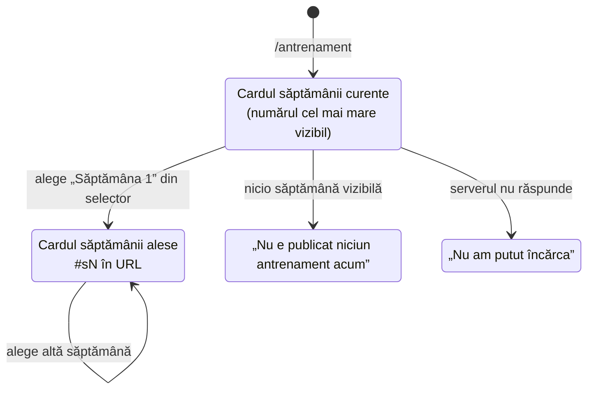
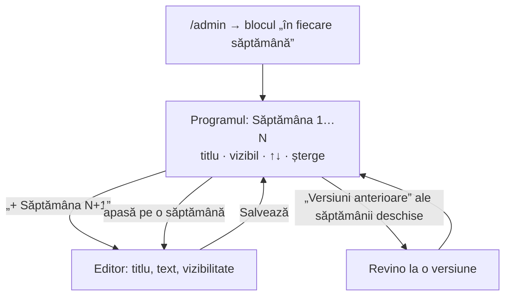

# Programul antrenamentelor, pe săptămâni numerotate - Plan

## Goal Capsule

- **Objective:** cine intră pe `/antrenament` vede antrenamentul săptămânii ăsteia, dar poate alege din toate săptămânile de până acum — ca să înceapă de la Săptămâna 1 dacă abia acum se apucă de alergat. Iar organizatorul nu mai gestionează un singur text care se suprascrie, ci un program: adaugă săptămâna următoare cu numărul deja pus, le vede pe toate, le editează, le mută și le ascunde.
- **Means:** `runlift.weekly_workout` trece de la „un singur rând publicat" la „un rând publicat per săptămână, numerotat" (KTD1, KTD2); pagina publică păstrează cardul curent și capătă un selector (KTD7); ecranul de admin devine listă de program plus editor (KTD8).
- **Authority:** planul ăsta. Alegerile de produs au fost luate în sesiune — vezi Key Decisions. Unde codul contrazice planul, codul câștigă și se notează.
- **Execution profile:** React + module pure, **o migrare SQL** (U1, aplicată manual). Nicio funcție Edge nouă, niciun shell de build nou, nicio rută nouă în `vercel.json`. Deploy prin merge în `main`.
- **Stop conditions:** oprește-te și întreabă dacă (a) migrarea ar cere backfill — tabelul era gol la scrierea planului și asta e premisa pe care stă KTD2; (b) renumerotarea din U1 ar cere blocaje explicite peste tranzacție; (c) selectorul din U3 ar cere o bibliotecă nouă sau ar sparge garda de scroll orizontal pe mobil din `tests/antrenament.spec.ts`.
- **Tail ownership:** implementare + verificare locală. Aplicarea migrării în Supabase și deploy-ul (merge în `main`) rămân ale operatorului.
- **Open blockers:** niciunul.

---

## Product Contract

### Summary

Antrenamentul săptămânii încetează să fie un text care se suprascrie și devine un **program numerotat**: Săptămâna 1, 2, 3 și așa mai departe. Pe `/antrenament` rămâne în prim-plan antrenamentul săptămânii curente — linkul trimis în story duce tot la el — iar sub el un selector dă acces la oricare altă săptămână, ca un începător să pornească de la Săptămâna 1. În `/admin`, ecranul antrenamentului devine programul întreg: numărul se completează singur, săptămânile se văd și se editează direct, se mută cu ↑↓, se șterg, și fiecare se poate ascunde separat.

### Problem Frame

Astăzi există un singur antrenament, cel curent. Când se scrie următorul, cel de dinainte dispare din ochii publicului — versiunile rămân în DB, dar ca **undo pentru o greșeală**, nu ca istoric. Costul: un om care vrea acum să înceapă să alerge n-are de unde începe. Antrenamentul săptămânii 9 nu-i folosește dacă n-a făcut 1–8, iar ce-a fost în săptămânile 1–8 nu mai e nicăieri.

Al doilea cost, pe partea de organizator: cu un singur text care se suprascrie, tot ce s-a scris până acum se administrează prin lista de „Versiuni anterioare" — un mecanism de reparație, nu de planificare. Nu există un loc din care să vezi programul.

Ce **nu** e problema: linkul. El există deja și funcționează; planul ăsta n-are voie să-l strice.

### Key Decisions

- KD1. **Istoricul e un program numerotat, nu o arhivă cronologică.** Săptămâna 1 → N, parcurgibil de la început. *(session-settled: user-directed — ales peste o listă invers cronologică „ce-a fost săptămâna trecută": valoarea numită a fost „să poată începe de la săptămâna 1", care cere ordine crescătoare și un punct de pornire, nu recență.)* Governs R1, R2, R3.
- KD2. **Istoricul stă pe `/antrenament`, la același URL.** *(session-settled: user-approved — ales peste o arhivă cu URL per săptămână, o secțiune pe pagina principală și un istoric doar în admin.)* Governs R1, R4.
- KD3. **Antrenamentul săptămânii rămâne în prim-plan; restul programului stă după un selector.** *(session-settled: user-directed — „doar workoutul de săptămâna asta pe pagină și restul într-un buton sau un dropdown".)* Governs R2, R3.
- KD4. **Numerotarea se incrementează singur, fără capăt.** Fiecare antrenament nou primește automat numărul următor. *(session-settled: user-approved — ales peste numerotare manuală și peste un program cu lungime fixă care se reia; criteriul a fost efortul zero la admin.)* Governs R5, R9. Vezi RISK1 pentru costul pe termen lung, asumat.
- KD5. **Organizatorul vede și editează programul întreg, mută săptămâni, le șterge și le ascunde una câte una.** *(session-settled: user-directed — toate patru cerute explicit.)* Governs R6, R7, R8, R9.
- KD6. **Intrările în program nu mai vin dintr-un pas separat de arhivare.** Întrebarea „ce anume intră în istoric" a primit inițial răspunsul „doar ce marchezi ca săptămână încheiată", dar numerotarea automată o rezolvă mai simplu: **a adăuga o săptămână nouă ESTE gestul de încheiere a celei de dinainte.** O corectură pe o săptămână existentă rămâne corectură și nu creează o intrare. *(derivat din KD4 + KD5; înlocuiește răspunsul inițial fără să-i schimbe intenția — corecturile tot nu poluează programul.)* Governs R5, R10.
- KD7. **Cererea redeschide, deliberat, două puncte închise pe 19 septembrie.** KD4 din `docs/plans/2026-09-19-1151-feat-antrenamentul-saptamanii-si-admin-cronologic-plan.md` („valoarea urmărită e un link de trimis", ales atunci **peste** o arhivă de antrenamente) și punctul „Amânat — arhivă publică de antrenamente, index sau navigare între săptămâni" sunt revizuite de utilizator, nu ignorate. Ce rămâne în picioare din decizia veche: linkul e în continuare prim-plan, iar pagina nu devine index (KD3).

### Actors

- **A1. Vizitatorul care aleargă deja** — deschide linkul din story, vrea antrenamentul săptămânii ăsteia, în două secunde, pe telefon.
- **A2. Vizitatorul care abia începe** — a auzit de Run + Lift, vrea să înceapă de la Săptămâna 1 și să urce în ritmul lui.
- **A3. Organizatorul** — scrie un antrenament pe săptămână, din `/admin`, în sub un minut, și din când în când corectează sau rearanjează ce-a scris.

### Requirements

- R1. `/antrenament` rămâne la același URL, cu același shell de build și același card de share. Un link trimis luna trecută duce tot la o pagină validă.
- R2. Pagina arată în prim-plan **antrenamentul săptămânii curente** — săptămâna vizibilă cu numărul cel mai mare — în același card ca azi.
- R3. Sub card, un selector listează toate săptămânile vizibile, crescător („Săptămâna 1", „Săptămâna 2", …). Alegerea uneia schimbă cardul pe loc, fără reîncărcare și fără o nouă cerere la server.
- R4. Selecția se reflectă în fragmentul URL-ului (`/antrenament#s1`), ca linkul „începe de la Săptămâna 1" să fie trimisibil. Un fragment care nu corespunde niciunei săptămâni vizibile e ignorat, iar pagina deschide săptămâna curentă.
- R5. În `/admin`, butonul de adăugare poartă numărul deja calculat („+ Săptămâna 10"). Organizatorul scrie doar titlul și textul.
- R6. Ecranul de admin listează programul întreg. Apăsarea pe o săptămână o deschide în editor; salvarea o modifică pe ea, fără să atingă celelalte.
- R7. Fiecare săptămână se mută cu ↑ / ↓ în program. Mutarea renumerotează, deci numerele rămân 1…N fără goluri.
- R8. Fiecare săptămână se poate șterge, după o confirmare. Ștergerea duce cu ea și versiunile ei, iar săptămânile de după se renumerotează.
- R9. Fiecare săptămână are comutatorul ei de vizibilitate. O săptămână scrisă din timp și ascunsă nu apare nici în card, nici în selector.
- R10. Editarea titlului sau a textului unei săptămâni lasă o versiune anterioară, recuperabilă din admin, ca azi. Comutarea vizibilității nu lasă versiune.
- R11. Server-ul refuză o săptămână vizibilă cu textul gol, oricine ar cere-o și pe orice cale — nu doar formularul.
- R12. Fără nicio săptămână vizibilă, pagina răspunde cu mesajul existent („Nu e publicat niciun antrenament acum"), nu cu 404 și nu cu eroare.
- R13. O eroare de rețea rămâne distinctă de „nu e nimic publicat", ca azi.
- R14. Nimic din tabel nu se poate citi direct cu cheia publică: accesul trece exclusiv prin funcția publică, iar ea nu întoarce niciodată o săptămână ascunsă sau o versiune înlocuită.

### Key Flows





- F1. A2 deschide `/antrenament`, vede săptămâna curentă, alege „Săptămâna 1" din selector, citește, trimite linkul `#s1` unui prieten.
- F2. A3 deschide `/admin`, apasă „+ Săptămâna 10", scrie, salvează cu vizibilitate pornită. Pagina publică arată imediat Săptămâna 10 în card, iar 1–9 rămân în selector.
- F3. A3 observă o greșeală în Săptămâna 7, o deschide din listă, corectează, salvează. Numerele nu se schimbă, iar în programul public nu apare nimic nou.
- F4. A3 scrie Săptămâna 11 sâmbătă, o lasă ascunsă, o pornește luni. Cardul public trece de la 10 la 11 fără altă intervenție.

### Acceptance Examples

- AE1. Săptămâna curentă e cea mai mare vizibilă
  - **Given** există săptămânile 1–5, iar 5 e ascunsă.
  - **When** un vizitator deschide `/antrenament`.
  - **Then** cardul arată Săptămâna 4, iar selectorul listează 1–4. Săptămâna 5 nu apare nicăieri.
- AE2. Alegerea unei săptămâni nu mai cere serverul
  - **Given** pagina s-a încărcat cu săptămânile 1–4.
  - **When** vizitatorul alege „Săptămâna 1".
  - **Then** cardul arată Săptămâna 1, URL-ul devine `…/antrenament#s1`, și nu pleacă nicio cerere nouă spre backend.
- AE3. Un fragment invalid nu rupe pagina
  - **Given** cineva deschide `/antrenament#s99`, iar programul are 4 săptămâni.
  - **When** pagina se încarcă.
  - **Then** cardul arată săptămâna curentă, fără eroare și fără card gol.
- AE4. Numărul se pune singur
  - **Given** programul are 9 săptămâni.
  - **When** organizatorul deschide ecranul antrenamentului.
  - **Then** butonul de adăugare spune „+ Săptămâna 10", iar salvarea scrie `numar = 10`.
- AE5. Mutarea renumerotează
  - **Given** programul are săptămânile 1–4.
  - **When** organizatorul mută Săptămâna 3 în sus.
  - **Then** fostul 3 devine 2, fostul 2 devine 3, iar numerele rămân 1–4 fără goluri. Versiunile fiecărei săptămâni o urmează.
- AE6. Ștergerea compactează
  - **Given** programul are săptămânile 1–4.
  - **When** organizatorul șterge Săptămâna 2 și confirmă.
  - **Then** rămân 1–3, fostul 3 devine 2, fostul 4 devine 3, iar versiunile fostei săptămâni 2 nu mai există.
- AE7. Vizibil peste text gol se refuză pe server
  - **Given** o cerere directă către RPC, nu prin formular.
  - **When** cere o săptămână vizibilă cu corpul gol.
  - **Then** refuz cu codul dedicat, niciun rând scris.
- AE8. Corectura nu creează o intrare nouă în program
  - **Given** programul are 4 săptămâni.
  - **When** organizatorul corectează textul Săptămânii 2 și salvează.
  - **Then** programul are tot 4 săptămâni, Săptămâna 2 arată textul nou, iar lista ei de versiuni are un rând în plus.

### Success Criteria

- Un om care intră prima dată poate ajunge la Săptămâna 1 în două apăsări, de pe telefon.
- Linkul trimis în story duce tot la antrenamentul săptămânii ăsteia — comportamentul de azi nu se schimbă pentru cine îl folosește azi.
- Organizatorul adaugă săptămâna următoare fără să tasteze sau să aleagă vreun număr.
- Programul se vede întreg dintr-un singur ecran de admin, fără să treci prin „Versiuni anterioare".

### Scope Boundaries

**În scop**

- Numerotarea, ordinea, vizibilitatea per săptămână și ștergerea.
- Selectorul public și fragmentul `#sN`.
- Migrarea modelului existent, cu testele SQL rescrise.

**Amânat**

- URL per săptămână, ca rută reală (`/antrenament/3`) cu card de share propriu.
- Secțiune pentru program pe pagina principală.
- Grupare pe cicluri, etichete de nivel („începător", „avansat"), sau mai multe programe paralele.
- Structură impusă a antrenamentului (intervale, distanțe, ritmuri ca elemente separate).
- Marcarea progresului („am făcut săptămâna 3") — cere identitate per vizitator, pe care site-ul n-o are.

**În afara identității produsului**

- Programul nu devine jurnal personal de antrenament și nici plan de pregătire cu istoric per persoană. Site-ul rămâne despre eveniment.

### Dependencies / Assumptions

- `runlift.weekly_workout` **era gol în producție** la 20 septembrie 2026 (verificat direct în `ironworks-gym`). Migrarea nu are nimic de convertit, iar KTD2 se bazează pe asta.
- `/antrenament` are deja shell propriu de build (`antrenament.html`) și rută în `vercel.json`. Nu se schimbă niciuna.
- Pagina nu primește `EventConfigProvider` (`src/main.tsx:78`) și nu trebuie să înceapă să-l primească: programul nu ține de nicio ediție.
- Există un singur cont de organizator; două ferestre de admin care rearanjează simultan nu e un scenariu pe care planul îl apără dincolo de tranzacțiile din RPC.

### Sources / Research

- Cod citit: `src/components/Antrenament.tsx`, `src/admin/AdminAntrenamentTab.tsx`, `src/admin/BlocSaptamanal.tsx`, `src/lib/supabase.ts:259`, `src/lib/adminApi.ts:242`, `src/main.tsx:54`, `src/index.css:2463`.
- Schema: `supabase/sql/supabase-migration-antrenament-saptamanii.sql`, `supabase/schema/runlift.sql:2241`.
- Teste existente: `tests/antrenament.spec.ts`, `tests/unit/adminAntrenamentTab.test.tsx`, `tests/unit/sql/antrenament.test.ts`.
- Tipar de listă cu ↑↓, vizibilitate și ștergere: `src/admin/eventTab/grupuri/GrupInstagram.tsx:111`, `src/admin/eventTab/grupuri/GrupCeArata.tsx:51`, helperele `mutaReel` / `mutaSectiune` din `src/admin/eventConfigForm.ts:273`.
- Plan precedent, revizuit de cererea asta: `docs/plans/2026-09-19-1151-feat-antrenamentul-saptamanii-si-admin-cronologic-plan.md` (KD4, secțiunea „Amânat").
- Starea reală a bazei: interogare directă pe `runlift.weekly_workout` — 0 rânduri.

---

## Planning Contract

### Key Technical Decisions

- KTD1. **Numărul săptămânii e poziția în program, nu un identificator etern.** Coloana `numar int not null`, unică între rândurile publicate, atribuită automat ca `max(numar) + 1`. Mutarea și ștergerea renumerotează, ca programul să rămână 1…N fără goluri — un program cu Săptămâna 2 lipsă e un program stricat, nu un program cu o gaură. Costul acceptat: „Săptămâna 5" se poate referi la alt conținut după o ștergere. Acceptabil pentru că nu există rute per săptămână (KD2) și pentru că mutările sunt rare. Governs R7, R8.
- KTD2. **Tabelul existent capătă `numar` și `vizibil`; regula „un singur rând publicat" cade.** Indexul unic parțial `(status) where status = 'published'` se înlocuiește cu `(numar) where status = 'published'`. Rândurile `superseded` poartă același `numar` ca săptămâna lor, deci „Versiuni anterioare" devine per săptămână fără niciun mecanism nou. Alternativa — tabel nou, cu migrarea celui vechi — n-avea ce migra: tabelul e gol. Governs R6, R10.
- KTD3. **`activ` (global) devine `vizibil` (per săptămână); nu rămâne și un comutator de pagină.** Pagina e „pornită" exact când există cel puțin o săptămână vizibilă, iar starea „nu e nimic publicat" rămâne cuvânt cu cuvânt cea de azi. Două manete pentru aceeași stare ar fi însemnat o combinație („pagina pornită, toate săptămânile ascunse") fără niciun înțeles de arătat cuiva. Governs R9, R12.
- KTD4. **Refuzul „vizibil peste corp gol" rămâne în RPC, acum per săptămână.** Formularul nu e singura cale spre tabel — regula de azi (`workout_empty`) se păstrează neschimbată ca intenție și ca nume de cod. Governs R11.
- KTD5. **Pagina publică cere un singur RPC care întoarce tot programul vizibil.** `public_weekly_workouts()` → `jsonb` array `[{numar, titlu, corp}]`, crescător. Un al doilea RPC „dă-mi săptămâna N" ar fi însemnat un tur la server la fiecare alegere din selector, pentru un conținut care încape într-un răspuns. `public_weekly_workout()` (singular) se șterge în aceeași migrare: ar fi rămas o a doua poartă publică spre același tabel, iar coloana `activ` pe care o interoga nu mai există. Governs R3, R14. Vezi RISK2.
- KTD6. **„Săptămâna curentă" se derivă (`max(numar)` între cele vizibile), nu se marchează.** O coloană `curent` ar fi fost o a doua sursă de adevăr peste ordine, cu voie să o contrazică. Governs R2.
- KTD6b. **Ascunderea unei săptămâni NU renumerotează.** Consecința e vizibilă publicului: cu săptămâna 3 ascunsă, selectorul arată „Săptămâna 1, 2, 4". Alternativa — numere publice recalculate peste cele vizibile — ar fi făcut ca numărul săptămânii curente să se schimbe de fiecare dată când organizatorul ascunde sau arată ceva, iar un `#s3` trimis ieri ar fi dus altundeva azi. Numărul aparține programului, nu vizibilității de moment. Governs R9.
- KTD7. **Selectorul e un `<select>` nativ.** Pe telefon deschide roata nativă — cea mai bună țintă de atins cu degetul, accesibilă și rezistentă la cincizeci de opțiuni, gratis. Un meniu propriu ar fi cerut capcană de focus, navigare cu tastatura și derulare, pentru zero câștig. Governs R3.
- KTD8. **Ecranul de admin devine „listă + editor", pe tiparul clipurilor Instagram.** Lista programului reia clasele și forma din `GrupInstagram.tsx:111` (număr, nume, ↑↓, șterge) și `GrupCeArata.tsx:51` (comutator de vizibilitate în rând). Editorul de deasupra e formularul de azi, cu o săptămână selectată. Governs R5, R6, R7, R8, R9.
- KTD9. **Mutarea și ștergerea se trimit ca operații, nu ca listă întreagă.** `admin_move_weekly_workout(token, id, directie)` și `admin_delete_weekly_workout(token, id)`, fiecare cu renumerotarea în aceeași tranzacție. Clipurile Instagram trimit lista întreagă pentru că fac parte dintr-un document-ciornă; aici nu există ciornă, iar o listă întreagă ar fi transformat orice reîmprospătare ratată într-o rescriere a programului. Governs R7, R8.
- KTD10. **Operațiile identifică săptămâna prin `id`-ul rândului ei publicat, nu prin `numar`.** Serverul derivă `numar` din el și acționează pe toate rândurile acelei săptămâni. Un `numar` trimis dintr-un ecran rămas în urmă după o renumerotare ar fi lovit altă săptămână decât cea apăsată. Governs R7, R8.
- KTD11. **Ștergerea e definitivă, după o confirmare în dialog.** Duce cu ea și versiunile săptămânii. Soft-delete ar fi cerut un filtru în fiecare RPC și în indexul de unicitate, pentru un gest rar; confirmarea acoperă riscul real (clicul greșit). Governs R8. Vezi RISK4.
- KTD12. **Renumerotarea trece printr-un interval-tampon negativ, nu printr-un singur `update`.** Indexul din KTD2 e un **index unic parțial**, iar Postgres nu poate amâna verificarea unui index (numai constrângerile sunt `deferrable`, iar o constrângere unică parțială nu există). Verificat pe instantaneu, nu presupus:
  - `update … set numar = case numar when 2 then 3 when 3 then 2 end` — **pică** cu `duplicate key`. Ăsta e exact schimbul de care are nevoie mutarea, deci forma naivă nu e o variantă.
  - `update … set numar = numar + 1` pe mai multe rânduri — **pică** la fel.
  - `update … set numar = numar - 1 where numar > X` (compactarea după ștergere) — **trece**, dar numai fiindcă rândurile sunt inserate crescător, deci ordinea fizică coincide cu cea în care coborârea e sigură. E o coincidență de așezare pe disc, nu o garanție: mutările rescriu tupluri și pot schimba acea ordine.

  Regula, aceeași pentru amândouă: mută întâi rândurile vizate în intervalul negativ (numerele reale sunt ≥ 1, deci nu se pot ciocni), apoi adu-le la valorile finale. Trei instrucțiuni la mutare, două la compactare, în aceeași tranzacție. Governs R7, R8.

### High-Level Technical Design

**Forma tabelului, după migrare** (direcțional, nu specificație de implementare):

```sql
runlift.weekly_workout
  id         uuid pk
  numar      int  not null          -- poziția în program; 1…N, fără goluri
  status     text not null          -- 'published' | 'superseded'  (neschimbat)
  titlu      text not null
  corp       text not null
  vizibil    boolean not null       -- fostul `activ`, acum per săptămână
  creat_la   timestamptz not null

unique (numar) where status = 'published'   -- înlocuiește unicitatea pe `status`
index  (numar asc)                           -- programul se citește crescător
index  (creat_la desc)                       -- versiunile, invers cronologic
```

**Suprafața de RPC.** Trei funcții își păstrează numele pentru că rolul lor nu se schimbă, chiar dacă forma răspunsului da; două sunt noi; una publică se înlocuiește.

| RPC | Rol | Stare |
|---|---|---|
| `admin_list_weekly_workout(token)` | programul + versiunile, cu `numar` și `vizibil` | formă schimbată |
| `admin_save_weekly_workout(token, id, titlu, corp, vizibil)` | `id = null` → săptămână nouă la `max+1`; `id` dat → editează acea săptămână | semnătură schimbată |
| `admin_restore_weekly_workout(token, id)` | revine la o versiune, în cadrul aceleiași săptămâni | neschimbat |
| `admin_move_weekly_workout(token, id, directie)` | schimbă `numar` cu vecinul, pentru toate rândurile ambelor săptămâni | nou |
| `admin_delete_weekly_workout(token, id)` | șterge săptămâna și versiunile ei, apoi compactează numerele | nou |
| `public_weekly_workouts()` | array cu săptămânile vizibile, crescător | nou, înlocuiește `public_weekly_workout()` |

**Ce se schimbă pe client:**

- `src/lib/supabase.ts` — `fetchWeeklyWorkout(): WeeklyWorkout | null` devine `fetchWeeklyWorkouts(): WeeklyWorkout[]`, cu `WeeklyWorkout = { numar: number; titlu: string; corp: string }`. Lista goală înlocuiește `null` ca „nu e nimic publicat"; parsarea rămâne tolerantă, ca la `parseEventConfig` — un element stricat se ignoră, nu strică pagina.
- `src/components/Antrenament.tsx` — starea capătă o săptămână selectată. Selecția inițială: fragmentul din URL dacă există și e valid, altfel `max(numar)`. Cardul nu-și schimbă marcajul (`.an-card` / `.an-titlu` / `.an-corp` rămân, deci testele de `pre-wrap` și de lățime pe mobil rămân valabile).
- `src/admin/AdminAntrenamentTab.tsx` — se împarte în listă de program și editor. Garda `atinsRef` de azi (reîncărcarea nu calcă peste ce se tastează) rămâne și capătă o a doua treabă: schimbarea săptămânii selectate cu text netrimis în editor trebuie să avertizeze sau să blocheze, nu să piardă textul în tăcere.
- `src/admin/BlocSaptamanal.tsx` — rândul de sub linia de timp spune „Săptămâna N — titlu" și câte săptămâni sunt vizibile, în loc de „pagina e pornită/oprită".

**Ce NU se atinge:** `antrenament.html`, `vite.config.ts`, `vercel.json`, `src/content/*`, `src/lib/config.ts`, CSP-ul.

### Sequencing

1. **U1** — migrarea și RPC-urile. Nimic nu se poate construi fără ele, iar testele SQL pe instantaneu sunt prima dovadă.
2. **U2** — wrapperele de rețea. Depind de forma finală a RPC-urilor.
3. **U3** și **U4** — pagina publică și ecranul de admin, în paralel. Nu se ating între ele.
4. **U5** — blocul săptămânal din dashboard, după ce lista de admin are forma finală.
5. **U6** — documentația, la sfârșit, ca să descrie ce s-a construit.

### Risks & Dependencies

- RISK1. **Numerotarea fără capăt își pierde înțelesul.** Peste un an, „Săptămâna 47" nu-i spune nimic unui începător, iar selectorul are 52 de rânduri. Alegere asumată (KD4). *Prag de reconsiderare: peste ~30 de săptămâni vizibile, reia discuția despre grupare pe cicluri sau program cu lungime fixă.* Planul nu construiește nimic pentru asta acum.
- RISK2. **Răspunsul public crește liniar cu programul.** La ~1KB de text per săptămână și 52 de săptămâni, vorbim de zeci de KB — acceptabil. *Prag: dacă răspunsul trece de ~200KB, taie-l în „index (numar + titlu) + corp la cerere".* Nu acum.
- RISK3. **Renumerotarea invalidează un `#sN` trimis mai devreme.** Consecință directă din KTD1. Impactul e mic: fragmentul greșit deschide săptămâna curentă (AE3), nu o eroare.
- RISK4. **Ștergerea nu se poate anula.** Acoperită cu dialog de confirmare (KTD11), nu cu soft-delete.
- RISK5. **Migrarea se aplică manual.** CI nu o rulează (vezi `MIGRATIONS.md`). Testele SQL dovedesc comportamentul pe instantaneu, nu că baza reală e migrată. Aplicarea și verificarea în `ironworks-gym` rămân un pas de operator.
- DEP1. Tabelul trebuie să fie în continuare gol la momentul aplicării. Dacă între timp s-a scris primul antrenament real, migrarea trebuie să-i pună `numar = 1` și `vizibil = activ` — un `update` în plus, nu un plan diferit.

### Assumptions

- „Antrenamentul de weekend" și „antrenamentul săptămânii" sunt aceeași entitate. Titlul paginii rămâne „Antrenamentul săptămânii"; planul nu redenumește nimic. *Dacă e greșit, spune — e o schimbare de text, nu de structură.*
- Un antrenament pe săptămână, fără mai multe programe paralele.
- Textul rămâne text liber cu rânduri păstrate (`pre-wrap`), ca azi. Nimic din plan nu introduce markdown.

---

## Implementation Units

### U1. Programul în baza de date

- **Goal:** tabelul ține un program numerotat, iar regulile de ordine, unicitate și refuz stau pe server.
- **Requirements:** R5, R6, R7, R8, R9, R10, R11, R14; AE4, AE5, AE6, AE7, AE8.
- **Dependencies:** niciuna.
- **Files:** `supabase/sql/supabase-migration-program-antrenamente.sql` (nou), `supabase/schema/runlift.sql`, `MIGRATIONS.md`, `tests/unit/sql/antrenament.test.ts`
- **Approach:**
  1. **Întâi șterge funcțiile care nu pot fi înlocuite pe loc.** `create or replace` **nu** poate schimba tipul de retur al unei funcții și **nu** înlocuiește o funcție cu altă semnătură — o suprasolicită. Fără `drop` explicit, `admin_save_weekly_workout` ar rămâne în baza de date în **două** variante, iar PostgREST ar putea alege alta decât cea vrută. Deci, în ordinea asta: `drop function runlift.public_weekly_workout()`, `drop function runlift.admin_save_weekly_workout(uuid, text, text, boolean)`, `drop function runlift.admin_list_weekly_workout(uuid)` (tipul de retur i se schimbă). `admin_restore_weekly_workout` își păstrează semnătura și returul, deci trece prin `create or replace`.
  2. `alter table runlift.weekly_workout` — adaugă `numar int not null`, redenumește `activ` → `vizibil`. Tabelul e gol (vezi DEP1), deci `not null` fără `default` e sigur; dacă nu mai e gol, `numar = 1` și gata. Redenumirea vine **după** pasul 1: corpul vechii funcții publice interoghează `activ`.
  3. Scoate indexul unic `weekly_workout_un_singur_publicat`, pune `unique (numar) where status = 'published'`. Adaugă indexul crescător pe `numar`; păstrează-l pe cel invers cronologic pentru versiuni.
  4. `admin_save_weekly_workout(p_token, p_id, p_titlu, p_corp, p_vizibil)`. Cu `p_id` null → `numar = coalesce(max(numar), 0) + 1`, insert ca `published`. Cu `p_id` dat → rezolvă `numar` din rândul publicat, îl trece în `superseded` și inserează rândul nou cu același `numar`. Regula de petic rămâne: titlu și corp neschimbate → doar `vizibil` se scrie pe loc, fără versiune nouă (R10).
  5. Refuzul `workout_empty` rămâne, cu `btrim` pe setul explicit ca azi, dar acum legat de `p_vizibil` al săptămânii (R11, KTD4).
  6. `admin_move_weekly_workout(p_token, p_id, p_directie)` — rezolvă `numar` din `p_id` (KTD10), găsește vecinul în direcția cerută, schimbă numerele **pentru toate rândurile ambelor săptămâni** (publicat + versiuni). La capăt de listă, fără vecin: nicio schimbare, fără eroare. **Vezi KTD12 pentru cum se face schimbul fără să lovească unicitatea** — un singur `update` cu `case` nu e sigur.
  7. `admin_delete_weekly_workout(p_token, p_id)` — rezolvă `numar`, șterge toate rândurile cu acel `numar`, apoi compactează cele de după. **Compactarea se face în doi pași, nu într-un `update … set numar = numar - 1`** — vezi KTD12.
  8. `admin_list_weekly_workout(p_token)` — recreată cu `numar` și `vizibil` în lista de coloane, ordonat `numar asc, creat_la desc`.
  9. `public_weekly_workouts()` — `security definer`, `stable`, `set search_path to ''`, întoarce `jsonb_agg` peste rândurile `published and vizibil`, ordonate crescător, cu `numar`, `titlu`, `corp`. Program gol → **array gol, nu `null`**: `jsonb_agg` pe zero rânduri dă `null`, deci pune `coalesce(…, '[]'::jsonb)`.
  10. Grants și revoke pe tiparul din migrarea existentă, pentru toate funcțiile atinse. `drop function` nu lasă grants în urmă, deci fiecare funcție recreată are nevoie din nou de `grant execute … to anon, authenticated, service_role`. RLS rămâne pornit, fără politici; tabelul rămâne fără `grant select` pentru `anon`.
  11. Actualizează `supabase/schema/runlift.sql` în aceeași unitate — testele SQL rulează pe instantaneu, nu pe baza reală. Notează migrarea în `MIGRATIONS.md` ca **NEAPLICATĂ**, cu ce atinge și de ce.
- **Patterns to follow:** `supabase/sql/supabase-migration-antrenament-saptamanii.sql` (forma RPC-urilor, refuzul, grants); `supabase/sql/supabase-migration-event-config.sql:154` (funcție publică peste tabel închis).
- **Test scenarios:**
  - Covers AE4. Trei salvări fără `p_id` → `numar` 1, 2, 3, în ordinea scrierii.
  - Covers AE8. Salvare cu `p_id` pe săptămâna 2 → programul rămâne de 3 săptămâni, `numar` neschimbat, iar lista de versiuni pentru `numar = 2` are un rând în plus.
  - Covers AE5. Mutare în sus a săptămânii 3 → numerele devin 1,2,3,4 cu conținutul schimbat între 2 și 3; versiunile fiecăreia poartă noul `numar`.
  - Mutare în sus a săptămânii 1 → niciun rând schimbat, fără eroare.
  - Covers AE6. Ștergerea săptămânii 2 dintr-un program de 4 → rămân 1,2,3 fără goluri, iar rândurile fostei săptămâni 2 (publicat + versiuni) nu mai există.
  - Covers AE7. Salvare cu `p_vizibil = true` și corp gol → refuz `workout_empty`, zero rânduri scrise.
  - Salvare cu `p_vizibil = false` și corp gol → se acceptă; refuzul e legat de vizibilitate, nu de conținut.
  - Salvare care schimbă doar `p_vizibil` → rândul publicat se peticește, nicio versiune nouă (R10).
  - `public_weekly_workouts()` cu săptămânile 1–4 și 3 ascunsă → array de trei elemente, `numar` 1, 2, 4, crescător. (Numerele din răspuns nu se recalculează: ascunderea nu renumerotează.)
  - `public_weekly_workouts()` fără nicio săptămână vizibilă → array gol.
  - `public_weekly_workouts()` nu întoarce niciodată un rând `superseded`, nici când e singurul de pe acel `numar`.
  - `public_weekly_workouts()` chemat pe rolul `anon` → reușește. `select` direct pe tabel ca `anon` → refuzat de RLS.
  - Restaurarea unei versiuni a săptămânii 2 → devine `published`, cea de dinainte trece în `superseded`, iar `numar` rămâne 2 pe amândouă.
  - Fiecare dintre cele cinci RPC-uri de admin, cu token invalid → refuz, fără scriere.
  - `public_weekly_workout()` (singular) nu mai există.
  - **Anti-KTD12, mutare:** pe un program de 8 săptămâni, mută în sus fiecare săptămână de la 8 la 2, una după alta → toate reușesc, fără „duplicate key", iar numerele rămân 1–8 fără duplicate.
  - **Anti-KTD12, ștergere:** pe un program de 8 săptămâni, șterge Săptămâna 1 → compactarea atinge șapte rânduri deodată și reușește; repetă până rămâne una singură.
  - **Anti-suprasolicitare:** `admin_save_weekly_workout` există într-o singură variantă în catalog (`pg_proc`), nu în două.
- **Verification:** `npm run test` trece cu `tests/unit/sql/antrenament.test.ts` rescris; `MIGRATIONS.md` are secțiunea nouă.
- **Execution note:** scrie și treci testele pe instantaneu **înainte** de a atinge `ironworks-gym`. Aplicarea în proiectul real e un pas separat, manual, prin `apply_migration` cu nume prefixat `runlift_`.

### U2. Wrapperele de rețea

- **Goal:** clientul citește programul public și conduce programul din admin prin aceleași convenții ca restul aplicației.
- **Requirements:** R3, R5, R6, R7, R8, R9, R12, R13.
- **Dependencies:** U1.
- **Files:** `src/lib/supabase.ts`, `src/lib/adminApi.ts`, `tests/unit/backend-contract.test.ts`
- **Approach:**
  1. `src/lib/supabase.ts` — `WeeklyWorkout` capătă `numar`; `fetchWeeklyWorkout` devine `fetchWeeklyWorkouts(signal?): Promise<WeeklyWorkout[]>`, pe `public_weekly_workouts`. Parsarea rămâne tolerantă: ce nu are cele trei câmpuri de forma așteptată se sare, iar un răspuns care nu e array devine listă goală. Sortarea crescătoare se face și pe client — serverul o garantează, dar pagina nu trebuie să depindă de asta.
  2. `src/lib/adminApi.ts` — `AdminWorkoutRow` capătă `numar` și schimbă `activ` în `vizibil`. `saveWeeklyWorkout` capătă parametrul `id: string | null`. Wrappere noi: `moveWeeklyWorkout(token, id, directie)`, `deleteWeeklyWorkout(token, id)`.
  3. `mesajRefuzAntrenament` — păstrează `workout_empty` și `not_found`, cu textele actualizate la vocabularul de program („Nu poți face vizibilă o săptămână fără text scris").
- **Patterns to follow:** `src/lib/adminApi.ts:258` (forma wrapperului `rpc`), `src/lib/supabase.ts:270` (apelul public, cu `Content-Profile`).
- **Test scenarios:**
  - Citirea publică trimite headerele de schemă `runlift` și merge spre URL-ul din config.
  - Un răspuns cu un element stricat între altele bune → elementele bune ajung la pagină, cel stricat e sărat.
  - Un răspuns care nu e array → listă goală, nu excepție.
  - Un răspuns cu numerele în dezordine → lista întoarsă e crescătoare.
  - `workout_empty` de la server se traduce într-un mesaj pentru operator, nu în textul brut al erorii.
- **Verification:** `tests/unit/backend-contract.test.ts` trece fără să atingă un backend real.

### U3. Pagina publică: cardul curent și selectorul

- **Goal:** vizitatorul vede săptămâna curentă și poate alege orice altă săptămână, inclusiv prima.
- **Requirements:** R1, R2, R3, R4, R12, R13.
- **Dependencies:** U2.
- **Files:** `src/components/Antrenament.tsx`, `src/index.css`, `tests/antrenament.spec.ts`, `tests/unit/claseCss.test.ts` (doar dacă garda cere o restanță nouă — vezi mai jos)
- **Approach:**
  1. Starea devine `{ fel: 'incarca' } | { fel: 'are'; program: WeeklyWorkout[]; ales: number } | { fel: 'nimic' } | { fel: 'eroare' }`. Program gol → `nimic`, cu textul de azi neschimbat (R12). Eroarea rămâne distinctă (R13).
  2. Selecția inițială: `numar` din fragmentul `#sN` dacă există în program, altfel cel mai mare `numar` (KTD6). Fragment invalid → curentă, fără eroare (AE3).
  3. Cardul își păstrează marcajul (`.an-card`, `.an-titlu`, `.an-corp`) și capătă deasupra titlului eticheta „Săptămâna N".
  4. Selectorul e un `<select>` nativ sub card (KTD7), cu etichetă vizibilă și `aria-label`, opțiunile crescător. Se randează doar când programul are cel puțin două săptămâni — cu una singură ar fi fost un control cu o singură alegere.
  5. La alegere: schimbă `ales` și scrie fragmentul cu `history.replaceState`, nu `pushState`. Butonul „înapoi" trebuie să ducă înapoi de unde a venit vizitatorul, nu să-l plimbe prin săptămâni.
  6. Stiluri noi în blocul `/* ---- Pagina /antrenament ---- */` din `src/index.css:2463`, lângă cele existente. Păstrează `overflow-wrap: break-word` și lățimea maximă — garda de scroll orizontal pe mobil din teste depinde de ele.
  7. **Fiecare clasă `an-*` nouă trebuie să existe în CSS.** `tests/unit/claseCss.test.ts:96` ține prefixele `an-` și `admin-` în regim **strict**: o clasă scrisă în JSX fără pereche în fișierul de stil pică testul. Garda a intrat în repo exact pentru că ecranul antrenamentului fusese scris cu patru clase inexistente.
- **Patterns to follow:** starea existentă din `src/components/Antrenament.tsx:22` (cele patru feluri, inclusiv `AbortError` ignorat la demontare).
- **Test scenarios:**
  - Covers AE1. Programul întors are săptămânile 1–4 → cardul arată Săptămâna 4, selectorul are patru opțiuni, crescător.
  - Covers AE2. Alegerea „Săptămâna 1" → cardul arată textul săptămânii 1, URL-ul devine `#s1`, și nu pleacă nicio cerere nouă spre `public_weekly_workouts`.
  - Covers AE3. Deschidere pe `#s99` într-un program de 4 → cardul arată Săptămâna 4, fără eroare.
  - Deschidere pe `#s2` → cardul arată direct Săptămâna 2, fără să treacă prin cea curentă.
  - Un program cu o singură săptămână → cardul apare, selectorul nu.
  - Program gol → textul „Nu e publicat niciun antrenament", fără card și fără selector.
  - Un 500 de la server → mesajul de eroare, iar textul „nu e publicat" nu apare (contrastul de azi, păstrat).
  - Rândurile scrise de organizator rămân rânduri: `.an-corp` are `white-space: pre-wrap`, și după schimbarea săptămânii.
  - Pe 375px lățime, cu un URL lung în corp și selectorul prezent, pagina nu derulează orizontal.
  - Pagina tot nu cere configul ediției (garda existentă, păstrată).
- **Verification:** `npm run test:e2e:preview` trece, cu `tests/antrenament.spec.ts` extins.

### U4. Ecranul de admin: programul întreg

- **Goal:** organizatorul adaugă săptămâna următoare fără să aleagă un număr, și vede, editează, mută, ascunde sau șterge orice săptămână dintr-un singur ecran.
- **Requirements:** R5, R6, R7, R8, R9, R10, R11.
- **Dependencies:** U2.
- **Files:** `src/admin/AdminAntrenamentTab.tsx`, `src/index.css`, `tests/unit/adminAntrenamentTab.test.tsx`
- **Gardă de respectat:** `tests/unit/claseCss.test.ts:96` ține prefixul `admin-` în regim strict — orice clasă nouă din listă trebuie să aibă pereche în `src/index.css`. Refolosirea claselor de la clipurile Instagram (`admin-layout-list`, `admin-layout-nr`, `admin-layout-nume`) rezolvă majoritatea cazului fără CSS nou.
- **Approach:**
  1. Statisticile de sus devin despre program: câte săptămâni, câte vizibile, care e cea curentă.
  2. Lista programului, pe tiparul din `GrupInstagram.tsx:111`: număr, titlu, comutator de vizibilitate, ↑ / ↓, șterge. Rândul apăsat se deschide în editor.
  3. Butonul „+ Săptămâna N+1" golește editorul și îl pune pe modul „săptămână nouă" (`id = null`), cu numărul afișat, nu tastat (R5, AE4).
  4. Editorul e formularul de azi (titlu, text liber, comutator), cu `id`-ul săptămânii deschise. Garda `atinsRef` rămâne. **În plus:** schimbarea săptămânii selectate cu modificări netrimise cere confirmare — altfel un clic pe un rând ar șterge în tăcere ce tocmai s-a scris.
  5. Ștergerea trece printr-un dialog de confirmare (KTD11), pe tiparul dialogurilor existente din `src/admin/eventTab/Dialog.tsx`.
  6. „Versiuni anterioare" rămâne, dar filtrată la `numar`-ul săptămânii deschise, cu textul actualizat ca să spună a cui săptămână e istoricul.
  7. După orice operație, `incarca()` reîmprospătează lista, ca azi. Mutarea și ștergerea resetează `atinsRef`, fiindcă nu vin din formular.
- **Patterns to follow:** `src/admin/eventTab/grupuri/GrupInstagram.tsx:111` (rând de listă cu ↑↓ și ștergere), `src/admin/eventTab/grupuri/GrupCeArata.tsx:84` (comutator de vizibilitate în rând), `src/admin/AdminAntrenamentTab.tsx:63` (garda `atinsRef`).
- **Test scenarios:**
  - Covers AE4. Cu un program de 9 săptămâni, butonul de adăugare spune „+ Săptămâna 10", iar salvarea trimite `id = null`.
  - Apăsarea pe Săptămâna 3 populează editorul cu titlul și textul ei; salvarea trimite `id`-ul rândului ei publicat.
  - Cu text modificat în editor, apăsarea pe altă săptămână cere confirmare; la refuz, textul rămâne pe ecran.
  - ↑ pe Săptămâna 3 cheamă serverul cu direcția corectă; ↑ pe Săptămâna 1 e dezactivat.
  - Ștergerea cere confirmare; la anulare nu se cheamă serverul.
  - Comutatorul de vizibilitate al unui rând schimbă doar acel rând.
  - Refuzul `workout_empty` ajunge la om ca mesaj, iar textul rămâne în formular (garanția de azi, păstrată).
  - Reîncărcarea de după salvare nu calcă peste ce s-a tastat între timp (garanția de azi, păstrată).
  - „Versiuni anterioare" arată doar versiunile săptămânii deschise, nu ale întregului program.
  - Program gol → ecranul se randează cu editorul pe „+ Săptămâna 1", nu rupt.
  - Un eșec de autentificare nu produce un toast de eroare obișnuit (garanția de azi, păstrată).
- **Verification:** `npm run test` trece cu `tests/unit/adminAntrenamentTab.test.tsx` extins.

### U5. Blocul „în fiecare săptămână" din dashboard

- **Goal:** organizatorul vede de pe primul ecran unde a ajuns programul, fără să-l deschidă.
- **Requirements:** R6, R9.
- **Dependencies:** U4.
- **Files:** `src/admin/BlocSaptamanal.tsx`, `tests/unit/blocSaptamanal.test.tsx` (**nou** — componenta n-are azi niciun test propriu)
- **Approach:**
  1. Rândul spune „Săptămâna N — <titlu>" pentru săptămâna curentă (cea vizibilă cu numărul cel mai mare) și câte săptămâni are programul.
  2. Starea în cuvinte rămâne regula casei: fără nicio săptămână vizibilă, textul e „Pagina e oprită", ca azi — KTD3 spune că asta e exact aceeași stare, doar derivată altfel.
  3. O singură încărcare, fără poll (comentariul existent rămâne valabil).
- **Patterns to follow:** `src/admin/BlocSaptamanal.tsx` întreg — se schimbă ce se derivă din date, nu forma componentei.
- **Test scenarios:**
  - Program cu 4 săptămâni, ultima vizibilă e 3 → blocul spune „Săptămâna 3" și titlul ei.
  - Nicio săptămână vizibilă → „Pagina e oprită", fără titlu inventat.
  - Program gol → „Niciun antrenament scris încă".
  - Cât timp lista nu s-a încărcat → „se încarcă…", fără titlu.
- **Verification:** `npm run test` trece.

### U6. Documentația

- **Goal:** cine deschide repo-ul peste trei luni află că antrenamentul e un program, nu un text care se suprascrie — și de ce.
- **Requirements:** toate (traseul de la cerere la cod).
- **Dependencies:** U1–U5.
- **Files:** `README.md`, `docs/FLUXURI.md`, `MIGRATIONS.md`
- **Approach:**
  1. `README.md`, secțiunea „Antrenamentul săptămânii (`/antrenament`)" — rescrie fraza „Un singur antrenament — cel curent; nu e arhivă și n-are navigare între săptămâni". Spune ce e acum și **că decizia s-a schimbat deliberat**, cu trimitere la planul ăsta. La „Decizii de arhitectură", adaugă de ce numărul e poziție, nu identificator (KTD1).
  2. `docs/FLUXURI.md` — actualizează 4.9b („Antrenamentul săptămânii (bloc, nu tab)") și tabelul de rute; adaugă fluxul public cu selectorul.
  3. `MIGRATIONS.md` — secțiunea migrării noi, marcată NEAPLICATĂ până se aplică; după aplicare, data și tabelul de verificare, pe tiparul secțiunii de la 19 septembrie.
- **Patterns to follow:** `MIGRATIONS.md:145` (forma unei secțiuni de migrare, inclusiv tabelul „Ce / Așteptat / Găsit").
- **Test scenarios:** niciunul automat. Verificare prin citire.
- **Verification:** cele trei documente descriu comportamentul construit, nu pe cel de dinainte.

---

## Verification Contract

| Poartă | Comandă | Ce dovedește |
|---|---|---|
| Unitare + SQL | `npm run test` | Numerotarea, mutarea, ștergerea, refuzul și parsarea, pe instantaneul de schemă |
| Tipuri | `npm run typecheck` și `npm run typecheck:tests` | Semnătura schimbată a `saveWeeklyWorkout` și forma nouă a rândurilor nu rup nimic |
| Lint | `npm run lint` | Sub plafonul existent de avertismente |
| Cod mort | `npm run deadcode` | `fetchWeeklyWorkout` la singular nu rămâne exportat degeaba |
| Build | `npm run build` | Ambele shell-uri se produc, garda de config de deploy trece |
| End-to-end | `npm run test:e2e:preview` | Cardul, selectorul, fragmentul și cele trei stări, pe build-ul de preview |
| Totul | `npm run verify` | Poarta completă, înainte de merge |

Migrarea din U1 nu e acoperită de niciuna dintre comenzile astea în proiectul real: se aplică manual în Supabase și se verifică acolo. Testele SQL dovedesc doar comportamentul pe instantaneu.

---

## Definition of Done

**Global**

- Toate porțile din Verification Contract trec local.
- Migrarea din U1 e aplicată în `ironworks-gym` și notată în `MIGRATIONS.md` cu data aplicării și tabelul de verificare.
- `public_weekly_workout()` la singular nu mai există nici în instantaneu, nici în baza reală.
- `README.md` și `docs/FLUXURI.md` descriu programul, iar fraza „nu e arhivă" nu mai există nicăieri în repo.
- Codul rămas din încercări abandonate e șters — niciun modul, wrapper sau test orfan.

**Pe unități**

- U1 — un program de patru săptămâni supraviețuiește unei mutări și unei ștergeri cu numerele 1…N intacte, dovedit de test.
- U2 — un răspuns public stricat parțial nu rupe pagina, dovedit de test.
- U3 — `/antrenament#s1` deschide direct Săptămâna 1, iar alegerea din selector nu mai cere serverul.
- U4 — organizatorul adaugă Săptămâna N+1 fără să tasteze un număr, și nu-și pierde textul schimbând săptămâna selectată.
- U5 — blocul din dashboard spune la ce săptămână a ajuns programul, fără să-l deschizi.
- U6 — cele trei documente descriu ce s-a construit, inclusiv de ce s-a răzgândit decizia din 19 septembrie.
