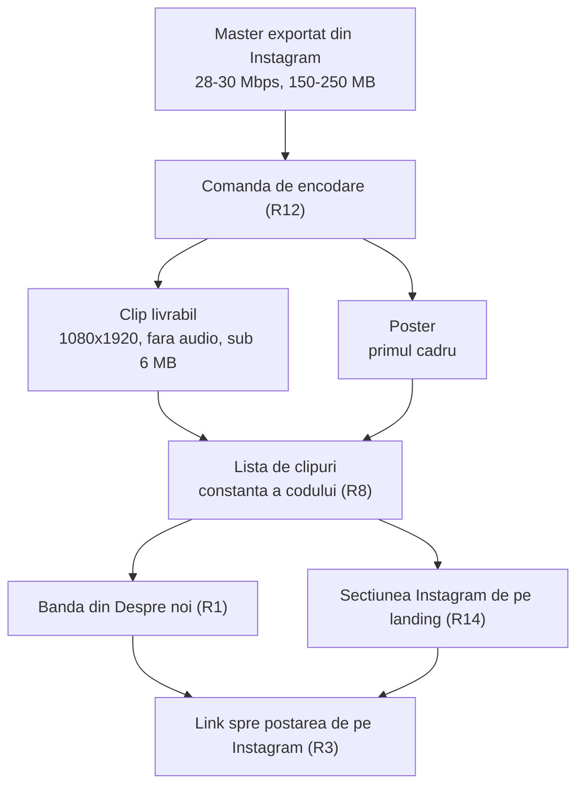
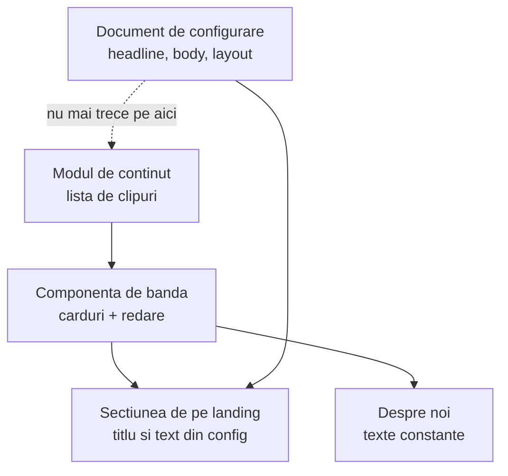
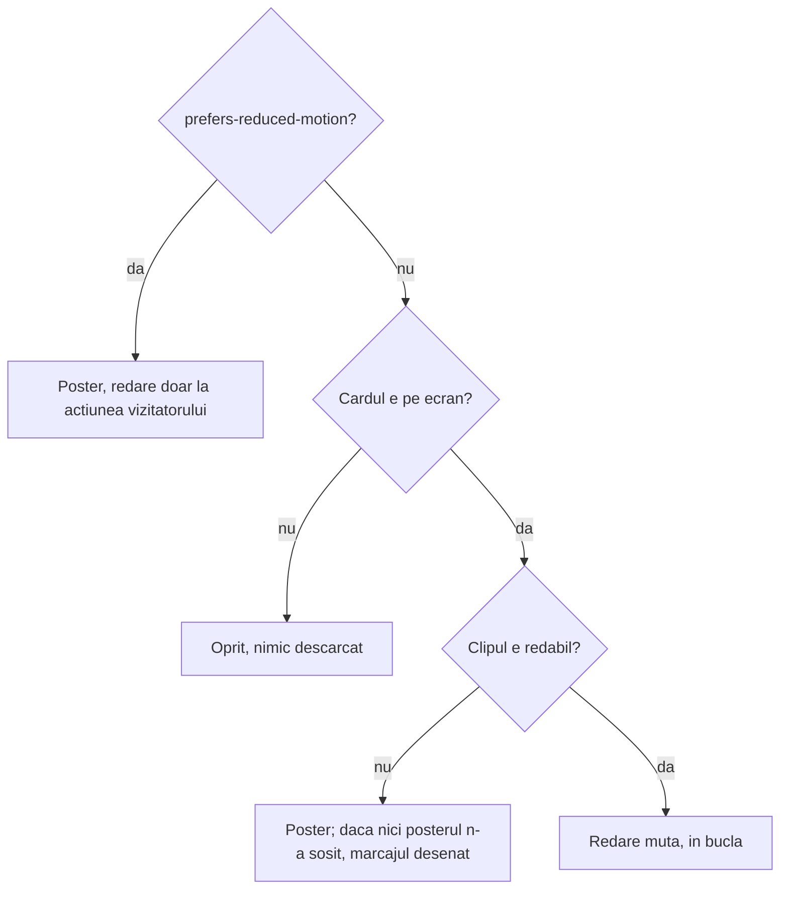

# Clipurile de antrenament, din fișiere proprii - Plan

## Goal Capsule

**Objective:** Cine deschide site-ul vede cum arată efectiv un antrenament, nu doar citește despre el. Clipurile filmate pe teren rulează în pagină, în limbajul vizual al site-ului, și trimit mai departe spre Instagram pentru cine vrea mai mult.

**Means:** Clipuri proprii, comprimate, servite de pe aceeași origine ca pagina, într-o bandă orizontală cu scroll-snap, alimentate dintr-o singură listă din cod (KTD1, KTD2).

**Authority hierarchy:** Cerințele (R-ID) bat pe comportament. KTD-urile bat pe mecanism. Unitățile nu bat nimic.

**Stop conditions:**
- Oprește-te dacă `/despre-noi` ajunge să facă vreun request către Supabase. E proprietatea păzită de `tests/despre-noi.spec.ts:103`, iar KTD4 e singura garanție mecanică pentru ea.
- Oprește-te dacă un clip livrat depășește pragul din R9. Peste el, secțiunea costă mai mult decât hero-ul aceleiași pagini.
- Oprește-te înainte de orice migrare care atinge schema `public`. Aparține gym-app și botului de Telegram (`MIGRATIONS.md`).
- Oprește-te dacă `npm run verify` pică dintr-un motiv care nu e numit în U6.

**Execution profile:** U1 și U2 sunt independente și pot merge în paralel. U3 le consumă pe amândouă. U4 și U5 sunt independente între ele și vin după U3. U6 vine după U5, fiindcă abia atunci nimeni nu mai citește lista din config. U7 e coada și are nevoie doar de U1 și U2.

---

## Product Contract

### Summary

`/despre-noi` capătă o secțiune cu clipurile de antrenament: carduri portret pe o bandă orizontală, care pornesc singure, fără sunet, în buclă, cât timp sunt pe ecran. Fiecare card duce spre postarea reală de pe Instagram. Fișierele sunt ale noastre, în repo, pregătite cu o singură comandă. Secțiunea „Instagram" de pe landing trece pe aceeași listă și pe aceeași redare, iar mecanismul de embed-uri și editarea clipurilor din admin ies din uz.

### Problem Frame

Pagina „Despre noi" descrie antrenamentul în trei paragrafe și trei etape, dar nu-l arată. Singura imagine în mișcare de pe ea e clipul FPV din hero, care e atmosferă, nu antrenament. Cine ezită să vină la primul antrenament ezită exact pentru că nu știe cum arată.

Mecanismul pentru clipuri există deja pe landing din august: `ReelsSection` citește `reels.items` din documentul de configurare, iar adminul are un panou care primește un link de Instagram, îl parsează și reordonează lista. În documentul publicat din Supabase, `reels.items` e gol — la fel în toate versiunile anterioare și în instantaneul de build. Secțiunea returnează `null` pe listă goală, deci pe site nu s-a văzut niciodată.

Ce a rămas nefăcut nu e editarea listei, ci producerea clipului. Masterele sunt la 28-30 Mbps, adică 150-250 MB bucata — un fișier pe care nicio pagină nu-l poate servi și pe care nimeni nu-l transformă manual de fiecare dată.

### Key Decisions

- KD1. **Fișiere proprii în repo, nu storage extern.** (session-settled: user-directed — ales în locul Supabase Storage, Cloudflare R2 și embed-urilor Instagram: proiectul n-are niciun bucket de storage, iar egress-ul Supabase e partajat cu gym-app și botul de Telegram.) Governs R7, R8, R9.
- KD2. **Bandă orizontală cu scroll-snap**, nu bandă în derivă și nici carusel cu focus. (session-settled: user-directed, după o probă vizuală — legenda și linkul per clip au unde să stea, iar gestul e același ca pe landing.) Governs R1, R6.
- KD3. **Fără panou de admin pentru clipuri.** (session-settled: user-directed — ales în locul unui tabel + RPC + tab după modelul `weekly_workout`: clipurile se schimbă de câteva ori pe an, iar fișierul tot printr-un commit intră.) Governs R8, R15.
- KD4. **Secțiunea stă imediat după „Cum arată un antrenament".** Acea secțiune descrie antrenamentul în cuvinte; clipurile îl arată. Governs R1.
- KD5. **`/despre-noi` rămâne fără niciun request către Supabase.** Governs R8.
- KD6. **O singură sursă pentru ambele secțiuni.** (session-settled: user-directed — ales în locul lăsării landing-ului pe embed-uri: două mecanisme pentru „clipurile noastre" ar fi divergat, iar unul singur ar fi avut vreodată conținut.) Governs R14, R15.

### Requirements

**Secțiunea în pagină**

- R1. `/despre-noi` capătă o secțiune nouă cu clipurile de antrenament, imediat după „Cum arată un antrenament", construită ca bandă orizontală cu scroll-snap peste carduri portret 9:16.
- R2. Un clip pornește singur, fără sunet, în buclă, doar cât timp cardul lui e pe ecran, și se oprește când iese.
- R3. Sub fiecare card stau o legendă scurtă și un link către postarea reală de pe Instagram.
- R4. Până când clipul e redabil, cardul arată poster-ul lui, iar până sosește poster-ul arată un marcaj desenat, în limbajul cifrei-fantomă folosit deja în pagină. Nu există stare în care cardul e o casetă goală.
- R5. La `prefers-reduced-motion: reduce` niciun clip nu pornește singur; cardul rămâne pe poster și pornește doar la acțiunea vizitatorului.
- R6. Pe mobil banda rămâne un singur rând, cu cardul la aproximativ 72vw și fără decalajul vertical dintre carduri.
- R7. Secțiunea nu cere nimic de la Instagram la încărcare: fișierele video, posterele și textele vin de pe aceeași origine ca pagina.

**Sursa și greutatea clipurilor**

- R8. Lista de clipuri — fișier, poster, legendă, link, ordine — e o constantă a codului, în același limbaj cu `POVESTE`, `VALORI` și `ETAPE`.
- R9. Un clip livrat are cel mult 6 MB: 1080×1920, fără pistă audio, buclă de 10-15 secunde, cu metadatele așezate la începutul fișierului ca redarea să pornească înainte de descărcarea completă.
- R10. Nimic nu se descarcă înainte ca un card să se apropie de ecran.
- R11. Secțiunea dispare complet când lista e goală, fără să lase un număr de secțiune nefolosit în pagină.

**Pregătirea clipurilor**

- R12. Repo-ul capătă o comandă care primește un master exportat din Instagram și produce clipul comprimat și poster-ul lui, la setările din R9, direct în locul de unde le citește pagina.
- R13. Comanda semnalează vizibil când rezultatul depășește pragul din R9, în loc să-l scrie tăcut.

**Secțiunea de pe landing**

- R14. Secțiunea „Instagram" de pe landing citește aceeași listă ca „Despre noi" și redă clipurile la fel. Comportamentul din R2, R4, R5, R7 și R10 se aplică identic.
- R15. Nimic nu mai citește clipurile din documentul de configurare al ediției, iar adminul nu mai oferă editarea lor. Titlul și textul secțiunii rămân editabile.

### Acceptance Examples

- AE1. Pornire la intrarea în ecran
  - **Covers R2.**
  - **Given:** vizitatorul derulează pagina spre secțiune.
  - **When:** primul card intră în ecran.
  - **Then:** clipul pornește fără sunet și se reia în buclă; când cardul iese din ecran, se oprește.
- AE2. Conexiune lentă
  - **Covers R4, R10.**
  - **Given:** o conexiune pe care fișierul nu sosește imediat.
  - **When:** cardul ajunge pe ecran.
  - **Then:** se vede poster-ul clipului, nu o casetă goală, iar descărcarea a început abia acum.
- AE3. Mișcare redusă
  - **Covers R5.**
  - **Given:** sistem configurat cu „reduce motion".
  - **When:** secțiunea intră în ecran.
  - **Then:** niciun clip nu pornește singur; toate cardurile rămân pe poster.
- AE4. Listă goală
  - **Covers R11.**
  - **Given:** lista de clipuri e goală.
  - **When:** pagina se randează.
  - **Then:** secțiunea lipsește din pagină, iar numerotarea secțiunilor rămâne continuă.
- AE5. Instagram blocat
  - **Covers R7, R14.**
  - **Given:** o extensie sau o rețea care blochează `instagram.com`.
  - **When:** vizitatorul ajunge pe oricare dintre cele două secțiuni.
  - **Then:** clipurile rulează normal; doar linkul spre postare nu duce nicăieri.
- AE6. Document de ediție vechi
  - **Covers R15.**
  - **Given:** un document publicat care încă poartă `reels.items`.
  - **When:** pagina îl citește.
  - **Then:** documentul se parsează fără eroare, clipurile vin din listă, iar cele din document sunt ignorate.

### Success Criteria

- Prima vedere a secțiunii transferă doar clipurile aflate pe ecran — 2-3 pe desktop, 1-2 pe mobil — iar totalul lor rămâne sub 10 MB, comparabil cu clipul din hero-ul aceleiași pagini. Pragul per clip din R9 e un plafon, nu o țintă: la CRF-ul din KTD7 o buclă de 12 secunde iese în jur de 2-4 MB.
- Drumul de la un master proaspăt exportat până la clipul vizibil în ambele pagini e o comandă plus un commit.
- `/despre-noi` continuă să se încarce fără niciun request către Supabase.
- După livrare există un singur loc în care se schimbă clipurile, nu două.

### Scope Boundaries

- Fără panou de admin pentru clipuri, nici nou, nici păstrat. Fără tabel propriu și fără RPC.
- Fără migrare care să scoată cheia `reels` din documentul de configurare. Cheia poate rămâne nefolosită; ce dispare e codul care o citește și partea de panou care o scria (R15).
- Fără Supabase Storage, fără Cloudflare R2, fără modificări de CSP.
- Fără Instagram Graph API și fără widget terț de feed.
- Fără sunet. Clipurile sunt mute prin construcție, nu doar pornite mute.
- Ordinea și numerotarea celorlalte secțiuni ale landing-ului rămân cum sunt.

### Dependencies / Assumptions

- `ffmpeg` local, prezent (8.1.2). Build-ul instalat prin Homebrew n-are filtrul `drawtext`; R12 nu are nevoie de el.
- Masterele pot fi exportate din Instagram sau recuperate de pe telefon.
- Se presupun 4-6 clipuri la lansare. Numărul nu e o cerință; banda funcționează la orice număr.
- CSP-ul actual permite tot ce cere planul: `default-src 'self'` acoperă fișierele video servite de pe aceeași origine, iar `img-src 'self' data:` acoperă posterele.

### Sources / Research

- `src/components/landing/ReelsSection.tsx` — mecanismul existent: façade, un singur iframe montat odată, link de rezervă spre Instagram.
- `src/edition3.css:479-684` — tot vocabularul `.e3-reels*`, inclusiv punctele de rupere și tratamentul pentru mișcare redusă.
- `src/components/Landing.tsx:145-157` — secțiunile se randează din `layout`, cu numerotarea calculată acolo.
- `src/main.tsx:76` și `tests/despre-noi.spec.ts:103` — proprietatea „fără request către Supabase" a paginii.
- `src/lib/media.ts` și `public/fpv.mp4` — precedentul de video propriu servit din `public/`, cu encode separat pentru mobil.
- `scripts/write-version.ts` — forma unui script de repo rulat prin `tsx`.
- `vercel.json` — CSP-ul care exclude scriptul oficial Instagram și imaginile de pe CDN-ul lor.
- `runlift.event_config_validate` în baza de date — tratează `reels` și `reels.items` ca opționale, deci U6 nu are nevoie de migrare.
- `docs/plans/2026-08-27-sectiune-instagram-si-panou-coming-soon.md` — planul care a produs secțiunea de pe landing.

---

## Planning Contract

**Product Contract preservation:** changed: R15 — panoul de admin păstrează titlul și textul secțiunii; doar lista de clipuri iese din document. Restul Product Contract-ului e neschimbat.

### Key Technical Decisions

- KTD1. **Clipurile stau sub `public/`, servite de Vercel.** Fără bucket, fără CSP nou, fără credențiale. (session-settled: user-directed — ales în locul Supabase Storage și Cloudflare R2: egress-ul Supabase e partajat cu alte două aplicații, iar R2 ar fi un serviciu în plus pentru clipuri care se schimbă de câteva ori pe an.) Instantiază KD1; governs R7, R8, R9.
- KTD2. **O componentă de bandă, două pagini.** Banda primește lista și textele ca props și nu știe de unde vin, deci `/despre-noi` o poate folosi fără context de configurare. Instantiază KD6; governs R1, R14.
- KTD3. **Redarea e `<video muted loop playsinline preload="none">` plus `IntersectionObserver`, nu `autoplay`.** `autoplay` ar porni clipuri aflate în afara ecranului și ar descărca tot; `preload="none"` plus pornirea la intersecție e ce face R10 adevărat, iar `muted` e ce face pornirea automată legală în toate browserele. Governs R2, R10.
- KTD4. **Lista trăiește în `src/content/`, fără niciun import din `src/lib/supabase.ts` sau din hook-ul de configurare.** E singura garanție mecanică pentru KD5, și e verificată printr-un test care citește sursa modulului. Governs R8.
- KTD5. **`reels.headline` și `reels.body` rămân în documentul de configurare; doar `items` iese.** Documentele publicate rămân valide fără migrare, fiindcă validatorul din baza de date tratează ambele chei ca opționale. Governs R15.
- KTD6. **Ștergerea codului rămas fără consumator e parte din U6, nu curățenie ulterioară.** `npm run verify` rulează `knip`, deci un export orfan oprește lanțul. Governs R15.
- KTD7. **Encodarea țintește o calitate (CRF), nu un bitrate.** Un CRF fix dă fișiere mici pe cadre statice și fișiere mai mari acolo unde e mișcare, ceea ce e exact profilul unui clip de antrenament. Governs R9, R12.

### High-Level Technical Design

Trei componente, o direcție. Modulul de conținut e singura sursă; banda e singurul randator; cele două pagini o compun diferit doar prin textele din jur.

Starea unui card e decisă de trei intrări, în ordinea asta. Implementatorul nu are voie să scurtcircuiteze prima.

### Assumptions

- Banda existentă de pe landing își păstrează vocabularul CSS. Se schimbă ce ține de façade (`.e3-reel--live`, `.e3-reel-frame`), nu grila, punctele de rupere sau tratamentul pentru mișcare redusă.
- `data-reveal` rămâne pe bandă, nu pe card. `useScrollReveal` pune `opacity: 0` pe fiecare element observat, iar cardurile tăiate orizontal nu intersectează niciodată viewport-ul.

### Sequencing

U1 și U2 pot merge în paralel. U3 are nevoie de amândouă. U4 și U5 sunt independente între ele și vin după U3. U6 vine după U5. U7 are nevoie doar de U1 și U2, dar se livrează ultimul, ca restul să fie verificat pe o listă de probă.

### Risks & Dependencies

- Greutatea repo-ului crește cu aproximativ 30 MB, permanent. Git nu uită; e cea mai puțin reversibilă parte a planului.
- iOS în modul economie de energie blochează pornirea automată chiar și pentru clipuri mute. Pagina rămâne corectă — R4 acoperă cazul — dar arată altfel decât pe desktop. Merită verificat pe un telefon real, nu doar în emulator.
- Două sau trei carduri pot fi vizibile simultan pe desktop, deci se decodează simultan. Dacă banda devine grea pe telefoane slabe, limita e numărul de clipuri redate odată, nu dimensiunea fișierului.
- U6 atinge șapte fișiere de test cu aproape 100 de referințe la clipuri împreună. E unitatea cu cea mai mare șansă să spargă lanțul de verificare.
- `npm run verify` rulează acoperirea cu praguri fixate (`vitest.config.ts`). Ramurile noi ale benzii plus ștergerea unor ajutoare de admin bine acoperite pot muta procentele sub prag. Nu e previzibil fără o rulare.
- **`Permissions-Policy: autoplay=()` din `vercel.json` e singurul risc care nu poate fi prins de nicio poartă locală.** `vite preview` nu servește headerele din `vercel.json`, deci suita Playwright nu le vede niciodată. Dovada contrară e puternică — hero-ul aceleiași pagini rulează azi cu `autoPlay muted` sub același header — dar comportamentul se confirmă pe preview-ul deployat, nu local.

---

## Implementation Units

### U1. Comanda de encodare

- **Goal:** o comandă duce un master la clipul și poster-ul livrabile.
- **Requirements:** R9, R12, R13.
- **Files:** `scripts/encode-reel.ts` (nou), `package.json`.
- **Approach:** același tipar ca `scripts/write-version.ts` — TypeScript rulat prin `tsx`, adăugat ca script npm. Construcția argumentelor `ffmpeg` stă într-o funcție pură exportată, ca testele să n-aibă nevoie de `ffmpeg`. Scriptul măsoară fișierul rezultat și întoarce un verdict față de pragul din R9. Per KTD7, calitatea se dă prin CRF.
- **Test Scenarios** (`tests/unit/encodeReel.test.ts`):
  - argumentele conțin scalarea la 1080×1920, scoaterea pistei audio, CRF-ul și așezarea metadatelor la început
  - durata implicită e cea a buclei din R9; o durată dată explicit o înlocuiește
  - numele fișierelor de ieșire derivă din slug-ul dat, nu din numele masterului
  - un master care nu există produce o eroare numită, înainte de a porni `ffmpeg`
  - verdictul pentru un fișier peste prag e „prea mare"; pentru unul sub prag, „în regulă"
  - un slug cu caractere neașteptate e respins, ca să nu compună o cale în afara directorului de clipuri
- **Verification:** `npm run test`, apoi o rulare reală pe un master și inspecția vizuală a clipului rezultat.

### U2. Modulul cu lista de clipuri

- **Goal:** o listă pe care ambele pagini o citesc fără backend.
- **Requirements:** R3, R7, R8.
- **Files:** `src/content/reels.ts` (nou).
- **Approach:** o constantă exportată plus tipul ei, în același loc cu celelalte constante de build. Fiecare intrare poartă fișierul video, poster-ul, legenda și adresa postării. Per KTD4, modulul nu importă nimic din stratul de backend.
- **Test Scenarios** (`tests/unit/reelsContent.test.ts`):
  - fiecare intrare are cale de video și de poster care încep cu `/`
  - nicio legendă nu e goală
  - fiecare link duce către `instagram.com`
  - niciun fișier video nu apare de două ori
  - sursa modulului nu conține niciun import din `lib/supabase` sau din hook-ul de configurare
  - lista goală e o stare validă și tipul o permite
- **Verification:** `npm run test` și `npm run typecheck`.

### U3. Banda și cardul, pe video local

- **Goal:** o bandă reutilizabilă care redă clipuri locale după regulile din diagrama de stare.
- **Requirements:** R1, R2, R3, R4, R5, R6, R10.
- **Files:** `src/components/landing/ReelsRail.tsx` (nou), `src/components/landing/ReelsSection.tsx`, `src/edition3.css`.
- **Approach:** banda primește lista și textele ca props (KTD2). Cardul devine un element video configurat per KTD3, cu poster și marcaj desenat ca stări de rezervă. Un `IntersectionObserver` pornește și oprește redarea; la mișcare redusă nu pornește nimic. Din CSS se scot regulile de façade (`.e3-reel--live`, `.e3-reel-frame`); grila, punctele de rupere și blocul pentru mișcare redusă rămân.
- **Poster-ul rămâne un `` sub video, nu atributul `poster`.** Atributul n-are echivalent de încărcare leneșă: l-ar cere pe toate la randare, iar `preload="none"` oprește doar octeții clipului. Tiparul există deja în `ReelsSection`.
- **Afordanța la mișcare redusă:** butonul `.e3-reel-play` din CSS-ul existent rămâne și devine un buton real de pornire, focalizabil de la tastatură. Fără el, R5 cere o acțiune a vizitatorului pe un element care n-are niciun control.
- **Accesibilitate:** elementul video primește `aria-hidden="true"`, în același limbaj cu `alt=""` de pe poster-ul de azi. Legenda și linkul de sub card sunt ce citește un cititor de ecran.
- **Note de mediu:** jsdom n-are nici `IntersectionObserver`, nici `HTMLMediaElement.prototype.play`. Ambele se pun ca stub, după tiparul din `tests/unit/sectionLayout.test.tsx`.
- **Test Scenarios** (`tests/unit/reelsRail.test.tsx`):
  - randează un card per clip, fiecare cu poster-ul lui ca ``
  - fiecare video are `preload="none"`, `muted`, `loop`, `playsinline` și `aria-hidden`
  - o listă goală nu randează nimic
  - la intrarea în ecran, `play()` e chemat pe cardul intrat; la ieșire, `pause()`
  - cu mișcare redusă activă, niciun clip nu pornește la intrarea în ecran, iar butonul de pornire e prezent și îl pornește la click
  - legenda și linkul apar sub card, nu suprapuse peste imagine
  - un clip fără poster cade pe marcajul desenat, nu pe o casetă goală
- **Verification:** `npm run test`, plus o verificare vizuală în `npm run dev` pe desktop și pe lățime de telefon.

### U4. Secțiunea pe „Despre noi"

- **Goal:** pagina „Despre noi" arată clipurile, fără să capete un backend.
- **Requirements:** R1, R7, R11.
- **Files:** `src/components/DespreNoi.tsx`, `tests/despre-noi.spec.ts`.
- **Approach:** secțiune nouă după „Cum arată un antrenament" (KD4), cu titlul și textul ca alte constante locale ale paginii. Numerele de secțiune ale paginii sunt azi litere fixe („01"…„05"), deci inserarea uneia condiționate între 03 și 04 n-ar putea să se repare singură și lista goală ar lăsa 01, 02, 03, 05, 06. Numerele se derivă din poziția într-o listă filtrată, după tiparul din `Landing.tsx`.
- **Test Scenarios** (`tests/despre-noi.spec.ts`):
  - lista titlurilor de secțiune include noul titlu, în poziția de după „Cum arată un antrenament"
  - testul existent „nu face requesturi către Supabase la încărcare" rămâne verde
  - la încărcare nu pleacă niciun request către `instagram.com`
  - fiecare card are un link vizibil spre postare
  - numerotarea afișată a secțiunilor e continuă
- **Verification:** `npm run test:e2e:preview`.

### U5. Landing-ul pe aceeași sursă

- **Goal:** secțiunea de pe landing redă aceleași clipuri, la fel.
- **Requirements:** R7, R14.
- **Files:** `src/components/landing/ReelsSection.tsx`, `src/components/Landing.tsx`, `tests/reels.spec.ts`.
- **Approach:** secțiunea compune banda din U3, cu clipurile din modulul U2 și cu titlul și textul din documentul de configurare (KTD5). `Landing.tsx` se schimbă: filtrul care decide ce secțiuni se randează testează azi lungimea listei din config, iar acea expresie dispare în U6. Trece pe lungimea listei din modulul U2. Filtrul rămâne acolo, nu se mută în componentă — numerotarea se derivă din poziția în lista filtrată, deci o secțiune care s-ar randa goală ar lăsa un număr sărit.
- **Test Scenarios** (`tests/reels.spec.ts`):
  - zero cereri către `instagram.com` pe toată durata vizitei, nu doar până la primul click — testul existent se strânge de la „până la click" la „niciodată"
  - secțiunea afișează titlul venit din configul mock-uit
  - `visible: false` în `layout` ascunde secțiunea
  - cele trei teste construite pe façade („clicul montează iframe-ul", „un singur iframe montat odată", „fiecare card poartă linkul canonic") se rescriu sau se șterg, împreună cu ajutorul care le construia `items`
  - garda pentru lista goală nu mai poate trăi aici, fiindcă Playwright nu poate mock-ui un modul; se mută în `tests/unit/sectionLayout.test.tsx` (U6)
- **Verification:** `npm run build && npm run test:e2e:preview`.

### U6. Curățenia configului și a adminului

- **Goal:** nimic nu mai citește sau scrie clipuri în documentul de ediție.
- **Requirements:** R15.
- **Files:** `src/content/eventConfig.ts`, `src/content/edition.ts`, `src/admin/eventConfigForm.ts`, `src/admin/eventTab/diferente.ts`, `src/admin/eventTab/grupuri/GrupInstagram.tsx`, `src/admin/AdminEventTab.tsx`, `GHID-EDITIE-NOUA.md`, `docs/FLUXURI.md`, `tests/unit/eventConfig.test.ts`, `tests/unit/eventConfigForm.test.ts`, `tests/unit/adminEventTab.test.tsx`, `tests/unit/sectionLayout.test.tsx`, `tests/unit/diferente.test.ts`, `tests/unit/nesalvat.test.ts`.
- **Approach:** forma configului păstrează titlul și textul secțiunii și pierde lista (KTD5). Se șterg tipul intrării de clip, plafonul de intrări, parsarea linkurilor de Instagram și cele patru funcții de listă. Panoul de admin rămâne cu două câmpuri de text. Documentele vechi se parsează în continuare; cheia rămasă e ignorată.
- **Execution note:** rulează `npm run deadcode` după fiecare ștergere, nu doar la final. Lanțul de verificare îl conține (KTD6), iar un export rămas fără consumator oprește build-ul.
- **Test Scenarios:**
  - un document care încă poartă lista de clipuri se parsează fără eroare, iar lista lui nu ajunge în pagină
  - un document fără cheia secțiunii primește titlul și textul implicite
  - panoul de admin randează cele două câmpuri de text și niciun rând de clip
  - salvarea ciornei nu mai trimite lista, iar validarea din baza de date o acceptă
  - `knip` nu raportează exporturi orfane
- **Verification:** `npm run deadcode`, `npm run test`, `npm run typecheck:tests`.

### U7. Clipurile reale

- **Goal:** secțiunea are conținut, nu doar mecanism.
- **Requirements:** R7, R9.
- **Files:** `public/reels/` (nou), `src/content/reels.ts`.
- **Approach:** 4-6 mastere trecute prin comanda din U1, cu legendele și linkurile lor adăugate în listă. Fiecare fișier se verifică față de pragul din R9 înainte de commit.
- **Test expectation:** none — unitatea aduce conținut, nu comportament. Comportamentul e acoperit de U3, U4 și U5.
- **Până aici lista e goală, deliberat.** Nu se commit-ează clipuri de probă: ar fi conținut fals într-un repo de producție. Cât timp lista e goală, e2e-ul păzește contractul listei goale (secțiunea lipsește, numerotarea rămâne continuă), iar comportamentul de redare e acoperit unitar în U3 cu stub-uri. Scenariile e2e pe listă plină se activează odată cu unitatea asta.
- **Verification:** fiecare clip sub pragul din R9; `npm run verify`; o încărcare reală a paginii cu rețeaua limitată, ca să se vadă că transferul rămâne sub ținta din Success Criteria.

---

## Verification Contract

| Poartă | Comandă | Se aplică la |
|---|---|---|
| Lint | `npm run lint` | toate |
| Cod mort | `npm run deadcode` | U6 în special, apoi toate |
| Tipuri | `npm run typecheck` și `npm run typecheck:tests` | toate |
| Unitare | `npm run test` | U1, U2, U3, U6 |
| End-to-end | `npm run build && npm run test:e2e:preview` | U4, U5, U7 |
| Lanțul complet | `npm run verify` | înainte de PR |

Două verificări nu sunt acoperite de comenzi și se fac de mână: redarea pe un iPhone real, inclusiv în modul economie de energie (Risks), și mărimea transferului la o vizită obișnuită pe „Despre noi", față de ținta din Success Criteria.

## Definition of Done

- Toate cerințele de la R1 la R15 sunt adevărate pe site, nu doar în teste.
- `npm run verify` trece.
- `/despre-noi` nu face niciun request către Supabase, iar niciuna dintre cele două secțiuni nu cere nimic de la `instagram.com` la încărcare.
- Fiecare clip livrat e sub pragul din R9.
- Nu mai există cod care citește sau scrie clipuri în documentul de ediție, iar `knip` e curat.
- Codul rămas din încercări abandonate e șters, nu lăsat în diff — mai ales regulile CSS de façade și funcțiile de listă din admin.
- Redarea e verificată pe un telefon real, nu doar la lățime de telefon în browser.
