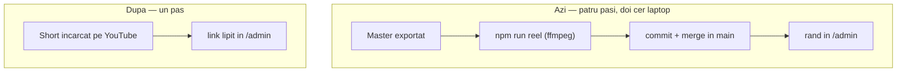
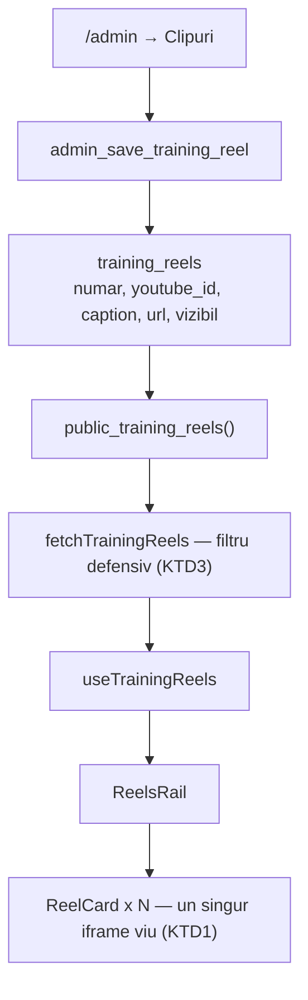
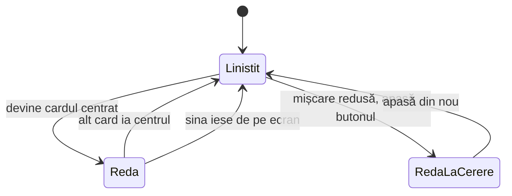

# Clipuri de antrenament găzduite pe YouTube - Plan

## Goal Capsule

- **Obiectiv:** Un clip nou ajunge pe site lipind un link în `/admin`, de pe telefon, fără fișier, fără encodare și fără deploy.
- **Mijloc:** Clipurile se găzduiesc pe YouTube și se redau printr-un `iframe` montat și demontat de pagină (KTD1, KTD4).
- **Autoritate de produs:** Acest plan deține banda cu clipuri de pe landing și de pe `/despre-noi`, plus tabul `/admin → Clipuri`. Restul adminului nu e în scop.
- **Profil de execuție:** Opt unități, în ordinea din secțiune. U1 e o migrare aplicată manual în producție; restul sunt schimbări de cod într-un singur PR.
- **Condiții de oprire:** Oprește-te și întreabă dacă migrarea din U1 cere pierderea unor rânduri existente (nu ar trebui — banda e goală), sau dacă antetele din U6 nu pot fi verificate în producție.
- **Coada:** `ce-work` duce până la PR deschis. Aplicarea migrării în Supabase și încărcarea Shorts-urilor rămân la organizator.
- **Blocante deschise:** Niciunul.

**Product Contract preservation:** Product Contract unchanged. Planificarea n-a schimbat niciun R, A, F sau AE.

---

## Product Contract

### Summary

Adăugarea unui clip devine un singur pas de administrare: încarci Short-ul pe YouTube, lipești linkul în `/admin → Clipuri`, gata. Banda se transformă dintr-o bandă în care pornesc toate cardurile într-un carusel în care redă doar cardul focalizat. Ordinea, legendele și vizibilitatea rămân exact cum sunt azi.

### Problem Frame

Banda cu clipuri există de la sfârșitul lui august și n-a avut niciodată conținut. Prima versiune cerea un singur lucru — un link de Instagram lipit în admin — și a stat nefolosită o lună. A doua versiune, livrată pe 21 septembrie, cere patru pași: exportul masterului, `npm run reel` pe o mașină cu `ffmpeg`, un commit în `main` și abia apoi rândul din admin. `public/reels/` nu există încă; n-a fost rulată nicio dată.

Doi dintre cei patru pași cer un laptop cu un checkout al proiectului. Asta scoate complet din discuție momentul în care apare clipul — după un antrenament, de pe telefon — și îl mută într-o sesiune separată, la birou, care nu se întâmplă. Costul nu e mărimea efortului, ci locul unde trebuie să fii ca să-l faci.

### Actors

- A1. Organizatorul — filmează, încarcă pe YouTube, administrează banda din `/admin`.
- A2. Vizitatorul — deschide landing-ul sau `/despre-noi` și derulează banda.

### Key Decisions

- KD1. **Gazda e YouTube, cu Shorts nelistate.** (session-settled: user-directed — ales în locul Vimeo (~12 $/lună) și al embed-urilor Instagram: e gratuit, iar dintre gazdele gratuite e singura care poate porni un clip mut, în buclă, de la sine.) Governs R1, R2, R5.
- KD2. **Redă doar cardul focalizat, un singur player la un moment dat.** (session-settled: user-directed — ales în locul redării simultane a tuturor cardurilor, după o schiță în care cinci playere au coborât pagina la ~37 fps.) Governs R5, R6.
- KD3. **Conducta de fișiere proprii se scoate, nu se păstrează ca a doua sursă.** (session-settled: user-approved — două surse pentru aceeași bandă ar diverge, iar niciuna n-a apucat să aibă conținut.) Governs R11.
- KD4. **Legătura de sub card rămâne spre postarea de pe Instagram.** Un Short nelistat n-are unde să trimită pe cineva; publicul e pe Instagram, iar YouTube e doar gazda fișierului. Governs R10.

### Requirements

**Administrare**

- R1. Un clip se adaugă lipind un link YouTube în `/admin → Clipuri`. Nu se produce niciun fișier și nu e nevoie de deploy.
- R2. Linkul se acceptă în oricare dintre formele pe care le dă YouTube la „Copiază linkul" și se normalizează la identificatorul clipului.
- R3. Legenda rămâne obligatorie: elementul de redare e ascuns din arborele de accesibilitate, deci legenda e tot ce primește cineva care folosește un cititor de ecran.
- R4. Ordinea, vizibilitatea și editarea legendei rămân cum sunt azi — efect imediat, fără deploy.

**Redarea în pagină**

- R5. Banda e un carusel: clipul din cardul focalizat rulează în buclă, fără sunet.
- R6. Un singur clip rulează la un moment dat; cardurile nefocalizate nu țin un player viu.
- R7. La deschiderea paginii nu se descarcă nimic pentru bandă; playerul se încarcă abia când banda se apropie de ecran.
- R8. La `prefers-reduced-motion` nimic nu pornește singur, iar cine vrea clipul are un buton care comută pornire/oprire.
- R9. Cardul nefocalizat are o înfățișare desenată de noi. YouTube nu oferă un poster vertical utilizabil, deci cardul liniștit nu preia o imagine de la gazdă.

**Ce se schimbă în jur**

- R10. Legătura de sub card duce spre postarea de pe Instagram, nu spre clipul de pe YouTube.
- R11. Conducta de encodare locală iese din uz: comanda, directorul de clipuri și câmpurile de cale din admin dispar.
- R12. Garda care păzește absența cererilor terțe se mută pe noua graniță: pagina cere resurse de la gazda video, iar spre `instagram.com` rămâne la zero cereri.

### Key Flows

- F1. Organizatorul adaugă un clip
  - **Declanșator:** A1 tocmai a filmat la un antrenament.
  - **Pași:** Încarcă Short-ul pe YouTube ca nelistat; copiază linkul; îl lipește în `/admin → Clipuri` împreună cu legenda și linkul postării de pe Instagram; salvează.
  - **Rezultat:** Clipul apare în bandă imediat, pe ambele pagini, fără deploy.
  - **Acoperit de:** R1, R2, R3, R10.

- F2. Vizitatorul derulează banda
  - **Declanșator:** A2 ajunge cu banda pe ecran.
  - **Pași:** Playerul se încarcă pentru cardul focalizat și pornește mut, în buclă; la derulare laterală focalizarea trece pe cardul următor, iar playerul îl urmează.
  - **Rezultat:** Un singur clip rulează la un moment dat; restul cardurilor stau liniștite.
  - **Acoperit de:** R5, R6, R7, R9.

### Acceptance Examples

- AE1. Nimic la deschidere
  - **Covers R7.**
  - **Given:** landing-ul se deschide cu banda sub prima pagină de ecran.
  - **When:** pagina s-a așezat și vizitatorul n-a derulat.
  - **Then:** nu pleacă nicio cerere către gazda video.

- AE2. Focalizarea mută playerul
  - **Covers R5, R6.**
  - **Given:** banda e pe ecran, cu clipul din primul card pornit.
  - **When:** vizitatorul derulează banda lateral până la cardul al treilea.
  - **Then:** al treilea card redă, primul revine la starea liniștită, iar numărul de playere vii rămâne unu.

- AE3. Mișcare redusă
  - **Covers R8.**
  - **Given:** sistemul cere `prefers-reduced-motion`.
  - **When:** banda ajunge pe ecran.
  - **Then:** niciun clip nu pornește singur, iar butonul de pe card pornește și oprește la cerere.

- AE4. Link lipit în altă formă
  - **Covers R2.**
  - **Given:** organizatorul apasă „Copiază linkul" în aplicația YouTube.
  - **When:** lipește ce a primit, cu coada cu care vine.
  - **Then:** rândul se salvează, fără să i se ceară o formă anume a adresei.

- AE5. Legendă lipsă
  - **Covers R3.**
  - **Given:** un rând cu link valid și legenda goală.
  - **When:** organizatorul salvează.
  - **Then:** salvarea e refuzată, cu motivul scris pe ecran.

- AE6. Instagram rămâne la zero
  - **Covers R12.**
  - **Given:** landing-ul cu banda plină, derulat până la capăt.
  - **When:** vizitatorul stă pe pagină fără să apese nimic.
  - **Then:** nu pleacă nicio cerere către `instagram.com`; singurul lucru care duce acolo e legătura de sub card.

### Success Criteria

- Un clip filmat la antrenament ajunge pe site de pe telefon, în câteva minute, fără checkout și fără deploy.
- Banda are conținut. E singurul criteriu pe care cele două versiuni anterioare l-au ratat.

### Scope Boundaries

- Găzduire plătită (Vimeo și altele) — respinsă pentru costul lunar.
- Încărcarea fișierelor video din admin.
- Descărcarea și re-encodarea automată a unui clip dintr-un link lipit.
- Feed automat din Instagram sau YouTube. Lista rămâne aleasă manual, rând cu rând.

### Dependencies / Assumptions

- Un cont YouTube pe care se încarcă Shorts nelistate.
- CSP-ul din `vercel.json` nu admite azi gazda video; granița se lărgește exact cât trebuie.
- Constrângerile `CHECK` din `supabase/sql/supabase-migration-training-reels.sql` fixează azi forma `/reels/<nume>.mp4` pentru fișier și forma linkului de Instagram pentru adresă. Ambele se mută.
- `tests/reels.spec.ts` păzește azi absența oricărei cereri spre `instagram.com`. Testul rămâne valabil (R12), dar presupunerea lui — că pagina nu cere nimic de nicăieri din afară — nu mai e adevărată.
- Banda e goală în producție, deci nu există rânduri de migrat.
- KD4 e alegerea mea, nu una cântărită punctual în dialog. E ieftin de întors dacă legătura trebuie să ducă în altă parte.

### Outstanding Questions

**Deferred to Planning**

- Cont YouTube dedicat proiectului sau cel existent al organizatorului.
- Cum arată cardul liniștit din R9 — desen, nu decizie de produs.
- Unde se duce plafonul de mărime și comanda de encodare la scoatere (R11): ștergere completă sau păstrare în istoric.

### Sources / Research

- `docs/plans/2026-09-20-1955-feat-reels-despre-noi-plan.md` — planul care a produs conducta de fișiere proprii, cu decizia KTD1 pe care acest plan o întoarce.
- `src/components/landing/ReelsRail.tsx` — redarea de azi: `IntersectionObserver`, poster, `preload="none"`, garda de mișcare redusă.
- `src/admin/AdminClipuriTab.tsx` — ecranul de administrare și validările lui de formă.
- `scripts/encode-reel.ts` — comanda care iese din uz.
- `supabase/sql/supabase-migration-training-reels.sql` — tabelul și RPC-urile; constrângerile de formă.
- `tests/reels.spec.ts` — garda „nimic de la Instagram, niciodată".
- `vercel.json` — CSP-ul curent.
- [YouTube Embedded Players and Player Parameters](https://developers.google.com/youtube/player_parameters) — `autoplay`, `mute`, `loop` cu `playlist`, `playsinline`; `modestbranding` e depreciat.
- [About embedding background and Chromeless videos – Vimeo](https://help.vimeo.com/hc/en-us/articles/12426285089681-About-embedding-background-and-Chromeless-videos) — `background=1`, disponibil doar pe plan plătit; motivul pentru care Vimeo a picat.
- [Autoplay guide for media and Web Audio APIs – MDN](https://developer.mozilla.org/en-US/docs/Web/Media/Guides/Autoplay) — delegarea prin `allow="autoplay"` și relația cu `Permissions-Policy`; sursa presupunerii din U6.

---

## Planning Contract

### Key Technical Decisions

- KTD1. **`iframe` montat și demontat de pagină, nu API-ul de player YouTube.** (session-settled: user-approved — ales în locul lui `YT.Player` din `iframe_api`: API-ul cere un script terț, iar `tests/unit/deploy-config.test.ts` păzește `script-src` pe `'self'`.) Governs R5, R6, R7.
- KTD2. **Coloana `fisier` devine identificatorul YouTube; `poster` se șterge.** (session-settled: user-approved — ales în locul păstrării lui `poster` pentru o imagine încărcată manual: gazda nu oferă un poster vertical, iar cardul liniștit e desenat deja.) Governs R9, R11.
- KTD3. **O singură formă, patru validatoare, mutate împreună.** Forma clipului e scrisă azi în constrângerile `CHECK`, în harta de mesaje `mesajRefuzClip`, în expresiile din ecranul de admin și în filtrul defensiv din `fetchTrainingReels`. Oricare rămasă în urmă respinge tăcut un rând valid. Governs R1, R2.
- KTD4. **Cardul „focalizat" se alege din poziția de derulare, nu din focusul DOM.** `scroll-snap` pe șină face alegerea fără echivoc și lasă tastatura să ajungă normal la legătură și la buton. Governs R5, R6.
- KTD5. **Antetele se lărgesc minim și se retarghetează.** `frame-src` capătă gazda video; `Permissions-Policy` mută `fullscreen` de pe `instagram.com` și deschide `autoplay` pentru aceeași origine. Governs R12.
- KTD6. **Cardul liniștit refolosește marcajul desenat existent.** (session-settled: user-approved — ales în locul unui desen nou: `.e3-reel-fallback` randează deja numărul cardului când un clip n-are poster.) Governs R9.

### High-Level Technical Design

Direcția, nu semnăturile. Forma exactă rămâne la implementare.

Drumul datelor nu se schimbă; se schimbă ce curge prin el și ce randează capătul.

Starea unui card e ce se schimbă cel mai mult. Un singur card stă în „redă"; restul stau în „liniștit".

„Liniștit" înseamnă fără `iframe` în DOM — demontat, nu ascuns. Asta e ce ține numărul de playere la unu (R6).

### Assumptions

- `Permissions-Policy: autoplay=()` nu ar trebui să blocheze redarea mută, dar schița pe care s-a luat decizia a rulat pe `localhost`, unde antetul nu există. U6 tratează asta ca verificare în producție, nu ca fapt stabilit.
- Un Short șters sau trecut pe privat nu poate fi detectat din pagină fără API-ul de player (KTD1). Cardul rămâne, iar playerul afișează eroarea gazdei.
- Banda e goală în producție, deci U1 nu are rânduri de convertit.

### Risks & Dependencies

- Termenii YouTube cer ca butoanele și marca playerului să rămână vizibile, deci `controls=0` nu e o opțiune. Controalele se retrag singure după câteva secunde de redare neîntreruptă; cardul arată curat cât timp rulează, și branduit la interacțiune.
- Un player YouTube costă în jurul unui megaoctet. R6 — un singur player viu — e ce ține pagina în picioare; o regresie aici se vede ca pagină greoaie, nu ca eroare.
- Pagina capătă prima ei dependență terță la runtime. Dacă gazda e blocată în rețeaua cuiva, cardurile rămân în starea liniștită. Asta e o degradare acceptabilă, nu o cale de eroare.

### System-Wide Impact

`tests/reels.spec.ts` păzea proprietatea „pagina nu cere nimic din afară". Proprietatea se restrânge la `instagram.com` (R12) în loc să dispară, ca să nu pierdem garda odată cu premisa ei.

---

## Implementation Units

### U1. Migrarea tabelului și a RPC-urilor

- **Goal:** Tabelul ține un identificator YouTube în loc de o cale de fișier, iar RPC-urile îl trec mai departe.
- **Requirements:** R1, R2, R11. Instanțiază KTD2, KTD3.
- **Files:** `supabase/sql/supabase-migration-clipuri-youtube.sql` (nou), `supabase/schema/runlift.sql`, `tests/unit/sql/clipuri.test.ts` (nou), `tests/unit/sql/drepturi.test.ts`, `MIGRATIONS.md`.
- **Approach:** `fisier` → `youtube_id`, `poster` se șterge. Constrângerile `training_reels_fisier_ok` și `training_reels_poster_ok` se înlocuiesc cu una pe forma identificatorului; `training_reels_url_ok` rămâne neatinsă (R10). Indexul unic de pe `fisier` se mută pe coloana nouă. `admin_save_training_reel` pierde `p_poster` și primește identificatorul în locul căii. Instantaneul `supabase/schema/runlift.sql` se regenerează din baza reală după aplicarea migrării — nu se scrie de mână; testele SQL rulează peste el în PGlite, deci acoperă constrângerile noi.
- **Test Scenarios:** un identificator valid intră; unul cu caractere din afara alfabetului YouTube e respins de constrângere; un al doilea rând cu același identificator e respins de indexul unic; un link Instagram curat rămâne acceptat, iar unul cu coadă rămâne respins; `public_training_reels()` întoarce numai rândurile vizibile, în ordine; drepturile pe RPC-uri rămân cele din `drepturi.test.ts` după schimbarea semnăturii lui `admin_save_training_reel`.
- **Verification:** `npm run test`. Un instantaneu verde nu înseamnă bază migrată — aplicarea în Supabase se verifică separat și se consemnează în `MIGRATIONS.md`.

### U2. Stratul de date din aplicație

- **Goal:** Tipurile și filtrele din cod urmează forma nouă.
- **Requirements:** R1, R2. Instanțiază KTD3.
- **Files:** `src/lib/supabase.ts`, `src/lib/adminApi.ts`, `tests/unit/trainingReels.test.ts`, `tests/unit/trainingReelsApi.test.ts`, `tests/unit/useTrainingReels.test.tsx`.
- **Approach:** `Reel` pierde `poster` și schimbă `video` pe identificator. Filtrul defensiv din `fetchTrainingReels` nu mai verifică prefixul `/reels/`, ci forma identificatorului; garda pe `url` rămâne pe `instagram.com`. `AdminReelRow` și `saveTrainingReel` pierd `poster`. `mesajRefuzClip` își remapează mesajele pe numele noi ale constrângerilor.
- **Test Scenarios:** un rând valid trece; unul cu identificator stricat se sare fără să rupă lista; unul cu `url` care nu e Instagram se sare; lista goală rămâne o stare validă; fiecare nume de constrângere nou produce mesajul lui.
- **Verification:** `npm run test`.

### U3. Normalizarea linkului YouTube

- **Goal:** Orice formă pe care o dă „Copiază linkul" ajunge la același identificator.
- **Requirements:** R2.
- **Files:** `src/lib/youtube.ts` (nou), `tests/unit/youtube.test.ts` (nou).
- **Approach:** O funcție pură, în aceeași manieră ca `curataUrl` din ecranul de clipuri: primește text lipit, întoarce identificatorul sau șirul gol. Acoperă formele `youtube.com/shorts/<id>`, `youtu.be/<id>` și `watch?v=<id>`, cu parametri în coadă.
- **Test Scenarios:** cele trei forme, fiecare cu și fără coadă de parametri; un link de pe alt domeniu întoarce gol; text care nu e link întoarce gol; un identificator lipit singur e acceptat ca atare.
- **Verification:** `npm run test`.

### U4. Ecranul de administrare

- **Goal:** Organizatorul lipește un link și o legendă. Nu mai există câmpuri de cale.
- **Requirements:** R1, R2, R3, R4, R10. Instanțiază KTD3.
- **Files:** `src/admin/AdminClipuriTab.tsx`, `tests/unit/adminClipuriTab.test.tsx`.
- **Approach:** Câmpurile „calea clipului" și „calea posterului" devin un singur câmp de link YouTube, normalizat la lipire prin U3. Expresiile locale de validare urmează forma nouă. Legenda rămâne obligatorie (R3). Câmpul de link Instagram și `curataUrl` rămân neatinse. Reordonarea, vizibilitatea și garda de ieșire din tab rămân cum sunt.
- **Test Scenarios:** un link lipit în oricare formă se salvează; un link de pe alt domeniu e refuzat înainte de server; legenda goală e refuzată; un editor atins oprește schimbarea de tab; reordonarea și comutatorul de vizibilitate rămân cu efect imediat.
- **Verification:** `npm run test`.

### U5. Caruselul

- **Goal:** Cardul centrat redă mut, în buclă; restul stau liniștite.
- **Requirements:** R5, R6, R7, R8, R9. Instanțiază KTD1, KTD4, KTD6.
- **Files:** `src/components/landing/ReelsRail.tsx`, `src/edition3.css`, `tests/unit/reelsRail.test.tsx`.
- **Approach:** `<video>` iese; în locul lui, un `iframe` montat doar pe cardul centrat, cu `allow="autoplay"` și parametrii de redare mută în buclă. Cardul liniștit randează `.e3-reel-fallback` (KTD6). Alegerea centrului se face la derularea șinei și la intersecția șinei cu ecranul; când șina iese de pe ecran, se demontează tot. `scroll-snap-type: x mandatory` pe `.e3-reels-rail`, `scroll-snap-align: center` pe card. Regulile CSS pentru `.e3-reel-video` și `.e3-reel-poster` se scot. La mișcare redusă nu se montează nimic automat, iar butonul montează și demontează (R8). Legenda și legătura de sub card rămân neatinse (R10).
- **Execution note:** Testele existente din `tests/unit/reelsRail.test.tsx` descriu comportamentul vechi al elementului `<video>`. Rescrie-le pe comportamentul nou înainte de a schimba componenta — sunt specificația celor cinci cerințe de mai sus.
- **Test Scenarios:** lista goală nu randează nimic; un card per clip; înainte de intersecție nu există niciun `iframe`; după intersecție există exact unul, pe cardul centrat; derularea îl mută pe cardul următor și numărul rămâne unu; ieșirea șinei de pe ecran îl demontează; la mișcare redusă nu se montează nimic până la apăsarea butonului, iar a doua apăsare îl demontează; legenda și legătura spre Instagram rămân sub card.
- **Verification:** `npm run test`.

### U6. Antetele de deploy

- **Goal:** Gazda video poate rula în pagină, în producție.
- **Requirements:** R12. Instanțiază KTD5.
- **Files:** `vercel.json`, `tests/unit/deploy-config.test.ts`.
- **Approach:** `frame-src` capătă originul gazdei. `Permissions-Policy` mută `fullscreen` de pe `instagram.com` pe aceeași origine și deschide `autoplay` pentru ea. `script-src` rămâne pe `'self'` — e premisa lui KTD1. Blocul de teste „CSP-ul lasă embed-urile Instagram să intre" a rămas în urmă de la scoaterea embed-urilor; se retarghetează pe gazda video, păstrând verificarea că `frame-src` nu pierde Google Maps.
- **Test Scenarios:** `frame-src` conține gazda video; `frame-src` conține în continuare `https://www.google.com`; `script-src` nu conține nicio origine terță; `Permissions-Policy` deleagă `fullscreen` și `autoplay` gazdei video și nu mai pomenește `instagram.com`; `checkDeployConfig` rămâne fără reclamații.
- **Verification:** `npm run test` și `npm run build` (garda de build rulează `check-deploy-config`). Apoi, după deploy, deschide banda în producție și confirmă că un clip chiar pornește — antetele nu se aplică în dev, deci ăsta e singurul loc unde presupunerea despre `autoplay` se verifică.

### U7. Scoaterea conductei de fișiere proprii

- **Goal:** Nu mai există o a doua cale de a pune un clip pe site.
- **Requirements:** R11. Instanțiază KTD2.
- **Files:** `scripts/encode-reel.ts` (șters), `tests/unit/encodeReel.test.ts` (șters), `package.json`, `knip.json`, `GHID-EDITIE-NOUA.md`, `docs/FLUXURI.md`.
- **Approach:** Comanda `reel` iese din `package.json`, iar `ignoreBinaries: ["ffmpeg"]` iese din `knip.json` odată cu ultimul lui consumator. Secțiunea „Banda cu clipuri de antrenament" din ghid se rescrie pe fluxul nou: un singur pas, fără deploy.
- **Test expectation:** none — ștergere și documentație, fără comportament nou. Acoperirea vine din `npm run deadcode`, care pică dacă a rămas ceva neconsumat.
- **Verification:** `npm run deadcode` și `npm run typecheck`.

### U8. Garda „nimic terț neașteptat"

- **Goal:** Testul care păzea absența cererilor terțe păzește granița nouă, în loc să fie șters.
- **Requirements:** R12.
- **Files:** `tests/reels.spec.ts`, `tests/despre-noi.spec.ts`.
- **Approach:** Ambele aserțiuni „zero cereri spre `instagram.com`" rămân — acum sunt adevărate din alt motiv (R10 lasă doar o legătură). Se adaugă aserțiunea care lipsea: la încărcarea paginii, înainte ca șina să ajungă pe ecran, nu pleacă nicio cerere spre gazda video (R7). Mock-urile de RPC din spec se mută pe forma nouă a rândului.
- **Test Scenarios:** la încărcare, zero cereri spre `instagram.com` și zero spre gazda video; după ce șina ajunge pe ecran, apare exact un `iframe` al gazdei; niciun `iframe` de `instagram.com`, niciodată; legătura de sub card duce spre `instagram.com`.
- **Verification:** `npm run test:e2e:preview`.

---

## Verification Contract

| Poartă | Comandă | Ce dovedește |
|---|---|---|
| Unitare | `npm run test` | U1–U6: forma datelor, normalizarea linkului, adminul, caruselul, antetele |
| Cod mort | `npm run deadcode` | U7: conducta chiar a ieșit, fără resturi |
| Tipuri | `npm run typecheck` și `npm run typecheck:tests` | `Reel` fără `poster` n-a lăsat consumatori stricați |
| Build | `npm run build` | `check-deploy-config` acceptă `vercel.json` |
| E2E | `npm run test:e2e:preview` | U8: granița cererilor terțe |
| Tot | `npm run verify` | Poarta completă, aceeași pe care o rulează CI |

Verificarea care nu se poate automatiza: după deploy, un clip chiar pornește singur în producție. Antetele din U6 nu se aplică în dev.

## Definition of Done

- Cele opt unități sunt livrate, iar `npm run verify` trece.
- Migrarea din U1 e aplicată în producție și consemnată în `MIGRATIONS.md`.
- Un clip adăugat numai din `/admin`, fără commit, se vede pe landing și pe `/despre-noi`.
- În producție, cardul centrat pornește singur, mut, în buclă, iar la derulare playerul îl urmează.
- `npm run reel`, `public/reels/` și câmpurile de cale nu mai există nicăieri în repo sau în ghid.
- Codul rămas din încercări care n-au ținut e șters, nu lăsat în diff.
