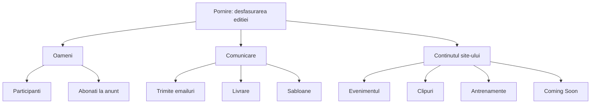
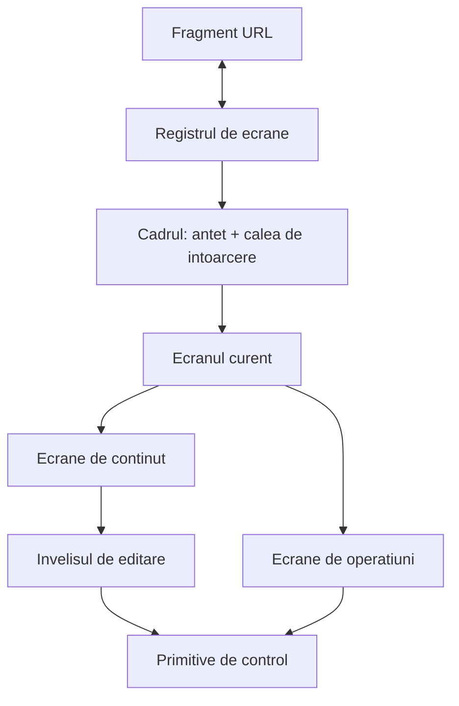
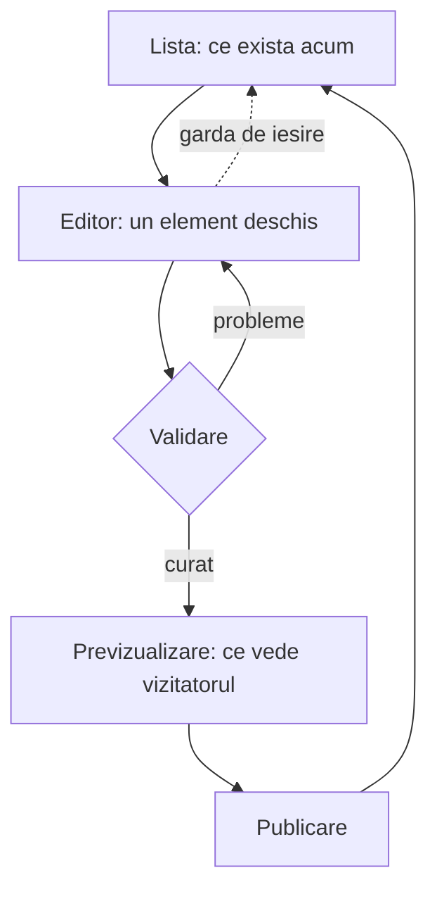

# Adminul pe ecrane, cu controale pe masura alegerii - Plan

## Goal Capsule

- **Obiectiv:** Organizatorul duce la capăt orice treabă din `/admin` fără să caute unde stă și fără să ghicească ce vrea un câmp de la el.
- **Mijloc:** Adminul se împarte în ecrane adresabile, iar ecranele de conținut adoptă învelișul de editare extras din ecranul Evenimentului (KTD1, KTD3).
- **Autoritate de produs:** Acest plan deține structura de ecrane a lui `/admin`, controalele din ele și tiparul de editare al ecranelor de conținut. Nu deține comportamentul de trimitere a emailurilor, modelul de date al ediției, autentificarea, și nici pagina publică în afara previzualizării.
- **Profil de execuție:** Opt unități, în ordinea din secțiune. U1–U3 construiesc învelișul; U4–U6 mută conținutul pe el; U7 atinge operațiunile; U8 e etapa de design. Nicio migrare de bază de date.
- **Condiții de oprire:** Oprește-te și întreabă dacă pragurile de acoperire din `vitest.config.ts` nu pot fi ținute fără a scădea clichetul, sau dacă extragerea învelișului din `src/admin/AdminEventTab.tsx` cere schimbarea semanticii de ciornă a evenimentului.
- **Coada:** `ce-work` duce până la PR deschis. Fuziunea în `main` — care e deploy-ul — rămâne la organizator.
- **Blocante deschise:** Niciunul.

**Product Contract preservation:** Product Contract unchanged. Planificarea n-a schimbat niciun R, KD, F sau AE.

---

## Product Contract

### Summary

`/admin` încetează să fie o pagină unică prin care derulezi. Fiecare funcție primește ecranul ei, grupate după ce fac, iar alegerile se exprimă prin liste derulante, butoane radio și liste ordonabile în loc de rânduri de butoane. Ecranele care schimbă ce vede vizitatorul capătă același tipar de editare: listă, editor, previzualizare, publicare.

### Problem Frame

Adminul s-a construit prin adăugare. Fiecare funcție nouă și-a găsit loc unde a încăput, iar rezultatul e o singură pagină cu cinci blocuri permanente înaintea oricărei treburi: selectorul de ediție, bannerul de arhivă, linia de timp cu cinci noduri și butoanele lor, blocul săptămânal, apoi bara de navigație pe două rânduri. Abia sub ele începe ecranul pe care voiai să ajungi.

Două dintre blocurile permanente sînt ele însele suprafețe interactive, deci concurează cu ecranul de dedesubt. Antrenamentele nu sînt nici măcar un tab: stau pe o manetă din cromul paginii, iar când se deschid se randează între linia de timp și bara de navigație — simultan cu tabul selectat. Sînt două ecrane vizibile în același timp, fără ca vreunul să spună că e secundar.

Alegerile se exprimă aproape exclusiv prin butoane. În tot `src/admin/` sînt 108 de `type="button"`, față de 9 liste derulante, 6 bifate și un singur buton radio. Inclusiv alegerile care sînt în mod evident „una dintre acestea" — mută mai sus, mută mai jos, editează, scoate, pe fiecare rând — sînt tot butoane. Densitatea asta e ce citește organizatorul ca „nu e clar unde sînt secțiunile".

Ecranele de conținut nu se comportă la fel între ele. „Evenimentul" are ciornă, previzualizare pe `/?config=draft`, validare care blochează publicarea și istoric de versiuni. Antrenamentele au istoric de versiuni, dar nici ciornă, nici previzualizare, și un singur verb, „Salvează". Clipurile n-au niciuna dintre ele și scriu direct. Trei treburi asemănătoare, trei modele mentale diferite. Costul se vede cel mai clar la adăugarea unui clip: formularul cere un link de YouTube, o legendă și un link de Instagram obligatoriu, iar eticheta „Linkul postării" nu spune de ce un clip de pe YouTube are nevoie și de o postare — afli când validarea refuză salvarea.

### Key Decisions

- KD1. **Un ecran pe rând, nu o pagină prin care derulezi.** (session-settled: user-directed — ales în locul păstrării paginii unice: „do not keep all in one page".) Governs R1, R2.
- KD2. **Împărțirea urmează ce face funcționalitatea**, nu tabelul din spate și nu ordinea în care s-au adăugat funcțiile. (session-settled: user-directed.) Governs R3.
- KD3. **Controlul se alege după forma alegerii**, nu după ce e mai rapid de randat. (session-settled: user-directed — cerute explicit liste derulante, liste și butoane radio.) Governs R6, R7, R8.
- KD4. **Tiparul ciornă → previzualizare → publicare din „Evenimentul" devine tiparul comun al ecranelor de conținut**, în loc să se proiecteze unul nou. (session-settled: user-approved — propus cu costul lui pe masă, acceptat.) Governs R9, R10, R13.
- KD5. **Ecranul de pornire e desfășurarea ediției.** Fără el, trecerea la un ecran pe rând ar lua răspunsul la „unde e ediția acum?", care azi se citește fără niciun clic. (session-settled: user-approved.) Governs R4.
- KD6. **Tiparul de editare se aplică doar conținutului, nu operațiunilor.** Coming Soon e o manetă, iar trimiterea și livrarea sînt operațiuni: primesc structura și controalele noi, nu ciorna și publicarea. (session-settled: user-directed — ales în locul aplicării tiparului peste tot.) Governs R15, R16.

### Requirements

**Împărțirea pe ecrane**

- R1. Fiecare funcție a adminului are un ecran al ei, iar la un moment dat e vizibil un singur ecran.
- R2. Deasupra ecranului curent rămân doar antetul și calea de întoarcere; niciun bloc de funcționalitate nu mai e permanent.
- R3. Ecranele se grupează după ce fac: desfășurarea ediției, oamenii, comunicarea și conținutul site-ului.
- R4. Ecranul pe care aterizezi răspunde la „unde e ediția acum?" fără niciun clic.
- R5. Antrenamentele sînt un ecran ca oricare altul, ajuns din aceeași structură ca restul.

**Controalele**

- R6. O alegere dintr-un set care crește în timp se face dintr-o listă derulantă.
- R7. O alegere dintre puține variante exclusive se face cu butoane radio.
- R8. Reordonarea unei liste nu cere câte un buton de direcție pe fiecare rând.

**Editarea conținutului**

- R9. Evenimentul, clipurile, antrenamentele și șabloanele folosesc același tipar de editare: listă, editor, previzualizare, publicare.
- R10. Un ecran de conținut arată ce va vedea vizitatorul înainte ca schimbarea să fie publicată.
- R11. Ajutorul unui câmp e vizibil înainte de a greși, nu doar în refuzul validării.
- R12. Un câmp obligatoriu al cărui rost nu se deduce din eticheta lui își spune rostul lângă el.
- R13. Verbul de salvare e același pe toate ecranele de conținut.
- R14. Nicio schimbare făcută din adminul refăcut nu cere deploy.
- R15. Coming Soon are efect imediat și spune pe ecran că e o excepție: e o manetă, nu un document.
- R16. Ecranele de comunicare primesc structura și controalele noi, dar nu tiparul din R9.

### Harta ecranelor

Gruparea ilustrează R3. Șabloanele rămân sub Comunicare — editează text de email, nu pagina — dar primesc tiparul de editare din R9 ca toate celelalte ecrane de conținut.

Coming Soon stă sub „Conținutul site-ului" fiindcă acolo îl caută organizatorul, nu fiindcă e un document. Gruparea e de navigație; scutirea de la tiparul de editare rămâne cea din KD6 și R15.

### Key Flows

- F1. Adaugă un clip nou
  - **Declanșator:** Organizatorul a încărcat un Short pe YouTube și vrea să apară în bandă.
  - **Pași:** Ajunge la ecranul Clipuri din grupul „Conținutul site-ului". Deschide editorul pentru un clip nou. Fiecare câmp își spune rostul înainte de completare, inclusiv de ce e nevoie și de linkul postării. Previzualizează cum arată banda. Publică.
  - **Rezultat:** Clipul e în bandă, fără deploy.
  - **Covers R9, R10, R11, R12, R14.**

- F2. Schimbă antrenamentul săptămânii
  - **Declanșator:** E luni și programul săptămânii trebuie actualizat.
  - **Pași:** De pe ecranul de pornire se vede că săptămâna afișată e cea veche. Deschide ecranul Antrenamente, care arată la fel ca celelalte ecrane de conținut. Scrie săptămâna nouă, previzualizează, publică.
  - **Rezultat:** Pagina publică arată săptămâna nouă.
  - **Covers R5, R9, R10, R13.**

- F3. Verifică unde e ediția
  - **Declanșator:** Organizatorul deschide `/admin` fără o treabă anume.
  - **Pași:** Ecranul de pornire arată desfășurarea ediției și ce cere atenție. Nu e nevoie de niciun clic pentru a citi starea.
  - **Rezultat:** Știe unde e ediția și de unde continuă.
  - **Covers R2, R4.**

### Acceptance Examples

- AE1. **Covers R11, R12.** Dat fiind un editor de clip gol, când organizatorul se uită la câmpul linkului de postare, atunci rostul câmpului e deja vizibil — nu apare pentru prima oară în mesajul de refuz al validării.
- AE2. **Covers R10.** Dat fiind un ecran de conținut cu modificări nepublicate, când organizatorul cere previzualizarea, atunci vede randarea publică a ciornei, nu starea publicată.
- AE3. **Covers R1, R2.** Dat fiind orice ecran deschis, când organizatorul se uită la pagină, atunci nu e vizibil niciun al doilea ecran de funcționalitate deasupra sau dedesubtul lui.
- AE4. **Covers R6, R7.** Dat fiind un set de variante exclusive cunoscute dinainte și puține, când ecranul îl prezintă, atunci le prezintă ca butoane radio, iar un set care crește în timp ca listă derulantă.
- AE5. **Covers R13.** Dat fiind oricare două ecrane de conținut, când organizatorul compară acțiunea de finalizare, atunci verbul e același pe amândouă.

### Success Criteria

- Dezechilibrul de controale scade vizibil față de starea de azi: 108 butoane contra 9 liste derulante, 6 bifate și un buton radio în `src/admin/`.
- Rezultatul nu arată ca markup-ul de azi restilizat. Redesignul trece printr-o etapă de design propriu-zisă, nu prin reordonarea claselor existente.
- Un organizator care n-a mai intrat de o lună găsește ecranul căutat fără să deschidă mai mult de unul greșit.

### Scope Boundaries

- Comportamentul de trimitere a emailurilor nu se schimbă: cine primește ce și cum se trimite rămân identice. Ecranele se reorganizează și își schimbă controalele, atât.
- Modelul de date al ediției, autentificarea și sesiunea de admin rămân neatinse.
- Pagina publică nu se schimbă, în afara faptului că previzualizarea o randează din ciornă.
- Nu se introduc capacități noi de administrare: nu apare nimic ce nu se putea face și înainte. Previzualizarea și ciorna se extind la ecranele care nu le aveau, dar sînt tiparul existent al evenimentului, nu o funcție nouă.

#### Deferred to Follow-Up Work

- Mutarea stilurilor de admin din `src/index.css` într-o foaie proprie. Sînt ~484 de linii dintr-un fișier de 2750, iar mutarea ar îngroșa diff-ul fără să schimbe ce vede organizatorul.
- Unificarea istoricului de versiuni între ecranul Evenimentului și cel al Antrenamentelor. Amândouă îl au, cu forme diferite; învelișul comun nu depinde de unificare.

### Dependencies / Assumptions

- Se presupune că frecarea de azi e un amestec de „unde stă lucrul ăsta" și „ce vrea câmpul ăsta de la mine", nu o capacitate lipsă. Presupunerea n-a fost confirmată printr-un exemplu concret; dacă e greșită, R6–R8 și R11–R12 își pierd prioritatea.
- Se presupune un singur organizator, care lucrează preponderent pe desktop. Dacă adminul se folosește de pe telefon în mod curent, R1 și R3 cântăresc mai mult, iar R8 se schimbă.
- Ciorna pe clipuri face adăugarea unui clip mai lentă decât azi, unde salvarea e imediată. Costul a fost acceptat în favoarea consecvenței (KD4).

### Sources / Research

- `src/admin/AdminDashboard.tsx:692-727` — blocurile permanente de deasupra fiecărui ecran, în ordinea randării.
- `src/admin/AdminDashboard.tsx:103` — starea tabului: `useState`, fără URL și fără persistență.
- `src/admin/stareCurenta.ts:19-27` — `TabAdmin`, tipul de care atârnă navigația, semnalele de atenție și acțiunile liniei de timp.
- `src/admin/adminNavigatie.ts:28-90` — gruparea de azi în trei, cu descrierile scrise pentru fiecare tab.
- `src/admin/AdminNav.tsx:93` — descrierile acelea ajung doar în `title`, deci nu se văd.
- `src/admin/BlocSaptamanal.tsx` și `src/admin/AdminDashboard.tsx:719-721` — antrenamentele ca manetă din crom, randate lângă tabul selectat.
- `src/admin/AdminEventTab.tsx:58,191-231` — ciorna, previzualizarea pe `/?config=draft` și validarea care blochează publicarea; tiparul pe care îl adoptă R9.
- `src/admin/AdminAntrenamentTab.tsx:100,254,461` — istoric de versiuni fără ciornă și fără previzualizare, cu un singur verb.
- `src/admin/AdminClipuriTab.tsx:114-125,281-350` — scriere directă, formular mereu deschis, linkul de Instagram obligatoriu fără explicație.
- `src/components/landing/ReelsRail.tsx:91` — unde ajunge linkul acela pe pagina publică; câmpul e real, eticheta e problema.
- `src/main.tsx:44-62` — rutarea: comutare pe `pathname` exact, fără router.
- `src/admin-preview.tsx` și `admin-preview.html` — dashboardul complet cu date false, fără login; suprafața pe care se lucrează designul.
- Pentru etapa de design, skill-urile de UI instalate în workspace: `redesign-existing-projects` pentru auditul suprafeței existente, `minimalist-ui` sau `high-end-visual-design` pentru direcția vizuală, `web-design-guidelines` pentru verificarea finală.

---

## Planning Contract

### Key Technical Decisions

- KTD1. **Ecranele primesc adrese în fragmentul URL (`/admin#clipuri`).** Fără ele, butonul „înapoi" scoate din admin cu totul de îndată ce ecranele se exclud reciproc. Fragmentul evită atingerea `src/main.tsx`, care comută pe `pathname` exact. (session-settled: user-approved — ales în locul stării pur în memorie.) Instantiates KD1; governs R1, R2.
- KTD2. **`TabAdmin` devine `EcranAdmin`, cu `antrenament` și `desfasurare` ca membri noi.** Tipul e deja punctul de cuplare pentru navigație, semnale și acțiunile liniei de timp; extinderea lui e ce face antrenamentele un ecran egal. Governs R3, R5.
- KTD3. **Învelișul comun de editare se extrage din `src/admin/AdminEventTab.tsx`, nu se scrie de la zero.** Ecranul acela are deja ciorna, previzualizarea, validarea care blochează publicarea și garda de ieșire. Cites KD4; governs R9, R10, R13.
- KTD4. **Învelișul e o componentă cu sloturi, nu un editor generic condus de date.** Cele patru ecrane au seturi de câmpuri ireductibil diferite; o generalizare peste ele ar fi o abstracție mai proastă decât repetiția. Governs R9.
- KTD5. **Controalele stau într-un modul propriu de primitive**, nu redefinite în fiecare ecran. Altfel R6–R8 se aplică inegal și a treia listă reinventează a doua. Governs R6, R7, R8.
- KTD6. **Reordonarea folosește o listă derulantă de poziție pe rând, nu tragere.** Tragerea cere fie o dependență nouă, fie tratare manuală de `pointer`, și e greu de testat și de folosit cu tastatura. (session-settled: user-approved — ales în locul tragerii.) Governs R8.
- KTD7. **Adminul capătă primul lui test de browser.** Suita de azi e numai unitară, iar comutarea între ecrane — exact ce introduce planul — e clasa de regresie pe care testele unitare n-o pot prinde structural. (session-settled: user-approved.)
- KTD8. **Lucrul de design rulează pe `admin-preview.html`.** Există deja, randează dashboardul complet cu date false și nu cere login în producție. Governs the work in U8.
- KTD10. **Pentru clipuri, `vizibil` E poarta de publicare.** `training_reels` n-are coloană de stare, iar banda publică filtrează pe `vizibil` — deci „publicat" și „se vede pe pagină" sînt deja același lucru. „Salvează" scrie clipul ascuns, „Publică" îl face vizibil, iar previzualizarea randează cardul în admin, cu același `iframe` ca pagina publică. Fără migrare. (session-settled: user-approved — ales în locul unei migrări care ar fi adus o coloană de stare.) Governs R9, R10, R13 pe ecranul Clipuri.
- KTD11. **Mutarea pe o poziție se traduce în apeluri de câte un pas.** `admin_move_training_reel` mută cu o singură poziție; o mutare de pe 5 pe 1 e patru apeluri seriale. Nu e atomică, dar banda e scurtă și o mutare întreruptă se repară cu încă una. (session-settled: user-approved — ales în locul unui RPC nou cu migrare.) Governs R8 pe ecranul Clipuri.
- KTD12. **Pe ecranul Antrenamente, „Publică" înseamnă salvează ȘI arată săptămâna asta.** Acolo săptămânile sînt un program, iar `vizibil` alege care se vede — deci verbul nu putea însemna același lucru ca pe clipuri fără să se lovească de controlul de vizibilitate al programului. „Salvează" păstrează vizibilitatea de acum. (session-settled: user-approved — ales în locul păstrării unui singur verb ca excepție.) Governs R9, R13 pe ecranul Antrenamente.
- KTD9. **Cadrul păstrează poll-ul agregat; ecranele își dețin doar scrierile.** Contoarele din registru se derivă azi din aceeași citire agregată, deci mutarea citirii în fiecare ecran le-ar stinge exact pe cele ale ecranelor închise. Alternativa — citire per ecran — s-ar plăti cu un contor mort sau cu o a doua sursă de adevăr peste aceleași rânduri. Governs the work in U2.

### High-Level Technical Design

Compoziția învelișului. `AdminDashboard` încetează să randeze toate ecranele într-o stivă și devine un cadru care alege unul.

Ciclul unui ecran de conținut. Aceeași succesiune pe toate patru, cu câmpurile puse în slot.

### Assumptions

- Extragerea învelișului din ecranul Evenimentului poate păstra semantica lui de ciornă neschimbată. Dacă nu poate, planul se oprește — vezi condițiile de oprire din Goal Capsule.
- Pragurile de acoperire din `vitest.config.ts` pot fi ținute pe tot parcursul. Clichetul nu se coboară; unitățile care mută cod aduc testele odată cu el.

### Sequencing

U1 → U2 → U3 construiesc învelișul și îl lasă funcțional cu ecranele de azi puse în el. U4 extrage învelișul de editare. U5 și U6 mută conținutul pe el. U7 atinge operațiunile. U8 e etapa de design și rulează la urmă, când structura nu se mai mișcă.

### System-Wide Impact

- `src/admin/stareCurenta.ts` e tipul partajat; redenumirea din KTD2 atinge `AdminNav`, `LiniaDeTimp`, `adminNavigatie` și testele lor.
- `npm run verify` rulează `knip`. Orice componentă rămasă orfană după mutări pică poarta de cod mort.
- Pragurile de acoperire sînt un clichet documentat în `vitest.config.ts` și `CI-CD.md`: se urcă, nu se coboară.

### Risks & Dependencies

- **Extragerea învelișului poate regresa ciorna evenimentului.** Ecranul are cea mai multă logică din admin și cea mai mare suită de teste. Mitigare: U4 extrage fără a schimba comportamentul, cu testele existente ca plasă; ecranul Evenimentului rămâne primul consumator al învelișului.
- **Redenumirea tipului atinge patru module și testele lor deodată.** Mitigare: U1 face doar redenumirea și extinderea, fără schimbări de comportament, ca diff-ul să fie citibil.
- **Acoperirea poate scădea în mijlocul mutărilor.** Mitigare: fiecare unitate care mută cod mută și testele lui în aceeași unitate.

---

## Implementation Units

### U1. Modelul de ecrane și registrul navigației

- **Goal:** Un singur tip și un singur registru descriu toate ecranele adminului, inclusiv antrenamentele.
- **Requirements:** R3, R5. Cites KTD2.
- **Dependencies:** Niciuna.
- **Files:** `src/admin/stareCurenta.ts`, `src/admin/adminNavigatie.ts`, `src/admin/AdminNav.tsx`, `src/admin/LiniaDeTimp.tsx`, `tests/unit/adminNavigatie.test.ts`, `tests/unit/adminNav.test.tsx`
- **Approach:**
  1. Redenumește `TabAdmin` în `EcranAdmin` și adaugă membrii `antrenament` și `desfasurare`.
  2. Rescrie registrul din `adminNavigatie.ts` pe cele patru grupuri din R3, cu antrenamentele ca frunză.
  3. Re-țintește harta `ACTIUNI` din `LiniaDeTimp.tsx` și câmpul `tab` al semnalelor de atenție pe tipul nou.
- **Patterns to follow:** Forma actuală a `GRUPURI` din `src/admin/adminNavigatie.ts` — registru pur, fără randare.
- **Test scenarios:**
  - Fiecare membru al `EcranAdmin` apartine exact unui grup din registru.
  - Un ecran absent din registru cade pe primul grup, fără ecran gol.
  - Contorul unui grup rămâne `null` cât timp o frunză n-a primit date.
  - Fiecare țintă din harta acțiunilor liniei de timp e un ecran care există în registru.
- **Verification:** `npm run typecheck` trece fără referințe rămase la `TabAdmin`; testele de navigație trec neschimbate ca intenție.

### U2. Cadrul de aplicație: un ecran pe rând, cu adresă

- **Goal:** Adminul randează un singur ecran, iar ecranul curent are o adresă la care se poate reveni.
- **Requirements:** R1, R2. Cites KTD1, KTD9.
- **Dependencies:** U1
- **Files:** `src/admin/AdminDashboard.tsx`, `src/admin/AdminCadru.tsx`, `src/admin/useEcranCurent.ts`, `tests/unit/adminDashboard.test.tsx`, `tests/unit/useEcranCurent.test.ts`
- **Approach:**
  1. Extrage din `AdminDashboard` un cadru care randează antetul, calea de întoarcere și exact un ecran.
  2. Ține ecranul curent într-un hook care citește și scrie fragmentul URL și ascultă `hashchange`.
  3. Scoate linia de timp, blocul săptămânal și bara pe două rânduri din stiva permanentă.
  4. Lasă poll-ul agregat în cadru, per KTD9; ecranele primesc datele prin proprietăți, ca azi.
- **Execution note:** Pornește de la un test care demonstrează că două ecrane nu pot fi randate simultan — asta e regresia pe care o previne unitatea.
- **Patterns to follow:** Garda de ieșire deja predată de taburi prin `inregistreazaGardaIesire` în `src/admin/AdminDashboard.tsx`.
- **Test scenarios:**
  - Covers AE3. Cu un ecran deschis, niciun al doilea ecran de funcționalitate nu e în document.
  - Un fragment necunoscut cade pe ecranul de pornire, nu pe ecran gol.
  - Schimbarea ecranului scrie fragmentul; un `hashchange` din afară schimbă ecranul.
  - Garda de ieșire a unui editor cu date nesalvate oprește schimbarea ecranului.
  - Garda retrasă la demontare nu mai blochează navigarea ulterioară.
  - Contorul unui ecran închis rămâne corect: cadrul continuă să citească agregat, per KTD9.
- **Verification:** Butonul „înapoi" al browserului mută între ecranele adminului fără să iasă din `/admin`.

### U3. Ecranul de pornire și primitivele de control

- **Goal:** Aterizarea în admin răspunde „unde e ediția acum?", iar controalele comune există într-un singur loc.
- **Requirements:** R4, R6, R7, R8. Cites KTD5, KTD6.
- **Dependencies:** U2
- **Files:** `src/admin/EcranPornire.tsx`, `src/admin/LiniaDeTimp.tsx`, `src/admin/controale/ListaDerulanta.tsx`, `src/admin/controale/GrupRadio.tsx`, `src/admin/controale/ListaOrdonabila.tsx`, `tests/unit/adminControale.test.tsx`, `tests/unit/ecranPornire.test.tsx`
- **Approach:**
  1. Fă din linia de timp ecranul de pornire, cu semnalele de atenție și blocul săptămânal ca rezumate care duc la ecranele lor.
  2. Scrie cele trei primitive de control, fiecare cu etichetă, descriere vizibilă și stare de eroare.
  3. Dă listei ordonabile o listă derulantă de poziție pe rând, per KTD6.
- **Patterns to follow:** Starea în cuvinte, nu doar prin culoare, așa cum o face `stareaNodului` în `src/admin/LiniaDeTimp.tsx`.
- **Test scenarios:**
  - Covers AE4. Un set mic și exclusiv se randează ca grup radio; un set care crește, ca listă derulantă.
  - Lista ordonabilă mută un element de pe poziția a treia pe prima prin alegerea poziției.
  - Prima și ultima poziție nu oferă mutări imposibile.
  - Ecranul de pornire arată reperul următor fără niciun clic.
  - Cu documentul ediției stricat, ecranul de pornire spune că desfășurarea nu se poate desena, în loc să deseneze din date invalide.
  - Fiecare primitivă leagă eticheta de control și expune starea de eroare unui cititor de ecran.
- **Verification:** Ecranul de pornire se citește complet fără interacțiune; primitivele se folosesc doar cu tastatura.

### U4. Învelișul de editare, extras din ecranul Evenimentului

- **Goal:** Tiparul listă → editor → previzualizare → publicare există ca înveliș reutilizabil, cu Evenimentul drept primul consumator.
- **Requirements:** R9, R10, R11, R13. Cites KTD3, KTD4.
- **Dependencies:** U3
- **Files:** `src/admin/continut/InvelisEditare.tsx`, `src/admin/continut/campuri.tsx`, `src/admin/AdminEventTab.tsx`, `tests/unit/invelisEditare.test.tsx`, `tests/unit/adminEventTab.test.tsx`
- **Approach:**
  1. Extrage din ecranul Evenimentului cadrul comun: lista, editorul, validarea care blochează publicarea, previzualizarea și garda de ieșire.
  2. Dă învelișului sloturi pentru câmpuri, per KTD4; seturile de câmpuri rămân ale fiecărui ecran.
  3. Pune ajutorul de câmp în componenta de câmp, vizibil înainte de validare, per R11.
  4. Mută ecranul Evenimentului pe înveliș fără să-i schimbe semantica de ciornă.
- **Execution note:** Extragere fără schimbare de comportament. Suita existentă a ecranului Evenimentului e plasa; rulează-o înainte și după, neschimbată.
- **Patterns to follow:** `src/admin/AdminEventTab.tsx:191-231` pentru ciornă, publicat și validare; `src/admin/eventTab/primitive.tsx` pentru forma câmpurilor.
- **Test scenarios:**
  - Covers AE2. Cu modificări nepublicate, previzualizarea randează ciorna, nu starea publicată.
  - Covers AE1. Ajutorul unui câmp e în document înainte de orice încercare de salvare.
  - Validarea cu probleme blochează publicarea și lasă editorul deschis.
  - Plecarea dintr-un editor atins cere confirmare; dintr-unul neatins, nu.
  - Ecranul Evenimentului păstrează aceeași secvență ciornă → publicare ca înainte de extragere.
- **Verification:** Testele ecranului Evenimentului trec fără modificări de intenție; publicarea unei ediții se comportă identic.

### U5. Clipurile și antrenamentele pe învelișul comun

- **Goal:** Cele două ecrane fără ciornă o capătă, cu același verb și aceeași previzualizare ca Evenimentul.
- **Requirements:** R5, R9, R10, R12, R13, R14. Cites KTD3.
- **Dependencies:** U4
- **Files:** `src/admin/AdminClipuriTab.tsx`, `src/admin/AdminAntrenamentTab.tsx`, `src/admin/BlocSaptamanal.tsx`, `tests/unit/adminClipuriTab.test.tsx`, `tests/unit/adminAntrenamentTab.test.tsx`
- **Approach:**
  1. Mută ecranul Clipuri pe înveliș; banda devine lista, editorul de clip devine slotul de câmpuri.
  2. Explică linkul postării lângă câmp, per R12: e adresa spre care duce „vezi pe Instagram" de sub clip.
  3. Mută ecranul Antrenamente pe înveliș și scoate maneta din crom, păstrând rezumatul ca intrare pe ecranul de pornire.
  4. Reordonarea benzii trece pe lista ordonabilă din U3.
- **Patterns to follow:** `src/admin/AdminClipuriTab.tsx:50-64` pentru curățarea linkului la lipire — se păstrează.
- **Test scenarios:**
  - Covers AE1. Rostul linkului de postare e vizibil înainte ca validarea să refuze salvarea.
  - Un link de YouTube în orice formă recunoscută reține doar identificatorul; unul nerecunoscut ajunge la validare cu mesajul ei.
  - Covers AE5. Verbul de finalizare e același pe ecranul Clipuri și pe cel al Antrenamentelor.
  - Reordonarea benzii prin alegerea poziției schimbă ordinea publică.
  - Un clip ascuns rămâne în listă și marcat ca ascuns.
  - Ecranul Antrenamente se deschide din registrul de ecrane, nu dintr-o manetă.
  - Cu banda goală, ecranul spune că secțiunea nu apare pe pagină.
- **Verification:** Un clip adăugat de pe ecranul nou ajunge în bandă fără deploy; antrenamentul săptămânii se schimbă de pe ecranul lui.

### U6. Șabloanele pe înveliș și excepția Coming Soon

- **Goal:** Șabloanele folosesc același tipar, iar Coming Soon rămâne cu efect imediat și o spune.
- **Requirements:** R9, R13, R14, R15. Cites KD6, KTD3.
- **Dependencies:** U4
- **Files:** `src/admin/AdminTemplatesTab.tsx`, `src/admin/AdminComingSoonTab.tsx`, `tests/unit/adminTemplatesTab.test.tsx`, `tests/unit/adminComingSoonTab.test.tsx`
- **Approach:**
  1. Mută ecranul Șabloane pe înveliș; previzualizarea arată emailul randat.
  2. Lasă Coming Soon cu scriere imediată și scrie excepția pe ecran, per R15.
  3. Trece comutatoarele lui Coming Soon pe primitivele din U3.
- **Patterns to follow:** Textul de excepție urmează tonul notelor din `src/admin/AdminEditionTabs.tsx:109-115` — spune ce se întâmplă, nu doar că e diferit.
- **Test scenarios:**
  - Previzualizarea unui șablon arată emailul randat, nu sursa lui.
  - Covers AE5. Verbul de finalizare al Șabloanelor e cel comun.
  - Coming Soon aplică schimbarea fără pas de publicare.
  - Ecranul Coming Soon spune că are efect imediat, în text, nu doar prin lipsa butonului.
- **Verification:** Un șablon editat se previzualizează înainte de publicare; comutarea Coming Soon rămâne o singură acțiune.

### U7. Ecranele de operațiuni

- **Goal:** Participanți, abonați, trimitere și livrare primesc structura și controalele noi, fără tiparul de editare.
- **Requirements:** R1, R6, R7, R8, R16. Cites KD6.
- **Dependencies:** U3
- **Files:** `src/admin/AdminDashboard.tsx`, `src/admin/AdminEmailTab.tsx`, `src/admin/AdminDeliveryTab.tsx`, `src/admin/AdminLaunchTab.tsx`, `src/admin/AdminCifre.tsx`, `tests/unit/adminEmailTab.test.tsx`, `tests/unit/adminDashboard.test.tsx`
- **Approach:**
  1. Mută tabelul de participanți, cifrele și activitatea pe ecranul lor propriu.
  2. Înlocuiește alegerile exprimate azi prin butoane cu primitivele din U3, unde forma alegerii o cere.
  3. Lasă neatinse cine primește ce email și cum se trimite, per marginile de scop.
- **Patterns to follow:** Filtrarea și exportul existente din `src/admin/AdminDashboard.tsx` rămân ca sînt; doar gazda lor se schimbă.
- **Test scenarios:**
  - Alegerea destinatarilor se face cu un control care arată setul, nu cu un buton pe variantă.
  - Ediția de arhivă rămâne doar-citire pe toate ecranele de operațiuni.
  - Exportul CSV funcționează și pe arhivă.
  - Căutarea în lista de participanți își păstrează comportamentul de azi.
  - Contorul de emailuri nelivrate rămâne o alertă, vizibilă din registru cu ecranul închis.
- **Verification:** Fluxul de trimitere a emailurilor produce aceleași rezultate ca înainte, de pe ecranul nou.

### U8. Direcția vizuală și verificarea de interfață

- **Goal:** Adminul arată ca o interfață proiectată, nu ca markup-ul de azi restilizat.
- **Requirements:** Success Criteria. Cites KTD8.
- **Dependencies:** U5, U6, U7
- **Files:** `src/index.css`, `src/admin-preview.tsx`, `tests/admin.spec.ts`
- **Approach:**
  1. Rulează auditul suprafeței cu skill-ul `redesign-existing-projects` pe `admin-preview.html`.
  2. Stabilește direcția vizuală cu `minimalist-ui` sau `high-end-visual-design`, pe tokenii de temă existenți din `src/index.css`.
  3. Extinde datele false din previzualizare cu toate ecranele noi, ca designul să se judece pe conținut plauzibil.
  4. Treci rezultatul prin `web-design-guidelines`.
  5. Scrie primul test de browser al adminului, per KTD7: comutarea între ecrane și revenirea cu butonul „înapoi".
- **Execution note:** Etapa de design rulează pe previzualizarea de dezvoltare, nu pe producție. Fără login, cu date false.
- **Patterns to follow:** Tokenii de temă din capul lui `src/index.css` — rebrandul se face acolo, nu prin fișier.
- **Test scenarios:**
  - Comutarea între două ecrane schimbă conținutul și fragmentul URL.
  - Butonul „înapoi" revine la ecranul anterior fără a părăsi `/admin`.
  - Previzualizarea de dezvoltare randează fiecare ecran nou cu date false.
  - Ecranele trec verificarea de contrast și de focalizare din ghidul de interfață.
- **Verification:** `npm run test:e2e:preview` trece cu noul test; previzualizarea arată toate ecranele.

---

## Verification Contract

| Poartă | Comandă | Ce dovedește |
|---|---|---|
| Lint | `npm run lint` | `oxlint` sub pragul de 25 de avertismente |
| Cod mort | `npm run deadcode` | `knip` nu găsește componente rămase orfane după mutări |
| Tipuri | `npm run typecheck` | Nicio referință rămasă la tipul redenumit din U1 |
| Tipuri (teste) | `npm run typecheck:tests` | Testele mutate compilează |
| Unitare + acoperire | `npm run test:coverage` | Pragurile din `vitest.config.ts` țin: linii 75, instrucțiuni 73, funcții 69, ramuri 66 |
| Build | `npm run build` | Configul de deploy și build-ul trec |
| Browser | `npm run test:e2e:preview` | Comutarea între ecrane și butonul „înapoi" (U8) |
| Totul | `npm run verify` | Poarta completă, în ordinea de mai sus |

Pragurile de acoperire sînt un clichet: se urcă la valorile măsurate, nu se coboară niciodată. O unitate care mută cod mută testele lui în aceeași unitate.

---

## Definition of Done

**Global**

- Toate cele opt unități sînt livrate, iar `npm run verify` trece.
- Fiecare cerință de la R1 la R16 e acoperită de o unitate sau declarată amânată în marginile de scop.
- Cele cinci exemple de acceptare au câte un test care le poartă marcajul `Covers`.
- `/admin` randează un singur ecran la un moment dat, iar fiecare ecran are o adresă.
- Antrenamentele se deschid din registrul de ecrane, nu dintr-o manetă din crom.
- Nicio capacitate de administrare n-a dispărut față de starea de dinainte.
- Codul rămas din abordări abandonate e șters, nu lăsat în diff. `knip` e poarta care o dovedește.

**Pe unitate**

- Unitatea își trece propriile scenarii de test, enumerate la ea.
- Unitatea nu coboară niciun prag de acoperire.
- Fișierele mutate nu lasă în urmă module neimportate.
