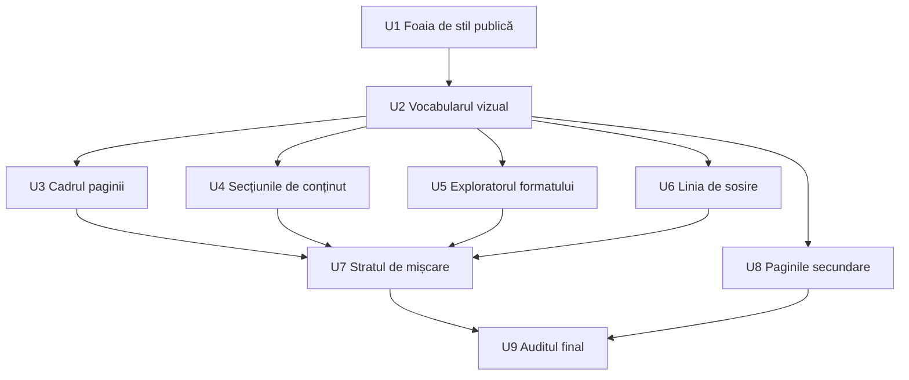

# Redesignul paginii publice - afiș de cursă - Plan

## Goal Capsule

- **Obiectiv:** Vizitatorul paginii publice simte evenimentul ca pe o cursă adevărată. Pagina arată lucrată, se mișcă și răspunde la atingere, iar înscrierea nu devine mai grea.
- **Mijloc:** Un redesign vizual complet în direcția „afiș de cursă” (sport-brutalist), pe paleta și fonturile existente, cu skill-urile taste-skill ca metodă de lucru și două piese interactive noi (KD1).
- **Autoritate de produs:** Planul deține aspectul și interacțiunile paginii publice și ale paginilor publice secundare. Redesignul adminului e o zonă separată, încă neplanificată, și nu face parte din acest plan. Planul nu deține logica înscrierii, datele ediției și nici conținutul editabil din admin.
- **Autoritate tehnică:** Pe comportament de produs câștigă R-urile; pe mecanism câștigă KTD-urile din Planning Contract; unitățile nu le suprascriu pe niciunele.
- **Profil de execuție:** Unitățile U1–U9 în ordinea din graficul de secvențiere. Fiecare unitate lasă suita e2e verde înainte de următoarea.
- **Condiții de oprire:** Oprește-te și întreabă dacă o cerință cere schimbarea unui text editabil din admin, a paletei, a fonturilor sau a unui flux de înscriere; dacă pragul R7 nu se poate ține fără să scoți o animație cerută de R5; sau dacă textele exploratorului nu sînt aprobate de organizator.
- **Coada:** Merge-ul în `main` e deploy-ul (CI). Nu există migrări sau funcții Edge în acest plan.
- **Blocante deschise:** Niciunul.

---

## Product Contract

### Summary

Pagina publică primește un redesign complet în direcția „afiș de cursă”: tipografie Anton la scară mare, grilă rigidă și lime folosit ca semnal. Secțiunea Format devine un explorator interactiv al stațiilor, iar înscrierea capătă tratament de linie de sosire. Secțiunile, textele și fluxurile rămân cele de azi.

### Problem Frame

Pagina de azi are deja multă mișcare (reveal la scroll, halou sub cursor, butoane magnetice, bandă rulantă, grain), dar stilurile stau împrăștiate. Aspectul e scris inline pe componente, iar stilurile publice stau amestecate cu adminul în `src/index.css`. Un redesign făcut peste inline-uri ar fi un restyle, nu o recompunere (R3). Planul mută întâi stilurile publice într-un loc propriu, fixează vocabularul vizual, apoi recompune secțiunile pe rând.

### Key Decisions

- **Direcția „afiș de cursă”, plus exploratorul formatului și înscrierea ca linie de sosire.** Construiește pe identitatea existentă (Anton și lime sînt deja brutale) și aduce interactivitate fără să reconstruiască narațiunea paginii. (session-settled: user-directed — chosen over „editorial premium”, „afiș pur” fără piese noi și „pagina ca o cursă” completă: premium-ul riscă aspectul generic, iar reconstrucția completă schimbă structura și majoritatea testelor e2e.) Governs R2, R3, R8, R9, R10.
- **Pagina publică întâi, adminul după.** Pagina publică fixează limbajul vizual pe care adminul îl va refolosi. (session-settled: user-directed — chosen over „adminul întâi” și „amîndouă într-un singur plan”: un plan mai mic, livrabil separat.) Governs R12.
- **Paleta și fonturile rămân.** Cererea inițială a fost „aceleași culori”; redesignul schimbă felul în care sînt folosite, nu valorile. Cifrele vii și etichetele mici rămân pe Archivo, cu cifre tabulare. (session-settled: user-directed — chosen over un font monospace pentru date și etichete: identitatea rămâne aceeași, fără un font în plus de încărcat.) Governs R1, R14.
- **Pre-flight-ul taste-skill se aplică, cu excepții numite.** Câteva reguli ale lui contrazic deciziile planului, așa că R3 le scutește explicit, în loc să ceară un pre-flight imposibil de trecut. (session-settled: user-directed — chosen over pre-flight complet, care ar fi rescris texte editabile din admin și redeschis R13, și over pre-flight doar ca ghid, care lasă criteriul vizual fără prag.) Governs R3.
- **Exploratorul primește conținut nou, fix în cod.** Propoziția de azi a fiecărui card e prea subțire pentru o interacțiune. (session-settled: user-directed — chosen over „propoziția de azi, animată” și „conținut bogat, editabil din admin”: primul nu justifică interacțiunea, al doilea trage lucru de admin în acest plan.) Governs R8.
- **Linia de sosire nu depinde de poziție.** Ordinea secțiunilor se setează din admin, iar înscrierea nu e neapărat ultima. Governs R11.

### Requirements

**Limbaj vizual**

- R1. Pagina folosește doar paleta existentă (tokenii `--e3-*`) și fonturile Anton și Archivo. Cele câteva culori scrise direct pe paginile publice trec pe tokeni.
- R2. Direcția „afiș de cursă”: titluri Anton la scară mare, grilă rigidă, lime rezervat semnalelor (CTA, stări active, cifre vii), nu umpluturii.
- R3. Rezultatul nu arată ca markup-ul de azi restilizat și trece verificarea pre-flight din skill-ul `design-taste-frontend`, cu aceste excepții: numerotarea secțiunilor (`01`, `02`…) rămâne ca parte a identității de afiș; pagina rămâne doar în modul întunecat; nu se cer poze noi (vezi Scope Boundaries); liniile de pauză (—) din textele editabile din admin rămân. Liniile de pauză din textele scrise direct în cod dispar.
- R4. Lizibilitatea pe telefon e prag: textul și formularul rămân citibile la 360px lățime, fără scroll orizontal.
- R14. Pe paginile publice există o singură regulă pentru colțuri (unghi drept, în spiritul direcției brutaliste), aplicată peste tot. Punctele colorate decorative dispar; rămân doar cele care semnalează o stare reală (de exemplu înscrieri deschise).
- R15. Cifrele vii folosesc cifre tabulare, ca să nu sară când se animă.

**Mișcare și interacțiune**

- R5. Fiecare secțiune are o intrare animată și stări lucrate de hover, focus și apăsare. Cifrele vii (participanți, numărătoare inversă) se animă când se schimbă.
- R6. Cu `prefers-reduced-motion`, animațiile decorative se opresc, iar conținutul rămâne complet vizibil.
- R7. Animațiile nu întârzie apariția conținutului din primul ecran.

**Exploratorul formatului**

- R8. Secțiunea Format devine un explorator: vizitatorul alege o etapă (RUN, LIFT, REPEAT) și vede detalii noi despre ce face acolo, cu RUN selectat implicit.
- R9. Exploratorul se folosește la fel de bine cu atingerea, mouse-ul și tastatura.

**Înscrierea ca linie de sosire**

- R10. Secțiunea de înscriere are tratament vizual de linie de sosire în toate stările ei: deschisă, listă de așteptare, plină, închisă și confirmare.
- R11. Linia de sosire arată corect în orice ordine a secțiunilor setată din admin și când alte secțiuni sînt ascunse.

**Acoperire și comportament**

- R12. Redesignul acoperă landing-ul în ambele moduri (normal și clasament), overlay-ul de înscriere și paginile publice secundare: Înscriere (`/inscriere`), Coming Soon, Antrenament, Despre noi, Confirmare, Renunț și Dezabonare.
- R13. Comportamentul rămâne neschimbat: aceleași secțiuni, aceleași texte editabile din admin și aceleași fluxuri de înscriere, retragere și dezabonare.

### Acceptance Examples

- AE1. **Covers R8.** **Given** vizitatorul ajunge la Format fără să atingă nimic, **then** vede detaliile pentru RUN. **When** atinge LIFT, **then** vede detaliile pentru LIFT, iar RUN nu mai e selectat.
- AE2. **Covers R11.** **Given** organizatorul pune Înscrierea prima după Hero și ascunde Reels, **when** vizitatorul parcurge pagina, **then** secțiunea de înscriere arată tot ca linie de sosire și nimic din ea nu presupune că e finalul paginii.
- AE3. **Covers R10.** **Given** locurile s-au ocupat și lista de așteptare e deschisă, **when** vizitatorul ajunge la înscriere, **then** vede tratamentul de linie de sosire cu textele listei de așteptare.
- AE4. **Covers R6.** **Given** telefonul are activată reducerea mișcării, **when** vizitatorul deschide pagina, **then** nicio secțiune nu se animă și tot conținutul e vizibil de la început.

### Success Criteria

- Organizatorul, privind pagina nouă lângă cea veche, nu o recunoaște ca pe aceeași pagină restilizată.
- Suita e2e existentă trece; se schimbă doar localizatorii legați de clase CSS eliminate, nu așteptările despre texte și roluri. Excepție: testele de mișcare se rescriu pe noua mișcare (KTD9).

<!-- ce-section: work-relationships -->
### How This Work Fits Together

Planul deține redesignul paginii publice. Împărțirea de mai jos e înțelegerea de acum, nu o foaie de parcurs asumată.

- Redesignul adminului
  - **Depends on** acest plan: refolosește limbajul vizual și vocabularul de mișcare fixate aici.
  - **Shares** paleta `--e3-*` și fonturile.
  - **Still to decide:** cum se leagă de criteriile din `docs/plans/2026-09-22-1328-feat-admin-pe-ecrane-plan.md`.

### Scope Boundaries

- Redesignul adminului, cu excepția previzualizării paginii publice din admin, care urmează singură noul aspect.
- Conținut nou din `BACKLOG.md`: FAQ, rândul de beneficii, poze reale, pagina `/rezultate`. Redesignul le lasă loc, dar nu le adaugă.
- Schimbarea paletei, a fonturilor sau a textelor existente, cu o singură excepție: liniile de pauză din textele scrise în cod (R3).
- Editarea din admin a conținutului exploratorului.

### Dependencies / Assumptions

- Organizatorul nu a numit probleme concrete ale paginii de azi, deci ținta e finisajul general, nu repararea unor momente anume.
- Textele noi ale exploratorului (R8) le scrie organizatorul sau le schițează agentul și le aprobă organizatorul înainte de livrare.

### Outstanding Questions

**Deferred to Implementation**

- Textul exact al fiecărei etape din explorator. Agentul schițează, organizatorul aprobă înainte de merge (vezi Dependencies / Assumptions).
- Forma exactă a benzii de sosire și a grilei de afiș. Se decid pe ecran, în limitele R2, R10, R14 și KTD5.

### Sources / Research

- Paleta: `src/index.css:5-28`. Culori scrise direct pe pagini publice: `src/index.css:2290`, `src/index.css:2322`.
- Fonturi: `index.html:35`, `src/edition3.css:8`.
- Ordinea secțiunilor vine din configurația ediției (`SECTION_KEYS`, `src/content/eventConfig.ts:18`), iar modul clasament are propria ordine în `src/components/Landing.tsx`.
- Cardurile Format de azi: `FORMAT_CARDS` în `src/components/landing/FormatSection.tsx`.
- Stările înscrierii: `src/hooks/useRegistration.ts`, `src/components/landing/registrationStates.tsx`.
- Reducerea mișcării e deja tratată în `src/edition3.css` și `src/index.css`.
- Teste e2e care ating landing-ul: `tests/landing.spec.ts`, `tests/faze.spec.ts`, `tests/navigare.spec.ts`, `tests/mobil.spec.ts`, `tests/miscare.spec.ts`, `tests/reels.spec.ts`, `tests/inscriere.spec.ts`.
- Skill-urile taste-skill instalate: `design-taste-frontend`, `industrial-brutalist-ui`, `redesign-existing-projects`.
- Linii de pauză vizibile scrise în cod azi: `FORMAT_CARDS` (`src/components/landing/FormatSection.tsx:4-6`), textul listei de așteptare (`src/components/landing/RegistrationForm.tsx:133`), starea goală a participanților (`src/components/landing/ParticipantsSection.tsx:97`), banner-ul de confirmare (`src/components/landing/SignupBanner.tsx:61`). Planificarea verifică care texte ale Hero-ului și ale Formatului vin din admin.
- Colțuri amestecate pe paginile publice azi: cercuri de 50%, 10–14px și 999px (de exemplu `src/index.css:1999`, `src/index.css:2517`, `src/index.css:2741`).
- Stack: fără bibliotecă de animații sau Tailwind (`package.json`); dacă se adaugă una e decizie de planificare, nu de produs.

**Product Contract preservation:** changed: R12 — adaugă `/inscriere` și overlay-ul de înscriere, care folosesc același formular și lipseau din listă (confirmat de utilizator la sinteza de planificare). Success Criteria: excepția pentru testele de mișcare (KTD9), confirmată de utilizator. Restul Product Contract neschimbat.

---

## Planning Contract

### Key Technical Decisions

- KTD1. **Clasele existente rămân cârlige stabile.** Aproximativ 160 de aserțiuni e2e găsesc elemente după clase (`.cs-*`, `.an-*`, `.cf-*`, `.dn-*`, `.e3-*`). Redesignul restilizează în spatele acestor clase și adaugă clase noi când e nevoie. Nu redenumește. (session-settled: user-approved — chosen over redenumirea liberă a claselor cu rescrierea localizatorilor: criteriul de succes cere ca doar localizatorii claselor eliminate să se schimbe.)
- KTD2. **Stilurile publice se mută în `src/public.css`.** Secțiunile publice din `src/index.css` (landing, Coming Soon, Despre noi, Confirmare, Antrenament) trec în fișierul nou, importat din `src/main.tsx` și `src/admin-preview.tsx`. `src/edition3.css` rămâne pentru stările `e3-*` și keyframes. Adminul rămâne în `src/index.css`. Mutarea se face întâi fără nicio schimbare vizuală.
- KTD3. **Aspectul iese din inline în clase.** Inline-ul bate `:hover` și media queries (vezi comentariul de la `.e3-card` din `src/edition3.css`). Fiecare secțiune atinsă își mută layout-ul, spațierea și tipografia în clase. Inline rămân doar valorile calculate la rulare (de exemplu lățimea barei de locuri).
- KTD4. **Nicio bibliotecă nouă.** Mișcarea se construiește pe hook-urile existente (`useScrollReveal`, `useSpotlight`, `useMagnetic`, `useCountUp`), pe CSS și pe Web Animations API. Fără Motion, fără Tailwind. (session-settled: user-approved — chosen over adăugarea Motion: pagina are deja un vocabular de mișcare fără dependențe, iar o bibliotecă adaugă cost de bundle pe primul ecran, contra R7.)
- KTD5. **Linia de sosire trăiește în interiorul secțiunii.** Tratamentul se desenează în `RegistrationSection`, la marginea de sus a secțiunii. Nu folosește selectori de poziție (`:last-child`, frați, adiacența cu footer-ul) și nu presupune că după ea vine sfârșitul paginii. Governs R11.
- KTD6. **Exploratorul urmează modelul WAI-ARIA Tabs.** `role="tablist"`, câte un `tab` per etapă și un `tabpanel`. Săgețile mută focusul și selecția, iar Home și End sar la capete. Selecția se schimbă la atingere, click sau tastă, fără hover. Conținutul stă într-o constantă în cod. Governs R8, R9.
- KTD7. **Primul ecran nu așteaptă animațiile.** Elementul LCP (titlul din hero) nu pornește de la `opacity: 0`. Intrările din primul ecran pot anima doar `transform` și `clip-path`, și se termină în cel mult 700 ms. Reveal-ul la scroll se aplică doar sub fold, cum face deja `useScrollReveal`. Governs R7.
- KTD8. **Efecte retrase și încărcarea fontului.** Strălucirea infinită a CTA-ului din hero (`e3-glow`) dispare. Fonturile se încarcă o singură dată, din `index.html`: dispare `@import`-ul din `src/edition3.css`, care cere Google Fonts a doua oară. (session-settled: user-approved — chosen over păstrarea lor: strălucirea e un tic „AI” în pre-flight, iar încărcarea dublă întârzie prima afișare.)
- KTD9. **`tests/miscare.spec.ts` se rescrie pe noua mișcare.** Fișierul verifică efectele de azi (clip-path-ul titlului, pauza benzii rulante, haloul). Așteptările lui se schimbă odată cu mișcarea. Excepție asumată de la criteriul „doar localizatorii se schimbă”. Garanțiile de reducere a mișcării rămân și se extind (R6). (session-settled: user-approved — chosen over păstrarea efectelor de azi doar ca testul să rămână neatins: mișcarea e parte din redesign.)
- KTD10. **Garda de clase urmează fișierul nou.** `tests/unit/claseCss.test.ts` citește azi doar `src/index.css` și `src/edition3.css`. Lista primește `src/public.css`, altfel orice clasă mutată apare ca inventată.

### High-Level Technical Design

Secvențierea unităților. Fundația (U1, U2) blochează tot restul. Secțiunile și paginile secundare pot merge în paralel după ea. Mișcarea (U7) vine după ce secțiunile au forma finală, iar auditul (U9) închide.

### Assumptions

- Textul din hero are 26 de cuvinte, peste pragul de 20 din pre-flight. Textul rămâne (R13, Scope Boundaries). Regula de 20 de cuvinte cedează aici, la fel ca excepțiile numite în R3.
- Liniile de pauză vizibile de pe landing sînt aproape toate scrise în cod, inclusiv în textul din hero și în introducerea Formatului, deci cad sub R3 și dispar.
- Previzualizarea din admin randează `Landing`, deci urmează singură noul aspect odată ce importă `src/public.css`.

### Sources / Research (planning)

- Stilurile inline și motivul pentru care bat `:hover`: comentariul de la `.e3-card`, `src/edition3.css`.
- Familiile de rădăcini: `.e3-root` (landing, `/inscriere`), `.cs-root` (Coming Soon, Confirmare, Renunț, Dezabonare, Antrenament), `.dn-root` (Despre noi).
- Reducerea mișcării: blocul de la finalul `src/edition3.css` și `useScrollReveal`, care iese devreme pe `prefers-reduced-motion`.
- Numerotarea secțiunilor din poziția în lista filtrată: `src/components/Landing.tsx`.
- Testul numerotării și al ordinii: `tests/unit/sectionLayout.test.tsx`. Stările înscrierii: `tests/unit/registrationViews.test.tsx`.

---

## Implementation Units

### U1. Foaia de stil publică

- **Goal:** Stilurile publice stau într-un fișier propriu, fără nicio schimbare vizuală.
- **Requirements:** R1, R12. Pregătește R3.
- **Dependencies:** Niciuna.
- **Files:** `src/public.css` (nou), `src/index.css`, `src/edition3.css`, `src/main.tsx`, `src/admin-preview.tsx`, `index.html`, `tests/unit/claseCss.test.ts`.
- **Approach:**
  1. Mută secțiunile publice din `src/index.css` în `src/public.css` (KTD2), fără să schimbi reguli.
  2. Importă `src/public.css` în `src/main.tsx` și `src/admin-preview.tsx`.
  3. Trece culorile scrise direct pe paginile publice pe tokeni `--e3-*` (R1), inclusiv cele de la `src/index.css:2290` și `:2322`.
  4. Scoate `@import`-ul Google Fonts din `src/edition3.css` (KTD8).
  5. Adaugă `src/public.css` în garda de clase (KTD10).
- **Execution note:** Mutare de caracterizare: suita e2e trebuie să treacă neatinsă înainte să schimbi vreo valoare.
- **Patterns to follow:** Comentariile de secțiune în stilul `/* ---- Nume ---- */` din `src/index.css`.
- **Test scenarios:**
  - Garda de clase trece cu clasele publice mutate în `src/public.css`.
  - Garda de clase eșuează dacă o componentă publică folosește o clasă absentă din toate cele trei fișiere.
  - Suita e2e existentă trece fără nicio modificare.
- **Verification:** `src/index.css` nu mai conține reguli pentru `.cs-*`, `.dn-*`, `.cf-*`, `.an-*` și `.e3-*`. Paginile arată identic.

### U2. Vocabularul vizual comun

- **Goal:** Primitivele direcției „afiș de cursă” există o singură dată și sînt folosite peste tot.
- **Requirements:** R2, R14, R15. Governs pentru restul unităților.
- **Dependencies:** U1.
- **Files:** `src/public.css`, `src/edition3.css`, `src/components/landing/shared.ts`.
- **Approach:**
  1. Scara tipografică: titluri Anton cu `clamp()`, uppercase, tracking strâns, interlinie 0.85–0.95. Corp Archivo la cel mult 65ch.
  2. Grila de afiș: containerul, coloanele și separatoarele de 1px pe `--e3-border`.
  3. Antetul de secțiune: numărul (`.e3-title-num`) și titlul (`.e3-title`) recompuse ca element de afiș, păstrând clasele (KTD1).
  4. Colțuri drepte pe toate paginile publice (R14). Punctele decorative dispar; rămâne doar indicatorul de înscrieri deschise.
  5. Cifre tabulare pe cifrele vii (R15).
  6. Tokenii de mișcare: durate și curbe numite, folosite de U7.
  7. Lime doar pe semnale (R2): CTA, stare activă, cifre vii.
- **Patterns to follow:** Tokenii din `:root` (`src/index.css`); `.e3-step-idx` pentru cifrele mari.
- **Test scenarios:**
  - Test expectation: none -- stilizare fără comportament nou; verificarea vizuală și e2e existentă acoperă.
- **Verification:** Nicio regulă publică nu mai are `border-radius` diferit de 0, în afara excepției documentate pentru indicatorul de stare.

### U3. Cadrul paginii

- **Goal:** Bara de sus, hero-ul, banda rulantă, banner-ul și footer-ul vorbesc limbajul nou.
- **Requirements:** R2, R3, R4, R12, R13.
- **Dependencies:** U2.
- **Files:** `src/components/landing/TopBar.tsx`, `src/components/landing/Hero.tsx`, `src/components/landing/Marquee.tsx`, `src/components/landing/SignupBanner.tsx`, `src/components/landing/Footer.tsx`, `src/components/Landing.tsx`, `src/public.css`, `tests/landing.spec.ts`, `tests/navigare.spec.ts`.
- **Approach:**
  1. Mută layout-ul inline în clase (KTD3), inclusiv toast-ul din `src/components/Landing.tsx`.
  2. Hero-ul: titlul de afiș în primul ecran, textul și CTA-ul vizibile fără scroll la 360px (R4).
  3. Scoate strălucirea CTA-ului (KTD8).
  4. Înlocuiește liniile de pauză din textele scrise în cod: textul din hero și banner-ul de confirmare (R3).
  5. Banda rulantă rămâne singura de pe pagină.
- **Test scenarios:**
  - Hero-ul arată titlul, textul și CTA-ul fără scroll la 360×740.
  - Pe modul clasament, hero-ul nu arată niciun CTA spre înscriere.
  - Niciun text vizibil din hero și banner nu conține „—”.
  - Navigarea din bara de sus duce la aceleași ancore ca azi.
- **Verification:** `tests/landing.spec.ts`, `tests/navigare.spec.ts` și `tests/faze.spec.ts` trec; pagina nu are scroll orizontal la 360px.

### U4. Secțiunile de conținut

- **Goal:** Locația, participanții și clipurile sînt recompuse, fiecare cu altă familie de layout.
- **Requirements:** R2, R3, R4, R13.
- **Dependencies:** U2.
- **Files:** `src/components/landing/VenueSection.tsx`, `src/components/landing/ParticipantsSection.tsx`, `src/components/landing/ReelsSection.tsx`, `src/components/landing/ReelsRail.tsx`, `src/public.css`, `src/edition3.css`, `tests/reels.spec.ts`, `tests/mobil.spec.ts`.
- **Approach:**
  1. Mută layout-ul inline în clase (KTD3).
  2. Nicio familie de layout nu se repetă între secțiunile landing-ului.
  3. Înlocuiește liniile de pauză scrise în cod: starea goală a participanților și legenda clipului din `ReelsRail` (R3).
- **Test scenarios:**
  - Lista de participanți goală arată mesajul de stare goală, fără „—”.
  - Șina de clipuri se navighează la fel cu săgețile și segmentele.
  - Pe 360px, fiecare secțiune e o singură coloană fără scroll orizontal.
- **Verification:** `tests/reels.spec.ts` și `tests/mobil.spec.ts` trec; singurele schimbări din ele sînt localizatori ai claselor eliminate.

### U5. Exploratorul formatului

- **Goal:** Secțiunea Format devine un explorator RUN, LIFT, REPEAT cu detalii noi per etapă.
- **Requirements:** R8, R9, R3. Covers AE1.
- **Dependencies:** U2.
- **Files:** `src/components/landing/FormatSection.tsx`, `src/content/etape.ts` (nou), `src/public.css`, `tests/unit/formatSection.test.tsx` (nou), `tests/landing.spec.ts`.
- **Approach:**
  1. Conținutul etapelor stă în `src/content/etape.ts`: titlul, o frază de deschidere și 3–4 detalii (exerciții, distanțe, ce să aștepți). Fără linii de pauză.
  2. Tabs după KTD6, cu RUN selectat implicit.
  3. Panoul își păstrează înălțimea la schimbare, ca pagina să nu sară.
  4. Funcționează și în modul clasament, unde Format e secțiunea 02.
  5. Textul introducerii pierde linia de pauză (R3).
- **Execution note:** Scrie testul unitar al comportamentului tabs înainte de stilizare.
- **Patterns to follow:** `tests/unit/reelsRail.test.tsx` pentru teste de componentă cu `@testing-library/react`.
- **Test scenarios:**
  - Covers AE1. La randare, RUN e selectat (`aria-selected="true"`) și panoul arată detaliile RUN.
  - Covers AE1. Click pe LIFT: LIFT devine selectat, RUN nu mai e, panoul arată detaliile LIFT.
  - Săgeata dreapta pe RUN mută focusul și selecția pe LIFT; pe REPEAT revine la RUN.
  - Home sare la RUN, End sare la REPEAT.
  - Doar tab-ul selectat e în ordinea Tab (`tabindex="0"`); celelalte au `tabindex="-1"`.
  - Panoul are `aria-labelledby` spre tab-ul selectat.
  - E2e pe mobil: atingerea lui REPEAT arată detaliile REPEAT.
- **Verification:** Testul unitar și scenariile e2e trec; textele etapelor sînt aprobate de organizator.

### U6. Înscrierea ca linie de sosire

- **Goal:** Secțiunea de înscriere arată ca linie de sosire în toate stările și în orice poziție.
- **Requirements:** R10, R11, R12, R3. Covers AE2, AE3.
- **Dependencies:** U2.
- **Files:** `src/components/landing/RegistrationSection.tsx`, `src/components/landing/registrationStates.tsx`, `src/components/landing/RegistrationForm.tsx`, `src/components/landing/RegistrationOverlay.tsx`, `src/components/Inscriere.tsx`, `src/public.css`, `tests/unit/sectionLayout.test.tsx`, `tests/unit/registrationViews.test.tsx`, `tests/inscriere.spec.ts`, `tests/inscriere-directa.spec.ts`.
- **Approach:**
  1. Banda de sosire se desenează în secțiune, după KTD5.
  2. Tratamentul acoperă stările deschis, listă de așteptare, plin, închis și confirmare (R10).
  3. Overlay-ul și `/inscriere` primesc limbajul vizual nou, fără banda de sosire (R12).
  4. Textul listei de așteptare pierde linia de pauză (R3).
  5. Câmpurile, ordinea lor, etichetele și validarea rămân neschimbate (R13).
- **Test scenarios:**
  - Covers AE2. Cu layout-ul „înscriere prima, Reels ascuns”, secțiunea de înscriere are numărul 01 și poartă marcajul de linie de sosire.
  - Covers AE3. Cu locurile ocupate și lista de așteptare deschisă, secțiunea poartă marcajul și textele listei de așteptare.
  - Stările plin, închis și confirmare poartă fiecare marcajul de linie de sosire.
  - Mesajul listei de așteptare nu conține „—”.
  - Fluxurile e2e de înscriere, retragere și înscriere directă trec neschimbate.
- **Verification:** Testele unitare și e2e trec; marcajul nu depinde de poziția secțiunii.

### U7. Stratul de mișcare

- **Goal:** Fiecare secțiune intră animat, fiecare element interactiv are stări lucrate, iar cifrele vii se animă.
- **Requirements:** R5, R6, R7, R15. Covers AE4.
- **Dependencies:** U3, U4, U5, U6.
- **Files:** `src/hooks/useScrollReveal.ts`, `src/hooks/useCountUp.ts`, `src/hooks/useSpotlight.ts`, `src/hooks/useMagnetic.ts`, `src/components/landing/ParticipantsSection.tsx`, `src/components/landing/TopBar.tsx`, `src/edition3.css`, `src/public.css`, `tests/miscare.spec.ts`.
- **Approach:**
  1. Intrările de secțiune folosesc tokenii din U2 și respectă KTD7.
  2. Stări de hover, focus și apăsare pe fiecare element interactiv, inclusiv tab-urile exploratorului.
  3. Numărul de participanți și numărătoarea inversă se animă la schimbare, cu cifre tabulare.
  4. Haloul și butoanele magnetice rămân, reglate pe noul limbaj.
  5. Reducerea mișcării oprește tot ce e decorativ, fără conținut ascuns (R6).
  6. Rescrie `tests/miscare.spec.ts` pe noua mișcare (KTD9).
- **Test scenarios:**
  - Covers AE4. Cu `reducedMotion: 'reduce'`, toate elementele `[data-reveal]` au `opacity: 1` imediat și nimic nu are animație activă.
  - Covers AE4. Cu mișcare redusă, banda rulantă nu se mișcă, iar titlul din hero e vizibil fără clip.
  - Fără mișcare redusă, o secțiune de sub fold pornește ascunsă și ajunge la `opacity: 1` după ce intră în ecran.
  - Titlul din hero nu pornește niciodată de la `opacity: 0`.
  - Când statisticile schimbă numărul de participanți, cifra afișată ajunge la valoarea nouă.
  - Fiecare element interactiv arată un indicator de focus la navigarea cu tastatura.
- **Verification:** `tests/miscare.spec.ts` rescris trece; nicio animație nu folosește `top`, `left`, `width` sau `height`.

### U8. Paginile secundare

- **Goal:** Coming Soon, Antrenament, Despre noi, Confirmare, Renunț și Dezabonare folosesc limbajul nou.
- **Requirements:** R12, R13, R14, R3, R6.
- **Dependencies:** U2.
- **Files:** `src/components/ComingSoon.tsx`, `src/components/CardAntrenament.tsx`, `src/components/Antrenament.tsx`, `src/components/DespreNoi.tsx`, `src/components/Confirmare.tsx`, `src/components/Renunt.tsx`, `src/components/Unsubscribe.tsx`, `src/public.css`, `tests/coming-soon.spec.ts`, `tests/card-antrenament.spec.ts`, `tests/antrenament.spec.ts`, `tests/despre-noi.spec.ts`, `tests/confirmare.spec.ts`.
- **Approach:**
  1. Recompune cadrul comun `.cs-root` o dată; Confirmare, Renunț, Dezabonare și Antrenament îl moștenesc.
  2. Coming Soon și Despre noi primesc tratament propriu, pe aceleași primitive.
  3. Pictogramele rotunde de stare (`.cf-icon`) și punctele decorative trec pe regula de colțuri (R14).
  4. Clasele verificate de teste rămân (KTD1), inclusiv `.cs-antren-corp` cu `white-space: pre-wrap`.
- **Test scenarios:**
  - Confirmarea validă, deja confirmată și cu link invalid își păstrează titlurile și starea de eroare.
  - Countdown-ul Coming Soon arată aceleași unități și secundele se schimbă.
  - Cardul antrenamentului săptămânii duce la `/antrenament` și nu se taie pe mobil.
  - Selectorul de săptămână din `/antrenament` schimbă titlul și corpul.
  - Nicio pagină secundară nu are scroll orizontal la 360px.
- **Verification:** Suitele e2e ale paginilor secundare trec cu schimbări doar la localizatorii claselor eliminate.

### U9. Auditul final

- **Goal:** Redesignul trece pre-flight-ul cu excepțiile din R3 și pragul de prima afișare.
- **Requirements:** R3, R4, R7, Success Criteria.
- **Dependencies:** U7, U8.
- **Files:** `tests/unit/liniiDePauza.test.ts` (nou), `tests/*.spec.ts` (localizatori, dacă mai rămân).
- **Approach:**
  1. Rulează pre-flight-ul din `design-taste-frontend` pe fiecare pagină publică și notează excepțiile R3 și din Assumptions.
  2. Adaugă o gardă unitară: textele scrise în cod din `src/components/landing/` și `src/content/etape.ts` nu conțin „—” sau „–” ca separator.
  3. Măsoară LCP pe build-ul de preview pentru landing, înainte (pe `main`) și după, pe mobil emulat.
  4. Pune pagina veche lângă cea nouă pentru organizator (Success Criteria).
- **Test scenarios:**
  - Garda eșuează când un șir vizibil scris în cod conține „—”.
  - Garda ignoră comentariile din cod.
- **Verification:** LCP-ul nou nu e mai mare decât cel vechi; lista pre-flight nu are bife goale în afara excepțiilor numite.

---

## Verification Contract

| Poartă | Comandă | Când |
|---|---|---|
| Lint, cod mort, tipuri | `npm run lint`, `npm run deadcode`, `npm run typecheck`, `npm run typecheck:tests` | După fiecare unitate |
| Unitare cu acoperire | `npm run test:coverage` | După fiecare unitate |
| E2e pe build | `npm run build` apoi `npm run test:e2e:preview` | După fiecare unitate |
| Toate porțile, ca în CI | `npm run verify` | Înainte de PR |
| Prima afișare (R7) | LCP pe `vite preview`, mobil emulat, landing, înainte și după | U9 |
| Pre-flight vizual (R3) | Lista din `design-taste-frontend`, cu excepțiile din R3 | U9 |

---

## Definition of Done

- Toate R1–R15 sînt adevărate pe landing, overlay și toate paginile publice din R12.
- AE1–AE4 au teste care trec.
- `npm run verify` trece.
- Singurele schimbări din suitele e2e sînt localizatori ai claselor eliminate, plus rescrierea `tests/miscare.spec.ts` (KTD9).
- LCP-ul landing-ului nu a crescut față de `main`.
- Textele exploratorului sînt aprobate de organizator.
- Nu rămâne cod din încercări abandonate, clase moarte în `src/public.css` sau reguli publice în `src/index.css`.
- Per unitate: câmpul **Verification** al unității e adevărat.
