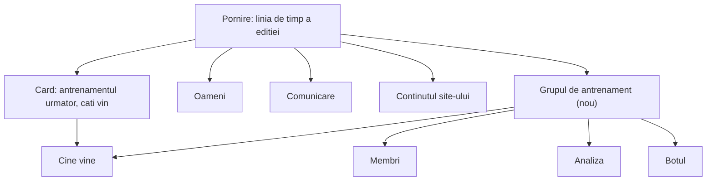
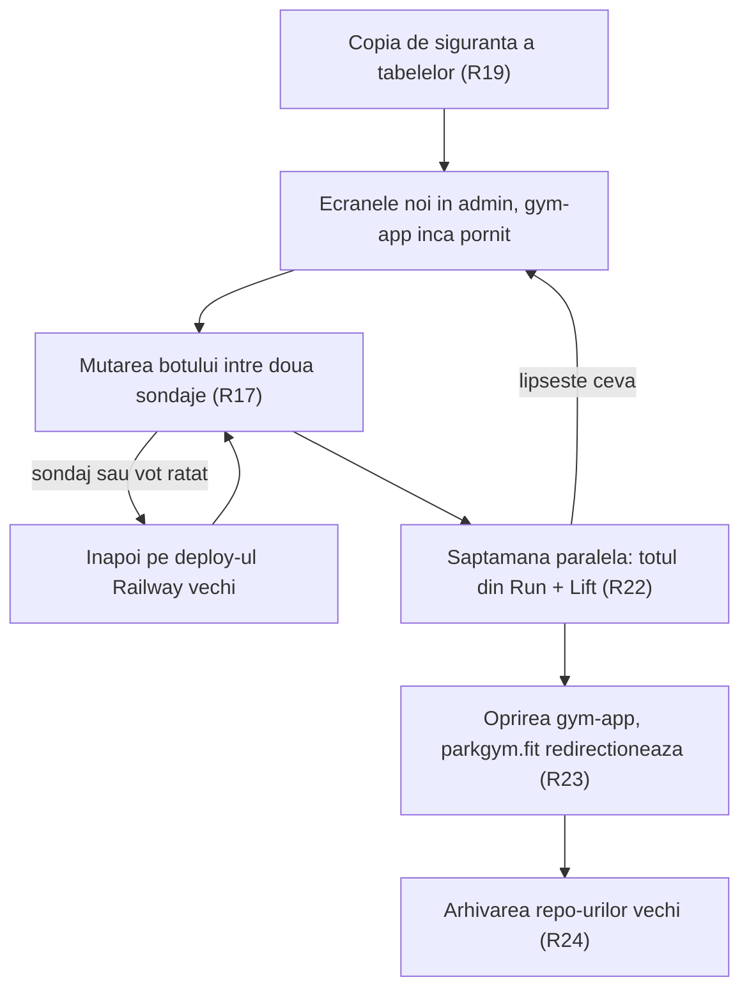
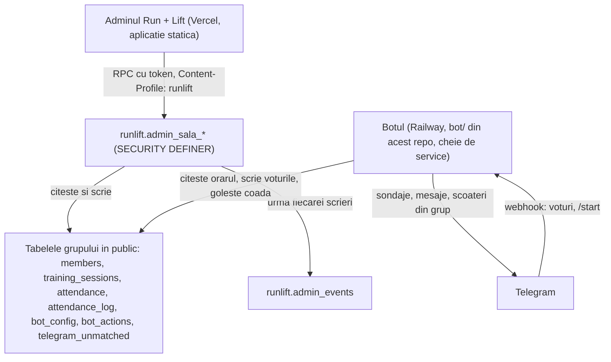
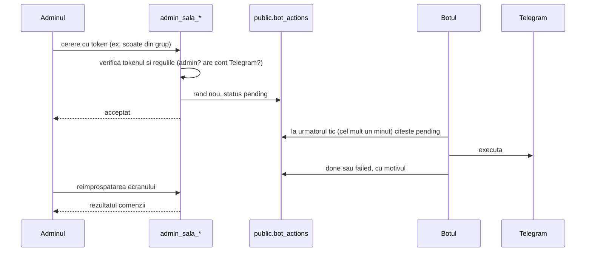
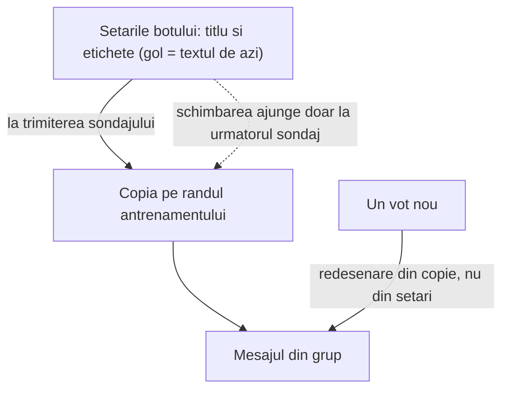
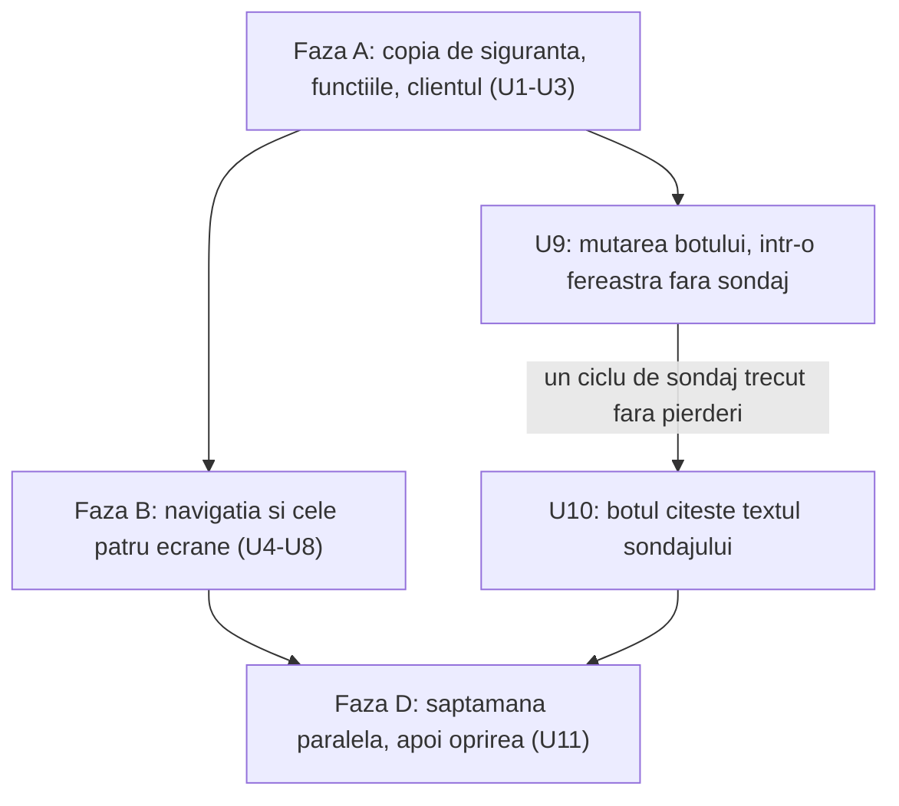

# Botul de Telegram și prezențele în adminul Run + Lift - Plan

## Goal Capsule

- **Obiectiv:** Organizatorii conduc grupul de antrenament (botul de Telegram, prezențele și membrii) din adminul Run + Lift, fiecare cu contul lui. Platforma veche (gym-app, parkgym.fit) nu mai rulează și nicio dată nu se pierde. Membrii din grupul de Telegram nu observă nicio schimbare, în afară de textul sondajului când organizatorul îl editează.
- **Mijloc:** Un grup nou de ecrane în admin, desenate de la zero pe sarcinile săptămânale, peste funcții de bază de date verificate prin tokenul adminului (KTD1). Codul botului se mută în acest repo, pe același serviciu Railway (KTD4). Datele rămân pe loc (KTD1), iar gym-app se oprește după o săptămână paralelă (KTD8, KTD9).
- **Autoritate de produs:** Planul deține ecranele de prezențe și bot din admin, mutarea codului botului, preluarea tabelelor grupului de antrenament în grija acestui repo și oprirea gym-app. Nu deține fluxurile edițiilor Run + Lift, evidența plăților și nici unificarea membrilor cu participanții la ediții.
- **Autoritate tehnică:** Pe comportament de produs câștigă R-urile. Pe mecanism câștigă KTD-urile din Planning Contract. Unitățile nu le suprascriu pe niciunele.
- **Profil de execuție:** Patru faze, în ordine: A (U1–U3), B (U4–U8), C (U9, U10), D (U11). U9 poate rula în paralel cu faza B. Fiecare unitate lasă verificările din Verification Contract verzi înainte de următoarea.
- **Condiții de oprire:** Oprește-te și întreabă dacă o schimbare ar șterge sau ar muta rânduri din tabelele grupului, dacă mutarea botului ar cădea într-o fereastră cu sondaj, rezumat sau reminder programat, dacă un sondaj sau un vot se pierde după mutare, sau dacă o cerință cere schimbarea comportamentului botului dincolo de R12.
- **Coada:** Merge-ul în `main` e deploy-ul (CI → Vercel). Migrările se aplică manual prin MCP `apply_migration`, înaintea codului care depinde de ele. Botul se deployează pe Railway doar după CI verde (KTD5). Pașii de pe Railway, BotFather și Vercel (domeniul) sînt manuali și apar în U9 și U11.
- **Blocante deschise:** Niciunul.

---

## Product Contract

### Summary

Adminul Run + Lift primește un al cincilea grup de ecrane pentru grupul de antrenament: cine vine, membrii, analiza și botul, cu textul sondajului editabil. Codul botului se mută în acest repo și rulează în continuare pe Railway, iar datele rămân în tabelele de azi. După o săptămână în care totul se face din Run + Lift, gym-app se oprește și parkgym.fit duce la admin.

### Problem Frame

Grupul de antrenament din parc rulează azi pe trei bucăți separate: panoul gym-app (Next.js, parkgym.fit), botul pe Railway din repo-ul `parkgym-telegram-bot` și baza Supabase `ironworks-gym`, împărțită cu Run + Lift. Fiecare are login, drum de deploy și cod propriu.

Utilizarea arată unde stă valoarea. Botul a înregistrat prezențe până pe 1 octombrie 2026: 449 de răspunsuri, 22 de antrenamente, 35 de membri, toți legați de Telegram. Panoul gym-app n-a mai avut nicio autentificare din 9 iulie, iar ultima plată e din 8 iulie. Sarcinile reale sînt puține: din când în când configurarea botului (mesajul și ziua sondajului), săptămânal o privire la câți vin, ocazional scoaterea cuiva din grup.

Granița din `MIGRATIONS.md` („acest repo nu atinge schema `public`”) era corectă cât timp existau două aplicații. Păstrată după oprirea gym-app, ar lăsa datele grupului fără proprietar. Pe lângă asta, `gym-app/bot/` conține o versiune veche a botului care nu rulează nicăieri, o capcană pentru oricine caută codul live.

### Actors

- A1. Vlad: organizator. Configurează botul, se uită cine vine și administrează și edițiile Run + Lift.
- A2. Roma: a doua persoană care lucrează cu grupul, cu aceleași drepturi ca A1.
- A3. Membrii din grupul de Telegram: votează la sondaj și primesc mesajele botului în grup sau în privat.
- A4. Botul: serviciu pe Railway care postează sondajele, înregistrează voturile, trimite rezumatul de dimineață și execută acțiunile cerute din admin.

### Key Decisions

- **Vin trei părți ale gym-app: botul cu prezențele, membrii și analiza. Plățile ies.** Plățile nu mai sînt folosite. (session-settled: user-directed — chosen over reconstruirea ecranului de plăți: neatins din 8 iulie 2026.) Governs R5–R10, R21.
- **Câte un cont pentru fiecare organizator, cu acces complet.** Roma vede și datele participanților la ediții. (session-settled: user-directed — chosen over un singur cont comun și un rol de antrenor limitat la ecranele grupului: ambii lucrează cu toate ecranele.) Governs R1, R2.
- **Codul botului intră în acest repo și rămâne pe Railway.** Un singur cod, fără rescrierea unui bot folosit săptămânal. (session-settled: user-approved — chosen over păstrarea repo-ului separat și rescrierea pe Supabase Edge cu cron în bază: primul păstrează două repo-uri, al doilea e cea mai riscantă rescriere.) Governs R15–R17.
- **Datele rămân în tabelele de azi, iar acest repo le preia.** Nimic nu se mută, deci nimic nu se poate pierde, iar botul nu se schimbă pe partea de date. (session-settled: user-approved — chosen over o schemă proprie și mutarea în `runlift`: o schemă proprie cere o comutare simultană cu botul oprit câteva minute, iar `runlift` amestecă membrii cu participanții.) Governs R18, R20.
- **Un al cincilea grup în meniu, plus un card pe ecranul de pornire.** E cea mai mică schimbare față de registrul de ecrane existent. (session-settled: user-approved — chosen over două spații de lucru cu comutator și o pornire „Azi” condusă de antrenament: ambele schimbă structura adminului.) Governs R3, R4.
- **Ecranele se desenează de la zero, pe sarcinile săptămânale.** Nu se portează aspectul din gym-app. (session-settled: user-directed — chosen over reconstruirea fidelă în aspectul curent și urmarea unui design extern: ecranele trebuie să urmeze ce face organizatorul, nu ce făcea vechiul panou.) Governs R5–R14.
- **Textul sondajului devine editabil, cu previzualizare.** Organizatorul spune că mesajul e ceva ce configurează. (session-settled: user-directed — chosen over păstrarea textului fix în cod și ca „mesajul” să fie doar mesajul liber trimis în grup.) Governs R12.
- **Oprirea vine după o săptămână paralelă, iar parkgym.fit redirecționează.** (session-settled: user-approved — chosen over oprirea în aceeași zi și lăsarea domeniului să expire: prima nu are rezervă, a doua lasă linkurile vechi moarte.) Governs R22, R23.
- **Rândurile de plăți rămân în bază, neatinse, fără ecran și fără export.** Ștergerea e ireversibilă și nu e necesară opririi. (session-settled: user-approved — chosen over o arhivă CSV și o listă doar-citire: „nu mai avem nevoie de ele”.) Governs R21.
- **Mutarea botului e un pas separat, între două sondaje, cu drum de întoarcere.** E pasul cu cel mai mare risc pentru membrii care votează. (session-settled: user-approved — chosen over mutarea odată cu ecranele: o eroare de bot n-ar mai fi separabilă de una de admin.) Governs R17.

### Requirements

**Accesul**

- R1. Fiecare organizator (cel puțin Vlad și Roma) intră în adminul Run + Lift cu contul lui și vede toate ecranele, inclusiv pe cele ale ediției.
- R2. Conturile din gym-app nu se mută și nu mai funcționează după oprire (R23).

**Navigația**

- R3. Ecranele grupului de antrenament stau într-un al cincilea grup din meniu, construit pe întrebarea organizatorului despre antrenamentul următor. Numele grupului și ale ecranelor nu se confundă cu ecranul existent „Antrenament” (programul săptămânal de pe pagina publică).
- R4. Ecranul de pornire rămâne linia de timp a ediției și primește un card cu antrenamentul următor și câți vin, care deschide ecranul „Cine vine”.

**Cine vine**

- R5. Ecranul arată întâi antrenamentul următor: data, ora, locul, câți vin, cine vine, cine nu vine și cine n-a răspuns.
- R6. Organizatorul poate anula sau reactiva un antrenament și poate marca prezența de mână, ca azi.
- R7. Antrenamentele trecute rămân consultabile, cu răspunsurile lor.

**Membrii și analiza**

- R8. Lista de membri arată starea fiecăruia și legătura cu Telegram. Conturile de Telegram necunoscute se pot lega de un membru, iar duplicatele se pot uni.
- R9. Un membru poate fi scos din grupul de Telegram, cu confirmare. Adminii grupului nu pot fi scoși, ca azi.
- R10. Analiza pe membru păstrează tot ce arată azi ecranul „Analiză” din gym-app: prezențele, ritmul și inactivitatea.

**Botul**

- R11. Setările de azi rămân editabile: pornit/oprit, zilele și ora sondajului, zilele și ora rezumatului, ora și locul antrenamentului, reminderul automat și pragul lui.
- R12. Textul sondajului (fraza de titlu și cele două butoane) se poate edita, cu previzualizarea mesajului așa cum apare în Telegram; ziua, data, ora și locul din rândul de titlu rămân automate. Schimbarea se aplică de la următorul sondaj.
- R13. Acțiunile la cerere rămân: trimite sondajul acum, trimite rezumatul acum, trimite reminderul acum și trimite un mesaj liber în grup. Fiecare acțiune își arată rezultatul: în așteptare, făcută sau eșuată, cu motivul.
- R14. Ecranul arată starea botului cel puțin la fel de complet ca pagina „Bot” din gym-app.

**Botul ca serviciu**

- R15. Comportamentul botului în Telegram rămâne cel de azi, cu o singură excepție, textul din R12. Asta include orarul, butoanele, mesajul de sondaj actualizat la fiecare vot, rezumatul de dimineață, reminderul automat, alerta de inactivitate, `/start` și parcarea conturilor necunoscute.
- R16. Codul botului trăiește în acest repo și rulează în continuare pe Railway. Un deploy care atinge doar site-ul sau adminul nu repornește botul.
- R17. Mutarea botului se face separat de ecrane, între două sondaje, cu deploy-ul Railway actual păstrat ca drum de întoarcere. Tokenul botului se schimbă cu ocazia mutării, fiindcă a circulat în clar în iulie.

**Datele**

- R18. Datele grupului de antrenament rămân în tabelele de azi: nimic nu se copiază, nu se mută și nu se șterge.
- R19. Înaintea primei schimbări care atinge tabelele grupului sau botul se face o copie de siguranță a acestor tabele.
- R20. Acest repo devine proprietarul tabelelor grupului, iar documentația graniței dintre aplicații se rescrie ca să nu mai spună contrariul.
- R21. Rândurile de plăți (16) rămân neatinse în bază, fără ecran și fără export.

**Oprirea gym-app**

- R22. Săptămâna paralelă: timp de o săptămână întreagă, cu cel puțin două cicluri de sondaj, totul se face din adminul Run + Lift. gym-app rămâne pornit doar ca rezervă.
- R23. După săptămâna paralelă gym-app se oprește, iar parkgym.fit duce la adminul Run + Lift.
- R24. Repo-urile vechi (`gym-app` și `parkgym-telegram-bot`) se arhivează, nu se șterg.

### Key Flows

- F1. Privirea săptămânală
  - **Trigger:** Sondajul a plecat (luni sau miercuri seara) ori e dimineața antrenamentului.
  - **Actors:** A1, A2
  - **Steps:** Login; cardul de pe pornire arată antrenamentul următor și câți vin; atingerea deschide „Cine vine” cu numele.
  - **Covered by:** R4, R5
- F2. Scoaterea din grup
  - **Trigger:** Cineva nu mai trebuie să fie în grupul de Telegram.
  - **Actors:** A1 sau A2, A4
  - **Steps:** Membri; alege membrul; „scoate din grup”; confirmă; botul execută cererea la următorul tic; rezultatul apare lângă cerere.
  - **Covered by:** R9, R13
- F3. Configurarea botului
  - **Trigger:** Se schimbă ziua, ora, locul sau textul sondajului.
  - **Actors:** A1 sau A2
  - **Steps:** Botul; editează; verifică previzualizarea; salvează; următorul sondaj programat pleacă cu valorile noi.
  - **Covered by:** R11, R12
- F4. Trecerea și oprirea
  - **Trigger:** Ecranele noi sînt în producție.
  - **Actors:** A1, A4
  - **Steps:** Copia de siguranță; ecranele noi; mutarea botului între două sondaje; săptămâna paralelă; oprirea gym-app cu redirecționare; arhivarea repo-urilor.
  - **Covered by:** R17, R19, R22, R23, R24

### Acceptance Examples

- AE1. **Covers R12.** Given un sondaj e deja în grup, When organizatorul schimbă textul și salvează, Then sondajul din grup își păstrează textul și la voturile următoare, iar următorul sondaj programat pleacă cu textul nou.
- AE2. **Covers R9.** Given membrul e admin în grupul de Telegram, When organizatorul încearcă să-l scoată, Then cererea e refuzată, cu explicația.
- AE3. **Covers R9, R13.** Given botul nu are drept de admin în grup, When organizatorul cere scoaterea unui membru, Then cererea apare ca eșuată, cu motivul, iar adminii primesc alerta de azi.
- AE4. **Covers R4.** Given sondajul pentru antrenamentul următor încă n-a plecat, When organizatorul deschide pornirea, Then cardul spune când pleacă sondajul, nu „0 vin”. Given botul e oprit, Then cardul spune că botul e oprit.
- AE5. **Covers R18, R22.** Given săptămâna paralelă, When Roma marchează din obișnuință o prezență în gym-app, Then prezența apare și în adminul Run + Lift, fiindcă datele sînt aceleași.
- AE6. **Covers R16.** Given un deploy care atinge doar pagina publică, When ajunge în producție, Then botul nu repornește, iar sondajul programat pleacă la ora lui.

### Success Criteria

- În cele două săptămâni de după oprire, sondajele pleacă la ora din setări, iar prezențele cresc după fiecare sondaj.
- Niciun tabel al grupului nu are mai puține rânduri decât în copia de siguranță din R19.
- Nimeni nu are nevoie de parkgym.fit în săptămâna paralelă.

### Scope Boundaries

- Ecranul și exportul plăților (R21).
- Rescrierea botului pe Supabase și renunțarea la Railway: amânată.
- Unificarea membrilor grupului cu participanții la edițiile Run + Lift: amânată, cele două liste rămân separate.
- Rolul de antrenor cu acces limitat: respins, fiecare organizator are acces complet (R1).
- Schimbări de comportament ale botului dincolo de textul sondajului (R15).
- Armarea `pg_cron` pentru reminderele Run + Lift: o problemă vecină, nu a acestui plan.

### Dependencies / Assumptions

- Botul rămâne admin în grupul de Telegram. Fără asta, R9 eșuează, la fel ca azi.
- Domeniul parkgym.fit rămâne înregistrat cât timp redirecționarea trebuie să funcționeze. Data expirării nu e verificată.
- Railway poate construi serviciul botului dintr-un subdosar al acestui repo și poate ignora schimbările din afara lui, prin rădăcina serviciului și căile urmărite. Verificat în documentația Railway pe 3 octombrie 2026; vezi KTD4 (R16).
- `runlift.admin_users` are deja conturile `vlad` și `roma`, create pe 8 iulie 2026. R1 nu cere conturi noi, doar confirmarea că Roma intră cu al lui.
- Ecranele noi folosesc limbajul vizual curent al adminului. Redesignul adminului e o zonă separată, încă neplanificată.

### Sources / Research

- `MIGRATIONS.md`: granița de azi dintre schemele `public` și `runlift` și lista migrărilor gym-app.
- `src/admin/adminNavigatie.ts`: registrul de ecrane, cu grupurile construite pe întrebări.
- `docs/plans/2026-09-22-1328-feat-admin-pe-ecrane-plan.md`: modelul de ecrane al adminului.
- `docs/plans/2026-09-26-1417-feat-redesign-pagina-publica-plan.md`: de aici vine amânarea redesignului adminului.
- Repo-ul `gym-app`: `app/(app)/bot/page.tsx` (pagina Bot), `components/AntrenamenteView.tsx`, `components/AnalizaView.tsx`, `components/MemberAnalytics.tsx` (inclusiv scoaterea din grup), `lib/bot-config-actions.ts`, `lib/member-actions.ts`. Dosarul `bot/` e o versiune veche, nefolosită.
- Repo-ul `parkgym-telegram-bot` (botul live): `src/index.ts` (orar citit din bază, tic de un minut), `src/jobs/process-commands.ts` (coada de acțiuni din admin), `src/lib/poll-text.ts` (textul sondajului, azi în cod), `context.md` (proiectul Railway, domeniul, variabilele de mediu).
- Starea live verificată pe 3 octombrie 2026: 35 de membri, 22 de antrenamente, 449 de răspunsuri, 642 de rânduri în jurnalul de prezențe, 16 plăți, 1 cont Telegram neasociat. Ultima autentificare în gym-app: 9 iulie 2026. Deploy-ul Railway al botului: `SUCCESS` din 23 iulie 2026.
- Orarul live din `public.bot_config` (3 octombrie 2026): sondaj luni și miercuri la 12:00, rezumat marți și joi la 06:00, antrenament la 06:30, reminder automat pornit cu pragul 6.

---

## Planning Contract

**Product Contract preservation:** restructurat, fără schimbare de scope. Întrebările „Deferred to Planning” au primit răspuns aici (KTD1, KTD4, KTD6, KTD8, KTD12) și au fost scoase din Product Contract. Rândul despre al doilea cont din Dependencies / Assumptions a fost rezolvat prin verificare.

### Key Technical Decisions

- KTD1. **Adminul ajunge la tabelele grupului prin funcții `runlift.admin_sala_*`, `SECURITY DEFINER`, verificate cu `admin_check_token`.** Clientul rămâne cel de azi: `fetch` spre `/rest/v1/rpc/*` cu `Content-Profile: runlift`, fără `supabase-js` și fără cheie de service în browser. Funcțiile scriu numele complet calificate (`public.members`) și au `search_path` fixat, ca restul schemei. Implementează decizia „datele rămân în tabelele de azi” pentru R18 și R20. (session-settled: user-approved — chosen over o schemă proprie și mutarea în `runlift`: nimic nu se mută, iar botul nu se schimbă pe partea de date.)
- KTD2. **O singură citire în bloc pentru ecranele grupului, plus o citire mică pentru cardul de pe pornire.** Datele sînt mici: 35 de membri, 22 de antrenamente, sub 500 de răspunsuri. Analiza se calculează în browser, din funcții pure portate din gym-app. Așa lucra și gym-app (`components/DataProvider.tsx`), iar o funcție de citire per ecran ar fi patru contracte de ținut în pas.
- KTD3. **Scrierile sînt funcții înguste, câte una per acțiune, și fiecare lasă o urmă în `runlift.admin_events` cu numele adminului.** Comenzile pentru bot intră în `public.bot_actions` dintr-o listă închisă (`send_poll`, `send_summary`, `send_reminder`, `send_message`, `kick_member`). Botul le golește ca azi, la fiecare tic de un minut. Numele adminului vine din `admin_sessions.user_id` → `admin_users.username`. Cu doi oameni pe același admin, „cine a scos-o pe Ana din grup” trebuie să aibă răspuns.
- KTD4. **Același serviciu Railway, repus pe acest repo.** Sursa serviciului `bot` (proiectul `parkgym-telegram-bot`) trece pe `vladrightjump/run-lift-landing`, cu directorul rădăcină `/bot` și calea urmărită `/bot/**`. Domeniul, variabilele de mediu și adresa webhook-ului rămân aceleași, deci mutarea nu cere reînregistrarea webhook-ului. Întoarcerea înseamnă repunerea sursei pe repo-ul vechi. Codul se copiază neschimbat; SHA-ul sursă se notează în `bot/README.md`, iar istoria rămâne în repo-ul arhivat. Implementează R15–R17. (session-settled: user-approved — chosen over păstrarea repo-ului separat și rescrierea pe Supabase Edge cu cron în bază: un singur cod, fără rescrierea unui bot folosit săptămânal.)
- KTD5. **Deploy-ul botului așteaptă CI-ul acestui repo.** `ci-deploy.yml` primește un job separat pentru `bot/`, pe Node-ul din `.nvmrc` (24, LTS-ul curent; `supabase-js` cade pe Node 20) — același local, pe Vercel și pe Railway. Pe serviciul Railway se pornește „Wait for CI”. Uneltele de la rădăcină nu ating `bot/`: `tsconfig.json` include doar `src`, `knip.json` și `vitest.config.ts` au globuri care nu-l prind, iar Vercel îl ignoră prin `.vercelignore`. Așa păstrează și botul regula „merge-ul în `main` e deploy-ul”.
- KTD6. **Textul sondajului stă în `public.bot_config`, iar fiecare antrenament păstrează o copie a textului cu care a plecat.** Trei coloane noi, nule, pe `bot_config`: titlul și etichetele celor două butoane. O coloană nouă, nulă, pe `training_sessions` păstrează copia. Webhook-ul redesenează mesajul la fiecare vot din copia antrenamentului, nu din setările curente. Gol înseamnă textul de azi. Organizatorul editează doar fraza de titlu și etichetele; ziua, data, ora și locul rămân automate. Coloanele intră odată cu funcțiile (U2), înaintea codului de bot care le citește (U10). Implementează R12 și AE1. (session-settled: user-approved — chosen over un șablon liber cu variabile: mai simplu, și nimic nu poate strica forma mesajului.)
- KTD7. **Ștergerea definitivă a unui membru nu vine din gym-app.** Azi șterge și istoricul de prezențe al omului. Starea inactivă, scoaterea din grup și unirea duplicatelor acoperă aceleași nevoi. Guvernează R8 și R18. (session-settled: user-approved — chosen over portarea ștergerii: istoricul de prezențe rămâne întreg.)
- KTD8. **La oprire, tabelele grupului se închid pentru orice rol în afară de bot și de funcțiile adminului.** Se scot cele două politici `authenticated` de pe `members` și `payments`. Se revocă drepturile `anon` și `authenticated` pe tabelele grupului, ca la blocarea `runlift` din 17 septembrie, și execuția `public.merge_members` pentru `authenticated` (pentru `anon` se revocă deja în U2). Conturile Supabase Auth ale gym-app rămân, dar nu mai deschid nimic. Guvernează R2 și R21. (session-settled: user-approved — chosen over lăsarea politicilor de azi: orice cont logat în gym-app poate citi și schimba membrii și plățile.)
- KTD9. **parkgym.fit trece în proiectul Vercel al Run + Lift, ca redirecționare.** O regulă din `vercel.json`, legată de host, trimite permanent orice cale spre `https://parktraining.fit/admin`. Regula trebuie să fie pe server: SPA-ul are deja `src/lib/canonicalHost.ts`, care ar păstra calea și ar duce omul pe pagina publică. Proiectul Vercel `gym-app` se pune pe pauză, nu se șterge. Guvernează R23. (session-settled: user-approved — chosen over păstrarea unui proiect Vercel doar pentru redirecționare: rămâne un singur proiect.)
- KTD10. **Copia de siguranță e o schemă separată, neexpusă prin API, cu data în nume.** Fiecare tabel al grupului se copiază acolo înainte de prima schimbare. Schema nu apare în „Exposed schemas”, deci nu se poate citi prin cheia publică. Repo-ul are deja tiparul cu tabele `*_backup_<dată>`; o schemă separată ține copiile departe de schema expusă `public`. Guvernează R19.
- KTD11. **Testele SQL rulează funcțiile noi pe PGlite, peste un instantaneu generat al tabelelor grupului.** `scripts/schema-snapshot.sql` produce azi `supabase/schema/runlift.sql`; se extinde ca să producă și `supabase/schema/sala.sql`, încărcat de `tests/unit/sql/db.ts` în schema `public`.
- KTD12. **Starea botului se citește din coada de comenzi.** O comandă rămasă în așteptare mai mult de 3 minute înseamnă că botul nu răspunde, fiindcă botul golește coada la fiecare minut. Botul nu se schimbă pentru asta. Guvernează R14.
- KTD13. **Ecranele noi stau în `src/admin/sala/`, iar clientul lor în `src/lib/salaApi.ts`.** `src/lib/adminApi.ts` are deja 900 de rânduri; `salaApi.ts` refolosește funcția lui `rpc`, care devine exportată. Logica pură (statistici, previzualizarea sondajului, mesajul cu mențiuni, starea botului, următorul sondaj) stă în module separate, testate fără React.

### High-Level Technical Design

Cine vorbește cu cine după mutare:

O comandă din admin, de la buton până la rezultat (KTD3, KTD12):

Drumul textului sondajului (KTD6):

Fazele și porțile dintre ele:

### Assumptions

- Roma își știe parola contului `roma` din adminul Run + Lift. Altfel, parola se resetează prin SQL, cu `crypt` din `pgcrypto`, ca la crearea conturilor.
- Railway poate citi `vladrightjump/run-lift-landing` (repo public, verificat pe 3 octombrie 2026).
- Railpack, builderul de acum al serviciului, respectă `engines.node` (`24.x`) din `bot/package.json` (verificat în documentația Railpack: `RAILPACK_NODE_VERSION` > `engines` > `.nvmrc`). `NIXPACKS_NODE_VERSION` nu-l mai citește, dar rămâne setat până la U11, pentru întoarcerea pe repo-ul vechi.
- Ferestrele liniștite pentru U9 sînt vineri, sâmbătă și duminică: nimic programat nu pleacă atunci, în afara rândurilor manuale din coadă.

### Sequencing

Faza A pornește prima: fără copia de siguranță nu se atinge nimic (R19). Faza B și U9 pot merge în paralel. U10 pornește doar după ce un ciclu complet de sondaj (sondaj, voturi, rezumat) a trecut pe codul mutat. Faza D pornește doar după B și C.

### System-Wide Impact

- **Granița dintre aplicații:** `MIGRATIONS.md` și `README.md` spun azi că repo-ul nu atinge schema `public`. După U11, repo-ul deține și tabelele grupului din `public`. Plățile rămân neatinse (R21).
- **Accesul:** tokenul de admin Run + Lift deschide acum și datele grupului. Ambii organizatori văd tot (R1).
- **Fluxul de activitate din admin:** evenimentele noi din `runlift.admin_events` au tipuri cu prefixul `sala_`. Fluxul de activitate al edițiilor arată doar tipurile din lista albă `TIPURI_ACTIVITATE` (`src/admin/dashboardRezumate.ts`), deci evenimentele grupului nu apar acolo, fără nicio schimbare.
- **CI:** pipeline-ul primește un job pentru bot. Un commit care atinge doar `bot/` declanșează și deploy-ul Vercel (identic), iar unul care atinge doar site-ul nu declanșează Railway (R16). „Wait for CI” așteaptă toate job-urile, deci o verificare live picată a deploy-ului Vercel amână și deploy-ul botului; botul rămâne pe versiunea de dinainte, nu cade.
- **Întoarcerea migrărilor:** U2 doar adaugă (funcții și coloane nule), deci se întoarce prin ștergerea lor, fără pierdere de date. Blocarea din U11 își documentează întoarcerea în fișierul ei, ca `supabase/sql/supabase-migration-turnstile-lockdown.sql`.
- **Telegram:** adresa webhook-ului rămâne aceeași; tokenul se schimbă o singură dată, în U9.

### Risks & Dependencies

| Risc | Efect | Ce-l ține sub control |
|---|---|---|
| Codul de bot care cere coloanele de text ajunge în producție înaintea migrării | `getBotConfig` cade pe valorile implicite, deci sondajul pleacă la 20:00, nu la 12:00, fără nicio alertă | Coloanele intră în U2, cu mult înaintea U10; U10 verifică existența lor înainte de deploy |
| Directorul rădăcină greșit pe Railway la mutare | Botul cade, voturile se pierd | Fereastră fără sondaj; `/health` și starea webhook-ului verificate imediat; întoarcere prin repunerea sursei vechi |
| Tokenul nou fără webhook | Voturile nu mai ajung | `set-webhook` rulat imediat după deploy-ul cu tokenul nou; `getWebhookInfo` verificat |
| În săptămâna paralelă, setările se salvează din ambele panouri | Ultima salvare câștigă, deci o schimbare se poate pierde | Setările botului se schimbă doar din Run + Lift în săptămâna paralelă |
| Înscrierea publică în Supabase Auth, neverificată | Un cont nou ar fi `authenticated` și ar citi membrii și plățile până la U11 | Verificare manuală în Supabase → Authentication, înainte de U1 |
| Pragurile de acoperire din `vitest.config.ts` urcă, nu coboară | Cod nou fără teste pică CI-ul | Fiecare unitate vine cu testele ei |

### Deferred to Implementation

- Numele finale ale grupului din meniu și ale celor patru ecrane, sub regula din R3. Etichete de lucru: grupul „Grupul din parc”, cu ecranele „Cine vine”, „Membri”, „Analiza”, „Botul”.
- Limitele exacte de lungime pentru titlul sondajului și etichetele butoanelor.
- Forma exactă a citirii în bloc (câte antrenamente trecute, câte comenzi recente).

### Deferred to Follow-Up Work

- Botul ar putea păstra ultima configurare bună în memorie, în loc să cadă pe valorile implicite când citirea pică. E o schimbare de comportament a botului, deci nu intră aici (R15).
- Ștergerea dosarelor locale vechi (`gym-app/bot/`, `~/run-lift-bot`, `~/telegram_bot`, `~/telegram bot admin run lift`).

---

## Implementation Units

| U-ID | Ce face | Fișiere principale | Depinde de |
|---|---|---|---|
| U1 | Copia de siguranță și instantaneul tabelelor grupului | `supabase/sql/supabase-migration-sala-copie-siguranta.sql`, `scripts/schema-snapshot.sql`, `supabase/schema/sala.sql`, `tests/unit/sql/db.ts` | — |
| U2 | Funcțiile admin ale grupului | `supabase/sql/supabase-migration-sala-functii-admin.sql`, `tests/unit/sql/sala.test.ts` | U1 |
| U3 | Clientul și logica pură | `src/lib/salaApi.ts`, `src/admin/sala/*.ts` | U2 |
| U4 | Navigația, cardul de pe pornire, previzualizarea | `src/admin/adminNavigatie.ts`, `src/admin/EcranPornire.tsx`, `src/admin-preview.tsx` | U3 |
| U5 | Ecranul „Cine vine” | `src/admin/sala/EcranCineVine.tsx` | U4 |
| U6 | Ecranul „Membri” | `src/admin/sala/EcranMembri.tsx` | U4 |
| U7 | Ecranul „Analiza” | `src/admin/sala/EcranAnaliza.tsx` | U4, U6 |
| U8 | Ecranul „Botul” | `src/admin/sala/EcranBot.tsx` | U4 |
| U9 | Mutarea botului în repo | `bot/**`, `.github/workflows/ci-deploy.yml`, `.vercelignore` | U1 |
| U10 | Botul citește textul sondajului | `bot/src/lib/config.ts`, `bot/src/jobs/send-poll.ts`, `bot/src/webhook.ts` | U2, U9 |
| U11 | Săptămâna paralelă și oprirea gym-app | `supabase/sql/supabase-migration-sala-blocare.sql`, `vercel.json`, `MIGRATIONS.md` | U4–U10 |

### U1. Copia de siguranță și instantaneul tabelelor grupului

**Goal:** Înainte de orice schimbare există o copie datată a tabelelor grupului, neexpusă prin API, iar testele SQL pot încărca tabelele grupului.

**Requirements:** R18, R19.

**Dependencies:** Niciuna. Înainte de U1 se verifică manual că înscrierea publică în Supabase Auth e oprită (vezi Risks).

**Files:**
- `supabase/sql/supabase-migration-sala-copie-siguranta.sql` (nou)
- `scripts/schema-snapshot.sql`
- `supabase/schema/sala.sql` (nou, generat)
- `tests/unit/sql/db.ts`
- `tests/unit/sql/sala.test.ts` (nou)
- `MIGRATIONS.md`

**Approach:**
1. Migrarea creează schema de copie, cu data în nume (KTD10), copiază cele opt tabele ale grupului și revocă orice drept de la `anon` și `authenticated`. Comentariul migrării notează numărul de rânduri din clipa copierii.
2. Se aplică prin MCP `apply_migration`, cu un nume care începe cu `sala_`.
3. `scripts/schema-snapshot.sql` produce și obiectele grupului din `public`: tabelele, constrângerile, vederea `member_attendance_stats` și funcția `merge_members`.
4. `tests/unit/sql/db.ts` încarcă `supabase/schema/sala.sql` și adaugă tabelele grupului în lista golită între teste.
5. `MIGRATIONS.md` primește rândul migrării.

**Patterns to follow:** `runlift.launch_notifications_backup_20260718`; `scripts/schema-snapshot.sql`; încărcarea din `tests/unit/sql/db.ts`.

**Test scenarios:**
- Instantaneul `sala.sql` se încarcă în PGlite lângă `runlift.sql`, fără erori.
- `merge_members` mută răspunsurile duplicatului pe membrul păstrat și șterge duplicatul (caracterizare a funcției existente).
- `member_attendance_stats` întoarce numărul de „vin” și ultima prezență pentru rândurile semănate.

**Verification:**
- Numărul de rânduri din fiecare tabel al copiei e egal cu cel din tabelul live în clipa copierii.
- O cerere REST spre schema de copie e refuzată.
- Suita SQL rulează verde.

### U2. Funcțiile admin ale grupului

**Goal:** Adminul poate citi și scrie datele grupului prin funcții verificate cu tokenul lui, iar setările botului au loc pentru textul sondajului.

**Requirements:** R1, R5–R13, R18, R20, R21; AE2, AE3.

**Dependencies:** U1.

**Files:**
- `supabase/sql/supabase-migration-sala-functii-admin.sql` (nou)
- `supabase/schema/runlift.sql` și `supabase/schema/sala.sql` (regenerate)
- `tests/unit/sql/sala.test.ts`
- `tests/unit/sql/drepturi.test.ts`
- `MIGRATIONS.md`

**Approach:**
1. Coloanele de text din KTD6: trei pe `public.bot_config`, una pe `public.training_sessions`. Toate nule.
2. Citirile din KTD2: blocul pentru ecrane (membri, antrenamente, răspunsuri, conturi necunoscute, setări, ultimele comenzi) și rezumatul pentru card (antrenamentul următor, câți vin, dacă botul e pornit, setările de orar). Plățile nu apar în nicio citire (R21).
3. Scrierile din KTD3, cu aceeași semantică precum acțiunile din gym-app (`lib/attendance-actions.ts`, `lib/session-actions.ts`, `lib/bot-config-actions.ts`, `lib/member-actions.ts`):
   - prezența de mână scrie în `attendance` și în `attendance_log`, cu sursa `manual` (singura permisă de constrângere în afară de `telegram`, ca în gym-app);
   - anularea unei zile creează rândul antrenamentului dacă lipsește; reactivarea îl pune înapoi pe `scheduled`;
   - salvarea setărilor validează zilele (0–6), orele (`HH:MM`), pragul (≥ 0) și lungimea textului; textul gol se salvează ca nul;
   - comenzile intră doar din lista închisă; `send_message` cere un text nevid, cu plafon de lungime;
   - scoaterea din grup refuză adminii și membrii fără cont de Telegram, apoi pune starea `cancelled` și adaugă `kick_member`, ca `kickFromGroup` din gym-app;
   - editarea membrului (nume, date Telegram, stare, admin), legarea unui cont necunoscut, crearea unui membru din cont și unirea, care cheamă `public.merge_members`.
4. Fiecare scriere adaugă în `runlift.admin_events` un rând cu tip `sala_*` și numele adminului.
5. Drepturile ca în `supabase/sql/supabase-migration-antrenament-saptamanii.sql`: `revoke all`, apoi `grant execute` pentru `anon`, `authenticated` și `service_role`.
6. Se revocă execuția `public.merge_members` pentru `anon`. Funcția rulează cu drepturile proprietarului și nu verifică cine o cheamă, deci azi o poate chema oricine are cheia publică. gym-app o cheamă cu cheia de service (`createAdminClient`), deci merge în continuare în săptămâna paralelă. (La aplicare s-a văzut că dreptul venea prin PUBLIC, deci revocarea l-a închis și pentru `authenticated`.)
7. Se aplică prin MCP, apoi se regenerează instantaneele și se rulează `get_advisors` (security).

**Patterns to follow:** `runlift.admin_save_weekly_workout` și grant-urile lui; `runlift.admin_check_token`.

**Test scenarios:**
- Fiecare funcție nouă, chemată cu un token invalid, aruncă `invalid_token`.
- Blocul întoarce membrii, antrenamentele, răspunsurile, conturile necunoscute, setările și comenzile recente, și niciun rând de plată.
- Prezență „vin” → rând în `attendance` și rând în `attendance_log` cu sursa `manual`; prezență golită → rândul din `attendance` dispare, iar jurnalul primește rândul ștergerii.
- Anularea unei zile fără antrenament creează rândul cu starea anulată; reactivarea îl pune pe `scheduled`.
- Setări cu ora `25:00`, cu ziua 7 sau cu pragul negativ → eroare, iar rândul rămâne neschimbat.
- Text de sondaj peste plafon → eroare; text gol → nul în bază.
- Comandă din afara listei → eroare, fără rând în coadă.
- Covers AE2. Scoaterea unui membru admin → eroare, fără rând în coadă și cu starea neschimbată.
- Scoaterea unui membru fără cont de Telegram → eroare.
- Scoaterea unui membru obișnuit → stare `cancelled` și un rând `kick_member` în așteptare.
- Legarea unui cont necunoscut → membrul primește contul, iar rândul din `telegram_unmatched` dispare; un cont legat deja de alt membru → eroarea de unicitate ajunge la client ca refuz numit.
- Unirea a doi membri → răspunsurile trec pe cel păstrat; unirea unui membru cu el însuși → eroare.
- Fiecare scriere reușită lasă un rând `sala_*` în `admin_events`, cu numele adminului care a cerut-o.
- `drepturi.test.ts`: funcțiile noi sînt executabile de `anon` doar cu token valid.
- `drepturi.test.ts`: `anon` nu mai poate executa `public.merge_members`, iar unirea prin funcția adminului merge în continuare.

**Verification:**
- Migrarea e aplicată live și apare în `MIGRATIONS.md`.
- `get_advisors` nu raportează probleme noi de securitate.
- Blocul, chemat cu un token real, întoarce aceleași numere ca tabelele live.

### U3. Clientul și logica pură

**Goal:** Ecranele au un client tipizat pentru funcțiile din U2 și module pure pentru tot ce se calculează în browser.

**Requirements:** R4, R10, R12, R13, R14.

**Dependencies:** U2.

**Files:**
- `src/lib/adminApi.ts` (exportă `rpc`)
- `src/lib/salaApi.ts` (nou)
- `src/admin/sala/statistici.ts` (nou, portat din `lib/attendance-stats.ts` din gym-app)
- `src/admin/sala/sondaj.ts` (nou: textul de previzualizare și momentul următorului sondaj)
- `src/admin/sala/mesaj.ts` (nou, portat din `lib/message-format.ts` din gym-app)
- `src/admin/sala/stareBot.ts` (nou)
- `src/admin/sala/fus.ts` (nou, dacă repo-ul n-are deja calculul zilei în `Europe/Chisinau`)
- `tests/unit/salaStatistici.test.ts`, `tests/unit/salaSondaj.test.ts`, `tests/unit/salaMesaj.test.ts`, `tests/unit/salaStareBot.test.ts` (noi)
- `tests/unit/backend-contract.test.ts`

**Approach:**
1. `salaApi.ts` urmează forma funcțiilor din `adminApi.ts`: token primul, `AbortSignal` opțional, `InvalidTokenError` la sesiune expirată.
2. `statistici.ts` și `mesaj.ts` se portează cu testele lor din gym-app (`test/attendance-stats.test.ts`, `test/message-format.test.ts`), adaptate la vitest.
3. `sondaj.ts` construiește previzualizarea cu aceleași reguli ca `src/lib/poll-text.ts` din bot, și calculează următorul sondaj din zilele și ora din setări, în `Europe/Chisinau`.
4. `stareBot.ts` aplică regula din KTD12.

**Patterns to follow:** `src/lib/adminApi.ts` (forma funcțiilor RPC); `src/admin/dashboardRezumate.ts` (logică pură lângă ecran).

**Test scenarios:**
- Statisticile portate trec testele portate din gym-app neschimbate ca așteptări.
- Previzualizarea fără text salvat e identică cu textul de azi al botului, pentru aceleași nume.
- Previzualizarea cu titlu și etichete proprii le pune în mesaj, iar `<b>` din titlu apare escapat.
- Următorul sondaj: miercuri la 11:59 → miercuri 12:00; miercuri la 12:01 → luni următoare 12:00; fără zile în setări → niciun sondaj programat.
- Mesajul cu mențiuni pune linkul `tg://user?id=` pentru membrii cu cont și numele simplu pentru ceilalți.
- Starea botului: o comandă în așteptare de 4 minute → „nu răspunde”; o comandă de 1 minut → normal; coadă goală → normal.
- `backend-contract.test.ts`: cererile noi poartă `Content-Profile: runlift` și tokenul în corp.

**Verification:** Modulele noi au acoperirea cerută de pragurile din `vitest.config.ts`.

### U4. Navigația, cardul de pe pornire și previzualizarea

**Goal:** Grupul nou apare în meniu cu cele patru ecrane, pornirea arată cardul antrenamentului următor, iar previzualizarea adminului are date false pentru grup.

**Requirements:** R3, R4; F1; AE4.

**Dependencies:** U3.

**Files:**
- `src/admin/stareCurenta.ts` (patru chei noi în `EcranAdmin`)
- `src/admin/adminNavigatie.ts` (al cincilea grup)
- `src/admin/AdminDashboard.tsx` (rutele și contoarele ecranelor noi)
- `src/admin/EcranPornire.tsx`
- `src/admin/sala/CardGrup.tsx` (nou)
- `src/admin-preview.tsx` (stub-uri pentru funcțiile `admin_sala_*`)
- `src/index.css` (stilurile ecranelor noi, în limbajul vizual curent al adminului)
- `tests/unit/adminNavigatie.test.ts`, `tests/unit/adminNav.test.tsx`, `tests/unit/salaCardGrup.test.tsx` (nou)
- `tests/sala.spec.ts` (nou)
- `tests/mobil.spec.ts` (verificarea la lățime de telefon, extinsă cu cardul și cu fiecare ecran nou din U5–U8 pe măsură ce apare)

**Approach:**
1. Etichetele de lucru sînt cele din Deferred to Implementation; regula de nume e R3.
2. Cardul stă pe pornire lângă `BlocSaptamanal` și urmează forma lui: citește rezumatul din U2, tace dacă cererea pică și deschide „Cine vine”.
3. Stările cardului vin din AE4: botul oprit, sondajul încă neplecat, antrenament anulat, antrenament cu răspunsuri.
4. Previzualizarea primește membri, antrenamente și comenzi false, ca ecranele să se poată lucra fără login în producție.

**Patterns to follow:** `src/admin/BlocSaptamanal.tsx`; registrul din `src/admin/adminNavigatie.ts`; stub-urile din `src/admin-preview.tsx`; mock-ul RPC din `tests/admin.spec.ts`.

**Test scenarios:**
- Registrul are cinci grupuri, iar niciun nume din grupul nou nu se repetă cu un ecran existent, „Antrenament” inclus.
- Covers AE4. Botul oprit → cardul spune că botul e oprit.
- Covers AE4. Fără antrenament creat → cardul spune ziua și ora următorului sondaj, nu „0 vin”.
- Antrenament anulat → cardul spune că e anulat.
- Antrenament cu 12 „vin” → cardul arată data și „12 vin”.
- Cererea rezumatului pică → cardul nu apare, iar restul pornirii se randează.
- E2E: după login (mock), un clic pe card deschide „Cine vine”, iar adresa ecranului se schimbă.
- E2E la lățime de telefon: cardul și fiecare ecran nou se randează fără derulare orizontală, iar butoanele lor principale rămân apăsabile.

**Verification:**
- Previzualizarea adminului arată grupul nou și cardul cu date false; testele unitare și e2e trec.
- În producție, Roma intră cu contul `roma` și vede grupul nou (R1).

### U5. Ecranul „Cine vine”

**Goal:** Organizatorul vede dintr-o privire cine vine la antrenamentul următor și poate corecta prezența sau anula ziua.

**Requirements:** R5, R6, R7; F1.

**Dependencies:** U4.

**Files:**
- `src/admin/sala/EcranCineVine.tsx` (nou)
- `tests/unit/salaCineVine.test.tsx` (nou)
- `tests/sala.spec.ts`

**Approach:**
1. Antrenamentul următor e primul neanulat cu data de azi sau mai târziu, în `Europe/Chisinau`.
2. Trei liste: vin, nu vin, n-au răspuns. „N-au răspuns” înseamnă membrii activi cu cont de Telegram, fără răspuns.
3. Prezența de mână și anularea trec prin funcțiile din U2, cu confirmare la anulare.
4. Antrenamentele trecute stau dedesubt, cel mai nou primul, fiecare cu răspunsurile lui.
5. Ecranul se reîmprospătează periodic, ca voturile să apară singure.

**Patterns to follow:** `src/admin/useAdminResource.ts` (reîmprospătare și eroare); `src/admin/AdminAntrenamentTab.tsx` (ecran autonom).

**Test scenarios:**
- Listele se împart corect: un membru inactiv fără răspuns nu apare la „n-au răspuns”.
- Marcarea de mână „vin” cheamă funcția și mută omul în lista „vin” după reîmprospătare.
- Anularea cere confirmare; renunțarea nu cheamă serverul.
- Fără antrenament următor → ecranul spune când pleacă sondajul.
- Un antrenament trecut se deschide și își arată răspunsurile.
- Eroare la scriere → mesaj de eroare, iar datele de pe ecran rămân.

**Verification:** Pe previzualizare și în e2e, ecranul arată cele trei liste cu numere corecte pentru datele false.

### U6. Ecranul „Membri”

**Goal:** Organizatorul ține lista membrilor la zi: leagă conturile necunoscute, unește duplicatele și scoate oameni din grup.

**Requirements:** R8, R9; F2; AE2, AE3.

**Dependencies:** U4.

**Files:**
- `src/admin/sala/EcranMembri.tsx` (nou)
- `src/admin/sala/DialogScoatere.tsx` (nou, folosit și de U7)
- `tests/unit/salaMembri.test.tsx` (nou)
- `tests/sala.spec.ts`

**Approach:**
1. Lista are căutare (nume și utilizator Telegram) și filtru de stare.
2. Conturile necunoscute stau sus doar când există; fiecare se leagă de un membru sau devine membru nou.
3. Unirea cere doi membri diferiți și numește în confirmare cine rămâne.
4. Scoaterea din grup e un dialog cu confirmare. Butonul e dezactivat, cu motivul scris, pentru admini și pentru membrii fără cont.
5. Rezultatul scoaterii (în așteptare, făcută, eșuată cu motiv) vine din comenzile recente din bloc.
6. Nu există ștergere definitivă (KTD7).

**Patterns to follow:** `src/admin/eventTab/Dialog.tsx` (dialogurile adminului); `src/admin/DialogPrezenta.tsx` (dialog fără apel la server).

**Test scenarios:**
- Căutarea după utilizatorul Telegram găsește membrul.
- Covers AE2. La un membru admin, butonul de scoatere e dezactivat și spune de ce.
- Covers AE3. O comandă `kick_member` eșuată apare lângă membru, cu motivul.
- Legarea unui cont necunoscut cheamă funcția, iar contul dispare din lista de sus.
- Unirea cu același membru pe ambele poziții nu se poate confirma.
- Nu există nicio acțiune de ștergere definitivă pe ecran.

**Verification:** E2E: scoaterea unui membru obișnuit trimite cererea și arată „în așteptare”.

### U7. Ecranul „Analiza”

**Goal:** Analiza pe membru din gym-app există în adminul Run + Lift, fără pierderi.

**Requirements:** R10.

**Dependencies:** U4, U6 (dialogul de scoatere).

**Files:**
- `src/admin/sala/EcranAnaliza.tsx` (nou)
- `tests/unit/salaAnaliza.test.tsx` (nou)

**Approach:**
1. Întâi se face lista a ce arată `components/AnalizaView.tsx` și `components/MemberAnalytics.tsx` din gym-app. Lista e criteriul de paritate.
2. Calculele vin din `src/admin/sala/statistici.ts` (U3); ecranul doar le arată.
3. Scoaterea din grup de pe acest ecran folosește dialogul din U6.

**Execution note:** Începe cu inventarul de paritate și ține-l în descrierea PR-ului; fiecare rând din el trebuie să aibă un loc pe ecranul nou.

**Patterns to follow:** `src/admin/AdminCifre.tsx` (cifre în admin).

**Test scenarios:**
- Schimbarea perioadei (lună, trimestru, an) schimbă rezumatul.
- Lista de inactivi îi conține pe membrii activi fără prezență în perioadă.
- Deschiderea unui membru arată istoricul lui de răspunsuri.
- Fără date → ecranul spune că nu există încă antrenamente, fără erori.

**Verification:** Fiecare rând din inventarul de paritate are un echivalent pe ecran.

### U8. Ecranul „Botul”

**Goal:** Organizatorul configurează botul, inclusiv textul sondajului, trimite comenzi și vede dacă botul răspunde.

**Requirements:** R11, R12, R13, R14; F3.

**Dependencies:** U4.

**Files:**
- `src/admin/sala/EcranBot.tsx` (nou)
- `src/admin/sala/PrevizualizareSondaj.tsx` (nou)
- `tests/unit/salaBot.test.tsx` (nou)
- `tests/sala.spec.ts`

**Approach:**
1. Formularul de setări stă în învelișul de editare al adminului, cu garda de modificări nesalvate.
2. Pornit/oprit se aplică imediat, ca în gym-app.
3. Textul sondajului are previzualizare vie din `sondaj.ts` (U3), cu nume de exemplu. Câmpurile goale arată textul de azi.
4. Acțiunile: trimite sondajul acum, trimite rezumatul acum, trimite reminderul acum și mesaj liber cu mențiuni.
5. Comenzile recente apar cu starea lor; starea botului vine din `stareBot.ts`.

**Patterns to follow:** `src/admin/continut/InvelisEditare.tsx`; `src/admin/eventTab/nesalvat.ts`.

**Test scenarios:**
- O oră invalidă blochează salvarea și spune de ce.
- Previzualizarea se schimbă la fiecare literă din titlu.
- Etichete goale → previzualizarea arată „✅ Vin!” și textul de azi.
- „Trimite sondajul acum” adaugă comanda și o arată „în așteptare”.
- O comandă în așteptare de peste 3 minute → avertismentul că botul nu răspunde.
- Ieșirea din ecran cu modificări nesalvate cere confirmare.

**Verification:** E2E: salvarea setărilor trimite valorile corecte, iar previzualizarea reflectă textul salvat.

### U9. Mutarea botului în repo

**Goal:** Codul live al botului trăiește în `bot/` din acest repo și rulează pe același serviciu Railway, fără nicio schimbare de comportament.

**Requirements:** R15, R16, R17; AE6.

**Dependencies:** U1 (R19: copia de siguranță vine înaintea primei schimbări care atinge botul). Pasul de pe Railway cere o fereastră liniștită (Assumptions).

**Files:**
- `bot/**` (copiat neschimbat din `parkgym-telegram-bot`: `src/`, `test/`, `scripts/`, `package.json`, `package-lock.json`, `tsconfig.json`, `railway.json`, `.env.example`, `README.md`)
- `.github/workflows/ci-deploy.yml`
- `.vercelignore` (nou)
- `.gitignore`
- `README.md`, `CI-CD.md`

**Approach:**
1. Copiază codul neschimbat și notează SHA-ul sursă în `bot/README.md` (KTD4).
2. Adaugă jobul de CI pentru `bot/` pe Node-ul din `.nvmrc`: instalare, teste, build, o pornire reală pe `/health` (KTD5).
3. Verifică faptul că linterul de la rădăcină nu ridică numărul de avertismente peste prag din cauza `bot/`; dacă îl ridică, exclude dosarul.
4. Pe Railway, într-o fereastră liniștită: setările serviciului (sursa → acest repo, rădăcina `/bot`, calea urmărită `/bot/**`, `/health`, „Wait for CI”) stau în `.railway/railway.ts` și se aplică cu `railway config plan` / `apply` (pașii în `bot/README.md`). Nu `railway.json`: Railway nu mai citește „Config as Code” după 1 decembrie 2026.
5. Verifică `/health`, jurnalele (planificatorul pornit) și starea webhook-ului. „Trimite rezumatul acum” din admin dovedește coada și API-ul Telegram fără să scrie în grup.
6. Schimbă tokenul: BotFather → token nou → variabila pe Railway → redeploy → `set-webhook` → `getWebhookInfo`.
7. Schimbă și cheia de bază de date a botului, care a circulat în clar în iulie: o cheie secretă Supabase nouă, doar pentru bot, pusă în `SUPABASE_SERVICE_ROLE_KEY` pe Railway în același redeploy. Cheia veche rămâne activă până la U11, fiindcă gym-app o poate folosi încă.
8. La orice problemă: sursa se repune pe repo-ul vechi.

**Execution note:** Unitatea nu schimbă comportament. Diferența dintre `bot/src` și repo-ul vechi la SHA-ul notat trebuie să fie goală.

**Patterns to follow:** `context.md` din `parkgym-telegram-bot` (pașii de deploy de pe 19 iulie 2026).

**Test scenarios:**
- Testele existente ale botului (`bot/test/*.test.ts`) trec în jobul nou de CI.
- Covers AE6. Un commit care atinge doar `src/` nu creează un deploy Railway.
- Un commit care atinge `bot/` creează un deploy Railway doar după CI verde.

**Verification:**
- Railway arată deploy-ul `SUCCESS` din acest repo.
- `/health` răspunde, iar URL-ul webhook-ului e cel așteptat.
- Următorul sondaj programat pleacă la ora lui, iar voturile se scriu.

### U10. Botul citește textul sondajului

**Goal:** Sondajul pleacă cu textul din setări, iar un sondaj deja postat își păstrează textul.

**Requirements:** R12, R15; AE1.

**Dependencies:** U2 (coloanele), U9 (codul în repo) și un ciclu de sondaj trecut pe codul mutat.

**Files:**
- `bot/src/lib/config.ts`
- `bot/src/lib/poll-text.ts`
- `bot/src/jobs/send-poll.ts`
- `bot/src/webhook.ts`
- `bot/test/poll-text.test.ts`, `bot/test/logic.test.ts`
- `tests/unit/salaSondajParitate.test.ts` (nou)

**Approach:**
1. Citirea setărilor ia și cele trei câmpuri de text; nul înseamnă textul de azi.
2. Trimiterea sondajului scrie copia textului pe rândul antrenamentului (KTD6).
3. Webhook-ul redesenează din copia antrenamentului; o copie lipsă (sondajele vechi) înseamnă textul de azi.
4. Datele butoanelor (`att:yes`, `att:no`) nu se schimbă, deci voturile se interpretează la fel.
5. Testul de paritate compară previzualizarea din admin (U3) cu textul botului, pentru aceleași intrări.
6. Înainte de deploy, verifică live că cele patru coloane există (Risks).

**Execution note:** Începe cu un test de caracterizare: fără text salvat, mesajul și butoanele sînt identice cu cele de azi.

**Test scenarios:**
- Fără text salvat → mesajul și butoanele sînt identice cu cele de azi.
- Covers AE1. Un antrenament cu copia A, redesenat după ce setările au trecut pe B, păstrează A.
- Etichete proprii → apar pe butoane, iar datele butoanelor rămân `att:yes` și `att:no`.
- Un titlu cu `<` și `&` apare escapat în HTML.
- Paritatea: previzualizarea din admin și textul botului coincid pentru trei combinații de intrări.

**Verification:** Primul sondaj programat după deploy pleacă cu textul salvat; un vot pe el îl redesenează cu același text.

### U11. Săptămâna paralelă și oprirea gym-app

**Goal:** După o săptămână fără gym-app, platforma veche se oprește, parkgym.fit duce la admin, iar tabelele grupului sînt închise pentru orice altceva decât botul și adminul.

**Requirements:** R2, R20, R21, R22, R23, R24; Success Criteria.

**Dependencies:** U4–U10.

**Files:**
- `supabase/sql/supabase-migration-sala-blocare.sql` (nou)
- `vercel.json`
- `tests/unit/deploy-config.test.ts`
- `tests/unit/sql/drepturi.test.ts`
- `supabase/schema/sala.sql` (regenerat)
- `MIGRATIONS.md`, `README.md`, `CI-CD.md`, `bot/README.md`

**Approach:**
1. Săptămâna paralelă (R22): tot ce ține de grup se face din Run + Lift, inclusiv setările botului (Risks). Ce lipsește întoarce lucrul la U4–U8.
2. Ziua opririi: domeniul parkgym.fit trece din proiectul Vercel `gym-app` în cel al Run + Lift, cu regula din KTD9; proiectul `gym-app` intră pe pauză.
3. Migrarea de blocare din KTD8, aplicată prin MCP, apoi `get_advisors`.
4. Cheia secretă veche de bază de date (cea din iulie) se revocă, după ce se verifică faptul că n-o mai folosește nimic: nici gym-app oprit, nici funcțiile Edge ale Run + Lift, nici botul, care are deja cheia lui din U9.
5. Repo-urile `vladrightjump/parkgym-fit-tracker` și `vladrightjump/parkgym-telegram-bot` se arhivează pe GitHub.
6. `MIGRATIONS.md` și `README.md` descriu noua graniță: repo-ul deține `runlift` și tabelele grupului din `public`; plățile rămân neatinse.

**Patterns to follow:** `supabase/sql/supabase-migration-turnstile-lockdown.sql` (blocare cu rollback documentat); garda din `tests/unit/deploy-config.test.ts`.

**Test scenarios:**
- `drepturi.test.ts`: după blocare, `anon` și `authenticated` nu pot citi `public.members` și nici `public.payments`.
- `drepturi.test.ts`: după blocare, `authenticated` nu mai poate executa `public.merge_members`.
- După blocare, funcțiile `admin_sala_*` merg în continuare cu token valid.
- După blocare, `service_role` scrie în continuare în `attendance`.
- `deploy-config.test.ts`: regula de redirecționare se aplică doar host-ului parkgym.fit și nu atinge parktraining.fit.

**Verification:**
- `https://parkgym.fit/oricare` răspunde cu redirecționare permanentă spre `https://parktraining.fit/admin`.
- Proiectul Vercel `gym-app` e pe pauză, iar repo-urile vechi sînt arhivate.
- Niciun tabel al grupului nu are mai puține rânduri decât în copia din U1.

---

## Verification Contract

| Poartă | Comandă sau verificare | Când |
|---|---|---|
| Linter și cod mort | `npm run lint`, `npm run deadcode` | fiecare unitate cu cod în `src/`, `tests/` sau `scripts/` |
| Tipuri | `npm run typecheck`, `npm run typecheck:tests` | idem |
| Teste unitare și SQL, cu prag de acoperire | `npm run test:coverage` (include `tests/unit/sql/*` pe PGlite) | U1–U8, U10, U11 |
| Build | `npm run build` | idem |
| E2E | local: `npm run test:e2e` pe dev server; în CI: `npm run test:e2e:preview` | U4–U8, U11 |
| Totul deodată | `npm run verify` (fără dev server pornit pe 5173) | înainte de fiecare merge |
| Botul | în `bot/`, pe Node-ul din `.nvmrc`: `npm ci`, `npm test`, `npm run build`, pornirea pe `/health`; `.railway/` se compilează | U9, U10 |
| Baza live | migrarea aplicată prin MCP `apply_migration`; `get_advisors` (security); interogarea numărului de rânduri față de copia din U1 | U1, U2, U11 |
| Railway | deploy `SUCCESS`, `/health`, `getWebhookInfo`, primul sondaj programat după schimbare | U9, U10 |
| Interfață | ecranele noi verificate pe `/admin-preview.html` cu dev server-ul, pe desktop și la lățime de telefon, apoi în producție cu un cont real | U4–U8 |
| Telefon | `tests/mobil.spec.ts` acoperă cardul de pe pornire și cele patru ecrane noi | U4–U8 |

---

## Definition of Done

- Fiecare unitate își îndeplinește Verification-ul.
- CI-ul e verde pe `main`, cu jobul botului inclus; pragurile de acoperire nu au coborât.
- Fiecare migrare aplicată are rândul ei în `MIGRATIONS.md`, iar `supabase/schema/runlift.sql` și `supabase/schema/sala.sql` sînt regenerate după ultima.
- Botul rulează din `bot/` al acestui repo, iar un sondaj programat a plecat și a primit voturi după fiecare dintre U9 și U10.
- Cardul de pe pornire și cele patru ecrane noi trec verificarea la lățime de telefon.
- Tokenul botului și cheia lui de bază de date sînt noi, iar cheia veche din iulie e revocată.
- gym-app e oprit, parkgym.fit redirecționează spre `/admin`, iar repo-urile vechi sînt arhivate.
- Niciun tabel al grupului nu are mai puține rânduri decât în copia din U1.
- Diff-ul nu conține cod de încercare abandonat, stub-uri rămase în afara `src/admin-preview.tsx` sau ramuri moarte.
