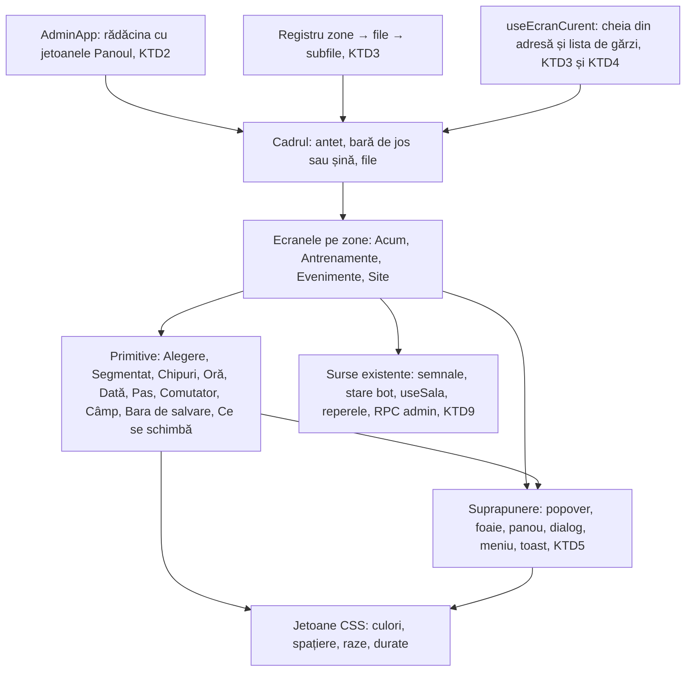
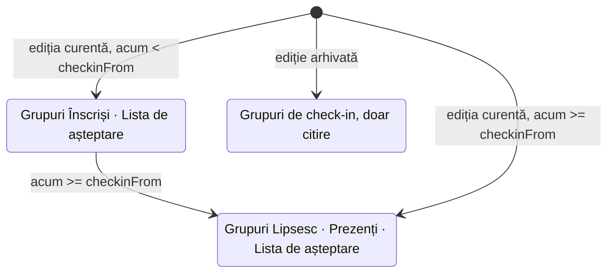
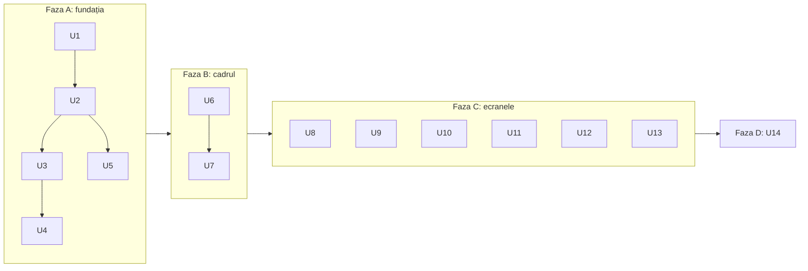

# Redesignul adminului Run + Lift pe zone de activitate, în finisajul Panoul - Plan

## Goal Capsule

- **Obiectiv:** Organizatorul găsește activitatea următoare, oamenii ei și acțiunea necesară fără să caute printre ecrane. Merge la fel de bine pe telefon (la antrenament sau la intrarea în cursă) și la birou. Adminul arată și răspunde ca o unealtă de lucru modernă, nu ca un formular de sistem.
- **Mijloc:** Registrul de ecrane existent se reorganizează în patru zone (KTD3). Tema luminoasă „Panoul” se aplică doar pe rădăcina adminului (KTD2). Controalele sunt primitive proprii care păstrează API-urile celor de azi (KTD1, KTD5). Prototipul din 6 octombrie 2026 e referința vizuală.
- **Autoritate de produs:** Planul deține structura, navigația, aspectul, controalele și comportamentele comune ale adminului `/admin`, inclusiv mutarea tuturor ecranelor existente. Nu deține pagina publică, schema bazei de date sau capabilități noi de backend.
- **Autoritate tehnică:** Pe comportamentul de produs câștigă R-urile. Pe mecanism câștigă KTD-urile din Planning Contract. Unitățile nu le suprascriu pe niciunele.
- **Profil de execuție:** Patru faze, în ordine:
  - **A — fundația:** U1–U5;
  - **B — cadrul:** U6, U7;
  - **C — ecranele:** U8–U13, independente între ele;
  - **D — verificarea:** U14.
  
  Fiecare unitate lasă verificările din Verification Contract verzi și adminul funcțional.
- **Condiții de oprire:** Oprește-te și întreabă dacă:
  - o schimbare ar atinge schema bazei, o funcție RPC sau o funcție Edge;
  - un ecran ar pierde o capabilitate din `docs/reviews/2026-10-04-admin-ui-audit.md` §5;
  - stilul adminului ar schimba pagina publică;
  - testele e2e ar rula pe alt checkout decât cel modificat (vezi Verification Contract).
- **Coada:**
  - Lucrul se face pe branch-ul nou `feat/redesign-admin-panoul`, pornit din `docs/redesign-run-lift` (PR #54, care aduce planul).
  - Push și PR doar cu acordul utilizatorului.
  - Merge-ul în `main` e deploy-ul (CI → Vercel).
  - Fără migrări și fără funcții Edge.
- **Blocante deschise:** Niciunul.

---

## Product Contract

**Păstrarea contractului de produs:** Schimbat doar prin adăugarea R37 și R38. Ambele au venit din verificarea documentului și au fost acceptate de utilizator. Cele patru întrebări amânate la planificare sunt rezolvate de KTD1, KTD3, KTD4 și KTD8, așa că au ieșit din Outstanding Questions.

### Summary

Adminul primește patru zone: Acum, Antrenamente, Evenimente și Site. Fiecare zonă are file pentru oameni, mesaje și setări, construite după același tipar. Toate ecranele de azi se mută în ele cu capabilitățile intacte. Aspectul urmează finisajul „Panoul”: suprafață caldă și luminoasă, lime doar ca umplere a acțiunii principale. Controalele native (liste derulante, selectoare de dată și oră, căsuțe, spinnere, `confirm()`) sunt înlocuite de controale proprii, liniștite în repaus și vii la fiecare acțiune.

### Problem Frame

Auditul din 4 octombrie 2026 a verificat în browser 13 probleme. Ce se simte cel mai des:

- Pe telefon, lista participanților începe sub cinci plăci de statistici.
- Tabelul de 1000 px e înghesuit într-un container de ~348 px.
- Antetul fix ocupă ~209 px.
- Textul nesalvat din programul săptămânal și mesajul Telegram dispare la navigare.

Ziua de lucru e împărțită între 14 destinații, alese dintr-o listă derulantă „Ecran”. Evenimentul domină pagina de început, deși antrenamentul din parc e sarcina săptămânală.

Senzația de „Windows 2003” vine din controale, nu din culorile brandului. Adminul are:

- 18 liste `<select>` native;
- 12 selectoare native de dată și oră;
- 7 căsuțe și 2 butoane radio nestilizate;
- 8 câmpuri numerice cu spinner;
- 20 de grupuri `fieldset`/`legend` cu stil implicit;
- 4 ferestre `confirm()`/`alert()` de sistem.

În plus, fiecare etichetă și fiecare buton e o cutie Anton majusculă, deci „Șterge” are aceeași greutate ca „Editează”.

Organizatorii sunt Vlad și Roma, cu aceleași drepturi. Lucrează în trei contexte: pe telefon în dimineața antrenamentului, pe telefon la intrarea în cursă (cu mâinile ocupate) și la birou când pregătesc o ediție.

### Key Decisions

- **Patru zone după activitate, cu file care se repetă în fiecare zonă.** Oamenii și mesajele unei activități stau lângă ea, fără o agendă nouă. (session-settled: user-approved — chosen over A, cele 14 ecrane lustruite, și C, agenda activităților: A lasă ziua împărțită între destinații, C cere o agendă comună pe care operațiunea de azi nu o justifică.) Governs R1–R6.
- **Finisajul „Panoul” peste tot, pe telefon și pe desktop.** (session-settled: user-directed — chosen over A · Sesiunea, „A pe telefon + B pe desktop” și un amestec pe ecrane: utilizatorul le-a încercat pe toate în prototip.) Governs R31, R32.
- **Minimalist, dar dinamic, la elemente și la câmpuri.** Cerut de utilizator. Liniștea vine din puține borduri și umbre și dintr-un singur accent. Dinamismul vine din răspunsul vizibil la acțiuni și la date schimbate, niciodată din mișcare decorativă. Governs R25–R30.
- **Tot adminul într-un singur plan.** Navigația nu poate fi pe jumătate veche și pe jumătate nouă. (session-settled: user-approved — chosen over o primă etapă doar cu ecranele din prototip: ar fi lăsat două sisteme de navigație în paralel.) Governs R1.
- **Participanții se grupează după faza ediției.** Gruparea după check-in are sens doar în ziua cursei. (session-settled: user-approved — chosen over gruparea permanentă după check-in din prototip: înainte de cursă ar fi pus pe toată lumea la „Lipsesc”.) Governs R16.
- **Check-in cu țintă mare pe telefon.** Aspectul rămâne cel din B, dar ținta are mărimea din A, pentru mâini ocupate. (session-settled: user-approved — chosen over căsuța de 24 px din prototipul B.) Governs R17.
- **Doar tema luminoasă acum, cu culorile definite o singură dată.** (session-settled: user-approved — chosen over o temă întunecată în paralel: dublează verificarea fără o cerere reală.) Governs R32.

### Harta ecranelor

| Ecranul de azi | Locul nou |
| --- | --- |
| Desfășurarea ediției | Acum (reperul următor) și Evenimente → Rezumat (desfășurarea completă) |
| Participanți | Evenimente → Participanți |
| Abonați la anunț | Evenimente → Abonați |
| Trimite emailuri | Evenimente → Mesaje → Compune |
| Livrare | Evenimente → Mesaje → Livrare |
| Șabloane | Evenimente → Mesaje → Șabloane comune |
| Evenimentul | Evenimente → Detalii și publicare |
| Prezențe (grup) | Antrenamente → Următorul și Antrenamente → Istoric și analiză |
| Analiza prezențelor | Antrenamente → Istoric și analiză |
| Membrii grupului | Antrenamente → Membri |
| Botul de Telegram | Antrenamente → Mesaje (mesajul manual) și Antrenamente → Setări bot (orar, text, comenzi, jurnal) |
| Antrenamente (programul public) | Site → Program săptămânal |
| Clipuri | Site → Clipuri |
| Coming Soon | Site → Prelansare |

### Requirements

**Structura și navigația**

- R1. Adminul are patru zone: Acum, Antrenamente, Evenimente și Site. Fiecare ecran de azi primește locul din Harta ecranelor și își păstrează capabilitățile.
- R2. Filele zonelor sunt:
  - **Antrenamente:** Următorul · Istoric și analiză · Membri · Mesaje · Setări bot.
  - **Evenimente:** Rezumat · Participanți · Mesaje (Compune / Livrare / Șabloane comune) · Detalii și publicare · Abonați.
  - **Site:** Program săptămânal · Clipuri · Prelansare.
- R3. Pe telefon, zonele stau într-o bară de jos cu patru intrări, iar filele zonei într-un rând derulabil sub titlu. Pe desktop, o șină stângă arată deodată zonele și filele lor. Lista derulantă „Ecran” dispare.
- R4. Selectorul de ediție apare doar în Evenimente și nu filtrează antrenamentele, membrii, programul public sau clipurile. Șabloanele poartă vizibil eticheta „comune tuturor edițiilor”.
- R5. Fiecare zonă și filă are adresă proprie, iar Back și Forward din browser funcționează. Adresele de azi (de exemplu `#participanti`, `#livrare`, `#grup-bot`) duc la noul loc al ecranului.
- R6. Pe telefon, antetul fix ocupă un singur rând. Semnalele de atenție apar pe Acum și ca număr pe zona Acum, nu ca bandă permanentă deasupra fiecărui ecran.
- R7. Ecranul de autentificare și stările de încărcare inițială urmează același finisaj.
- R38. Atingerea unei zone deschide ultima filă vizitată în zona aceea în sesiunea curentă. Dacă n-a fost vizitată nicio filă, se deschide prima.

**Acum**

- R8. Acum arată:
  - săptămâna curentă: antrenamentele, termenele ediției și evenimentul pe zilele lor;
  - lista „De rezolvat”;
  - antrenamentul următor, cu vin / nu pot / fără răspuns;
  - ediția următoare, cu locurile ocupate și reperul ei următor.
- R9. „De rezolvat” adună semnalele existente care cer o acțiune (emailuri nelivrate, ciornă nepublicată, previzualizarea rămasă în urmă, comenzi de bot eșuate), fiecare cu acțiunea ei pe loc. O problemă rezolvată iese din listă și din numărătoare.
- R10. O atingere pe o cifră a antrenamentului duce la lista filtrată corespunzătoare, de exemplu „Fără răspuns”.
- R11. Cifrele se actualizează la ritmul de reîmprospătare de azi, fără reîncărcarea paginii, iar schimbarea se vede.

**Antrenamente**

- R12. Următorul arată răspunsurile la sondaj, filtrabile după Toți / Vin / Nu pot / Fără răspuns. Ecranul spune că sunt răspunsuri declarate și că prezența reală se marchează după antrenament, în Istoric.
- R13. Mesajul manual către grup are fila lui (Mesaje), separată de Setări bot.
- R14. Setări bot are:
  - zilele ca chipuri;
  - orele ca chip de oră;
  - pragul reminderului ca stepper, cu propoziția vie „pleacă / nu pleacă” pentru antrenamentul următor;
  - comutatoare cu descriere;
  - o previzualizare a sondajului care se schimbă pe loc.
- R15. Comutatorul se numește „Automatizări programate”, nu „botul e pornit/oprit”. Succesul unei comenzi nu e prezentat ca mesaj citit de membri.
- R37. Până pleacă sondajul pentru antrenamentul următor, Acum și Următorul arată când pleacă, în loc de vin / nu pot / fără răspuns. Membrii încă neîntrebați nu apar ca „fără răspuns”.

**Evenimente → Participanți**

- R16. Lista e grupată după faza ediției:
  - **înainte de ora de check-in:** Înscriși · Lista de așteptare;
  - **de la ora de check-in:** Lipsesc la check-in · Prezenți · Lista de așteptare.
  
  Cine e marcat prezent trece în grupul lui.
- R17. Prezența se marchează dintr-o atingere pe rând, cu un toast „Anulează” câteva secunde. Corectarea rămâne posibilă din detalii. Pe telefon, ținta de check-in are ~52 px.
- R18. Deasupra listei stă un rezumat compact într-un singur rând, cu bară de ocupare: înscriși din capacitate, așteptare, check-in, emailuri nelivrate. Lângă el, căutare după nume, telefon sau email, care merge și fără diacritice.
- R19. Detaliile unei persoane se deschid într-un panou alăturat pe desktop și într-o foaie de jos pe telefon. Conțin:
  - telefonul și emailul, copiabile;
  - starea ultimului email (În coadă / Acceptat de furnizor / Livrat / Nelivrat);
  - ștergerea, ca acțiune secundară, cu confirmare pe loc.
- R20. Din starea emailului unei persoane se deschide Livrarea filtrată pe persoană și ediție. Revenirea păstrează filtrul și poziția în listă. Retrimiterea apare doar unde regulile de azi o permit.

**Evenimente → Mesaje și Detalii**

- R21. Compunerea are:
  - audiența aleasă din carduri cu numărul de persoane;
  - meniul „Inserează câmp”, care pune câmpul la cursor;
  - o previzualizare cu datele unui destinatar;
  - o confirmare la trimitere care spune câte persoane primesc și câte sunt excluse.
- R22. Detalii și publicare arată sus dacă ce vezi e ciornă sau publicat. Câmpurile:
  - data, din chipuri rapide (sâmbetele următoare) sau calendar;
  - ora, ca chip de oră;
  - durata și „Cine vine”, ca control segmentat;
  - locurile și lista de așteptare, ca stepper.
- R23. Pe desktop, Detaliile și Setările bot au o coloană „Ce se schimbă” (valoarea veche → cea nouă) și o previzualizare: ce vede vizitatorul, respectiv sondajul.
- R24. Se păstrează:
  - separarea ciornă / publicat, validarea și previzualizarea;
  - versiunile cu restaurare;
  - confirmarea publicării;
  - regulile listei de așteptare;
  - edițiile arhivate doar pentru citire.

**Controale și câmpuri — minimalist, dar dinamic**

- R25. În admin nu rămâne niciun control nativ de sistem: fără `<select>` nativ, fără selector nativ de dată sau oră, fără căsuță sau buton radio nestilizat, fără spinner numeric și fără `confirm()`/`alert()`.
- R26. Setul comun de controale, după prototip:
  - **alegeri:** control segmentat (2–5 opțiuni), chipuri, listă proprie în popover care devine foaie de jos pe telefon;
  - **date și cifre:** chipuri rapide de dată cu calendar, chip de oră, stepper, comutator cu descriere;
  - **liste și acțiuni:** carduri de selecție cu număr, meniu ⋯, panou lateral sau foaie de jos;
  - **feedback:** toast cu „Anulează”, skeleton la încărcare, bara de salvare.
- R27. În repaus, câmpurile sunt liniștite: etichetă scurtă deasupra, valoarea pe o suprafață plată, fără chenar greu și fără etichete majuscule. La focus, conturul și accentul se schimbă vizibil și animat.
- R28. Textul de sub câmp reacționează la valoare în timp ce o schimbi: data relativă („peste 3 zile”), locurile libere după salvare, efectul pragului, numărul de destinatari. Validarea apare lângă câmp, în română, cu calea de rezolvare, nu abia la salvare.
- R29. Câmpul modificat și nesalvat poartă un semn lângă etichetă. Bara de salvare apare doar când există modificări și spune câte sunt. După salvare, confirmarea se vede pe loc.
- R30. Mișcarea apare doar ca răspuns la o acțiune sau la date schimbate: apăsare, comutare, cifră nouă, rând care se mută, panou sau foaie care intră, toast. Durata e de ~150–300 ms. Fără mișcare decorativă. Cu `prefers-reduced-motion`, totul se schimbă instantaneu.

**Finisaj**

- R31. Aspectul urmează prototipul B · Panoul:
  - **culori:** suprafață caldă și luminoasă, text în cerneală închisă; lime doar ca umplere cu text închis (acțiunea principală, selecția); accentul de text și grafic în măsliniu; stările în pasteluri cu text închis;
  - **borduri și forme:** borduri fine de 1 px, umbre aproape inexistente (doar pe ce plutește), colțuri mici și diferite după rol;
  - **tipografie:** Anton doar pentru titlurile de pagină și cifrele mari; Archivo pentru rest, cu majusculă doar la început de propoziție, și cifre tabulare.
- R32. Culorile, spațierea, razele și durata mișcării sunt definite o singură dată și folosite peste tot, ca o temă întunecată să poată fi adăugată ulterior fără să refaci ecranele.

**Comportamente comune**

- R33. Pe toate suprafețele editabile, textul nesalvat nu se pierde tăcut la navigare: programul săptămânal, mesajul Telegram, compunerea de email, șabloanele, evenimentul, clipurile, setările botului și prelansarea. Azi, programul săptămânal și mesajul Telegram pierd textul.
- R34. Dialogurile, foile și panourile:
  - primesc focus la deschidere și îl țin;
  - se închid cu Escape, acolo unde e potrivit;
  - la închidere, întorc focusul la elementul din care s-au deschis.
- R35. Stările ecranelor:
  - încărcarea nu apare niciodată ca zero;
  - o stare goală spune pasul următor;
  - o eroare explică în română ce s-a întâmplat și cum se repară.
- R36. Accesibilitate și lățime:
  - ținte tactile de cel puțin 44 px;
  - contrast de cel puțin 4.5:1 la text și 3:1 la controale și grafice;
  - totul se poate folosi la 360 px fără derulare orizontală și doar cu tastatura.

### Key Flows

- F1. Dimineața dinaintea antrenamentului, pe telefon
  - **Trigger:** Organizatorul vrea să știe cine vine mâine.
  - **Steps:** Acum → cifrele antrenamentului următor → „Fără răspuns” → lista filtrată → la nevoie, Antrenamente → Mesaje, pentru un mesaj în grup.
  - **Outcome:** Știe în câteva secunde câți vin și cine n-a răspuns, fără să treacă prin setările botului.
  - **Covered by:** R8, R10, R12, R13
- F2. Intrarea în cursă
  - **Trigger:** S-a deschis check-in-ul ediției.
  - **Steps:** Evenimente → Participanți → caută sau parcurge „Lipsesc la check-in” → atinge check-in-ul → toastul confirmă, cu „Anulează” → rândul trece la „Prezenți”, iar cifrele se schimbă.
  - **Outcome:** Prezența e marcată dintr-o atingere și se poate corecta.
  - **Covered by:** R16, R17, R18, R19
- F3. Un participant nu primește emailul
  - **Trigger:** Acum arată „1 email nelivrat”.
  - **Steps:** „Vezi” → Livrarea filtrată pe persoană → detaliile persoanei → retrimitere, dacă regulile o permit → înapoi, cu filtrul păstrat.
  - **Covered by:** R9, R19, R20
- F4. Schimbarea orei sondajului
  - **Trigger:** Antrenamentul se mută.
  - **Steps:** Antrenamente → Setări bot → chipul de oră → ora nouă → previzualizarea și „Ce se schimbă” se actualizează, câmpul e marcat, bara spune „1 modificare” → Salvează → confirmarea pe loc.
  - **Covered by:** R14, R23, R28, R29
- F5. Mutarea datei cursei
  - **Trigger:** Ediția se mută cu o săptămână.
  - **Steps:** Evenimente → Detalii și publicare → chip rapid sau calendar → data relativă se actualizează → bannerul trece pe „Ciornă” → Salvează ciorna → Publică, cu confirmare.
  - **Covered by:** R22, R24, R28, R29

### Acceptance Examples

- AE1. Gruparea după fază
  - **Covers:** R16
  - **Given:** check-in-ul ediției încă nu s-a deschis.
  - **When:** organizatorul deschide Participanți.
  - **Then:** vede grupurile Înscriși și Lista de așteptare, fără „Lipsesc la check-in”.
  - **Apoi:** după ora de check-in, aceeași listă apare ca Lipsesc la check-in · Prezenți · Lista de așteptare.
- AE2. Anularea unei prezențe greșite
  - **Covers:** R17
  - **Given:** un participant a fost marcat prezent din greșeală.
  - **When:** organizatorul apasă „Anulează” în toast.
  - **Then:** participantul revine la „Lipsesc”, iar cifrele de check-in revin.
- AE3. Text nesalvat la plecare
  - **Covers:** R33
  - **Given:** organizatorul a scris în programul săptămânal sau în mesajul Telegram și n-a salvat.
  - **When:** apasă pe altă zonă sau pe Back.
  - **Then:** fie e întrebat înainte de plecare, fie își găsește textul neschimbat la întoarcere.
- AE4. Mai puține locuri decât înscriși
  - **Covers:** R28
  - **Given:** ediția are 22 de înscriși.
  - **When:** organizatorul scade locurile la 20.
  - **Then:** lângă câmp apare avertismentul că 2 persoane ar rămâne peste limită și nu se șterge nimeni automat.
- AE5. Adresă veche
  - **Covers:** R5
  - **Given:** un link salvat către `/admin#livrare`.
  - **When:** organizatorul îl deschide.
  - **Then:** ajunge în Evenimente → Mesaje → Livrare.
- AE6. Mișcare redusă
  - **Covers:** R30
  - **Given:** sistemul cere mișcare redusă.
  - **When:** se schimbă o cifră sau se deschide o foaie.
  - **Then:** schimbarea apare instantaneu, fără animație.

### Success Criteria

- Pe telefon, organizatorul vede antrenamentul următor și persoanele fără răspuns din Acum, fără să deschidă setările botului.
- În ziua cursei, găsește un participant, îi vede starea și îi corectează prezența fără derulare laterală.
- O căutare în `src/admin` nu mai găsește controale native de formular sau `confirm()`/`alert()`.
- Aceleași sarcini, măsurate în adminul de azi și în cel nou (timp, navigări greșite, context pierdut), arată mai puține navigări greșite și nicio pierdere de text. Măsurăm întâi adminul de azi, ca bază; nu promitem procente.
- Utilizatorul confirmă că adminul implementat se simte „minimalist, dar dinamic”, comparat cu prototipul.

### Scope Boundaries

- Redesignul paginii publice (`redesign.md`, §1–13) e o lucrare separată.
- Fără capabilități noi de backend:
  - plăți și abonamente;
  - profil unic de client;
  - programe digitale;
  - agendă cu mai multe locații;
  - mesaje de bot pentru orice dată;
  - prezență verificată, dincolo de marcarea de mână existentă.
- Fără analize noi: Istoric și analiză mută ce există azi.
- Tema întunecată a adminului vine mai târziu (R32 o face posibilă).
- Participanții la ediții și membrii Telegram rămân identități separate.

#### Deferred to Follow-Up Work

- Măsurarea de bază a sarcinilor în adminul de azi (Success Criteria) se face înainte de merge, de către utilizator. Nu e o unitate de cod.

### Dependencies / Assumptions

- Organizatorii sunt Vlad și Roma, cu aceleași drepturi, conform `docs/plans/2026-10-03-1107-feat-botul-si-prezentele-in-admin-plan.md`.
- Frecvența sarcinilor nu e validată, pentru că întrebarea despre utilizarea reală a rămas fără răspuns. Presupunem că antrenamentul săptămânal e sarcina cea mai frecventă și că ziua cursei e momentul cel mai solicitant.
- Acum, „De rezolvat” și cifrele folosesc doar date și semnale existente.
- Auditul descrie commit-ul `8bb98b8`. Între timp, PR #51 a adus marcarea de mână a prezenței în Prezențe. Constatările se reverifică pe cod înainte de implementare.

### Sources / Research

- `docs/reviews/2026-10-04-admin-ui-audit.md`: problemele verificate, inventarul celor 14 ecrane, fluxurile și ce trebuie păstrat (§5).
- `redesign.md` §14: legătura cu redesignul paginii publice.
- Prototipul: `.context/compound-engineering/ce-prototype/2026-10-06-admin-finisaj/`. E local și ignorat de git. Se pornește cu `prototip-admin` din `.claude/launch.json`. `decisions.md` descrie ce a câștigat și de ce.
- Registrul de azi al ecranelor: `src/admin/adminNavigatie.ts`. Adresele și garda de ieșire: `src/admin/useEcranCurent.ts` (garda e folosită azi doar de Eveniment, Clipuri și Setări bot).
- Semnalele de atenție existente: `src/admin/stareCurenta.ts` (`SemnaleAdmin`, `semnaleDeAtentie`).
- Planurile anterioare: `docs/plans/2026-09-22-1328-feat-admin-pe-ecrane-plan.md` și `docs/plans/2026-10-03-1107-feat-botul-si-prezentele-in-admin-plan.md`.

---

## Planning Contract

### Key Technical Decisions

- KTD1. **Controale proprii, fără dependențe noi.** Proiectul nu are biblioteci UI. Are deja primitive cu API stabil: `ListaDerulanta`, `GrupRadio` și `ListaOrdonabila` (`src/admin/controale/`), `Dialog` (`src/admin/eventTab/Dialog.tsx`), `Camp` (`src/admin/eventTab/primitive.tsx`) și `CampEditare` (`src/admin/continut/campuri.tsx`). Le păstrăm API-ul și le schimbăm interiorul, așa că ecranele migrează fără rescriere. O bibliotecă headless ar aduce o dependență și un al doilea stil de API pentru ~12 controale. Implementează R25, R26.
- KTD2. **Tema „Panoul” are jetoanele ei, pe rădăcina adminului.** `src/index.css` e global, iar variabilele `--e3-*` le folosește și pagina publică. Adminul primește un set propriu de jetoane (culori, spațiere, raze, durate de mișcare), definit pe elementul rădăcină al `/admin`. Regulile `.admin-*` citesc doar aceste jetoane, așa că pagina publică nu se schimbă. Valorile vin din prototip (blocul `[data-dir="B"]`). Implementează R31, R32.
- KTD3. **Adresa rămâne cheia filei, iar zona se deduce din registru.** Toate cheile de azi rămân valabile, deci niciun link salvat nu se rupe (R5):
  - `desfasurare` devine fila Rezumat din Evenimente;
  - `grup-prezente` devine Următorul;
  - `grup-analiza` devine Istoric și analiză;
  - `grup-bot` devine Setări bot.
  
  Apar două chei noi: `acum` (aterizarea implicită) și `grup-mesaje`. Registrul din `src/admin/adminNavigatie.ts` devine zone → file → subfile și preia lista ecranelor care depind de ediție. Alternativa, adrese ierarhice `#zona/fila`, ar fi rupt linkurile salvate pentru un câștig doar estetic. Implementează R1, R2, R4, R5.
- KTD4. **Textul nesalvat e protejat în două feluri, după tipul suprafeței.**
  - Formularele cu „Salvează” înregistrează o gardă de ieșire: programul, evenimentul, clipurile, șabloanele, setările botului, prelansarea.
  - Compunerile de text liber își păstrează ciorna în `sessionStorage`, legată de sesiunea de admin: mesajul Telegram și emailul. Ciorna se golește după o trimitere reușită.
  
  Garda din `src/admin/useEcranCurent.ts` devine o listă de gărzi, nu una singură. Implementează R29, R33.
- KTD5. **O singură primitivă de suprapunere, cu prezentarea aleasă după lățime.** Popoverul, foaia de jos, panoul lateral și dialogul central folosesc logica de focus din `src/admin/eventTab/Dialog.tsx`: focus la deschidere, capcană de focus, Escape și întoarcerea focusului. Sub 760 px (pragul prototipului), popoverul și panoul devin foaie de jos. Implementează R19, R26, R34.
- KTD6. **Faza listei de participanți vine din ora de check-in a ediției.**
  - **ediția curentă, înainte de `checkinFrom`** (configul publicat): gruparea de înscriere;
  - **ediția curentă, de la `checkinFrom`:** gruparea de check-in;
  - **ediție arhivată:** mereu după check-in, doar pentru citire.
  
  Implementează R16.
- KTD7. **Mișcarea folosește CSS cu durate din jetoane și un singur hook pentru cifre.** Tranzițiile și keyframes-urile animă doar `transform` și `opacity`. Cifrele animate trec printr-un hook care respectă `prefers-reduced-motion`. Nu adăugăm o bibliotecă de animație. Implementează R11, R30.
- KTD8. **Un branch, un PR la final, livrat în faze.** Fundația (faza A) schimbă interiorul primitivelor și tema fără să mute navigația, deci adminul vechi rămâne funcțional după fiecare commit. Navigația nouă (faza B) și ecranele (faza C) ajung în producție odată, ca să nu existe două navigații (R1).
- KTD9. **Acum se compune din surse existente.** Folosește `semnaleDeAtentie` (`src/admin/stareCurenta.ts`), starea comenzilor botului (`src/admin/sala/stareBot.ts`), datele grupului (`src/admin/sala/useSala.ts`) și reperele ediției (`src/admin/reperele.ts`). Nu adaugă nicio cerere nouă la backend. Implementează R8, R9.

### High-Level Technical Design

**Componentele și dependențele lor.**

**Registrul: cheie → zonă → filă (KTD3).**

| Cheia din adresă | Zona | Fila (subfila) | Depinde de ediție |
| --- | --- | --- | --- |
| `acum` (nouă, implicită) | Acum | — | nu |
| `grup-prezente` | Antrenamente | Următorul | nu |
| `grup-analiza` | Antrenamente | Istoric și analiză | nu |
| `grup-membri` | Antrenamente | Membri | nu |
| `grup-mesaje` (nouă) | Antrenamente | Mesaje | nu |
| `grup-bot` | Antrenamente | Setări bot | nu |
| `desfasurare` | Evenimente | Rezumat | da |
| `participanti` | Evenimente | Participanți | da |
| `email` | Evenimente | Mesaje (Compune) | da |
| `livrare` | Evenimente | Mesaje (Livrare) | da |
| `sabloane` | Evenimente | Mesaje (Șabloane comune) | nu, comune |
| `eveniment` | Evenimente | Detalii și publicare | da |
| `lansare` | Evenimente | Abonați | da |
| `antrenament` | Site | Program săptămânal | nu |
| `clipuri` | Site | Clipuri | nu |
| `coming-soon` | Site | Prelansare | nu |

**Faza listei de participanți (KTD6).**

**Cum se prezintă o suprapunere (KTD5).**

| Ce se deschide | Peste 760 px | Sub 760 px |
| --- | --- | --- |
| Alegere (listă, oră, dată, fus orar, ediție, „Inserează câmp”) | Popover ancorat sub declanșator; dacă nu încape, derulează pagina, apoi deasupra | Foaie de jos |
| Meniul ⋯ | Popover ancorat | Foaie de jos |
| Detaliile unui participant | Panou lateral; în Participanți e un panou permanent alăturat | Foaie de jos |
| Confirmare (publicare, trimitere, ștergere, ieșire cu text nesalvat) | Dialog central | Dialog central |

**Contractul pentru text nesalvat (KTD4).**

| Suprafața | Mecanism | Ce vede organizatorul la plecare |
| --- | --- | --- |
| Program săptămânal, Detalii eveniment, Clipuri, Șabloane, Setări bot, Prelansare | Gardă de ieșire | Dialogul „Ai modificări nesalvate”, cu Rămâi / Pleacă fără să salvezi |
| Mesaj Telegram, Compune email | Ciornă în `sessionStorage` | Nimic; la întoarcere, textul e acolo |

### Assumptions

Confirmarea de scop a fost sărită, pentru că utilizatorul a cerut să trecem direct la implementare. Pariurile de mai jos nu sunt validate:

- **Antetul:** chipul „Pe site” (faza paginii publice) rămâne în antet pe desktop. Pe telefon trece în zona Site și în Acum. Numărătoarea spre anunț se mută în Evenimente → Rezumat.
- **Blocul săptămânal:** programul public al săptămânii iese de pe Acum și stă doar în Site → Program săptămânal.
- **Membri și Istoric și analiză:** își păstrează conținutul de azi. Se schimbă doar controalele și locul.
- **Check-in dintr-o atingere:** trimite prezența împreună cu numărul de concurs și timpul deja salvate pe rând, fiindcă `setPrezenta` (`src/lib/adminApi.ts`) le scrie pe toate trei; altfel le-ar șterge. Numărul și timpul se completează din detalii, prin `DialogPrezenta`.
- **Ținta de check-in:** 52 px doar sub 760 px. Pe desktop, 44 px.
- **Ciornele de compunere:** trăiesc doar în tabul curent (`sessionStorage`), nu se sincronizează între dispozitive sau organizatori.
- **„De rezolvat”:** comanda eșuată a botului e semnalată din `stareBot`. Butonul Reîncearcă repornește comanda prin RPC-ul existent din `EcranBot`.

### Sequencing

### System-Wide Impact

- **Pagina publică:** `src/index.css` e comun. KTD2 izolează tema, iar testele e2e publice (`tests/landing.spec.ts`, `tests/faze.spec.ts`) trebuie să rămână verzi.
- **Garda de clase:** `tests/unit/claseCss.test.ts` cere ca orice clasă `admin-*` folosită să existe în CSS. Clasele noi se adaugă împreună cu componentele lor.
- **Cod mort:** `npm run deadcode` (knip) prinde componentele scoase din uz, de exemplu `AdminNav`, `CardGrup`, `EcranPornire` și `BlocSaptamanal`, dacă rămân neimportate. Le ștergem în unitatea care le înlocuiește.
- **Testele existente:** testele unitare și e2e ale adminului caută după etichete și roluri care se schimbă: „Toate ecranele”, „Desfășurarea ediției”, „Calea de întoarcere”, lista „Ecran”. Fiecare unitate își actualizează testele atinse.
- **Previzualizarea de dezvoltare:** `src/admin-preview.tsx` are nevoie de date pentru filele noi (Acum, Mesaje în grup), ca verificarea vizuală să fie posibilă.
- **Documentația:** `docs/FLUXURI.md` §4 descrie adminul pe ecranele vechi și cere să fie actualizat la orice schimbare de flux.

### Risks & Dependencies

| Risc | Mitigare |
| --- | --- |
| Testele e2e din worktree lovesc serverul de dev de pe 5173, care servește checkout-ul principal (`run-lift-landing`), nu worktree-ul | Condiție de oprire în Goal Capsule. Înainte de e2e, confirmă că serverul de pe 5173 servește codul modificat sau cere utilizatorului să-l oprească (memorie: nu se oprește fără acord). |
| Un PR foarte mare, greu de revizuit | Commit-uri pe unități (U-ID în mesaj), iar fiecare commit lasă adminul funcțional (KTD8). |
| Valorile `datetime-local` din configul evenimentului nu mai trec la fel prin controalele noi de dată și oră | Teste de dus-întors în U11 și U13, pe `eventConfigForm` și `eventConfigFields`. |
| Calculele de dată (sâmbetele următoare, fazele) ies greșit în fusul orar | Calculele folosesc `Europe/Chisinau`, ca restul aplicației. Testele fixează ora. |
| Pragurile de acoperire (75/74/70/67) scad din cauza componentelor noi | Fiecare primitivă din U2–U4 vine cu testele ei. |

### Documentation / Operational Notes

- U14 actualizează `docs/FLUXURI.md` §4 (structura ecranului, navigația și fluxurile pe zone) și tabelul „Unde schimbi ce”.
- Nu se schimbă nimic operațional: fără migrări, fără variabile de mediu, fără funcții Edge.

---

## Implementation Units

**Index**

| U-ID | Titlu | Fișiere principale | Depinde de |
| --- | --- | --- | --- |
| U1 | Jetoanele și tema Panoul | `src/index.css`, `src/admin/AdminApp.tsx` | — |
| U2 | Suprapunerea comună | `src/admin/controale/Suprapunere.tsx`, `src/admin/eventTab/Dialog.tsx` | U1 |
| U3 | Controalele de alegere și valoare | `src/admin/controale/*` | U2 |
| U4 | Câmpul liniștit și bara de salvare | `src/admin/eventTab/primitive.tsx`, `src/admin/continut/campuri.tsx` | U3 |
| U5 | Contractul pentru text nesalvat | `src/admin/useEcranCurent.ts`, `src/admin/controale/useCiorna.ts` | U2 |
| U6 | Registrul de zone și file | `src/admin/adminNavigatie.ts`, `src/admin/stareCurenta.ts` | U5 |
| U7 | Cadrul nou | `src/admin/AdminCadru.tsx`, `src/admin/AdminDashboard.tsx` | U3, U6 |
| U8 | Acum | `src/admin/EcranAcum.tsx` | U7 |
| U9 | Evenimente → Participanți | `src/admin/Participanti.tsx`, `src/admin/DetaliiParticipant.tsx` | U4, U7 |
| U10 | Evenimente → Mesaje, Rezumat, Abonați | `src/admin/AdminEmailTab.tsx`, `src/admin/AdminDeliveryTab.tsx` | U4, U5, U7 |
| U11 | Evenimente → Detalii și publicare | `src/admin/AdminEventTab.tsx`, `src/admin/eventTab/grupuri/*` | U4, U7 |
| U12 | Antrenamente | `src/admin/sala/*` | U4, U5, U7 |
| U13 | Site | `src/admin/AdminAntrenamentTab.tsx`, `src/admin/AdminClipuriTab.tsx`, `src/admin/AdminComingSoonTab.tsx` | U4, U5, U7 |
| U14 | Curățenie, accesibilitate și documentație | `tests/unit/faraControaleNative.test.ts`, `docs/FLUXURI.md` | U8–U13 |

### U1. Jetoanele și tema Panoul

**Goal:** Adminul de azi trece în paleta, tipografia și mișcarea „Panoul”, fără să schimbe pagina publică.

**Requirements:** R7, R30, R31, R32, R36. KTD2, KTD7.

**Dependencies:** Niciuna.

**Files:**
- Modify: `src/index.css` (secțiunea „Admin backoffice”), `src/admin/AdminApp.tsx`, `src/admin/AdminLogin.tsx`, `src/admin/AdminSkeleton.tsx`
- Create: `tests/unit/temaAdmin.test.ts`
- Test: `tests/unit/claseCss.test.ts` (rămâne verde)

**Approach:**
1. Definește jetoanele adminului pe elementul rădăcină randat de `AdminApp` (și de ecranul de login): culori, spațiere, raze (6/10/16 px), durate de mișcare. Valorile vin din prototip, blocul `[data-dir="B"]` din `screens/app/app.css`.
2. Rescrie regulile `.admin-*` ca să citească doar jetoanele adminului. Numele claselor rămân aceleași.
3. Tipografia: Anton doar pe titlurile de pagină și pe cifrele mari. Etichetele majuscule cu spațiere devin text cu majusculă doar la început. Cifrele sunt tabulare.
4. Un bloc `prefers-reduced-motion` pentru admin anulează duratele (KTD7).
5. Orice clasă nouă poartă prefixul `admin-`, ca garda din `tests/unit/claseCss.test.ts` s-o verifice. Numele din prototip (`seg`, `pill`, `chip` și celelalte) nu se copiază ca atare. Regula se aplică în toate unitățile.

**Patterns to follow:** Structura secțiunii admin din `src/index.css`. Jetoanele și umbrele din prototip.

**Execution note:** E mai ales stil, deci verificarea principală e vizuală în `/admin-preview.html`, pe 390 și pe 1280 px.

**Test scenarios:**
- Fiecare jeton al adminului e definit o singură dată, pe rădăcina adminului.
- Nicio regulă `.admin-*` nu mai citește o variabilă `--e3-*` (scanare statică a secțiunii admin).
- Perechile text/suprafață din jetoane au contrast ≥4.5:1, iar perechile control/suprafață ≥3:1 (calculat în test din valorile jetoanelor).
- Ecranul de login se randează pe rădăcina adminului, cu jetoanele aplicate.

**Verification:** `/admin-preview.html` se deschide în paleta nouă. `tests/landing.spec.ts` și `tests/faze.spec.ts` trec neschimbate.

### U2. Suprapunerea comună

**Goal:** O singură primitivă pentru popover, foaie de jos, panou și dialog, plus meniul ⋯ și toastul cu „Anulează”.

**Requirements:** R17, R19, R26, R30, R34. KTD5.

**Dependencies:** U1.

**Files:**
- Create: `src/admin/controale/Suprapunere.tsx`, `src/admin/controale/MeniuActiuni.tsx`, `tests/unit/suprapunere.test.tsx`
- Modify: `src/admin/eventTab/Dialog.tsx`, `src/admin/DialogPrezenta.tsx`, `src/admin/AdminDashboard.tsx` (toastul), `src/admin/adminSession.tsx`, `src/index.css`
- Test: `tests/unit/dialog.test.tsx`, `tests/unit/dialogPrezenta.test.tsx`

**Approach:**
1. Mută logica de focus din `Dialog.tsx` într-un hook comun, folosit de toate prezentările.
2. `Suprapunere` alege prezentarea după tabelul din High-Level Technical Design. Poziționarea popoverului urmează regula din prototip: sub declanșator; dacă nu încape nici dedesubt, nici deasupra, derulează pagina.
3. `DialogPrezenta` trece pe `Dialog`. Așa primește focus și Escape (R34).
4. Toastul existent primește aspectul nou. Contractul `undo` din `adminSession.tsx` rămâne.

**Patterns to follow:** `src/admin/eventTab/Dialog.tsx` (capcana de focus), prototipul (`overlay()` și poziționarea din `render()` în `screens/app/app.js`).

**Test scenarios:**
- La deschidere, focusul cade pe opțiunea selectată sau pe primul element interactiv.
- Tab și Shift+Tab rămân în suprapunere.
- Escape închide suprapunerea și întoarce focusul la declanșator.
- Sub 760 px se randează foaie de jos; peste 760 px, popover ancorat.
- Un popover fără loc dedesubt sau deasupra derulează pagina și se deschide sub declanșator.
- `DialogPrezenta` se închide cu Escape și întoarce focusul pe rândul din care s-a deschis.
- Toastul cu „Anulează” stă 6 s; „Anulează” apelează `undo` o singură dată.
- Meniul ⋯ separă acțiunea distructivă printr-un separator și o marchează ca atare.

**Verification:** Toate suprapunerile existente (dialogurile din Eveniment, scoaterea din grup, prezența) se deschid prin primitiva nouă, iar testele lor trec.

### U3. Controalele de alegere și valoare

**Goal:** Setul de controale din R26, cu API-ul primitivelor de azi păstrat.

**Requirements:** R25, R26, R28, R30, R36. KTD1, KTD5.

**Dependencies:** U2.

**Files:**
- Modify: `src/admin/controale/ListaDerulanta.tsx` (interiorul devine listă proprie în `Suprapunere`), `src/admin/controale/GrupRadio.tsx` (segmentat pentru ≤5 opțiuni, carduri de selecție peste), `src/admin/controale/ListaOrdonabila.tsx` (lista de poziții devine butoane Sus/Jos)
- Create: `src/admin/controale/Chipuri.tsx`, `src/admin/controale/OraChip.tsx`, `src/admin/controale/DataRapida.tsx` (chipuri rapide + calendar), `src/admin/controale/Pas.tsx`, `src/admin/controale/Comutator.tsx`
- Modify: `src/index.css`
- Test: `tests/unit/adminControale.test.tsx` (extins)

**Approach:**
1. Fiecare control are rolul ARIA din prototip: `radiogroup`, `switch`, `aria-pressed`, `listbox` cu `option`, `group` cu `output` live.
2. `DataRapida` calculează sâmbetele următoare și data relativă în `Europe/Chisinau`.
3. `OraChip` oferă orele 05–22 și minutele 00/15/30/45. O valoare de azi care nu e pe grilă (de exemplu 06:20) se arată și se păstrează.
4. Nicio componentă nu folosește un control nativ de formular (R25).

**Patterns to follow:** `ListaDerulanta` și `GrupRadio` (API, descriere vizibilă, `problema`), prototipul (`seg`, `days`, `timechip`, `stepper`, `sw`, `datePick` în `screens/app/app.js`).

**Test scenarios:**
- **Alegere:** săgețile mută selecția, Enter alege; valoarea goală arată placeholderul; opțiunile pe grupuri au titlul grupului; starea dezactivată nu se deschide.
- **Segmentat:** are rolul `radiogroup`; săgețile schimbă opțiunea; opțiunea aleasă are `aria-checked`.
- **Chipuri de zile:** apăsarea comută `aria-pressed`; valoarea rămâne în ordinea Lu–Du, oricum ar fi apăsate.
- **OraChip:** alegerea orei și a minutului actualizează valoarea; eticheta accesibilă conține valoarea; 06:20 se afișează și rămâne neschimbată dacă nu atingi nimic.
- **DataRapida:** cu „acum” = miercuri, 7 octombrie 2026, chipurile sunt 10, 17 și 24 octombrie; calendarul dezactivează zilele trecute și navighează între luni; citirea relativă spune „peste 3 zile”.
- **Pas:** la minim și la maxim, butonul respectiv e dezactivat; valoarea nouă e anunțată (`aria-live`).
- **Comutator:** are rolul `switch` și `aria-checked`; are eticheta și descrierea legate.
- **ListaOrdonabila:** Sus și Jos mută elementul; tastatura funcționează; la capete, butonul e dezactivat.

**Verification:** Ecranele care folosesc `ListaDerulanta`, `GrupRadio` și `ListaOrdonabila` arată controalele noi fără nicio altă modificare.

### U4. Câmpul liniștit și bara de salvare

**Goal:** Câmpuri minimaliste și vii: semn pentru modificare, ajutor care reacționează la valoare, validare pe loc. Plus bara de salvare și coloana „Ce se schimbă”.

**Requirements:** R23, R27, R28, R29, R35. KTD7.

**Dependencies:** U3.

**Files:**
- Modify: `src/admin/eventTab/primitive.tsx` (`Camp`), `src/admin/continut/campuri.tsx` (`CampEditare`), `src/admin/continut/InvelisEditare.tsx`, `src/index.css`
- Create: `src/admin/controale/BaraSalvare.tsx`, `src/admin/controale/CeSeSchimba.tsx`, `src/admin/controale/useNumarAnimat.ts`, `tests/unit/campLinistit.test.tsx`
- Test: `tests/unit/invelisEditare.test.tsx`

**Approach:**
1. `Camp` și `CampEditare` primesc o stare „modificat” (semn lângă etichetă) și un loc pentru ajutorul viu. Validarea existentă rulează la tastare, nu doar la salvare.
2. `BaraSalvare` apare doar cu cel puțin o modificare. Spune numărul cu acord corect (1 modificare / 2 modificări / 20 de modificări). Butoanele lui sunt Renunță, Salvează și, opțional, Publică.
3. `CeSeSchimba` primește o listă de diferențe. Pentru eveniment o produce `diferenteFataDePublicat` (`src/admin/eventTab/diferente.ts`).
4. `useNumarAnimat` animă cifrele și respectă `prefers-reduced-motion` (KTD7).

**Patterns to follow:** `src/admin/eventTab/diferente.ts`, `src/admin/eventTab/nesalvat.ts`, prototipul (`savebar()`, `changes()`).

**Test scenarios:**
- Un câmp modificat arată semnul; revenirea la valoarea inițială îl scoate.
- Bara apare doar cu ≥1 modificare și spune „1 modificare”, „2 modificări” sau „20 de modificări”.
- Renunță readuce valorile inițiale și ascunde bara.
- După o salvare reușită, apare confirmarea „Salvat” și semnele dispar.
- O salvare eșuată păstrează valorile și arată eroarea în română.
- Validarea apare la tastare, lângă câmp, cu calea de rezolvare.
- `CeSeSchimba` afișează eticheta, valoarea veche și valoarea nouă; fără diferențe, arată textul pentru starea goală.
- Cu `prefers-reduced-motion`, `useNumarAnimat` întoarce imediat valoarea finală.

**Verification:** Editorul evenimentului și editorii de conținut folosesc câmpul nou, iar testele lor existente trec.

### U5. Contractul pentru text nesalvat

**Goal:** Niciun text nu se pierde tăcut la navigare (R33).

**Requirements:** R33, R29. KTD4. Covers AE3.

**Dependencies:** U2 (dialogul de ieșire).

**Files:**
- Modify: `src/admin/useEcranCurent.ts` (lista de gărzi), `src/admin/AdminAntrenamentTab.tsx`, `src/admin/AdminTemplatesTab.tsx`, `src/admin/AdminComingSoonTab.tsx`, `src/admin/sala/EcranBot.tsx` (mesajul manual), `src/admin/AdminEmailTab.tsx`, `src/admin/AdminDashboard.tsx`
- Create: `src/admin/controale/useCiorna.ts`, `tests/unit/gardaIesire.test.tsx`, `tests/unit/useCiorna.test.tsx`
- Test: `tests/unit/adminAntrenamentTab.test.tsx`, `tests/unit/nesalvat.test.ts`

**Approach:**
1. `inregistreazaGardaIesire` devine adăugare/scoatere într-o listă. Navigarea e permisă doar dacă toate gărzile o permit. Comportamentul la Back (adresa pusă la loc) rămâne.
2. Gărzile noi: programul săptămânal, șabloanele, prelansarea. Evenimentul, clipurile și setările botului au deja gardă.
3. Confirmarea de ieșire folosește dialogul din U2, nu `confirm()`.
4. `useCiorna` păstrează textul compunerilor în `sessionStorage`, sub o cheie per suprafață. Îl golește după o trimitere reușită și la ieșirea din cont.

**Patterns to follow:** Garda din `src/admin/AdminEventTab.tsx` (`potPleca`), `src/admin/eventTab/nesalvat.ts`.

**Test scenarios:**
- Covers AE3. Text nesalvat în programul săptămânal, apoi schimbarea zonei: apare dialogul; Rămâi păstrează ecranul și adresa.
- Covers AE3. Text în mesajul Telegram, plecare pe altă filă și întoarcere: textul e acolo.
- Ciorna mesajului se golește după o trimitere reușită și rămâne după o trimitere eșuată.
- Ieșirea din cont golește ciornele compunerilor.
- Două gărzi montate: dacă oricare refuză, navigarea e oprită.
- Back din browser cu modificări nesalvate: dialogul apare, iar refuzul pune adresa la loc.
- „Pleacă fără să salvezi” navighează și aruncă modificările.

**Verification:** Reproducerile din audit (programul săptămânal și mesajul Telegram) nu mai pierd textul.

### U6. Registrul de zone și file

**Goal:** Registrul descrie zonele, filele și subfilele și spune ce ecrane depind de ediție.

**Requirements:** R1, R2, R4, R5. KTD3. Covers AE5.

**Dependencies:** U5 (lista de gărzi trăiește în același hook).

**Files:**
- Modify: `src/admin/adminNavigatie.ts`, `src/admin/stareCurenta.ts` (`EcranAdmin` primește `acum` și `grup-mesaje`), `src/admin/useEcranCurent.ts` (aterizarea implicită `acum`), `src/admin/AdminDashboard.tsx` (`ECRANE_PE_EDITIE` vine din registru)
- Test: `tests/unit/adminNavigatie.test.ts`

**Approach:**
1. Registrul urmează tabelul „Registrul” din High-Level Technical Design.
2. Funcțiile de azi (`grupulEcranului`, `esteEcran`, `etichetaEcranului`, `contorGrup`) devin echivalentele pe zone. Contorul unei zone e suma filelor ei, iar `null` nu se numără ca zero.
3. O cheie necunoscută din adresă duce la `acum`.

**Test scenarios:**
- Covers AE5. `livrare` → zona Evenimente, fila Mesaje, subfila Livrare.
- Fiecare dintre cele 14 chei de azi e o filă validă (R1).
- O cheie necunoscută cade pe `acum`.
- „Depinde de ediție” e adevărat doar pentru filele din Evenimente, cu excepția Șabloanelor (R4).
- Contorul zonei e suma filelor; o filă cu `null` nu se numără; dacă toate filele au `null`, contorul e `null`.

**Verification:** Testele registrului trec. Adminul vechi încă navighează (cadrul se schimbă în U7).

### U7. Cadrul nou

**Goal:** Antet pe un rând, bară de jos cu zone pe telefon, șină cu zone și file pe desktop, rândul de file și selectorul de ediție doar în Evenimente.

**Requirements:** R3, R4, R5, R6, R36, R38. KTD3, KTD5.

**Dependencies:** U3, U6.

**Files:**
- Modify: `src/admin/AdminCadru.tsx`, `src/admin/AdminEditionTabs.tsx` (selectorul de ediție devine Alegere cu rânduri pe două linii și „Ediție nouă”), `src/admin/AdminDashboard.tsx` (montarea filelor, bannerul de arhivă doar în Evenimente), `src/index.css`
- Delete: `src/admin/AdminNav.tsx` (înlocuit de șină și de bara de jos)
- Test: `tests/unit/adminNav.test.tsx` (înlocuit de `tests/unit/cadru.test.tsx`), `tests/unit/adminDashboard.test.tsx`, `tests/admin.spec.ts`, `tests/navigare.spec.ts`, `tests/mobil.spec.ts`

**Approach:**
1. Antetul: logo, chipul „Pe site” (doar pe desktop), contul. Linkul „Sari la ecran” rămâne prima oprire de tabulare.
2. Pe telefon, zonele stau într-o bară de jos fixă, iar filele într-un rând derulabil sub titlu.
3. Pe desktop, șina arată zonele și filele lor. Fila activă are `aria-current="page"`.
4. Numărul de pe Acum e numărul semnalelor active (R6). Banda de alertă din antet dispare.
5. Calea de întoarcere de azi dispare, pentru că șina și bara de jos o înlocuiesc. Back din browser rămâne.
6. Cadrul ține minte, pe sesiune, ultima filă vizitată în fiecare zonă (R38).

**Patterns to follow:** Prototipul (`topbar()`, `tabbar()`, `rail()`, `areaHead()` în `screens/app/app.js`), comentariile din `AdminCadru.tsx` despre prima oprire de tabulare.

**Test scenarios:**
- La 390 px: bara de jos are 4 intrări, zona activă are `aria-current`, iar antetul are cel mult 64 px înălțime.
- La 1280 px: șina arată toate zonele și filele; clic pe o filă schimbă adresa și ecranul.
- Selectorul de ediție apare în Evenimente și lipsește în Acum, Antrenamente și Site (R4).
- Back și Forward trec între file și păstrează zona.
- „Sari la ecran” mută focusul pe conținutul principal.
- Numărul de pe Acum se schimbă când dispare un semnal.
- O ediție arhivată arată bannerul de arhivă doar în Evenimente.
- Atingerea unei zone deschide ultima filă vizitată acolo în sesiune; la prima vizită, deschide prima filă (R38).

**Verification:** Toate cele 14 ecrane se ating din cadrul nou, iar testele e2e de navigare trec pe telefon și pe desktop.

### U8. Acum

**Goal:** Pagina de aterizare: săptămâna, „De rezolvat”, antrenamentul următor și ediția următoare.

**Requirements:** R8, R9, R10, R11, R35, R37. KTD7, KTD9. Covers F1, AE6.

**Dependencies:** U7.

**Files:**
- Create: `src/admin/EcranAcum.tsx`, `tests/unit/ecranAcum.test.tsx`
- Modify: `src/admin/stareCurenta.ts` (semnalul pentru comanda eșuată a botului), `src/admin/AdminDashboard.tsx`, `src/admin-preview.tsx`
- Delete: `src/admin/EcranPornire.tsx`, `src/admin/sala/CardGrup.tsx`, `src/admin/BlocSaptamanal.tsx` (după ce nu mai sunt importate)
- Test: `tests/unit/blocSaptamanal.test.tsx` (se șterge odată cu componenta), `tests/unit/liniaDeTimp.test.tsx`

**Approach:**
1. Pe telefon, săptămâna e o bandă de 7 zile cu puncte pentru evenimente. Pe desktop e o grilă de 7 coloane. Sursele: zilele de antrenament din configul botului, `reperele` ediției, antrenamentele trecute cu prezența marcată.
2. „De rezolvat” = `semnaleDeAtentie` plus comanda eșuată din `stareBot`. Fiecare intrare are acțiunea ei.
3. Cifrele antrenamentului vin din `useSala` și se animă prin `useNumarAnimat`. O atingere pe ele duce la `grup-prezente` cu filtrul potrivit (R10).

**Patterns to follow:** Prototipul (`acumB()` în `screens/app/app.js`), `src/admin/sala/CardGrup.tsx` (cifrele de azi), `src/admin/LiniaDeTimp.tsx`.

**Test scenarios:**
- Săptămâna pune antrenamentele, termenul de înscriere și cursa pe zilele lor; ziua de azi e marcată.
- „De rezolvat” listează emailurile nelivrate, ciorna nepublicată, previzualizarea rămasă în urmă și comanda eșuată, fiecare cu acțiunea ei.
- Fără semnale, „De rezolvat” spune explicit că nu e nimic de rezolvat (R35).
- O atingere pe „Fără răspuns” duce la Următorul cu filtrul „Fără răspuns” (R10).
- Un poll care aduce un răspuns nou schimbă cifra cu animație; cu mișcare redusă, schimbarea e instantanee (AE6).
- În timpul încărcării se văd skeletoane, nu zerouri.
- Fără o ediție anunțată, cardul ediției spune pasul următor.
- Reîncearcă pe comanda eșuată arată starea „Se reia”, apoi rezultatul.
- Înainte să plece sondajul pentru antrenamentul următor, cardul arată ora la care pleacă și nicio cifră de „fără răspuns” (R37).

**Verification:** F1 se parcurge pe telefon din `/admin-preview.html`.

### U9. Evenimente → Participanți

**Goal:** Lista grupată după fază, check-in dintr-o atingere cu Anulează, detalii în panou sau foaie, legătura cu Livrarea.

**Requirements:** R16, R17, R18, R19, R20, R24, R36. KTD5, KTD6. Covers F2, F3, AE1, AE2.

**Dependencies:** U4, U7.

**Files:**
- Create: `src/admin/Participanti.tsx` (secțiunea scoasă din `AdminDashboard.tsx`), `src/admin/DetaliiParticipant.tsx`, `src/admin/fazaParticipanti.ts`, `tests/unit/participanti.test.tsx`, `tests/unit/fazaParticipanti.test.ts`
- Modify: `src/admin/AdminDashboard.tsx`, `src/admin/AdminCifre.tsx` (rezumatul compact), `src/admin/AdminAsteptare.tsx`, `src/admin/AdminRandAdaugare.tsx`, `src/admin/DialogPrezenta.tsx`
- Test: `tests/unit/adminDashboard.test.tsx`, `tests/unit/dialogPrezenta.test.tsx`, `tests/admin.spec.ts`

**Approach:**
1. `fazaParticipanti` decide gruparea după KTD6 și e testată separat.
2. Adăugarea, editarea, ștergerea, exportul CSV, promovarea din lista de așteptare și toastul pentru promovările automate rămân. Se schimbă doar locul și controalele lor.
3. Check-in-ul scrie prin funcția de prezență existentă (vezi Assumptions). Toastul are „Anulează”.
4. Pe desktop, panoul de detalii e permanent alăturat. Pe telefon, detaliile se deschid într-o foaie de jos.
5. „Istoricul” din starea emailului duce la `livrare` cu filtru pe persoană și ediție. Filtrul și poziția listei de participanți se păstrează la întoarcere.

**Patterns to follow:** Prototipul (`partB()`, `detaliu()`), căutarea de azi din `AdminDashboard.tsx`, `src/admin/deliveryLog.ts`.

**Test scenarios:**
- Covers AE1. Înainte de `checkinFrom`, grupurile sunt Înscriși și Lista de așteptare.
- Covers AE1. De la `checkinFrom`, grupurile sunt Lipsesc la check-in, Prezenți și Lista de așteptare.
- Un participant marcat prezent trece în grupul Prezenți, iar cifrele de check-in se schimbă.
- Check-in-ul dintr-o atingere, pe un rând cu număr de concurs și timp salvate, le păstrează neschimbate.
- Covers AE2. „Anulează” readuce participantul la Lipsesc și cifrele la valoarea dinainte.
- O salvare eșuată a prezenței arată toast de eroare, iar rândul revine.
- Căutarea „postica” găsește „Postică”; „069412108” găsește „069 412 108”.
- O ediție arhivată e doar pentru citire: fără check-in, fără ștergere, dar cu export.
- Detaliile se deschid în panou pe desktop și în foaie pe telefon; Escape le închide și întoarce focusul pe rând.
- Ștergerea cere confirmare pe loc; Păstrează anulează.
- Covers F3. „Istoricul” deschide Livrarea filtrată pe persoană; după întoarcere, filtrul și poziția listei sunt aceleași.
- E2E la 390 px: ținta de check-in are cel puțin 52 px, iar pagina nu derulează pe orizontală.

**Verification:** F2 și F3 se parcurg în `/admin-preview.html`. Testele unitare și e2e ale participanților trec.

### U10. Evenimente → Mesaje, Rezumat, Abonați

**Goal:** Compunerea cu carduri de audiență și „Inserează câmp”, Livrarea filtrabilă, Șabloanele marcate comune, Rezumatul și Abonații în finisajul nou.

**Requirements:** R4, R20, R21, R25, R33. KTD4.

**Dependencies:** U4, U5, U7.

**Files:**
- Modify: `src/admin/AdminEmailTab.tsx`, `src/admin/AnuntIstoric.tsx` (căsuțele devin comutatoare sau chipuri), `src/admin/AdminDeliveryTab.tsx` (filtrul pe persoană și ediție venit din context), `src/admin/AdminTemplatesTab.tsx` (lista nativă devine Alegere; eticheta „comune tuturor edițiilor”), `src/admin/AdminLaunchTab.tsx`, `src/admin/LiniaDeTimp.tsx` (fila Rezumat), `src/admin/emailAudience.ts`
- Test: `tests/unit/adminEmailTab.test.tsx`, `tests/unit/adminTemplatesTab.test.tsx`, `tests/unit/anuntIstoric.test.tsx`, `tests/unit/deliveryLog.test.ts`, `tests/unit/liniaDeTimp.test.tsx`

**Approach:**
1. Subfilele Compune, Livrare și Șabloane comune stau sub fila Mesaje (registrul din U6).
2. Cardurile de audiență folosesc numărătorile din `emailAudience.ts`, inclusiv excluderile.
3. „Inserează câmp” pune câmpul la cursorul din textul mesajului. Previzualizarea folosește datele primului destinatar.
4. Trimiterea trece prin dialogul din U2.

**Patterns to follow:** Prototipul (`mesaje()`), regulile de trimitere și retry de azi din `AdminEmailTab.tsx` și `AdminDeliveryTab.tsx`.

**Test scenarios:**
- Cardurile de audiență arată numerele corecte; alegerea unuia schimbă numărul din confirmare.
- „Inserează câmp” pune câmpul la cursor, nu la final, când cursorul e în mijlocul textului.
- Previzualizarea înlocuiește câmpurile cu datele destinatarului.
- Fără subiect sau fără mesaj, Trimite e dezactivat și spune de ce.
- Trimiterea deschide dialogul cu numărul de persoane și excluderile; Mai verific nu trimite nimic.
- Ciorna compunerii supraviețuiește navigării (U5).
- Livrarea filtrată pe o persoană arată doar rândurile ei; scoaterea filtrului arată tot.
- Retry apare doar unde regulile de azi îl permit.
- Șabloanele arată eticheta „comune tuturor edițiilor” și nu depind de ediția aleasă.
- Rezumatul arată reperele ediției alese.

**Verification:** Compunerea, livrarea și șabloanele merg ca azi în noile locuri, fără controale native.

### U11. Evenimente → Detalii și publicare

**Goal:** Editorul evenimentului în finisajul nou: banner ciornă/publicat, controale noi, „Ce se schimbă” și ce vede vizitatorul, pe desktop.

**Requirements:** R22, R23, R24, R25, R28, R29. KTD1, KTD5. Covers F5, AE4.

**Dependencies:** U4, U7.

**Files:**
- Modify: `src/admin/AdminEventTab.tsx` (două `confirm()` devin Dialog; bannerul; coloana laterală), `src/admin/eventTab/grupuri/GrupCand.tsx`, `src/admin/eventTab/grupuri/GrupLocuri.tsx`, `src/admin/eventTab/grupuri/GrupRemindere.tsx`, `src/admin/eventTab/grupuri/GrupCeArata.tsx`, `src/admin/eventTab/grupuri/GrupUnde.tsx`, `src/admin/eventTab/grupuri/GrupEditia.tsx`, `src/admin/eventTab/grupuri/GrupInstagram.tsx`, `src/admin/eventTab/DialogEditieNoua.tsx`, `src/admin/eventConfigFields.ts`
- Test: `tests/unit/adminEventTab.test.tsx`, `tests/unit/grupRemindere.test.tsx`, `tests/unit/eventConfigFields.test.ts`, `tests/unit/eventConfigForm.test.ts`, `tests/unit/diferente.test.ts`

**Approach:**
1. Datele și orele trec prin `DataRapida` și `OraChip`. Valoarea salvată păstrează formatul de azi.
2. Duratele, „Cine vine” și ce arată pagina trec pe Segmentat sau Alegere. Locurile, lista de așteptare și numărul ediției trec pe Pas.
3. Coloana laterală folosește `CeSeSchimba` cu `diferenteFataDePublicat` și o previzualizare a capului paginii publice.
4. Restaurarea versiunilor, validarea și confirmarea publicării rămân.

**Patterns to follow:** Prototipul (`detaliiB()`), `src/admin/eventTab/diferente.ts`, `src/admin/eventConfigForm.ts`.

**Test scenarios:**
- Covers F5. Un chip rapid de dată schimbă data, citirea relativă și rândul din „Ce se schimbă”.
- O dată din calendar se salvează identic cu valoarea scrisă azi prin `datetime-local` (dus-întors prin `eventConfigForm`).
- Covers AE4. Cu 22 de înscriși, scăderea locurilor la 20 arată avertismentul lângă câmp și nu șterge nimic.
- Publicarea cere confirmare printr-un dialog propriu; nu mai apare niciun `window.confirm`.
- O ediție arhivată are toate controalele dezactivate.
- Fusul orar comută între +03:00 și +02:00, iar orele afișate se recalculează.
- Bannerul arată „Ciornă” după o modificare și „Publicat” după publicare.
- Dialogul pentru ediție nouă folosește controalele noi și creează ediția ca azi.

**Verification:** Editorul publică exact aceleași valori ca azi. Testele `eventConfigForm` și `eventConfigFields` trec fără modificarea așteptărilor de format.

### U12. Antrenamente

**Goal:** Cele cinci file ale grupului din parc, cu Setări bot pe controale noi și mesajul manual în fila lui.

**Requirements:** R12, R13, R14, R15, R23, R25, R33, R37. KTD4. Covers F4.

**Dependencies:** U4, U5, U7.

**Files:**
- Modify: `src/admin/sala/EcranPrezente.tsx` (Următorul: răspunsurile la sondaj), `src/admin/sala/EcranAnaliza.tsx` (Istoric și analiză: antrenamentele trecute și marcarea de mână), `src/admin/sala/EcranMembri.tsx` (patru liste native devin Alegere sau Chipuri), `src/admin/sala/EcranBot.tsx` (Setări bot), `src/admin/sala/PrevizualizareSondaj.tsx`, `src/admin/sala/StareComanda.tsx`, `src/admin/sala/DialogScoatere.tsx`
- Create: `src/admin/sala/EcranMesaje.tsx`, `tests/unit/salaMesaje.test.tsx`
- Test: `tests/unit/salaPrezente.test.tsx`, `tests/unit/salaMembri.test.tsx`, `tests/unit/salaBot.test.tsx`, `tests/sala.spec.ts`

**Approach:**
1. Următorul păstrează sondajul declarat. Istoricul (antrenamentele trecute și marcarea de mână din PR #51) se mută în Istoric și analiză.
2. Setări bot folosește Chipuri, OraChip, Pas, Comutator, `CeSeSchimba` și previzualizarea vie. Comutatorul se numește „Automatizări programate” (R15).
3. Mesajul manual (limita Telegram, mențiunile, confirmarea) se mută în `EcranMesaje`, cu `useCiorna`.

**Patterns to follow:** Prototipul (`urmatorul()`, `setariB()`), regulile de comandă din `src/admin/sala/configBot.ts` și `src/admin/sala/stareBot.ts`.

**Test scenarios:**
- Următorul filtrează după Toți, Vin, Nu pot și Fără răspuns, cu numerele corecte, și arată mențiunea „declarat”.
- Istoricul păstrează marcarea de mână: „Marchează că a venit” scrie prezența ca azi.
- Covers F4. Schimbarea orei sondajului actualizează previzualizarea și „Ce se schimbă”, iar bara arată „1 modificare”.
- Pragul reminderului actualizează propoziția „pleacă / nu pleacă” după numărul de confirmări.
- Comutatorul are eticheta „Automatizări programate”.
- O comandă reușită spune că s-a executat, nu că a fost citită (R15).
- Mesajul manual: peste limita Telegram, Trimite e dezactivat cu motiv; trimiterea cere confirmare; ciorna supraviețuiește navigării.
- Membri: filtrele și scoaterea din grup funcționează cu controalele noi.
- Înainte să plece sondajul, Următorul arată când pleacă și nu listează pe nimeni ca „Fără răspuns” (R37).

**Verification:** `tests/sala.spec.ts` trece pe cadrul nou. F4 se parcurge în `/admin-preview.html`.

### U13. Site

**Goal:** Programul săptămânal, Clipurile și Prelansarea în finisajul nou, fără controale native.

**Requirements:** R25, R27, R29, R33. KTD4.

**Dependencies:** U4, U5, U7.

**Files:**
- Modify: `src/admin/AdminAntrenamentTab.tsx` (trei `fieldset` devin câmpuri liniștite), `src/admin/AdminClipuriTab.tsx` (`confirm()` devine Dialog), `src/admin/AdminComingSoonTab.tsx` (două `datetime-local` devin DataRapida și OraChip; două `fieldset`)
- Test: `tests/unit/adminAntrenamentTab.test.tsx`, `tests/unit/adminClipuriTab.test.tsx`, `tests/unit/adminComingSoonTab.test.tsx`

**Approach:**
1. Editorii păstrează ciorna, previzualizarea, publicarea și versiunile de azi.
2. Ordonarea clipurilor folosește `ListaOrdonabila` din U3.

**Patterns to follow:** `src/admin/continut/InvelisEditare.tsx`, prototipul (finisajul formularelor).

**Test scenarios:**
- Programul: o săptămână editată se publică; restaurarea unei versiuni funcționează ca azi.
- Clipuri: reordonarea cu tastatura mută clipul; ștergerea cere un dialog propriu, nu `window.confirm`.
- Prelansare: data și ora se salvează identic cu formatul de azi (dus-întors).
- Fiecare dintre cele trei editoare are gardă de ieșire (U5).

**Verification:** Cele trei ecrane trec testele existente, actualizate pe controalele noi.

### U14. Curățenie, accesibilitate și documentație

**Goal:** Dovada că R25 și R36 sunt respectate peste tot, fără cod mort, cu documentația la zi.

**Requirements:** R25, R35, R36. Success Criteria.

**Dependencies:** U8–U13.

**Files:**
- Create: `tests/unit/faraControaleNative.test.ts`
- Modify: `tests/mobil.spec.ts`, `tests/admin.spec.ts`, `src/admin-preview.tsx`, `docs/FLUXURI.md`
- Delete: componentele rămase fără import, raportate de `npm run deadcode`

**Approach:**
1. Testul static scanează `src/admin` după `<select`, `type="date"`, `type="time"`, `type="datetime-local"`, `type="number"`, `type="checkbox"`, `type="radio"`, `confirm(`, `alert(`. `type="search"` și `type="text"` rămân permise.
2. E2E pe mobil: fiecare zonă la 360 px, fără derulare orizontală; țintele interactive au cel puțin 44 px.
3. `docs/FLUXURI.md` §4 descrie zonele, filele și fluxurile F1–F5.

**Test scenarios:**
- Scanarea nu găsește niciun control nativ interzis în `src/admin`.
- La 360 px, nicio zonă nu derulează pe orizontală.
- Butoanele, chipurile și rândurile din fiecare zonă au cel puțin 44 px.
- Fiecare filă e accesibilă doar din tastatură, de la „Sari la ecran” până la acțiunea ei principală.

**Verification:** `npm run verify` trece (cu serverul pe 5173 eliberat, vezi Verification Contract). Utilizatorul compară adminul cu prototipul.

---

## Verification Contract

| Verificare | Comandă | Când |
| --- | --- | --- |
| Lint | `npm run lint` | după fiecare unitate |
| Tipuri | `npm run typecheck` și `npm run typecheck:tests` | după fiecare unitate |
| Unitare cu acoperire | `npm run test:coverage` (praguri 75/74/70/67) | după fiecare unitate |
| Cod mort | `npm run deadcode` | U7, U8, U14 și înainte de PR |
| E2E local | `npx playwright test` pe serverul de dev de pe 5173 | U7, U9, U12, U14 |
| Complet | `npm run verify` | înainte de PR |
| Vizual | `/admin-preview.html` la 390 și 1280 px, comparat cu prototipul (`prototip-admin`, portul 56010) | fiecare unitate din fazele A–C |

**Atenție la serverul de pe 5173.** Playwright refolosește serverul existent de pe 5173. Acum acel server servește checkout-ul principal (`run-lift-landing`), nu worktree-ul `run-lift-redesign`. Rulează e2e doar când 5173 servește codul modificat. Altfel cere utilizatorului să-și oprească serverul; nu-l opri fără acord. `npm run verify` pornește `vite preview` tot pe 5173, deci are nevoie de portul liber. Pe serverul de dev, `tests/antrenament.spec.ts:106` e instabil, din cauza StrictMode; pe build trece.

---

## Definition of Done

- Toate cerințele R1–R38 sunt implementate, iar fiecare unitate și-a atins Verification.
- Comenzile din Verification Contract trec, inclusiv `npm run verify`.
- `tests/unit/faraControaleNative.test.ts` trece: în `src/admin` nu mai e niciun control nativ interzis.
- Toate cele 14 ecrane de azi se ating din cadrul nou, iar adresele lor vechi funcționează.
- Pagina publică arată și se comportă neschimbat; testele ei e2e trec.
- Nu rămâne cod din încercări abandonate sau componente neimportate (`npm run deadcode` curat).
- `docs/FLUXURI.md` §4 descrie adminul nou.
- Utilizatorul a văzut adminul implementat și confirmă că se simte „minimalist, dar dinamic”, comparat cu prototipul.
