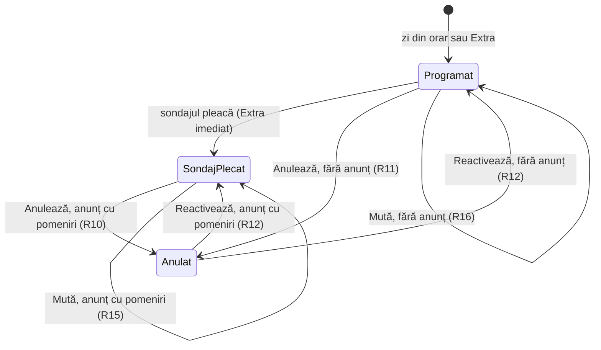
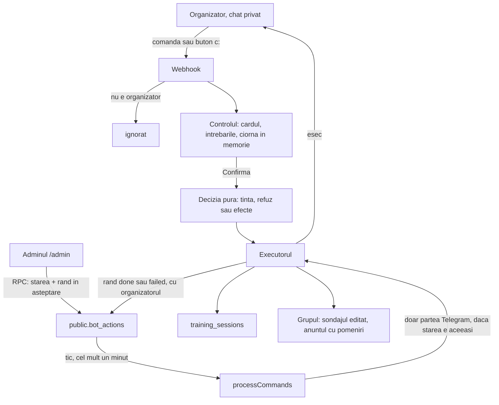
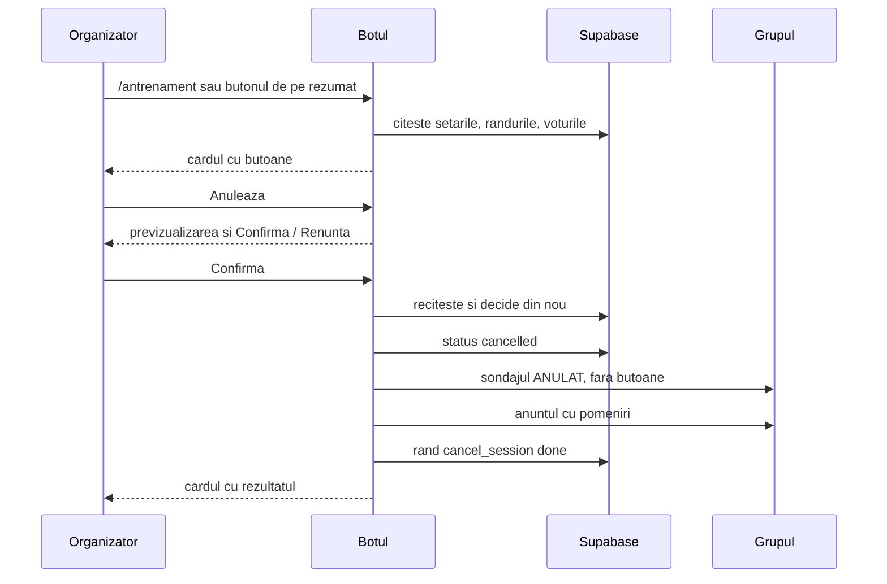

# Ziua de antrenament condusă din Telegram - Plan

## Goal Capsule

- **Obiectiv:** Vlad și Roma anulează, mută, adaugă și verifică un antrenament din Telegram, fără să deschidă `/admin`. Membrii care au spus „Vin” află de fiecare schimbare înainte să plece de acasă.
- **Mijloc:** Botul primește comenzile organizatorilor în privat, decide pur și execută pe un singur drum, comun cu anularea din `/admin` (KTD2, KTD3, KTD4).
- **Autoritate de produs:** Planul deține comenzile pentru ziua de antrenament: cine vine, anularea, reactivarea, mutarea, antrenamentul extra, sondajul și reminderul la cerere. Oamenii și intrarea în grup, moderarea, botul și rapoartele, disciplina prezențelor nu sînt scop activ (vezi How This Work Fits Together).
- **Autoritate tehnică:** Pe comportament de produs câștigă R-urile. Pe mecanism câștigă KTD-urile din Planning Contract. Unitățile nu le suprascriu pe niciunele.
- **Profil de execuție:** U1, apoi U2 → U3 → U4 → U5 în `bot/`, cu U6 în paralel după U1, apoi U7. O ramură, un PR. Fiecare unitate lasă verificările ei verzi înainte de următoarea.
- **Condiții de oprire:** Oprește-te și întreabă dacă U9 sau U10 din planul botului nu sînt live, dacă o schimbare ar șterge rânduri reale, dacă o verificare ar posta în grupul real sau ar atinge un antrenament real, sau dacă o cerință ar cere comportament în afara R1–R26.
- **Coada:** Merge-ul în `main` e deploy-ul: site-ul pe Vercel, botul pe Railway după CI verde. Migrarea U1 se aplică manual prin MCP `apply_migration`, înaintea merge-ului. Lista organizatorilor se schimbă de mână pe Railway (U7).
- **Blocante deschise:** Niciunul în plan. Livrarea așteaptă U9 și U10 din `docs/plans/2026-10-03-1107-feat-botul-si-prezentele-in-admin-plan.md`.

---

## Product Contract

### Summary

Organizatorii conduc ziua de antrenament din conversația privată cu botul. Un card arată antrenamentul următor și cine vine, cu butoane pentru anulare, mutare, antrenament extra, sondaj și reminder. Scurtăturile scrise fac același lucru mai repede, iar rezumatul de la 06:00 poartă aceleași butoane. Grupul vede doar rezultatul: un anunț care îi pomenește pe cei care au spus „Vin” și un sondaj care arată mereu starea reală.

### Problem Frame

Ziua de antrenament se schimbă azi doar din `/admin`, de pe telefon, și doar pe jumătate.

Anularea după ce sondajul a plecat nu anunță pe nimeni: organizatorul scrie separat un mesaj în grup (`GHID-GRUPUL-DIN-PARC.md`, „Anularea unei zile”). Sondajul rămâne cu butoanele active, iar voturile pe un antrenament anulat se înregistrează în continuare, fiindcă webhook-ul nu verifică starea antrenamentului.

Un singur antrenament nu poate fi mutat. Ora și locul vin mereu din setările globale ale botului, deci schimbarea lor mută toate antrenamentele următoare. Un antrenament în afara zilelor obișnuite n-are drum: sondajul pleacă doar pentru „mâine”, în zilele de sondaj, iar textul lui spune mereu „Antrenament mâine”. Reminderul de două ore și rezumatul de dimineață urmează și ele orarul global, nu antrenamentul.

Momentul tipic: plouă dimineața, organizatorul e deja în Telegram, iar decizia trebuie să ajungă la cei care au spus „Vin” înainte să plece de acasă. Botul are datele (cine a votat, sondajul din grup, membrii), dar nu poate fi condus de acolo.

### Actors

- A1. Organizatorii (Vlad, Roma): dau comenzile din conversația privată cu botul, cu aceleași drepturi.
- A2. Membrii grupului: văd anunțurile și sondajul; cei care au votat „Vin” sînt pomeniți.
- A3. Botul: arată cardul, cere confirmarea, execută și anunță în grup.
- A4. Adminul Run + Lift (`/admin`): anularea și reactivarea de acolo urmează aceleași reguli; arată antrenamentele mutate și extra.

### Key Decisions

- **Controlul înseamnă conducerea grupului din Telegram.** Organizatorul vrea să nu mai deschidă `/admin` pentru treburile zilei. (session-settled: user-directed — chosen over controlul intrărilor în grup, moderarea mesajelor și disciplina prezențelor: lipsa de control simțită e că totul cere `/admin`.)
- **Primul pachet e ziua de antrenament.** (session-settled: user-approved — chosen over oamenii și intrarea în grup, moderarea, botul și rapoartele: anularea și mutarea sînt situațiile reale.)
- **Comenzile se dau în privat, cu botul.** (session-settled: user-approved — chosen over comenzi scrise în grup și în ambele locuri: membrii nu văd comenzile, iar botul acceptă doar organizatorii.) Governs R1, R2.
- **Card cu butoane, scurtături scrise și butoane pe rezumatul de dimineață.** (session-settled: user-approved — chosen over doar comenzi scrise cu argumente și doar cardul: Roma îl folosește fără să învețe sintaxa, iar anularea pe ploaie se decide la ora rezumatului.) Governs R3–R6.
- **Anularea anunță grupul și îi pomenește pe cei care au spus „Vin”.** (session-settled: user-approved — chosen over un anunț fără pomeniri și mesaje private: doar pomenirea face telefonul să sune, iar mesajele private ajung doar la cine a apăsat /start.) Governs R10.
- **Mutarea păstrează voturile și îi pomenește pe cei care au spus „Vin”.** (session-settled: user-approved — chosen over un sondaj nou pentru toți și alegerea de fiecare dată: o singură apăsare, iar cine nu mai poate apasă ❌.) Governs R15.
- **Anularea și reactivarea din `/admin` se comportă la fel ca din Telegram.** (session-settled: user-approved — chosen over o bifă „anunță grupul” și `/admin` neschimbat: o singură regulă, oricare ar fi ecranul.) Governs R13.
- **Sondajul unui antrenament extra pleacă imediat.** (session-settled: user-approved — chosen over sondajul în ziua dinainte, la ora obișnuită: merge și pentru un antrenament adăugat pentru mâine sau azi.) Governs R18.
- **Orice postare în grup cere confirmare, cu previzualizare.** O apăsare în plus, dar o greșeală de pe telefon nu ajunge la 35 de oameni. Governs R7.
- **O zi anulată înainte de sondaj nu anunță grupul.** Nimeni n-a votat încă, deci nu e pe cine pomeni; păstrează comportamentul de azi al „Anulează o zi”. Governs R11.
- **Un antrenament mutat sau extra își trage după el automatismele.** Reminderul și rezumatul urmează antrenamentul, nu orarul global. Governs R22, R23.

### Requirements

**Accesul și cardul**

- R1. Comenzile funcționează doar în conversația privată cu botul și doar pentru organizatori; mesajele oricui altcuiva sînt ignorate, ca azi.
- R2. În grup, botul nu răspunde la comenzi; acolo apar doar rezultatele (anunțuri și sondaje).
- R3. Cardul de control arată antrenamentul următor: ziua, data, ora, locul, dacă e anulat, dacă sondajul a plecat și câți vin, câți nu, câți n-au răspuns.
- R4. Cardul are butoanele Cine vine, Anulează (Reactivează pe un antrenament anulat), Mută, Extra, Sondaj și Reamintește.
- R5. Fiecare buton are o scurtătură scrisă care face același lucru (`/maine`, `/anuleaza`, `/reactiveaza`, `/muta`, `/extra`, `/sondaj`, `/reaminteste`); argumentele date în scurtătură sar peste întrebările cardului.
- R6. Rezumatul de dimineață trimis organizatorilor poartă butoanele cardului pentru antrenamentul zilei.
- R7. Orice acțiune care scrie în grup arată întâi o previzualizare (ce se schimbă și pe cine pomenește) și se execută doar după „Confirmă”; „Renunță” nu schimbă nimic.
- R8. Cardul și toate acțiunile țintesc implicit cel mai apropiat antrenament care n-a început încă, chiar dacă e anulat; o dată dată explicit alege altul.

**Cine vine**

- R9. „Cine vine” arată numele pe trei liste: vin, nu vin și n-au răspuns, după aceleași reguli ca ecranul „Prezențe” din `/admin`.

**Anularea și reactivarea**

- R10. Anularea unui antrenament al cărui sondaj a plecat marchează sondajul „ANULAT”, îi scoate butoanele și postează în grup un anunț care îi pomenește pe toți cei care au votat „Vin”, cu un motiv opțional.
- R11. Anularea unui antrenament al cărui sondaj n-a plecat oprește sondajul lui și nu postează nimic în grup.
- R12. Reactivarea redă sondajului butoanele și voturile de dinainte; dacă sondajul plecase, postează în grup un anunț care îi pomenește pe cei care votaseră „Vin”.
- R13. Anularea și reactivarea din `/admin` urmează R10–R12, iar confirmarea din `/admin` spune dacă pleacă un anunț în grup.
- R14. Pe un antrenament anulat nu se mai înregistrează voturi, nici dintr-o copie mai veche a sondajului; cine apasă află că antrenamentul e anulat.



**Mutarea**

- R15. Mutarea schimbă ora, locul sau amândouă pentru un singur antrenament; voturile rămân, sondajul arată noile date, iar în grup pleacă un anunț care îi pomenește pe cei care au votat „Vin” și le spune să apese ❌ dacă nu mai pot.
- R16. Mutarea unui antrenament al cărui sondaj n-a plecat nu postează nimic; sondajul pleacă la ora lui cu ora și locul noi.
- R17. Mutarea nu atinge setările globale și nici celelalte antrenamente; un antrenament anulat nu se mută.

**Antrenamentul extra**

- R18. Extra adaugă un antrenament într-o zi de azi încolo, cu ora și locul alese (implicit cele din setări); sondajul lui pleacă în grup imediat după confirmare.
- R19. O zi care are deja un antrenament, programat sau anulat, nu primește un extra; botul trimite spre Mută sau Reactivează.
- R20. Sondajul numește corect ziua antrenamentului („azi”, „mâine” sau ziua și data), nu „mâine” mereu.

**Sondajul și reminderul la cerere**

- R21. Sondaj și Reamintește acționează pe antrenamentul țintă (R8), cu regulile butoanelor „Trimite sondajul acum” și „Trimite reminderul acum” din `/admin` (`GHID-GRUPUL-DIN-PARC.md`, „Acum”), inclusiv refuzul pentru o zi anulată.

**Automatismele urmează antrenamentul**

- R22. Reminderul automat pleacă cu două ore înainte de ora antrenamentului din ziua respectivă, inclusiv pentru unul mutat sau extra, nu față de ora din setări.
- R23. Rezumatul de dimineață pleacă și în ziua unui antrenament extra, la ora obișnuită a rezumatului, chiar dacă ziua nu e printre zilele rezumatului.

**Urma și eșecurile**

- R24. Fiecare acțiune din Telegram apare în `/admin` la „Ultimele comenzi”, cu organizatorul care a dat-o și rezultatul.
- R25. Antrenamentele mutate și extra apar în „Prezențe” din `/admin` cu ora și locul lor.
- R26. Dacă Telegram refuză o postare, organizatorul care a dat comanda află în conversația privată, cu motivul.

### Key Flows

- F1. Anulare pe ploaie, dimineața
  - **Trigger:** Rezumatul de la 06:00 ajunge la organizator; afară plouă.
  - **Actors:** A1, A2, A3
  - **Steps:** Organizatorul apasă Anulează pe rezumat. Botul arată previzualizarea: antrenamentul, motivul opțional și cei 9 pomeniți. Organizatorul confirmă. Sondajul din grup devine „ANULAT”, fără butoane, și pleacă anunțul cu pomeniri. Organizatorul primește confirmarea în privat.
  - **Covered by:** R6, R7, R10, R14
- F2. Mutare cu o seară înainte
  - **Trigger:** Organizatorul scrie `/muta 07:30`.
  - **Actors:** A1, A2, A3
  - **Steps:** Botul arată previzualizarea: 06:30 → 07:30 și cine e pomenit. Organizatorul confirmă. Sondajul arată 07:30, voturile rămân, iar anunțul îi pomenește pe cei care au spus „Vin”. Reminderul automat pleacă acum la 05:30.
  - **Covered by:** R5, R7, R15, R22
- F3. Antrenament extra
  - **Trigger:** Organizatorul apasă Extra pe card.
  - **Actors:** A1, A2, A3
  - **Steps:** Botul oferă zilele următoare ca butoane, apoi ora și locul, cu cele din setări gata alese. Organizatorul confirmă previzualizarea. Sondajul pleacă imediat și numește ziua corect. În dimineața antrenamentului pleacă rezumatul, iar reminderul automat pleacă cu două ore înainte.
  - **Covered by:** R18, R19, R20, R22, R23
- F4. Anulare din `/admin`
  - **Trigger:** Organizatorul apasă „Anulează antrenamentul” în „Prezențe”.
  - **Actors:** A1, A4, A3, A2
  - **Steps:** Confirmarea din `/admin` spune că pleacă un anunț cu pomeniri. După confirmare, botul face exact ce face la F1.
  - **Covered by:** R13, R10

### Acceptance Examples

- AE1. **Covers R10, R14.** Given sondajul pentru joi a plecat și are 9 „Vin” și 2 „Nu”, when organizatorul anulează cu motivul „ploaie”, then sondajul arată „ANULAT” fără butoane, anunțul îi pomenește pe cei 9 și conține „ploaie”, iar o apăsare pe o copie mai veche a sondajului nu înregistrează niciun vot.
- AE2. **Covers R11.** Given joi 15 octombrie nu are încă sondaj, when organizatorul o anulează, then în grup nu apare nimic, iar miercuri la ora sondajului botul nu trimite sondaj pentru ea.
- AE3. **Covers R12.** Given antrenamentul de joi a fost anulat după ce 9 au votat „Vin”, when organizatorul îl reactivează, then sondajul își recapătă butoanele cu cele 9 voturi, iar anunțul îi pomenește pe cei 9.
- AE4. **Covers R15, R16.** Given sondajul a plecat cu 9 „Vin”, when antrenamentul se mută de la 06:30 la 07:30, then voturile rămân, sondajul arată 07:30 și anunțul îi pomenește pe cei 9. Given sondajul n-a plecat, aceeași mutare nu postează nimic, iar sondajul pleacă mai târziu cu 07:30.
- AE5. **Covers R19.** Given joi are deja un antrenament anulat, when organizatorul cere un extra pentru joi, then botul refuză și oferă Reactivează.
- AE6. **Covers R20, R22, R23.** Given un extra sâmbătă la 08:00, adăugat miercuri, cu rezumatul setat marți și joi la 06:00, then sondajul spune „sâmbătă” (nu „mâine”), rezumatul pleacă sâmbătă la 06:00, iar reminderul automat sâmbătă la 06:00 dacă au confirmat mai puțini decât pragul.
- AE7. **Covers R1.** Given un membru care nu e organizator scrie `/anuleaza` botului în privat, then nu se întâmplă nimic.
- AE8. **Covers R7.** Given organizatorul apasă Anulează și apoi Renunță, then sondajul, voturile și grupul rămân neschimbate.

### Success Criteria

- O anulare pe ploaie, de la deschiderea Telegramului până la anunțul din grup, ia sub un minut, fără `/admin`.
- Nimeni care a votat „Vin” nu ajunge la un antrenament anulat, sau la ora veche a unuia mutat, fără să fi fost pomenit.
- Roma folosește cardul fără instrucțiuni.

### Scope Boundaries

- Celelalte zone (oamenii și intrarea în grup, moderarea, botul și rapoartele, disciplina prezențelor): vezi How This Work Fits Together.
- Mutarea și antrenamentul extra din `/admin`: doar din Telegram în această versiune; `/admin` le arată (R25).
- Schimbarea orarului permanent (zilele și ora sondajului, ora și locul implicite): rămâne în `/admin` → „Botul de Telegram”.
- Comenzi scrise în grup și mesaje private către membri.
- Mai multe antrenamente în aceeași zi.
- Oprirea și pornirea botului, rezumatul la cerere și starea botului din Telegram: zona „Botul și rapoartele”.

<!-- ce-section: work-relationships -->
### How This Work Fits Together

Acest plan deține ziua de antrenament condusă din Telegram. Lista de mai jos e înțelegerea de acum a zonelor vecine, nu o foaie de parcurs asumată.

- Oamenii și intrarea în grup: un card de membru, scoaterea și pauza din Telegram, legarea nou-veniților cu butoane, aprobarea cererilor de intrare, mesajul de bun venit, marcarea celor ieșiți.
  - Shares conversația privată doar pentru organizatori și confirmarea cu previzualizare (R1, R7).
  - Depends on botul să primească actualizările despre membrii grupului, pe care azi nu le primește.
- Moderarea: ștergerea mesajelor, mute, fixarea, curățarea mesajelor de sistem, limitarea linkurilor la nou-veniți.
  - Still to decide dacă moderarea se face în privat sau ca răspuns în grup; e singura zonă în care o comandă scrisă în grup are sens.
- Botul și rapoartele: starea botului, oprirea și pornirea, rezumatul la cerere, statistica săptămânii, lista de comenzi.
  - Can proceed independently of acest plan.
  - Depends on semnalul de viață al botului din U10 pentru o stare credibilă.
- Disciplina prezențelor (cine votează „Vin” și nu vine, cine nu votează niciodată).
  - Still to decide dacă e o zonă proprie; atinge datele de prezență pe care acest plan le folosește doar la pomeniri.

### Dependencies / Assumptions

- Livrarea așteaptă U9 (botul rulează din acest repo pe Railway) și U10 (textul sondajului) din `docs/plans/2026-10-03-1107-feat-botul-si-prezentele-in-admin-plan.md`. U10 schimbă aceleași locuri (trimiterea sondajului și redesenarea lui la vot). Pe 7 octombrie 2026, serviciul Railway construia încă din `vladrightjump/parkgym-telegram-bot`, deci U9 nu e făcut.
- Planul botului exclude explicit schimbările de comportament ale botului dincolo de textul sondajului (R15 acolo); acest plan e locul lor.
- Roma are un cont de Telegram pe care botul îl poate recunoaște ca organizator. Nu e verificat dacă primește azi mesajele adminilor.
- Pomenirile ajung ca notificare la membrii cu cont de Telegram legat; pe 1 octombrie 2026 toți cei 35 de membri erau legați.
- Frecvența anulărilor și mutărilor nu e măsurată; organizatorul a numit anularea sau mutarea drept situația recentă, fără detalii.
- Costul nu crește: Telegram nu taxează mesajele, iar botul rulează deja permanent pe Railway; nu apare niciun serviciu nou.

### Sources / Research

- `docs/plans/2026-10-03-1107-feat-botul-si-prezentele-in-admin-plan.md`: U9, U10 și granița R15 pentru comportamentul botului.
- `GHID-GRUPUL-DIN-PARC.md`: comportamentul de azi al anulării, al butoanelor „Acum” și al ecranului „Prezențe”.
- `bot/src/webhook.ts`: votul nu verifică starea antrenamentului; mesajele din grup, în afara celor de intrare, sînt ignorate; în privat doar `/start` și înscrierea au efect.
- `bot/src/index.ts`: reminderul automat pleacă față de ora din setări; rezumatul doar în zilele rezumatului.
- `bot/src/jobs/process-commands.ts`: acțiunile din coadă de azi (`send_poll`, `send_reminder`, `send_message`, `send_summary`, `kick_member`); sondajul și reminderul sînt mereu pentru „mâine”.
- `bot/src/lib/poll-text.ts`: titlul sondajului spune mereu „Antrenament mâine”.
- `supabase/sql/supabase-migration-sala-corecturi.sql`: `admin_sala_seteaza_antrenament` schimbă doar starea; un singur antrenament pe zi.
- `bot/scripts/set-webhook.ts`: botul primește doar mesaje și apăsări de butoane, nu și schimbările de membri ai grupului.

---

## Planning Contract

**Product Contract preservation:** restructurat, fără schimbare de scope. Cele șase întrebări „Deferred to Planning” au primit răspuns în KTD1, KTD4, KTD5, KTD7, KTD10 și în Deferred to Implementation, iar secțiunea Outstanding Questions a fost scoasă. Rândul despre U9 din Dependencies / Assumptions a fost verificat pe Railway.

### Key Technical Decisions

- KTD1. **Organizatorii sînt conturile din `TELEGRAM_ADMIN_CHAT_IDS`, variabila serviciului de pe Railway.** E aceeași listă care primește azi rezumatul și alertele (`bot/src/lib/notify.ts`). Botul acceptă o comandă doar când `from.id` e în listă și conversația e privată. Roma intră adăugându-i id-ul în variabilă (U7). Implementează R1 și R6. (session-settled: user-approved — chosen over bifa „admin în grup” din `/admin`: o singură sursă, aceeași care primește rezumatul.)
- KTD2. **Decizia e pură, execuția e subțire, iar executorul e unul singur.** Un modul fără bază și fără Telegram primește un instantaneu (setările, rândurile antrenamentelor, voturile, ora de acum) și întoarce fie un refuz, fie o previzualizare plus o listă de efecte. Un executor aplică efectele. Testele botului sînt azi doar de logică pură (`bot/test/*.test.ts`, `node:test`), iar așa rămân. Anularea din Telegram și cea din `/admin` trec prin același executor (R13).
- KTD3. **Acțiunile din Telegram se execută pe loc, în webhook, și lasă un rând în `public.bot_actions`.** Rândul are starea `done` sau `failed`, rezultatul și `payload` cu `sursa: "telegram"`, organizatorul (prenumele din Telegram) și data antrenamentului. Coada nu e folosită pentru ele: un minut de așteptare într-o conversație e prea mult. O inserare eșuată în jurnal se scrie în log și nu strică acțiunea. Implementează R24 și R26.
- KTD4. **Anularea și reactivarea din `/admin` scriu starea pe loc și pun în coadă partea de Telegram.** `admin_sala_seteaza_antrenament` schimbă `status`, ca azi, apoi inserează un rând `cancel_session` sau `reactivate_session` în așteptare. Botul îl ia la tic și face doar partea de Telegram, și numai dacă starea e încă aceea: o anulare urmată de reactivare în același minut nu mai anunță nimic. Implementează R13. (session-settled: user-approved — chosen over un anunț instant din `/admin`: refolosește coada pe care botul o golește deja la fiecare minut.)
- KTD5. **Ciornele stau în memoria botului, 15 minute.** O ciornă ține pașii unei acțiuni neconfirmate (ce oră, ce loc, ce motiv) pentru un chat de organizator. „Confirmă” poartă un token scurt al ciornei. La confirmare botul recitește starea și decide din nou; dacă decizia s-a schimbat între timp, arată noua previzualizare în loc să execute. Serviciul Railway rulează o singură replică (verificat pe 7 octombrie 2026), deci memoria e una. (session-settled: user-approved — chosen over ciorne în baza de date: o ciornă pierdută la un deploy costă o apăsare.)
- KTD6. **Butoanele de control au prefixul `c:` și țintesc antrenamentul după dată.** Forma e `c:<verb>:<YYYY-MM-DD>` sau `c:ok:<token>`, sub limita de 64 de octeți a Telegram. Data, nu id-ul, fiindcă o zi din orar n-are încă rând. Butoanele de vot (`att:yes`, `att:no`) rămân neschimbate.
- KTD7. **Antrenamentul țintă și zilele oferite de Extra se calculează la fel peste tot.** Candidații sînt rândurile de azi încolo, fără unul de azi care a început deja, plus zilele din orar (ziua sondajului + 1) pe următoarele 14 zile. Un rând câștigă peste ziua din orar cu aceeași dată. Ținta e cel mai apropiat candidat, anulat sau nu (R8). Extra oferă cele 14 zile următoare care n-au niciun candidat. `antrenamentulUrmator` din `src/admin/sala/model.ts` rămâne cum e: ecranul „Prezențe” sare peste zilele anulate, cardul botului nu.
- KTD8. **Scurtăturile se citesc cu un parser mic, în română.** Data: `azi`, `mâine`/`maine`, numele zilei cu sau fără diacritice (următoarea apariție, inclusiv azi dacă antrenamentul de azi n-a început), `15.10`, `15.10.2026`, `15 oct`. Ora: `7:30`, `07:30`, `7.30`. Restul textului e locul (la `/muta`, `/extra`) sau motivul (la `/anuleaza`). Ce nu se înțelege primește un răspuns cu exemple. Previzualizarea (R7) arată ce a înțeles botul înainte de orice scriere.
- KTD9. **Titlul sondajului depinde de ziua în care pleacă sondajul și se păstrează în copia lui.** Sondajul postat în ziua dinainte folosește titlul din setări (U10 din planul botului). Postat în aceeași zi folosește „Antrenament azi”. Altfel folosește „Antrenament”, iar sufixul automat („— Sâmbătă, 10 oct”) numește ziua. Titlul folosit intră în copia de pe rândul antrenamentului (`training_sessions.poll_wording`, KTD6 din planul botului), deci redesenarea la vot nu-l schimbă. Previzualizarea din `/admin` arată varianta din ziua dinainte și nu se schimbă. Implementează R20.
- KTD10. **Sondajul și redesenarea iau ora și locul de pe rândul antrenamentului.** Azi `bot/src/jobs/send-poll.ts` le ia din setări chiar când rândul există, iar o mutare dinaintea sondajului s-ar pierde (R16). Un antrenament anulat se redesenează „ANULAT”, fără butoane. Se editează doar copia păstrată în `poll_message_id`; copiile mai vechi, postate de un „Trimite sondajul acum” repetat, își păstrează butoanele, dar votul pe un antrenament anulat e refuzat oricum (R14).
- KTD11. **Pomenirile sînt legături HTML `tg://user?id=…`, ca în mesajul liber din admin.** Sînt pomeniți doar cei care au votat „Vin” și au cont de Telegram. Numele trec prin aceeași funcție de escapare ca sondajul (`esc` din `bot/src/lib/poll-text.ts`). Dacă anunțul ar depăși 4096 de caractere, lista se taie și se încheie cu „și încă N”.
- KTD12. **Automatismele citesc antrenamentul zilei la fiecare tic.** Reminderul automat e scadent la ora antrenamentului de azi minus 120 de minute, doar pe un antrenament programat și cel mult o dată pe antrenament cât rulează procesul. Rezumatul e scadent în zilele lui sau, la ora lui, într-o zi cu antrenament programat care nu e zi din orar (extra); cu zilele rezumatului goale nu pleacă deloc. Ambele reguli sînt predicate pure în `bot/src/lib/schedule.ts`. Implementează R22 și R23.
- KTD13. **Meniul de comenzi apare doar în chaturile organizatorilor.** La pornire, botul înregistrează comenzile (`setMyCommands`) cu domeniul unui chat, pentru fiecare organizator. Lista implicită, pe care o văd membrii, nu se schimbă. Un eșec se scrie în log și nu oprește pornirea.
- KTD14. **O migrare nouă, `sala_05_ziua_din_telegram`, doar pe funcții și pe constrângerea cozii.** Lista permisă din `bot_actions_action_check` primește `cancel_session`, `reactivate_session`, `move_session`, `add_session`. `admin_sala_seteaza_antrenament` primește un parametru opțional `p_motiv`; semnătura veche se șterge în aceeași migrare, ca PostgREST să nu aibă de ales între două variante. Un apel cu cei trei parametri vechi, pe nume, merge și după. `admin_sala_date` întoarce, pentru fiecare comandă, `sursa`, `organizator` și `data` din `payload`.
- KTD15. **Botul are un comutator pentru repetiția locală: fără planificator și fără coadă.** Cu `BOT_SCHEDULER=off`, procesul pornește doar webhook-ul. Altfel, un bot de test pornit local pe baza reală ar goli coada botului din producție și ar trimite sondaje programate. Comutatorul lipsește pe Railway.

### High-Level Technical Design

Cele două drumuri spre același executor (KTD2, KTD3, KTD4):



O anulare din Telegram, de la card la rezultat (F1, KTD5):



Forma deciziei, ca direcție, nu ca semnătură:

```text
decide(actiune, instantaneu, acum) ->
    refuz(motiv, butonSugerat?)
  | { previzualizare, efecte[] }

efect = scrieRand(data, status | ora | loc)
      | posteazaSondaj(data)
      | redeseneazaSondaj(data)          // activ sau ANULAT, dupa status
      | anunta(text, pomeniti[])
```

Ciclul de viață al unui antrenament e diagrama de stări din Product Contract, sub „Anularea și reactivarea”.

### Assumptions

- U9 și U10 din `docs/plans/2026-10-03-1107-feat-botul-si-prezentele-in-admin-plan.md` sînt în `main` și live înainte de U2. Pe 7 octombrie 2026, serviciul Railway construia încă din `vladrightjump/parkgym-telegram-bot`.
- Serviciul `bot` rulează o singură replică (`numReplicas: 1`, verificat pe 7 octombrie 2026). KTD5 se bazează pe asta.
- Webhook-ul primește deja tot ce trebuie: `allowed_updates` e `["message", "callback_query"]` (`bot/scripts/set-webhook.ts`), iar mesajele private și apăsările de butoane intră în ele. Nu e nevoie de reînregistrare.
- Într-un chat privat, id-ul chatului e id-ul utilizatorului, deci lista din KTD1 servește și ca destinatari, și ca filtru.
- Editarea propriului mesaj cu o tastatură goală scoate butoanele, iar o legătură `tg://user?id=` îl anunță pe un membru al grupului. Ambele sînt folosite deja de bot sau de admin.

### Sequencing

U10 din planul botului intră primul. Apoi U1, aplicată live prin MCP `apply_migration` înaintea merge-ului. U2 → U3 → U4 → U5 merg în ordine, în `bot/`. U6 depinde doar de U1 și poate merge în paralel cu U2–U5. U7 încheie: documentația, Roma în listă, repetiția și verificarea live. Totul stă pe o ramură și un PR.

### System-Wide Impact

- **Contractul cozii:** `public.bot_actions` primește patru acțiuni noi, folosite de bot (jurnal) și de admin (anunțul anulării). „Botul nu răspunde” din `src/admin/sala/stareBot.ts` numără și rândurile noi în așteptare, ceea ce e corect: un anunț blocat înseamnă un bot oprit.
- **Funcția de anulare:** semnătura `admin_sala_seteaza_antrenament` se schimbă (KTD14). Adminul deja deployat o cheamă pe nume, cu trei parametri, și merge în continuare.
- **Sondajul din grup:** ora și locul vin de pe rând (KTD10), titlul depinde de ziua postării (KTD9). Paritatea cu previzualizarea din admin (testul din U10) rămâne pe varianta din ziua dinainte.
- **Membrii:** văd anunțuri noi și sondaje „ANULAT”. Votul pe un antrenament anulat primește un mesaj scurt în loc să fie înregistrat.
- **Railway:** o variabilă schimbată de mână (Roma în `TELEGRAM_ADMIN_CHAT_IDS`). `BOT_SCHEDULER` nu se setează acolo.

### Risks & Dependencies

| Risc | Efect | Atenuare |
|---|---|---|
| Codul botului ajunge live înaintea migrării U1 | Inserarea în jurnal cade pe constrângere; „Ultimele comenzi” nu arată acțiunea | U1 se aplică înaintea merge-ului; executorul nu eșuează acțiunea din cauza jurnalului (KTD3) |
| Verificarea live postează în grupul real | 35 de oameni primesc un anunț de test | Repetiția rulează pe un bot și un grup de test, pe o dată din 2027 (U7); în producție se verifică doar cardul, `/maine` și previzualizări cu „Renunță” |
| Repetiția locală pornește planificatorul pe baza reală | Botul de test golește coada producției și trimite sondaje | `BOT_SCHEDULER=off` (KTD15); oprire dacă repetiția ar atinge un antrenament real |
| Un deploy în mijlocul unei conversații | Ciorna se pierde | Mesaj „a expirat” și cardul din nou (KTD5) |
| Doi organizatori acționează odată | A doua acțiune s-ar baza pe o stare veche | Confirmarea recitește și decide din nou (KTD5) |
| Parserul înțelege greșit o dată | Acțiune pe altă zi | Previzualizarea arată data înțeleasă înainte de confirmare (R7, KTD8) |
| Mutarea după reminderul de 2h | Un al doilea reminder | Cel mult unul pe antrenament (KTD12) |
| Serviciul trece pe mai multe replici | Ciornele se împart între procese | `bot/README.md` notează regula; o a doua replică cere ciorne în bază |
| U9 sau U10 nu sînt gata | Codul nu rulează live sau n-are copia textului sondajului | Condiție de oprire în Goal Capsule |

### Documentation / Operational Notes

- `GHID-GRUPUL-DIN-PARC.md`: o secțiune nouă „Din Telegram”; „Anularea unei zile” spune că anularea anunță grupul; „Ce nu face (încă)” se actualizează.
- `bot/README.md`: ce face botul la cererea organizatorilor, cine e organizator (KTD1), ciornele în memorie și regula unei replici (KTD5), comutatorul de repetiție (KTD15).
- `docs/FLUXURI.md`, secțiunea 4.11: cele două drumuri și acțiunile noi din coadă.
- `MIGRATIONS.md`: rândul migrării `sala_05_ziua_din_telegram`.

### Deferred to Implementation

- Textele exacte ale cardului, previzualizărilor, anunțurilor și ale răspunsului de ajutor.
- Orele propuse ca butoane la Mută și Extra (în jurul orei curente sau o listă fixă).
- Împărțirea exactă în fișiere din `bot/src` și numele funcțiilor.
- Limita de lungime a motivului (în jur de 200 de caractere) și codul erorii din SQL.

---

## Implementation Units

### U1. Migrarea `sala_05_ziua_din_telegram`

**Goal:** Baza acceptă acțiunile noi, anularea din `/admin` pune anunțul în coadă, iar „Ultimele comenzi” află cine a dat comanda.

**Requirements:** R13, R24; KTD4, KTD14.

**Dependencies:** Niciuna din acest plan.

**Files:**
- `supabase/sql/supabase-migration-sala-ziua-din-telegram.sql` (nou)
- `supabase/schema/sala.sql`, `supabase/schema/runlift.sql` (regenerate)
- `MIGRATIONS.md`
- `tests/unit/sql/sala.test.ts`

**Approach:**
1. Constrângerea `bot_actions_action_check` se recreează cu cele patru acțiuni noi.
2. `admin_sala_seteaza_antrenament` se recreează cu `p_motiv text default null`, după ce semnătura veche se șterge. Drepturile se reaplică la fel ca în `supabase-migration-sala-functii-admin.sql`.
3. După schimbarea stării, funcția inserează rândul `cancel_session` sau `reactivate_session` în așteptare, cu `payload` `{data, motiv, sursa: "admin", organizator}`. Numele organizatorului vine pe același drum ca în `sala_jurnal`. O reactivare care nu schimbă nimic nu inserează nimic.
4. `admin_sala_date` (ultima versiune, din `supabase-migration-sala-mai-putine-date.sql`) întoarce în `comenzi` și `sursa`, `organizator`, `data`.
5. Instantaneele se regenerează din `scripts/schema-snapshot.sql` și `scripts/schema-snapshot-sala.sql`.

**Patterns to follow:** `supabase/sql/supabase-migration-sala-corecturi.sql` (doar `create or replace`, comentarii în română), `sala_jurnal` pentru numele adminului.

**Test scenarios:**
- Anularea unei zile cu un token valid → `status` devine `cancelled` și apare un rând `cancel_session` în așteptare, cu data, motivul și numele adminului.
- Reactivarea unei zile anulate → `status` devine `scheduled` și apare un rând `reactivate_session` în așteptare.
- Reactivarea unei zile care nu e anulată → niciun rând nou în coadă.
- Motiv gol sau doar spații → `payload` fără motiv; motiv peste limită → eroarea de motiv prea lung, fără nicio scriere.
- Token invalid → `invalid_token`, nicio scriere.
- Un rând cu `action = 'move_session'` se inserează; unul cu o acțiune necunoscută e refuzat de constrângere.
- `admin_sala_date` întoarce `organizator` și `sursa` pentru un rând cu `payload` și `null` pentru rândurile vechi.
- Apelul pe nume cu cei trei parametri vechi (fără `p_motiv`) merge.

**Verification:** Testele SQL trec pe PGlite. Migrarea e aplicată live prin MCP, `get_advisors` nu arată o clasă nouă de problemă, iar constrângerea nouă se vede în baza live.

### U2. Logica pură a zilei de antrenament

**Goal:** Botul știe, fără bază și fără Telegram, care e antrenamentul țintă, ce înțelege dintr-o scurtătură și ce efecte are fiecare acțiune.

**Requirements:** R3, R5, R7–R12, R15–R20; F1–F3; AE1–AE6; KTD2, KTD6–KTD9, KTD11.

**Dependencies:** U10 din planul botului (copia textului sondajului).

**Files:**
- `bot/src/lib/sessions.ts` (nou): ținta, zilele pentru Extra, instantaneul
- `bot/src/lib/command-parse.ts` (nou)
- `bot/src/lib/day-actions.ts` (nou): decizia, previzualizarea, efectele
- `bot/src/lib/poll-text.ts`: titlul după ziua postării, starea „ANULAT”, pomenirile
- `bot/test/sessions.test.ts`, `bot/test/command-parse.test.ts`, `bot/test/day-actions.test.ts` (noi)
- `bot/test/poll-text.test.ts`

**Approach:**
1. Ținta și zilele pentru Extra urmează KTD7.
2. Parserul urmează KTD8.
3. Decizia urmează forma din High-Level Technical Design. Refuzurile acoperă: extra pe o zi cu antrenament (R19), mutarea unui antrenament anulat (R17), o dată sau o oră trecută.
4. Textul sondajului primește titlul din KTD9 și forma „ANULAT” din KTD10; pomenirile urmează KTD11.

**Execution note:** Începe cu teste de caracterizare pe `poll-text.ts`: fără text salvat, în ziua dinainte, mesajul e identic cu cel de azi.

**Patterns to follow:** `bot/src/lib/schedule.ts` (predicate pure), `bot/test/logic.test.ts` (`node:test`, `assert/strict`), `src/admin/sala/sondaj.ts` (`urmatorulSondaj`, calculul zilelor la Chișinău).

**Test scenarios:**
- Miercuri 21:00, joi are rând cu sondaj → ținta e joi.
- Azi 07:00, antrenamentul de azi a fost la 06:30 → ținta e următorul.
- Ziua următoare e anulată → ținta e ziua anulată (R8).
- Niciun rând, sondaj luni și miercuri → ținta e marți, cu ora și locul din setări.
- O dată dată explicit câștigă peste țintă.
- `/muta 7:30` → ora 07:30, fără loc; `/muta 07.30 Parcul Valea Morilor` → ora și locul.
- `/anuleaza ploaie` → fără dată, motivul „ploaie”; `/anuleaza joi ploaie` → joi și motivul.
- `/extra sâmbătă 08:00` și `/extra sambata 08:00` → aceeași zi și oră; `/extra 15.10` → 15 octombrie.
- `/muta 25:00` → răspuns cu exemple; o dată trecută → refuz.
- „joi” într-o joi, înainte de antrenament → azi; după → joia viitoare.
- Covers AE1. Anulare cu sondaj plecat și 9 „Vin” → efectele: `status` anulat, sondajul redesenat „ANULAT”, anunțul îi pomenește pe cei 9 și conține „ploaie”.
- Covers AE2. Anulare fără sondaj → doar scrierea stării, fără anunț.
- Covers AE3. Reactivare după sondaj → starea, sondajul redesenat cu butoane, anunțul îi pomenește pe cei 9.
- Covers AE4. Mutare cu sondaj → rândul cu ora nouă, sondajul redesenat, anunțul cu pomeniri; fără sondaj → doar rândul.
- Covers AE5. Extra pe o zi cu antrenament anulat → refuz care oferă Reactivează.
- Extra pe o zi din orar fără rând → refuz care oferă Mută.
- Covers AE6. Extra pentru sâmbătă, postat miercuri → titlul „Antrenament — Sâmbătă, 10 oct”; postat sâmbătă → „Antrenament azi”; postat vineri → titlul din setări.
- Un nume cu `<` și `&` apare escapat; un membru fără cont de Telegram nu primește legătură.
- Un anunț care ar trece de 4096 de caractere → lista se taie și se încheie cu „și încă N”.

**Verification:** `npm test` în `bot/` trece. Modulele noi nu importă clientul Supabase sau `telegram.ts`.

### U3. Executorul, sondajul și coada

**Goal:** Efectele decise în U2 ajung în bază și în grup, pe același drum din Telegram și din `/admin`.

**Requirements:** R10–R16, R18, R21, R24, R26; AE1–AE4; KTD2–KTD4, KTD9, KTD10.

**Dependencies:** U1, U2.

**Files:**
- `bot/src/jobs/day-ops.ts` (nou): executorul
- `bot/src/jobs/send-poll.ts`
- `bot/src/webhook.ts`: refuzul votului, redesenarea prin textul comun
- `bot/src/jobs/process-commands.ts`
- `bot/src/lib/telegram.ts`: tastatura goală, `setMyCommands`
- `bot/test/day-ops.test.ts` (nou)

**Approach:**
1. Executorul primește dependențele (baza, Telegram) ca parametru, cu cele reale implicite, ca testele să poată da înlocuitori.
2. Ordinea: rândul din bază, apoi sondajul, apoi anunțul, apoi rândul din jurnal (KTD3). Baza e adevărul: un eșec de Telegram după scriere nu o întoarce, ci ajunge la organizator cu motivul (R26).
3. `sendPoll` primește o dată, folosește ora și locul de pe rând (KTD10) și scrie titlul folosit în copia textului (KTD9).
4. Votul pe un antrenament anulat nu se scrie și primește un mesaj scurt (R14). Redesenarea unui antrenament anulat are forma „ANULAT”.
5. `processCommands` tratează `cancel_session` și `reactivate_session` după KTD4. `send_reminder` primește o dată opțională în `payload`; rândurile vechi, fără ea, rămân pentru mâine.

**Patterns to follow:** bucla și `alertAdmins` din `bot/src/jobs/process-commands.ts`, idempotența din `send-poll.ts`, tratarea `att:` din `webhook.ts`.

**Test scenarios:**
- Covers AE1. Executorul pe efectele unei anulări → scrie starea, editează sondajul cu tastatura goală, trimite anunțul, inserează rândul `cancel_session` `done` cu organizatorul.
- Anunțul e refuzat de Telegram → starea rămâne anulată, rândul din jurnal e `failed` cu motivul, iar organizatorul primește motivul (R26).
- Rând `cancel_session` din admin, antrenamentul încă anulat, sondaj plecat → sondajul și anunțul pleacă.
- Rând `cancel_session` din admin, antrenamentul reactivat între timp → niciun apel spre Telegram, rândul e `done` cu rezultatul „depășită”.
- Rând `cancel_session` din admin fără sondaj → niciun apel spre Telegram, rândul e `done`.
- Vot pe un antrenament anulat → nicio scriere în `attendance`, mesajul scurt apare.
- Vot pe un antrenament programat → la fel ca azi.
- Covers AE4. `sendPoll` pentru mâine, cu rândul mutat la 07:30 în alt loc → mesajul arată 07:30 și locul nou.
- `sendPoll` pentru un extra de sâmbătă, din miercuri → titlul din KTD9 ajunge în copie, iar o redesenare după vot îl păstrează.
- `send_reminder` din admin fără dată → mâine, ca azi; cu dată → antrenamentul acelei zile.
- Inserarea în jurnal cade → acțiunea e raportată organizatorului ca făcută, iar eroarea e în log.

**Verification:** `npm test` în `bot/` trece. Testul de pornire (`bot/test/smoke.test.ts`) trece pe `dist/`.

### U4. Conversația din privat cu organizatorii

**Goal:** Organizatorii deschid cardul, aleg o acțiune, văd previzualizarea și confirmă; oricine altcineva e ignorat.

**Requirements:** R1–R5, R7–R9, R17–R19, R21, R24; F1–F3; AE7, AE8; KTD1, KTD3, KTD5, KTD6, KTD13.

**Dependencies:** U2, U3.

**Files:**
- `bot/src/control.ts` (nou): mesajele private ale organizatorilor și butoanele `c:`
- `bot/src/lib/drafts.ts` (nou)
- `bot/src/lib/organizers.ts` (nou): lista din KTD1, folosită și de `notify.ts`
- `bot/src/webhook.ts`: rutarea, înaintea fluxului de înscriere
- `bot/src/lib/notify.ts`
- `bot/src/index.ts`: meniul de comenzi la pornire (KTD13)
- `bot/test/control.test.ts`, `bot/test/drafts.test.ts` (noi)

**Approach:**
1. Un mesaj privat de la un organizator, cu o comandă cunoscută sau ca răspuns la o întrebare în curs, merge la control. `/start` rămâne pe fluxul de azi.
2. Cardul e un mesaj cu butoane `c:`. Acțiunile editează același mesaj: întrebare, previzualizare, rezultat.
3. Mută întreabă ora (butoane și „Altă oră”), apoi locul („Același loc” sau „Alt loc”). Extra arată zilele din KTD7, apoi ora și locul, cu cele din setări gata alese. Anulează întreabă motivul („Fără motiv” sau text).
4. „Confirmă” urmează KTD5, apoi cheamă executorul din U3.
5. `/maine` și „Cine vine” arată listele din R9.
6. Un buton `c:` apăsat de altcineva primește doar confirmarea tehnică, fără efect.

**Patterns to follow:** fluxul `/start` cu `force_reply` din `bot/src/webhook.ts`, `answerCallbackQuery` pentru butoane.

**Test scenarios:**
- Covers AE7. Un ne-organizator scrie `/anuleaza` în privat → niciun apel spre Telegram sau spre bază.
- Un organizator scrie `/antrenament` → cardul țintei, cu butoanele din R4; pe un antrenament anulat apare Reactivează, fără Anulează și Mută.
- Covers AE8. Anulează, apoi Renunță → cardul revine, executorul nu e chemat.
- Confirmă cu o ciornă expirată → mesajul „a expirat” și cardul din nou, executorul nu e chemat.
- Confirmă după ce celălalt organizator a anulat → previzualizarea nouă, fără a doua acțiune.
- Două apăsări pe Confirmă → executorul e chemat o dată, a doua apăsare primește „deja făcut”.
- `/muta 07:30` → previzualizarea direct, fără întrebări (R5).
- Mută → „Altă oră” → „7:45” → previzualizarea cu 07:45; un text fără oră → aceeași întrebare, cu un exemplu.
- Extra arată doar zile fără antrenament și ora din setări gata aleasă.
- Un organizator scrie `/anuleaza` în grup → ignorat (R2).
- `/maine` → vin, nu vin și n-au răspuns, după regula din R9.
- Lista organizatorilor cu spații și intrări goale → doar id-urile valide.

**Verification:** `npm test` în `bot/` trece. În repetiția din U7, cardul și cele trei fluxuri merg până la capăt.

### U5. Automatismele urmează antrenamentul, iar rezumatul poartă butoanele

**Goal:** Reminderul și rezumatul pleacă după antrenamentul zilei, iar rezumatul deschide acțiunile cardului.

**Requirements:** R6, R22, R23; AE6; KTD12.

**Dependencies:** U3, U4.

**Files:**
- `bot/src/index.ts`
- `bot/src/lib/schedule.ts`
- `bot/src/jobs/auto-reminder.ts`
- `bot/src/jobs/morning-summary.ts`
- `bot/test/logic.test.ts`

**Approach:**
1. Două predicate pure noi în `schedule.ts`: scadența reminderului și a rezumatului (KTD12).
2. Ticul citește o dată antrenamentul de azi (id, oră, stare), ca pe setări.
3. Rezumatul adaugă butoanele cardului pentru antrenamentul de azi: Reactivează pe unul anulat, nimic fără antrenament.
4. Ticul respectă `BOT_SCHEDULER=off` (KTD15).

**Test scenarios:**
- Antrenament la 07:30 → reminderul e scadent la 05:30 și doar atunci.
- Antrenament anulat sau lipsă → reminderul nu e scadent.
- Antrenament deja reamintit → nu e scadent a doua oară, nici după o mutare.
- Covers AE6. Extra sâmbătă, rezumat marți și joi la 06:00 → rezumatul e scadent sâmbătă la 06:00.
- Sâmbătă fără antrenament → rezumatul nu e scadent; zilele rezumatului goale → nu e scadent nici cu un extra.
- Marți obișnuită → scadent, ca azi.
- Rezumatul cu antrenament azi → are butoane; fără antrenament → fără butoane.
- `BOT_SCHEDULER=off` → nicio sarcină programată și nicio golire a cozii.

**Verification:** `npm test` în `bot/` trece. Primul rezumat de după deploy are butoane (U7).

### U6. Adminul: anularea anunță, comenzile spun cine

**Goal:** `/admin` spune înainte de anulare dacă pleacă un anunț și arată comenzile din Telegram cu organizatorul.

**Requirements:** R13, R24, R25; F4; KTD4, KTD14.

**Dependencies:** U1.

**Files:**
- `src/admin/sala/EcranPrezente.tsx`
- `src/lib/salaApi.ts`
- `src/admin/sala/configBot.ts`
- `src/admin/sala/EcranBot.tsx`
- `src/admin-preview.tsx` (datele de previzualizare, dacă imită comenzile)
- `tests/unit/salaPrezente.test.tsx`, `tests/unit/salaBot.test.tsx`, `tests/unit/salaConfigBot.test.ts`
- `tests/sala.spec.ts`

**Approach:**
1. Dialogul de anulare spune, după `poll_sent`, fie că pleacă în grup un anunț care îi pomenește pe cei N care au spus „Vin”, fie că în grup nu pleacă nimic. Un câmp opțional „Motiv” ajunge în `p_motiv`.
2. Reactivarea din „Zile anulate” primește o confirmare cu aceeași regulă.
3. „Anulează o zi” păstrează formularul; mesajul de după spune că botul anunță grupul dacă sondajul plecase.
4. `ETICHETE_COMENZI` primește etichetele celor patru acțiuni noi. Rândul arată „din Telegram, <nume>” sau numele adminului.
5. R25 e deja acoperit: „Prezențe” arată ora și locul fiecărui antrenament. Testele confirmă că un rând mutat sau extra se vede corect.

**Patterns to follow:** dialogul existent din `EcranPrezente.tsx`, `ETICHETE_COMENZI` din `configBot.ts`, mesajele de eroare din `salaApi.ts`.

**Test scenarios:**
- Dialogul cu sondaj plecat și 9 „Vin” → textul îi numără pe cei 9 și spune că pleacă anunțul; confirmarea trimite motivul.
- Dialogul fără sondaj → „în grup nu pleacă nimic”.
- Motiv gol → `p_motiv` lipsește sau e `null`.
- Un rând `move_session` cu organizatorul „Vlad” → eticheta „Antrenament mutat” și „din Telegram, Vlad”.
- Un rând vechi, fără `payload` → doar eticheta, ca azi.
- Un antrenament mutat la 07:30 → „Prezențe” arată 07:30 și locul lui.
- E2E: fluxul de anulare din `tests/sala.spec.ts` vede textul nou al dialogului.

**Verification:** `npm run lint`, `npm run typecheck`, `npm run test:coverage` și E2E-ul pentru `sala` trec.

### U7. Documentația, Roma și verificarea live

**Goal:** Ghidul explică botul din Telegram, Roma e organizator, iar fluxurile sînt dovedite fără să deranjeze grupul.

**Requirements:** R1, R6; Success Criteria; KTD1, KTD15.

**Dependencies:** U1–U6; U9 din planul botului făcut.

**Files:**
- `GHID-GRUPUL-DIN-PARC.md`
- `bot/README.md`
- `docs/FLUXURI.md`
- `bot/.env.example`

**Approach:**
1. Documentația urmează Documentation / Operational Notes.
2. Id-ul de Telegram al lui Roma intră în `TELEGRAM_ADMIN_CHAT_IDS` pe Railway, după ce Vlad confirmă valoarea.
3. Repetiția, înaintea merge-ului: botul pornit local cu un token de test, un grup de test și `BOT_SCHEDULER=off`, expus printr-un tunel HTTPS temporar. Se parcurg cardul, Extra, Mută, Anulează, Reactivează și Renunță, doar pe o dată din 2027. Rândul de test din `training_sessions` se șterge apoi, cu acordul lui Vlad.
4. După deploy, în producție: Vlad deschide cardul, `/maine` și o previzualizare cu Renunță; un cont care nu e organizator e ignorat; rezumatul de a doua zi are butoane.

**Test expectation:** none -- documentație și pași operaționali; comportamentul e acoperit de testele din U1–U6 și de repetiție.

**Verification:** Lista din pasul 4 e bifată, iar documentele descriu comportamentul livrat.

---

## Verification Contract

| Poartă | Comandă sau verificare | Când |
|---|---|---|
| Linter și cod mort | `npm run lint`, `npm run deadcode` | U1, U6 |
| Tipuri | `npm run typecheck`, `npm run typecheck:tests` | U1, U6 |
| Teste unitare și SQL, cu prag de acoperire | `npm run test:coverage` (include `tests/unit/sql/*` pe PGlite) | U1, U6 |
| Build | `npm run build` | U6 |
| E2E | local: `npm run test:e2e` pe dev server; în CI: `npm run test:e2e:preview` | U6 |
| Totul deodată | `npm run verify` (fără dev server pornit pe 5173) | înainte de merge |
| Botul | în `bot/`, pe Node-ul din `.nvmrc`: `npm ci`, `npm test`, `npm run build`, pornirea pe `/health` | U2–U5 |
| Baza live | migrarea aplicată prin MCP `apply_migration`; `get_advisors` (security); constrângerea nouă citită live | U1 |
| Railway | deploy `SUCCESS`, `/health`, `getWebhookInfo` fără erori, planificatorul pornit în jurnale | după merge |
| Repetiția | botul de test, grupul de test, `BOT_SCHEDULER=off`, o dată din 2027 (U7) | înainte de merge |
| Producția | cardul, `/maine`, o previzualizare cu Renunță, un ne-organizator ignorat, rezumatul cu butoane | după deploy |

---

## Definition of Done

- Fiecare unitate își îndeplinește Verification-ul.
- CI-ul e verde, cu jobul botului inclus, iar pragurile de acoperire nu au coborât.
- Migrarea `sala_05_ziua_din_telegram` e aplicată live, are rândul ei în `MIGRATIONS.md`, iar `supabase/schema/runlift.sql` și `supabase/schema/sala.sql` sînt regenerate după ea.
- Roma e în `TELEGRAM_ADMIN_CHAT_IDS` și vede meniul de comenzi în chatul lui cu botul.
- Repetiția a trecut prin toate acțiunile, iar rândul ei de test nu mai e în baza live.
- În repetiție, anularea și mutarea au ajuns în grupul de test cu pomenirile, iar „Ultimele comenzi” le arată cu organizatorul.
- Ghidul, `bot/README.md` și `docs/FLUXURI.md` descriu comportamentul livrat.
- Diff-ul nu conține cod de încercare abandonat, stub-uri rămase în afara `src/admin-preview.tsx` sau ramuri moarte.
