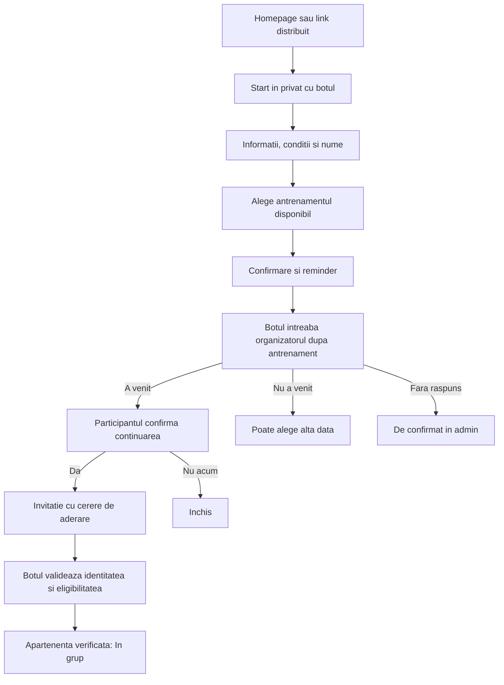

# Antrenament de proba prin Telegram

## Goal Capsule

**Objective:** O persoană nouă află condițiile, își alege un antrenament de probă și poate continua în comunitate, iar organizatorul urmărește parcursul cu minimum de intervenții.

**Means:** Homepage → conversație privată cu botul → alegere din programul existent → confirmarea prezenței de către organizator → confirmarea continuării de către participant → invitație în grup (KTD1–KTD5).

**Authority:** Instrucțiunile ulterioare ale utilizatorului au prioritate; Product Contract definește comportamentul, Planning Contract definește implementarea. Planul nu autorizează trimiterea de mesaje reale în etapa de redactare.

**Execution:** Implementare pe branch dedicat, PR către main, verificări locale cu Telegram simulat și probă controlată înaintea activării publice. Executorul livrează codul, migrarea, documentația și dovezile verificării. Nu se modifică producția în cadrul acestui plan.

**Stop conditions:** Opriți activarea dacă lipsesc condițiile reale, destinatarul notificărilor, permisiunile botului sau dacă fluxul ar debloca automat un membru exclus. Detaliile comerciale lipsă nu blochează construirea funcției dezactivate.

## Product Contract

### Summary

Un singur punct de intrare în Telegram pentru persoanele interesate de antrenamente. Botul gestionează alegerea probei, instrucțiunile, reminderul și continuarea. Organizatorul confirmă doar prezența fizică. Persoanele noi apar separat de membrii grupului.

### Problem Frame

Astăzi `/start` cere numele și creează direct un membru cu `status=active`. Acest lucru confundă interesul cu participarea și nu acoperă proba înaintea accesului în grup. Homepage-ul promovează cursa HYROX Trial, care trebuie diferențiată clar de un antrenament de probă obișnuit.

### Key Decisions

- D1. **Proba precede accesul în grup.** Governs R2, R6, R7. (session-settled: user-directed — chosen over accesul direct în grup: utilizatorul a cerut mesaj privat și probă înaintea intrării.)
- D2. **Participantul alege din programul existent.** Governs R3, R4. (session-settled: user-directed — chosen over programarea manuală a probei: antrenamentele sunt prestabilite în configurarea botului.)
- D3. **Automatizare cu verificarea umană a prezenței.** Governs R5, R6. (session-settled: user-approved — chosen over gestionarea manuală a fiecărui pas: utilizatorul a acceptat fluxul în care botul întreabă organizatorul dacă persoana a venit.)
- D4. **Invitația pleacă după două confirmări.** Governs R7. (session-settled: user-directed — chosen over invitația înaintea probei sau imediat după probă: utilizatorul a precizat că persoana intră numai după antrenament și după răspunsul afirmativ privind continuarea.)

### Requirements

- R1. Pe homepage există „Vreau la un antrenament”, care duce spre bot, plus explicația „Alegi o zi și primești detaliile în Telegram”. Linkul poate fi distribuit și direct. Prima interacțiune necesită Start în Telegram.
- R2. Un utilizator nou primește bun venit, informațiile și condițiile probei înainte de rezervare; numele este cerut explicit. Este înregistrat ca persoană interesată, fără a fi introdus în lista membrilor activi sau în grup.
- R3. Botul oferă antrenamente viitoare eligibile din următoarele 14 zile, folosind programul configurat, sesiunile suplimentare și excepțiile existente. Nu oferă sesiuni anulate, încheiate sau deja începute. Afișează data, ora și locația în Europe/Chisinau. Fără date disponibile: mesaj clar și posibilitatea de a reveni la alegere; nu inventează o dată.
- R4. Participantul poate avea o singură probă viitoare rezervată. Confirmarea arată ziua, ora, locația și condițiile. Poate anula sau reprograma din bot. Butoanele vechi revalidează disponibilitatea; apăsările repetate nu dublează rezervarea. Modificarea orei/locației produce notificare; anularea sesiunii oferă reprogramare și oprește reminderul vechi.
- R5. Botul notifică organizatorul configurat la rezervare și la anulare/reprogramare. Participantul primește un reminder cu 2 ore înainte; o rezervare mai târzie primește doar confirmarea completă. După sfârșitul sesiunii, organizatorul primește „A venit / Nu a venit”. Durata folosită pentru acest moment se configurează în admin înainte de activare.
- R6. Numai organizatorii autorizați pot confirma prezența, în privat sau în admin. Lipsa răspunsului rămâne „De confirmat”, vizibilă în admin, fără a considera automat persoana absentă. „Nu a venit” oferă o singură invitație la reprogramare pentru proba respectivă. O confirmare este auditabilă; corecțiile ulterioare sunt explicite și nu produc automat mesaje contradictorii.
- R7. După „A venit”, botul întreabă participantul „Vrei să continui antrenamentele cu noi?” și reafişează condițiile continuării. Botul trimite automat invitația numai după proba efectuată, confirmată de organizator, și răspunsul explicit „Da” la această întrebare. Confirmarea inițială „Vreau să vin la probă” nu satisface această condiție. Fără răspuns, persoana rămâne în așteptarea confirmării continuării și nu primește invitație; „Nu acum” închide parcursul fără insistențe. Starea „În grup” apare numai după verificarea apartenenței reale. Conturile excluse nu sunt deblocate automat.
- R8. În admin, „Persoane noi” arată numele, contul Telegram, proba, starea și eventualele erori/întrebări. Stările de parcurs sunt: Interesat, Probă programată, De confirmat, A venit, Nu a venit, Invitat, În grup, Închis. Starea conversației și rezultatul trimiterii mesajelor se păstrează separat.
- R9. „Am o întrebare” colectează textul pentru organizator. Notificarea include „Răspunde”; răspunsul adminului este trimis prin bot aceleiași persoane, cu context vizibil și confirmare înainte de trimitere. Nu se introduce un chatbot AI și nu se generează răspunsuri despre prețuri sau condiții.
- R10. Adminul poate configura activarea, mesajul de bun venit, condițiile probei, costul real, ce trebuie adus, condițiile continuării, durata sesiunii și destinatarul notificărilor dintre organizatorii autorizați. Previzualizare înainte de activare; textele obligatorii și drepturile Telegram sunt validate. Nu presupunem că proba este gratuită.
- R11. Revenirea prin Start reia parcursul existent. Membrii deja în grup nu refac proba și primesc informațiile relevante. Persoanele cu un cont deja asociat nu sunt duplicate. O ieșire/excludere din grup nu este anulată de accesarea linkului.
- R12. Erorile de trimitere sunt vizibile adminului și pot fi reîncercate. Botul nu declară mesajul trimis sau persoana intrată în grup înaintea rezultatului confirmat. Oprirea mesajelor de către persoană oprește automatizările proactive pentru ea; o revenire explicită permite reluarea.

### Homepage Placement

Propunere pentru implementare, păstrând structura vizuală actuală:

| Suprafață | Poziție și comportament |
|---|---|
| Homepage cu eveniment activ | În hero, lângă/sub CTA-ul cursei, un buton secundar „Vreau la un antrenament”. CTA-ul evenimentului devine explicit „Înscrie-te la eveniment”. |
| Secțiune de prezentare | Sub hero și banda informativă, înaintea detaliilor cursei: „Primul tău antrenament cu noi”, un paragraf, trei pași și CTA către bot. Stilul folosește tipografia și spațierea existente. |
| Între evenimente / ComingSoon | Același bloc, înainte de footer; antrenamentele au CTA propriu chiar dacă înscrierea la eveniment este închisă. Nu depinde de countdown. |
| În ziua evenimentului | Lista participanților își păstrează prioritatea; blocul pentru antrenamente apare după conținutul zilei, înainte de footer. |
| Mobil | CTA-urile stau vertical, cu etichete explicite și ținte tactile confortabile; fără un nou popup sau formular înaintea botului. |

Text propus:

> **Primul tău antrenament cu noi**
>
> Vino să ne cunoști la un antrenament de probă. În Telegram alegi ziua potrivită și primești programul, locația și condițiile de participare.
>
> Alegi ziua → Vii la antrenament → Decizi dacă vrei să continui.
>
> **Vreau la un antrenament**
>
> Se deschide Telegram. Apasă Start pentru a începe.

CTA-ul folosește un deep link către username-ul real al botului, cu o sursă fixă precum `trial_home`. Sursa nu conține date personale. Linkul copiat din admin folosește `trial_share`; Instagram poate folosi `trial_instagram`. Pagina nu publică invitația grupului. Fără Telegram, există o scurtă indicație și contactul public deja folosit de site.

### Flows

### Acceptance Examples

- AE1 (R1–R4): Maria vine de pe homepage, citește costul, alege marți și primește confirmarea; apare numai la Persoane noi, iar grupul nu primește mesaje.
- AE2 (R3–R5): Marți este anulat după rezervare; Maria primește anularea și date alternative, iar reminderul și întrebarea de prezență pentru acea rezervare nu mai pleacă.
- AE3 (R6–R7): Organizatorul confirmă A venit; doar după răspunsul Da al Mariei se trimite invitația. Alegerea probei sau lipsa răspunsului la întrebarea de continuare nu declanșează invitația. Un link redirecționat altui cont nu acordă acces.
- AE4 (R6): Organizatorul nu răspunde; cazul rămâne De confirmat și invitația nu pleacă.
- AE5 (R4, R11–R12): Start și callback-ul de rezervare sunt livrate de două ori; există o singură rezervare și un singur eveniment de notificare.
- AE6 (R7, R11): Un cont exclus folosește linkul public; botul nu îl deblochează și nu aprobă aderarea automat.
- AE7 (R1): La închiderea înscrierii la cursă, CTA-ul pentru probă rămâne disponibil, fără redeschiderea înscrierii la eveniment.

### Scope Boundaries

Incluse: un grup de antrenamente existent, o probă viitoare per persoană, dialog ghidat, întrebări către organizator, notificări, admin și CTA public. Fără plăți online, abonamente, recomandări AI, grup nou de informare sau detectarea automată a prezenței fizice. Nu se adaugă o limită de locuri sau listă de așteptare neverificată: v1 urmează disponibilitatea configurată; limita comercială pentru probe este o extensie separată dacă devine necesară.

### Activation Inputs

Înaintea activării, organizatorul completează costul/condițiile reale ale probei și continuării, durata folosită pentru solicitarea prezenței și destinatarul notificărilor. Aceste valori nu sunt cunoscute din conversație; formularul trebuie să permită construirea și testarea fluxului cu activarea oprită.

## Planning Contract

### Evidence

- `bot/src/webhook.ts:412`: `/start` și răspunsul cu numele creează în prezent un membru activ. Trebuie schimbat traseul public pentru persoane necunoscute, păstrând comenzile organizatorilor.
- `bot/src/lib/sessions.ts`: rezolvă programul și sesiunile concrete; rândul sesiunii prevalează asupra programului. Orizontul existent este 14 zile; zilele antrenamentului derivă din zilele sondajului + 1.
- `bot/src/index.ts`: scheduler existent, tick la minut și control `BOT_SCHEDULER`.
- `bot/src/lib/membership.ts`, `src/lib/salaApi.ts`: identitatea Telegram și apartenența sunt separate de starea comercială a membrului.
- `src/components/Landing.tsx`, `src/components/landing/Hero.tsx`, `src/App.tsx`, `src/components/ComingSoon.tsx`: homepage-ul are moduri diferite; modificarea doar a Hero nu acoperă perioada dintre evenimente.
- Telegram: [deep linking](https://core.telegram.org/bots/features#deep-linking), [invitații](https://core.telegram.org/bots/api#createchatinvitelink), [aprobarea cererilor](https://core.telegram.org/bots/api#approvechatjoinrequest). Botul necesită drepturi de invitare; o invitație cu cerere de aderare permite verificarea identității înainte de aprobare.

### Key Technical Decisions

- KTD1 (R2, R8, R11): entități dedicate pentru persoane interesate și rezervări de probă, cu identitate Telegram unică și legătură opțională spre un membru existent. Nu folosim `members.status=active` pentru un prospect. La conversie, asociem sau creăm un singur membru, păstrând istoricul probei. Nu reclasificăm automat membrii istorici.
- KTD2 (R3–R5): refolosim rezolvarea programului din `sessions.ts`; extindem cu listarea datelor eligibile. La rezervare materializăm tranzacțional sesiunea dacă era doar derivată din program, fără a trimite sondajul. Data rămâne unică, iar concurența cu jobul de sondaj se tratează prin upsert/reselect. Schimbarea programului nu mută implicit rezervările existente; acestea urmează sesiunea concretă și editările/anulările ei.
- KTD3 (R4–R6, R9, R12): tranziții tranzacționale și outbox persistent cu cheie unică per rezervare, versiune și tip de mesaj. Workerul existent execută trimiterile cu claim/lease și retry limitat. Replanificarea invalidează joburile vechi, care verifică din nou starea înaintea trimiterii. Telegram nu garantează exact-once pentru sendMessage: un timeout ambiguu rămâne vizibil și nu este reîncercat orbește. Confirmările de business sunt idempotente chiar dacă un mesaj se dublează.
- KTD4 (R5–R6): scadența întrebării este începutul sesiunii + durata configurată. Sesiunile trebuie să fie neanulate; webhook-ul de confirmare validează destinatarul autorizat, rezervarea și versiunea. Prima confirmare câștigă; apăsările concurente văd rezultatul existent. Corecția din admin este auditabilă și invalidează invitațiile încă nefolosite dacă persoana devine neeligibilă, fără a scoate automat din grup un membru deja intrat.
- KTD5 (R7, R11): invitații gestionate de bot cu cerere de aderare și expirare (implicit 7 zile). La `chat_join_request`, aprobăm automat doar identitatea eligibilă și grupul configurat; alte conturi nu primesc acces prin acest flux. Cererile din alte linkuri nu sunt preluate automat. Revalidăm excluderea înainte de aprobare; apartenența este confirmată prin `chat_member`/verificarea existentă. Linkul poate fi reemis, la cerere, dacă eligibilitatea încă există. Nu folosim limita de un utilizator ca substitut pentru verificarea identității.
- KTD6 (R1, R10): configurare publică minimă separată de configurarea secretă: activare, username validat și textele publice strict necesare. Tokenul botului, ID-urile private, cererile și invitațiile grupului nu ajung în frontend. CTA-ul se ascunde dacă fluxul este dezactivat; linkul direct răspunde cu indisponibilitatea și contactul configurat.
- KTD7 (R8–R10): RPC-urile admin reutilizează verificarea tokenului și jurnalul existente, RLS fără acces public la datele persoanelor. Callback-urile folosesc ID-uri opace și verificare server-side; numele/username-ul nu sunt autorizație. Întrebările și răspunsurile se păstrează într-un fir legat de prospect; expirarea contextului împiedică trimiterea unui răspuns către persoana greșită.

### Data Shape

Nume finale de stabilit în migrare, în convențiile repo: prospect (Telegram ID, nume, sursă, etapă dialog, opțiune mesaje, member_id opțional); trial booking (prospect, session_id, stare, versiune, condiții acceptate și moment, rezultat prezență, actor, răspuns continuare); mesaje/outbox (tip, destinatar, scadență, stare, încercări, rezultat); întrebări/răspunsuri și invitații (identitate eligibilă, expirare, rezultat). Index unic pentru identitatea Telegram și rezervarea viitoare activă. Datele de interes nu se includ în rapoartele membrilor sau în sondajele grupului.

## Implementation Units

### U1. Persistenta si configurare

**Goal:** separarea persoanelor noi și tranziții corecte. **Requirements:** R2, R4, R8, R10–R12; KTD1, KTD3, KTD7.

**Files:** migrare nouă în `supabase/sql/`, snapshot-uri în `supabase/schema/`, `src/lib/salaApi.ts`, teste SQL în `tests/unit/sql/`.

**Approach:** tabele, constrângeri, tranzacții, RPC-uri token-protected, audit, configurare dezactivată inițial. Nu migra automat membrii existenți spre prospects.

**Test scenarios / verification:** acces neautorizat refuzat, dublă rezervare și conversie concurentă, tranziție invalidă, prospect absent din lista membrilor, replay fără dublarea outbox-ului; teste SQL și typecheck.

### U2. Conversatia si alegerea probei

**Dependencies:** U1. **Requirements:** R2–R4, R9, R11; KTD1–KTD3, KTD7.

**Files:** `bot/src/webhook.ts`, `bot/src/lib/sessions.ts`, modul nou de onboarding, teste în `bot/test/`.

**Approach:** rutare explicită a deep-linkului și a utilizatorilor necunoscuți; conversație persistentă; nume, condiții, alegerea datei, confirmare, anulare/reprogramare, întrebări. Păstrează prioritatea și autorizarea comenzilor organizatorilor.

**Test scenarios / verification:** Start repetat, nume invalid, sesiune suplimentară/anulată/începută, buton vechi, lipsă sesiuni, rezervare concurentă, membru existent și cont exclus; teste bot.

### U3. Automatizari si prezenta

**Dependencies:** U1, U2. **Requirements:** R4–R6, R9, R12; KTD3–KTD4.

**Files:** `bot/src/index.ts`, job nou pentru probe în `bot/src/jobs/`, control privat și utilitare Telegram, teste bot.

**Approach:** notificare la rezervare, reminder, întrebare de prezență, răspuns la întrebări, reprogramare după absență; claim și retry persistent. Verifică datele sesiunii la execuție și invalidează joburile după modificări.

**Test scenarios / verification:** restart, tick repetat, timeout ambiguu, bot blocat, rezervare cu mai puțin de două ore înainte, schimbare de fus/DST, lipsa răspunsului adminului, actor neautorizat; teste cu timp și Telegram simulate.

### U4. Continuarea si accesul in grup

**Dependencies:** U3. **Requirements:** R6–R7, R11–R12; KTD1, KTD4–KTD5.

**Files:** `bot/src/lib/telegram.ts`, `bot/src/webhook.ts`, `bot/src/lib/membership.ts`, `bot/scripts/set-webhook.ts`, noul modul onboarding.

**Approach:** întrebarea de continuare, eligibilitate, emitere invitație, procesare chat_join_request și confirmare apartenență; adaugă tipurile și allowed_updates necesare. Verifică permisiunile la activare.

**Test scenarios / verification:** Da înainte de prezență refuzat, Nu acum, link transmis altui cont, cerere din alt grup, expirare, excludere între invitație și aderare, două confirmări de intrare, conversie fără duplicat. Teste bot/SQL și probă controlată în grup de test.

### U5. Admin pentru persoane noi

**Dependencies:** U1–U4. **Requirements:** R5–R6, R8–R10, R12; KTD4, KTD6–KTD7.

**Files:** `src/admin/adminNavigatie.ts`, `src/admin/AdminDashboard.tsx`, ecran nou în `src/admin/sala/`, `src/admin/sala/EcranBot.tsx`, `src/admin/acum.ts`, ghidul botului, CSS existent.

**Approach:** „Persoane noi” lângă Membri, filtre pe stări, detaliu cu istoric, confirmarea/corectarea prezenței, întrebări și răspunsuri, reîncercări explicite. Setări în ecranul botului, preview mesaje și copiere link. „De rezolvat” primește doar cereri care necesită intervenție, nu fiecare eveniment din parcurs.

**Test scenarios / verification:** desktop/mobil, lipsă padding/overflow, filtre, erori de salvare, permisiuni, copy link, configurație incompletă, paritate cu confirmarea din Telegram; unit și Playwright.

### U6. Intrarea publica si lansare

**Dependencies:** U2, U5. **Requirements:** R1, R10–R12; KTD6.

**Files:** `src/components/Landing.tsx`, `src/components/landing/Hero.tsx`, `src/components/ComingSoon.tsx`, componentă comună nouă pentru blocul de probă, configurația publică și teste browser.

**Approach:** CTA și secțiune conform Homepage Placement; link fix și validat, fără formular suplimentar. Coerență între hero, secțiune și ComingSoon; nu altera logica înscrierii la cursă.

**Test scenarios / verification:** toate fazele homepage, desktop/mobil, tastatură, flux dezactivat, username lipsă, lipsă Telegram și contact alternativ; regresia formularului de eveniment. PR cu capturi și rezultatele testelor.

## Verification Contract

Executare la implementare, cu Node 24 din manifest; planificarea nu rulează aceste teste.

- Frontend/SQL: `npm test`, `npm run typecheck`, `npm run typecheck:tests`, `npm run lint`, `npm run build`.
- Bot: `npm --prefix bot test`, `npm --prefix bot run build`.
- Browser: `npm run test:e2e:preview` după build, cu Telegram/RPC mock în scenariile automate și fără trimiteri către persoane reale.
- Migrare: aplicare pe baza izolată folosită de testele SQL; verificarea RLS, autorizării, unicității și istoricului intact; regenerarea snapshot-urilor prin mecanismul repo la momentul potrivit al livrării.
- Probă controlată înainte de activare: cont de participant și organizator, grup de test, rezervare → prezență → continuare → aderare, plus anulare și link redirecționat. Confirmă can_invite_users și update-urile Telegram; nu publica invitația de producție în loguri.
- Dovezi: fiecare AE are test sau rezultat de verificare identificabil în PR; capturi la 375 px și desktop pentru CTA/admin.

## Definition of Done

- R1–R12 implementate și AE1–AE7 verificate; utilizatorul nou nu apare prematur între membri.
- U1–U6 livrate în ordinea dependențelor, cu teste și fără cod experimental abandonat.
- Programul are o singură sursă; anulările și reprogramările invalidează automatizările vechi.
- Ghidul adminului explică stările, singura confirmare umană necesară și tratarea erorilor.
- Migrarea și botul se livrează înaintea activării CTA-ului. Feature flag rămâne oprit până la completarea datelor reale și proba controlată; oprirea lui suspendă noile înscrieri și trimiterile automate, păstrând istoricul și instrumentele adminului.
- La rollback se dezactivează fluxul; nu se șterg persoane, rezervări sau apartenențe.
- PR-ul este pregătit pentru review cu verificări documentate. Merge/deploy și activarea publică sunt raportate separat, fără a prezenta planul ca funcție deja livrată.
